### ApexRemoteWithPump

AIRBORNE PARTICLE COUNTER WITH PUMP

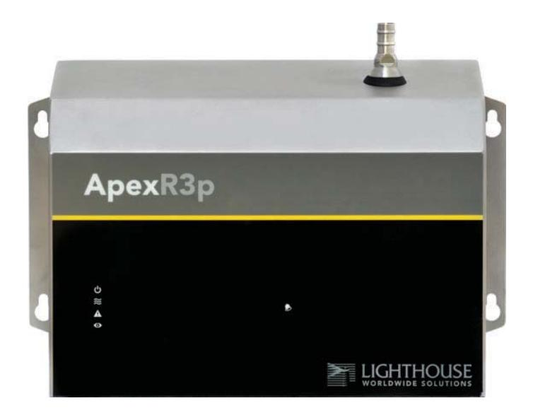

Operators Manual

ApexRp Operators Manual

**Intentionally Blank Page** 

### Lighthouse Worldwide Solutions

### Apex Remote With Pump

(Models: ApexR3p, ApexR5p, ApexR02p, ApexR03p, ApexR05p)

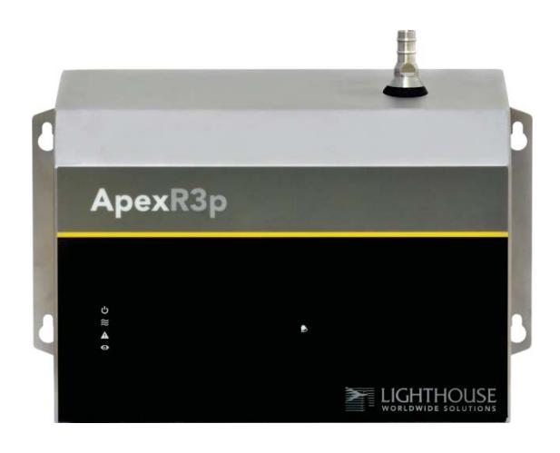

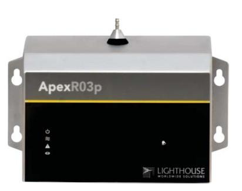

### Operators Manual

Copyright © 2014-2018 by Lighthouse Worldwide Solutions. All rights reserved. No part of this document may be reproduced by any means except as permitted in writing by Lighthouse Worldwide Solutions. The information contained herein constitutes valuable trade secrets of Lighthouse Worldwide Solutions. You are not permitted to disclose or allow to be disclosed such information except as permitted in writing by Lighthouse Worldwide Solutions. The information contained herein is subject to change without notice. Lighthouse Worldwide Solutions is not responsible for any damages arising out of your use of the LMS program. LMS™, LMS Express™, SIU™ and ApexRemoteWithPump™ and **ApexRp**™ are trademarks of Lighthouse Worldwide Solutions. Microsoft®, Microsoft Windows™, and Excel™ are trademarks of Microsoft Corporation.

Manufactured by:

Lighthouse Worldwide Solutions 1221 Disk Drive Medford, Oregon 97501

LWS Part Number 248083480-1

#### **Table of Contents**

| About this Manual                  | 8        |
|------------------------------------|----------|
| Text Conventions                   | 8        |
| Additional Help                    | 8        |
| 1 General Safety                   | 10       |
| Safety Considerations              | 10       |
| Laser Safety Information           | 11       |
| Electrostatic Safety Information   | 12       |
| 2 Introduction                     | 14       |
| Overview                           | 14       |
| Description                        | 14       |
| Accessories                        | 15       |
| Specifications                     | 16       |
| ApexR02p                           | 16       |
| ApexR03p                           | 17       |
| ApexR05p                           | 18       |
| ApexR3p                            | 19       |
| ApexR5p                            | 20       |
| 3 Get Started                      | 22       |
| Unpacking and Initial Inspection   | 22       |
| Identify the ApexRp Model          | 22       |
| Compare Contents                   | 22       |
| Configuration Kit                  | 23       |
| Software and SmartPort Cable Setup | 23       |
| Date Settings:                     | 26       |
| Factory Standard Settings          |          |
| ApexRp Model:                      |          |
| Operation                          |          |
| Understanding the LEDs             |          |
| 4 Communications                   |          |
| ApexRp Serial DIP Switches         |          |
| DIP Switch Definitions             |          |
| = ••                               | <u> </u> |

|      | exRp Operators Manual                       |      |
|------|---------------------------------------------|------|
| C    | Communicating Serial with ApexRp Instrument | 32   |
|      | Serial Data / Power Port                    | . 32 |
|      | RS-485 Communications                       | 34   |
|      | Ethernet Settings:                          | . 35 |
| A    | pexRp Web Page Interface                    | 36   |
| 5 N  | laintenance Procedures                      | . 38 |
| I    | ntroduction                                 | . 38 |
| S    | afety                                       | . 38 |
| N    | Naintenance Calibration                     | . 38 |
| Z    | ero Count Test                              | 38   |
| F    | ault Isolation                              | . 39 |
| I    | nstrument Service Report                    | . 39 |
| 6 P  | rogram with MODBUS Protocol                 | 40   |
|      | DIP Switches                                | 40   |
| P    | rotocol Settings                            | 40   |
| P    | ower On/Auto Start                          | 40   |
| F    | dunning the Instrument Using MODBUS         | 41   |
|      | AUTOMATIC Counting Mode                     | 41   |
| C    | Configuring with the MODBUS Protocol        | 42   |
|      | Setting the Real Time Clock                 | 42   |
|      | Changing the Default Instrument Parameters  | 43   |
|      | Using Sensor Setting Registers              | 44   |
|      | Location (Register 40026)                   | 44   |
|      | Hold Time (Registers 40031, 40032)          | 44   |
|      | Sample Time (Registers 40033, 40034)        | 44   |
| A    | larm and Threshold Registers                | 45   |
|      | Alarm Enable Registers                      | 45   |
|      | Enable Alarming for a Channel               | 46   |
|      | Threshold Setup Registers                   | 46   |
|      | Setting the Alarm Threshold Value           |      |
| 7 Ir | nstall                                      | . 48 |
| I    | nstall the ApexRp                           | . 48 |
|      | Installation Basics:                        |      |
|      | Installing the Wall Bracket/ApexRp          | 48   |
|      | Installing Anoven without Wall Pracket      | 50   |

| ApexRp | Operators | Manua |
|--------|-----------|-------|
|--------|-----------|-------|

|   | Connections                                              | . 51 |
|---|----------------------------------------------------------|------|
|   | Power Consumption:                                       | . 52 |
|   | Exhaust Port                                             | . 52 |
|   | Real-time LMS Pro/Pharma Data Download                   | . 53 |
|   | Shipping Instructions                                    | . 53 |
| A | ApexRp MODBUS Register Map v1.50                         | . 54 |
|   | COMM Settings                                            | . 54 |
|   | Supported MODBUS Commands                                | . 54 |
|   | Sensor Settings Registers                                | . 55 |
|   | Command Register                                         | . 62 |
|   | Alarm and Threshold Registers                            | . 63 |
|   | Alarm Enable Registers                                   | . 63 |
|   | Threshold Setup Registers                                | . 64 |
|   | Data Registers                                           | . 66 |
|   | Device Status Word                                       | . 69 |
|   | Data Enable Registers                                    | . 70 |
| В | Limited Warranty                                         | . 72 |
|   | Limitation Of Warranties:                                | . 72 |
|   | Warranty Of Repairs After Initial Two (2) Year Warranty: | 72   |

### **EU DECLARATION OF CONFORMITY**

**Manufacturer's Name:** Lighthouse Worldwide Solutions, Inc.

**Manufacture's Address:** Lighthouse Worldwide Solutions, Inc.

1221 Disk Drive

Medford, OR 97501 USA

**Declares that the product:** 

**Product Name:** ApexRemoteWithPump Airborne particle counters

**Model Number(s):** ApexRp Series

**Conforms to the following Product Specifications:** 

**SAFETY** EN61010-1:2010 Safety Requirements for Electrical Equipment for

Measurement, Control and Laboratory Use Part 1:

General Requirements IEC 61010-1:2010

**EMC** EN61326-1:2013 Electrical Equipment for Measurement, Control and

Laboratory use EN 61326-1:2013

#### **Supplementary Information**

The product herewith complies with the requirements of the Low Voltage 2014/35/EU and the EMC Directive 2014/30/EC and carries the CE marking accordingly.

 **\_\_\_\_\_\_\_\_\_\_\_\_\_\_\_\_\_\_\_\_\_\_\_\_\_\_\_** 

Fremont, CA August 1, 2018 Jerry Szpak – Director of Engineering

### **About this Manual**

This manual describes the detailed operation and use of the Lighthouse Worldwide Solutions ApexRemoteWithPump, **ApexRp** Airborne Particle Counters.

#### Text Conventions

**Boldface** Introduces or emphasizes a term.

**ApexRemoteWithPump, ApexRp, and Instrument** can all refer to any or all models ApexR3p, ApexR5p, ApexR02p, ApexR03p, or ApexR05p.

**Note:** A note appears in the sidebar to give extra information regarding a feature or suggestion.

**WARNING:** A warning appears in a paragraph like this and indicates a condition, which if not met, could cause serious personal injury or death, or damage to the instrument.

#### Additional Help

For more information about Lighthouse Airborne Particle Counters, contact

#### **Lighthouse Worldwide Solutions Service and Support**

Tel: 1-800-945-5905 (USA Toll Free) Tel: 1-541-770-5905 (Outside of USA) techsupport@golighthouse.com

www.golighthouse.com

**Intentionally Blank Page** 

# **1 General Safety**

#### Safety Considerations

**WARNING:** There are no user-serviceable components inside the instrument.

Warnings and cautions are used throughout this manual and the reader should become familiar with the meaning of a warning before operating the particle counter. Most warnings will appear in the left margin of the page next to the subject or step to which it applies. Take care when performing any procedures preceded by or containing a warning. The classifications of warnings are defined as follows:

- **LASER** pertaining to exposure to visible or invisible LASER radiation.
- **Electrostatic** pertaining to electrostatic discharge.
- **Network Connect** pertaining to communication ports and instrument damage.

#### Laser Safety Information

**WARNING:** The use of controls, adjustments or procedures other than those specified within this manual may result in personal injury and/or damage to this instrument.

This product is considered to be a Class 1 LASER product (as defined by FDA 21 CFR, §1040.10) when used under normal operation and maintenance. Performing service on the internal sensor can, however, result in exposure to invisible radiation.

The particle counter has been evaluated and tested in accordance with EN 61010-1:2012, "Safety Requirements For Electrical Equipment for Measurement, Control and Laboratory Use" and IEC 60825-1:2007, "Safety of LASER Products".

For further technical assistance, contact:

**Technical Support Team**  800-945-5905 (USA Toll Free) 541-770-5905 (Outside of USA).

**WARNING:** Attempts by untrained personnel to disassemble, alter, modify or adjust the electronics or optics may result in personal injury and damage to the instrument and will void its warranty. There are no userserviceable components inside the particle counter. Only factory authorized service personnel should repair or service this instrument and its optical system. Review Lighthouse specifications before installing a DC power supply. Attempting to use under-rated power source equipment can expose the instrument, adjacent equipment and the user to dangerous shock and fire hazards. Failure to meet the specifications as provided by Lighthouse Worldwide Solutions will void the instrument Warranty and CE certification and may cause serious personal injury.

#### Electrostatic Safety Information

Electrostatic discharge (ESD) can damage or destroy electronic components. Therefore, any service or maintenance work should be done at a static-safe work station. A static-safe work station requires an ESD consultant to evaluate the work environment and propose the equipment and apparel needed for just such a work station to be successful.

#### **Intentionally Blank Page**

# **2 Introduction**

#### Overview

This operating manual introduces the Lighthouse **ApexRp** Remote Airborne Particle Counter With Pump and includes instructions for inspecting, installing, using and maintaining the instrument.

#### Description

The **ApexRp** instrument comes standard with two channel sizes and a flow rate of either 1.0 or 0.1 CFM. Optionally, the **ApexRp** can be shipped with up to four particle-size channels. Figure 2-1 below shows the ApexR3p and ApexR03p.

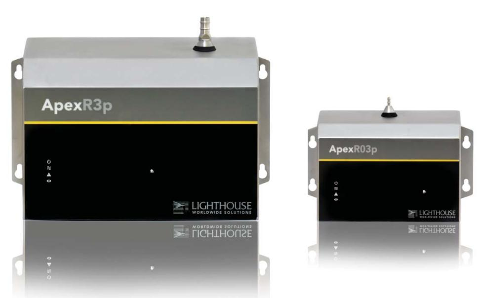

**Figure 2-1: ApexR3p and ApexR03p Remote Airborne Particle Counters** 

The instrument uses a LASER diode light source and LASER beam shaping optics to illuminate a cross section of the air flow path. As particles move along this path, they cross the LASER beam and scatter light. The light scattered is collected by an optical imaging system onto a photodiode. The photodiode converts the image into a current which is converted to a voltage and amplified by an electronic circuit.

The result is the electronic circuit outputs a voltage pulse each time a particle crosses the LASER beam. The amplitude of the voltage pulse

#### ApexRp Operators Manual

is proportional to the light scattered which in turn is proportional to the size of the particle.

The voltage pulses created by the particles are then processed by additional electronics that analyze the height of each pulse and therefore the size of each corresponding particle. The result is that the number of particles of various sizes is determined.

These instruments are effective in both ultra-clean areas (such as ISO Class 1 or Grade A) and also in more traditional cleanzones rated as ISO Class 3 or higher. Refer to Specifications tables in this manual for additional instrument information. The **ApexRp** line of Airborne Particle counters with pumps were created for continuous operation 24 hours per day, 7 days per week.

The instrument provides versatile mounting options and can be installed where space is at a premium.

The **ApexRp** integrates seamlessly with large facility monitoring/management systems and transfers particle count data using RS-485 (using MODBUS RTU or ASCII protocols).

#### Accessories

Several optional accessories can be ordered to tailor the instrument to specific needs. These accessories are listed here:

- Isokinetic Sampling Probe (specify flow rate 1.0 CFM or 0.1 CFM)
- Sample Tubing (per foot)
- Cable (per foot)
- WallBracket (specify 1.0 CFM or 0.1 CFM Wall bracket size)
- 0.1ȝm Purge Filter Assembly (Specify Flow Rate) with Tubing
- Configuration Kit (one included per order)**:** 
  - **SmartPort Cable**
  - 24VDC Power Supply (1.0 CFM units 120 W, 0.1 CFM units 25W)
  - Software and Operating Manual on USB key
  - Read Me First
  - Parts List

#### **ApexR02p**

| Size Ranges           | 0.2 – 2.0 μm                                                 |  |
|-----------------------|--------------------------------------------------------------|--|
| Channel Thresholds    | Standard 2-channel: 0.2, 0.3 μm                              |  |
|                       | Standard 4-channel: 0.2, 0.3, 0.5, 1.0 μm                    |  |
|                       | Optional 6-channel: 0.2, 0.3, 0.5, 0.7, 1.0, 2.0 μm          |  |
| Flow Rate             | 0.1 CFM (2.83 LPM)                                           |  |
| Counting Efficiency   | 50% (per ISO 21501-4)                                        |  |
| Data Storage          | Rotating Buffer, 3000 records                                |  |
| Light Source          | Laser Diode                                                  |  |
| Zero Count Level      | <1 count/5 minutes (per ISO 21501-4)                         |  |
| Calibration           | NIST Traceable                                               |  |
| Communication Modes   | MODBUS ASCII; MODBUS RTU; MODBUS TCP                         |  |
| Maximum Tubing Length | The sum of exhaust tubing length plus inlet tubing length to |  |
|                       | ISO kinetic probe may not exceed 10 ft. (3.0 M)              |  |
| Supporting Software   | LMS Pharma/Pro v7.3 or higher, LMS Express 8.2 or higher;    |  |
|                       | LWS Instrument Setup Tool 1.4.XX or higher.                  |  |
| Power Supply          | External power supply: 24 VDC, 5 A max draw                  |  |
| Enclosure             | 316L Stainless Steel, VHP compatible                         |  |
| Dimensions            | 4.87"(h) x 6.50"(w) x 3.26"(d) [12.37 x 16.51 x 8.28 cm]     |  |
| Weight                | 3.1 lbs. (1.4 kg)                                            |  |
| Operating Temp/RH     | 50° F to 104° F (10° C to 40° C) / 20% to 95% non-condensing |  |
| Storage Temp/RH       | 14° F to 122° F (-10° C to 50° C) / Up to 98% noncondensing  |  |

**Table 2-1 ApexR02p Specifications** 

#### **ApexR03p**

| Size Range            | 0.3 - 5.0 μm                                                 |  |
|-----------------------|--------------------------------------------------------------|--|
|                       |                                                              |  |
| Channel Thresholds    | Standard 2-channel: 0.3, 0.5 μm                              |  |
|                       | Standard 4-channel: 0.3, 0.5, 1.0, 5.0 μm                    |  |
|                       | Optional 6-channel: 0.3, 0.5, 0.7, 1.0, 3.0, 5.0 μm          |  |
| Flow Rate             | 0.1 CFM (2.83 LPM)                                           |  |
| Counting Efficiency   | 50% (per ISO 21501-4)                                        |  |
| Data Storage          | Rotating Buffer, 3000 records                                |  |
| Light Source          | Laser diode                                                  |  |
| Zero Count Level      | <1 count/5 minutes (per ISO 21501-4)                         |  |
| Calibration           | NIST Traceable                                               |  |
| Communication Modes   | MODBUS ASCII; MODBUS RTU; MODBUS TCP                         |  |
| Maximum Tubing Length | The sum of exhaust tubing length plus inlet tubing length to |  |
|                       | ISO kinetic probe may not exceed 10 ft. (3.0 M)              |  |
| Supporting Software   | LMS Pharma/Pro v7.3 or higher, LMS Express 8.2 or higher;    |  |
|                       | LWS Instrument Setup Tool 1.4.XX or higher.                  |  |
| Power Supply          | External power supply: 24 VDC, 5 A max draw                  |  |
| Enclosure             | 316L Stainless Steel, VHP compatible                         |  |
| Dimensions            | 4.87"(h) x 6.50"(w) x 3.26"(d) [12.37 x 16.51 x 8.28 cm]     |  |
| Weight                | 3.1 lbs. (1.4 kg)                                            |  |
| Operating Temp/RH     | 50° F to 104° F (10° C to 40° C) / 20% to 95% non-condensing |  |
| Storage Temp/RH       | 14° F to 122° F (-10° C to 50° C) / Up to 98% noncondensing  |  |

**Table 2-2 ApexR03p Specifications** 

#### **ApexR05p**

| Size Range            | 0.5 - 5.0 μm                                              |  |
|-----------------------|-----------------------------------------------------------|--|
| Channel Thresholds    | Standard 2-ĐŚĂŶŶĞů͗Ϭ͘ϱ͕ϱ͘Ϭʅŵ                              |  |
|                       | Standard 4-channel: 0.5, 1.0, 5.0, 10.0 μm                |  |
|                       | Optional 6-channel: 0.5, 0.7, 1.0, 3.0, 5.0,7.0, 10.0 μm  |  |
| Flow Rate             | 0.1 CFM (2.83 LPM)                                        |  |
| Counting Efficiency   | 50% (per ISO 21501-4)                                     |  |
| Data Storage          | Rotating Buffer, 3000 records                             |  |
| Light Source          | LASER Diode                                               |  |
| Zero Count Level      | <1 count/5 minutes (per ISO 21501-4)                      |  |
| Calibration           | NIST Traceable                                            |  |
| Communication Modes   | MODBUS ASCII; MODBUS RTU; MODBUS TCP                      |  |
| Maximum Tubing Length | The sum of exhaust tubing length plus inlet tubing        |  |
|                       | length to ISO kinetic probe may not exceed 10 ft. (3.0 M) |  |
| Supporting Software   | LMS Pharma/Pro v7.3 or higher, LMS Express 8.2 or         |  |
|                       | higher; LWS Instrument Setup Tool 1.4.XX or higher.       |  |
| Power Supply          | External power supply: 24 VDC, 5 A max draw               |  |
| Enclosure             | 316L Stainless Steel, VHP compatible                      |  |
| Dimensions            | 4.87"(h) x 6.50"(w) x 3.26"(d) [12.37 x 16.51 x 8.28 cm]  |  |
| Weight                | 3.1 lbs. (1.4 kg)                                         |  |
| Operating Temp/RH     | 50° F to 104° F (10° C to 40° C) / 20% to 95% non         |  |
|                       | condensing                                                |  |
| Storage Temp/RH       | 14° F to 122° F (-10° C to 50° C) / Up to 98%             |  |
|                       | noncondensing                                             |  |

**Table 2-3 ApexR05p Specifications** 

#### **ApexR3p**

| Size Range            | 0.3 - 5.0 μm                                              |  |
|-----------------------|-----------------------------------------------------------|--|
| Channel Thresholds    | Standard 2-ĐŚĂŶŶĞů͗Ϭ͘ϯ͕Ϭ͘ϱʅŵ                              |  |
|                       | Standard 4-ĐŚĂŶŶĞů͗Ϭ͘ϯ͕Ϭ͘ϱ͕ϭ͘Ϭ͕ϱ͘Ϭʅŵ                      |  |
|                       | Optional 6-ĐŚĂŶŶĞů͗Ϭ͘ϯ͕Ϭ͘ϱ͕Ϭ͘ϳ͕ϭ͘Ϭ͕ϯ͘Ϭ͕ϱ͘Ϭʅŵ              |  |
|                       |                                                           |  |
| Flow Rate             | 1.0 CFM (28.3 LPM)                                        |  |
| Counting Efficiency   | 50% (per ISO 21501-4)                                     |  |
| Data Storage          | Rotating Buffer, 3000 records                             |  |
| Light Source          | Laser diode                                               |  |
| Zero Count Level      | <1 count/5 minutes (per ISO 21501-4)                      |  |
| Calibration           | NIST Traceable                                            |  |
| Communication Modes   | MODBUS ASCII; MODBUS RTU; MODBUS TCP                      |  |
| Maximum Tubing Length | The sum of exhaust tubing length plus inlet tubing        |  |
|                       | length to ISO kinetic probe may not exceed 10 ft. (3.0 M) |  |
| Supporting Software   | LMS Pharma/Pro v7.3 or higher, LMS Express 8.2 or         |  |
|                       | higher; LWS Instrument Setup Tool 1.4.XX or higher.       |  |
| Power Supply          | External power supply: 24 VDC, 5 A max draw               |  |
| Enclosure             | 316L Stainless Steel, VHP compatible                      |  |
| Dimensions            | 6.65"(w) x 9.13"(h) x 4.75"(d) [16.89 x 23.19 x 12.06 cm] |  |
| Weight                | 6.3 lbs. (2.9 kg)                                         |  |
| Operating Temp/RH     | 50° F to 104° F (10° C to 40° C) / 20% to 95% non         |  |
|                       | condensing                                                |  |
|                       |                                                           |  |
| Storage Temp/RH       | 14° F to 122° F (-10° C to 50° C) / Up to 98%             |  |
|                       | noncondensing                                             |  |
|                       |                                                           |  |

**Table 2-4 ApexR3p Specifications** 

#### **ApexR5p**

| Size Range            | 0.5 - ϭϬ͘Ϭʅŵ                                              |  |
|-----------------------|-----------------------------------------------------------|--|
| Channel Thresholds    | Standard 2-ĐŚĂŶŶĞů͗Ϭ͘ϱ͕ϱ͘Ϭʅŵ                              |  |
|                       | Standard 4-ĐŚĂŶŶĞů͗Ϭ͘ϱ͕ϭ͘Ϭ͕ϱ͘Ϭ͕ϭϬ͘Ϭʅŵ                     |  |
|                       | Optional 4-channel: 0.5, Ϭ͘ϳ͕ϭ͘Ϭ͕ϯ͘Ϭ͕ϱ͘Ϭ͕ϳ͘Ϭ͕ϭϬ͘Ϭʅŵ       |  |
| Flow Rate             | 1.0 CFM (28.3 LPM)                                        |  |
| Counting Efficiency   | 50% (per ISO 21501-4)                                     |  |
| Data Storage          | Rotating Buffer, 3000 records                             |  |
| Light Source          | LASER diode                                               |  |
| Zero Count Level      | <1 count/5 minutes (per ISO 21501-4)                      |  |
| Calibration           | NIST Traceable                                            |  |
| Communication Modes   | MODBUS ASCII; MODBUS RTU; MODBUS TCP                      |  |
| Maximum Tubing Length | The sum of exhaust tubing length plus inlet tubing length |  |
|                       | to ISO kinetic probe may not exceed 10 ft. (3.0 M)        |  |
| Supporting Software   | LMS Pharma/Pro v7.3 or higher, LMS Express 8.2 or         |  |
|                       | higher; LWS Instrument Setup Tool 1.4.XX or higher.       |  |
| Power Supply          | External power supply: 24 VDC, 5 A max draw               |  |
| Enclosure             | 316L Stainless Steel, VHP compatible                      |  |
| Dimensions            | 6.65"(w) x 9.13"(h) x 4.75"(d) [16.89 x 23.19 x 12.06 cm] |  |
| Weight                | 6.3 lbs. (2.9 kg)                                         |  |
| Operating Temp/RH     | 50° F to 104° F (10° C to 40° C) / 20% to 95% non         |  |
|                       | condensing                                                |  |
| Storage Temp/RH       | 14° F to 122° F (-10° C to 50° C) / Up to 98%             |  |
|                       | noncondensing                                             |  |

 **Table 2-5 ApexR5p Specifications** 

**Intentionally Blank Page** 

# **3 Get Started**

#### Unpacking and Initial Inspection

The instrument is thoroughly inspected and tested at the factory and is ready for use upon receipt. It is presumed that when the instrument was received, its shipping carton was inspected for damage. If the carton was damaged, the carrier was notified and the carton was saved for carrier inspection. The instrument and other components were then removed from their packing materials and inspected for broken parts, scratches, dents, or other damage. Any damage was immediately reported to Lighthouse. Damaged cartons may be replaced by calling Lighthouse Sales. Keep an undamaged carton for reshipment of the instrument for its annual factory calibration.

#### Identify the ApexRp Model

#### The **ApexRp** is available in five models:

| ApexR3p  | 1.0 flow rate, .3μm minimum channel size |
|----------|------------------------------------------|
| ApexR5p  | 1.0 flow rate, .5μm minimum channel size |
| ApexR02p | 0.1 flow rate, .2μm minimum channel size |
| ApexR03p | 0.1 flow rate, .3μm minimum channel size |
| ApexR05p | 0.1 flow rate, .5μm minimum channel size |

#### Compare Contents

Compare the contents with the pack slip / invoice / parts list. Report immediately any missing or wrong parts to Lighthouse Support at 1- 800-945-5905 in the USA or 1-541-770-5905 outside of USA.

#### **NOTE:** All **ApexRp**

instruments require the SmartPort cable to set or change the Alarms and Alarm Thresholds. Changes to MODBUS registers are the only other way to make these changes. Once changes are made you must update the **ApexRp** to save settings. The cable must be removed before standard power connections are made to the instruments. If this condition is not met, peripheral equipment and/or the **ApexRp** may be seriously damaged and its respective warranties voided. Disconnect the cable BEFORE connecting the **ApexRp** to the instrument network!

#### Configuration Kit

Each order is shipped with a Configuration Kit, which includes the **SmartPort Cable**, software on USB key and a 24VDC Power Supply. To properly use the kit, the software on the USB key must be installed on a computer that will act as a configuration station. Running the LWS Instrument Setup Tool software will install the FTDI USB drivers and the Instrument Setup Tool software required to communicate with the instrument through the **SmartPort Cable**. This cable and the software are required to set up all **ApexRp** instruments for use.

#### **Software and SmartPort Cable Setup**

Turn DIP switch 7 on to communicate with the LWS Instrument Setup Tool.

Refer to Figure 3-1 and insert the **SmartPort Cable's** USB connector into a USB port on the computer. The computer should acknowledge the cable and report that it has found a new device, a Serial USB cable, and is installing its drivers. A COM port will be assigned to the cable.

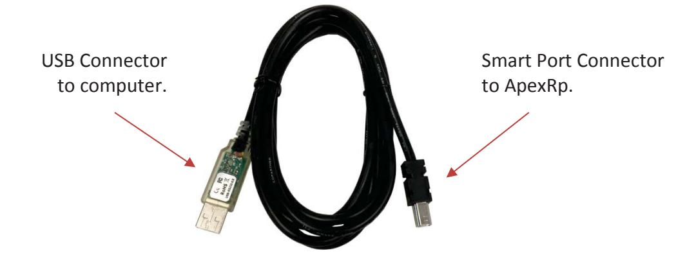

**Figure 3-1 SmartPort Cable Connections** 

View the COM port assigned by using *Computer|Properties|DeviceManager*. It will show as a USB Serial COM Port with a COM port number (see Figure 3-2).

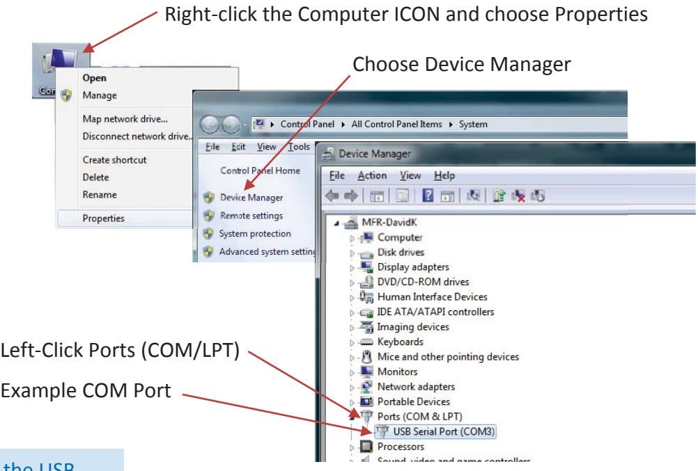

**Note:** While the USB connector is inserted in the computer port receptacle, its assignment will be displayed. If it is disconnected, the assignment will disappear until it is reconnected. Using this technique can quickly identify the correct port to use at the start of the LWS Instrument Setup program. This is handy if several ports are shown during this step.

**Figure 3-2 Viewing COM Port Assigned** 

Exit the Install menu.

The **SmartPort Cable** can be used with all **ApexRp** sensors and must be used to set all Alarm and Alarm Threshold settings.

Locate **SmartPort** on bottom of **ApexRp** as shown in Figure 3-3*.* 

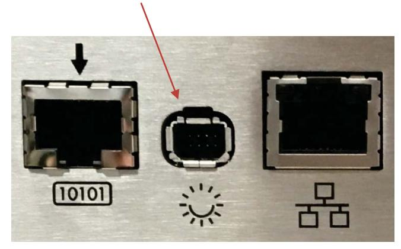

**Figure 3-3 SmartPort Location** 

Connect the **SmartPort Cable** to the **SmartPort** on **ApexRp**.

Attach the Power Supply to **ApexRp** and Attach the Power Supply to AC power.

Verify the **ApexRp** Power LED comes on solid after a few seconds before attempting to run the LWS Instrument Setup Tool or the program will not "see" the instrument and report an error, requiring another COM port to be selected.

On the configuration computer navigate to the Start menu, All Programs. Navigate to Lighthouse Worldwide Solutions, click and choose **LWS Instrument Setup Tool.** 

When it starts, the program will require the COM port number that the **SmartPort Cable** is using. Choose the correct COM port number from the dropdown as shown in Figure 3-6.

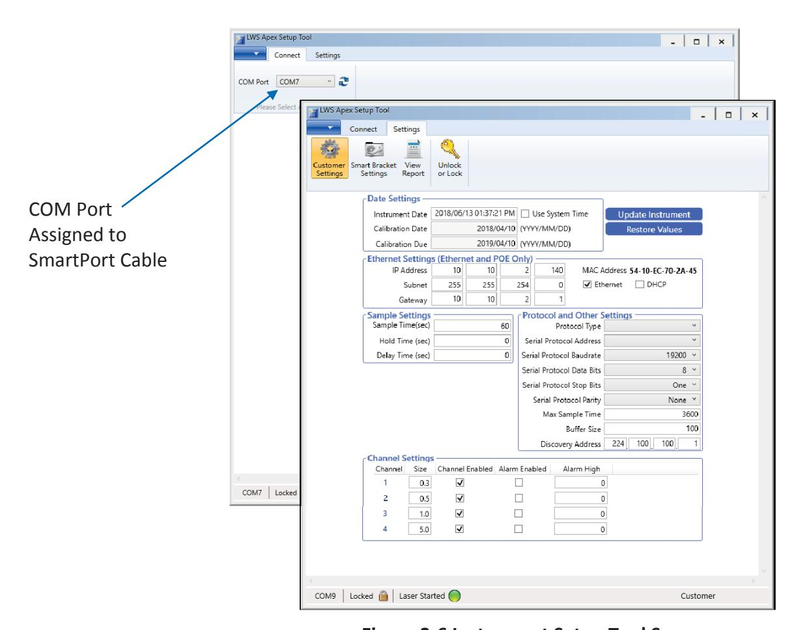

**Figure 3-6 Instrument Setup Tool Screen** 

#### **Date Settings:**

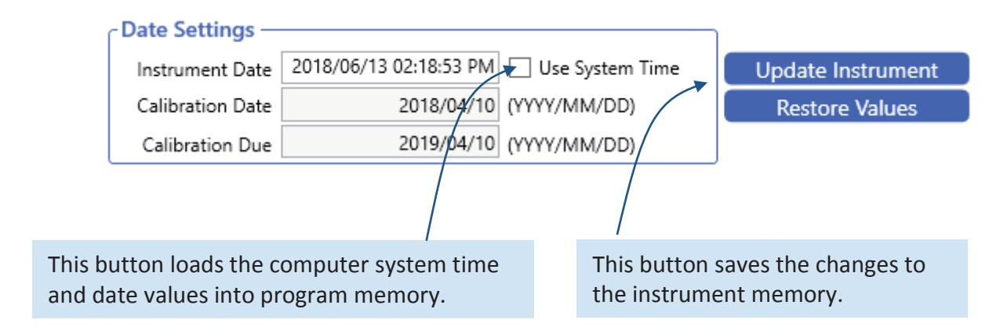

**Figure 3-7 Instrument Date and Time Settings** 

**Note:** Make sure to update the instrument settings before the SmartPort cable is disconnected from the ApexRp.

All **ApexRp** products can have their date and time settings changed in this screen. Refer to Figure 3-7 to change the Instrument Date / Time by using the **Set to System Time.** Corrections to errors can be reversed by clicking **Restore Values**. Make sure that desired changes are followed by clicking the **Update Instrument** button to save the changes to the instrument memory. If the instrument is not updated before the **SmartPort Cable** is disconnected, the changes will be lost.

#### Factory Standard Settings

#### **ApexRp Model:**

The **ApexRp** standard network settings are set to the same values for all **ApexRp**'s shipped. These values are 10.10.x.xxx for IP, 255.255.0.0 for netmask and 0.0.0.0 as Default Gateway setting. To view the **ApexRp** web page, type its IP address into a web browser on a computer in the same network subnet.

The IT group should provide IP, Mask and Default Gateway values that meet the local network needs. The **ApexRp** must be changed to meet these requirements. Each device will require the IP to be changed to a new IP, as shown in Figure 3-8, to prevent address conflicts.

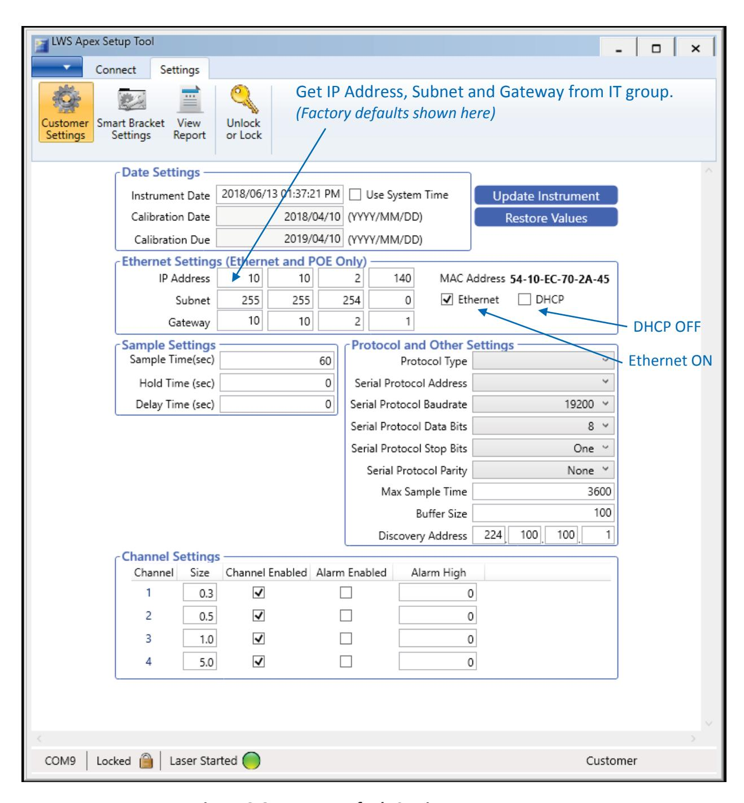

**Figure 3-8 ApexRp Default Settings** 

Default Alarm Threshold settings are the same as all **ApexRp** models: Ch1 threshold = 1000, Ch2 threshold = 1000 and channel alarms are disabled. If the Alarm is enabled, the Alarm LED will turn on solid green until that Alarm's threshold value is exceeded, in which case the LED will turn red.

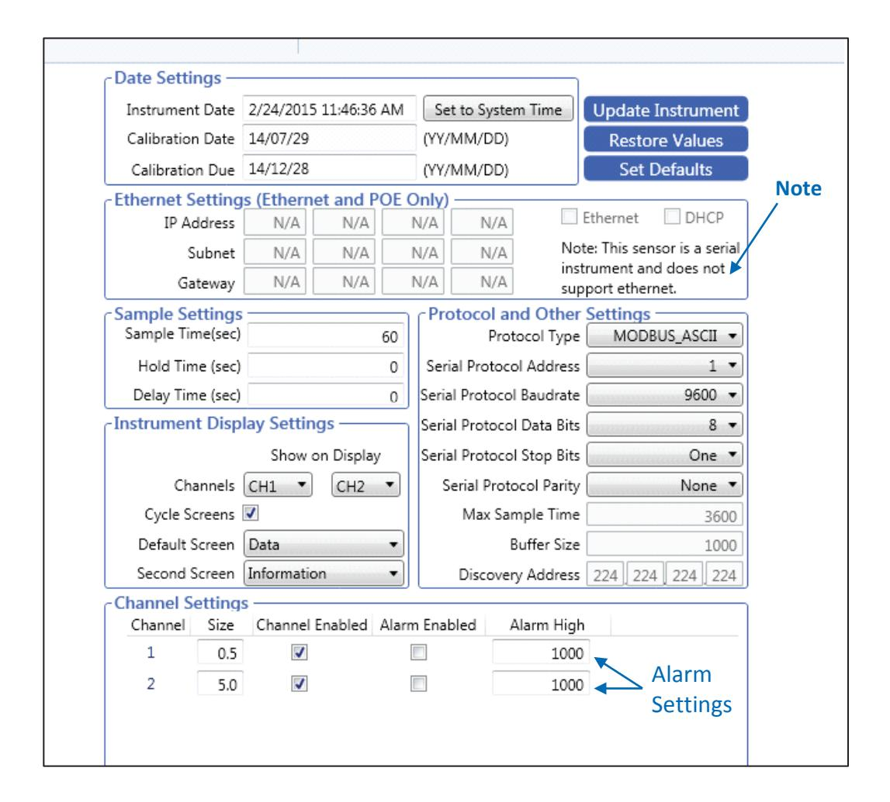

**Figure 3-9 ApexRp Serial Default Settings** 

The **ApexRp** Serial address is set via the switches on the bottom of the instrument or through the Setup Tool program, based on Switch 7's state (see Table 4-1). The Address can be shown in the Display Window, if this option is installed.

The **ApexRp** Serial must have its address set to a correct value or it won't be recognized by various management programs, including LMS Express and LMS Express RT. The full switch address list can be found in Table 4-3.

Make sure that changes are saved to the instrument by pressing the Update Instrument button on the screen shown in Figure 3-9. Remove the **SmartPort Cable** after settings are completed - do NOT leave it connected to the **ApexRp** during operation or the resultant damage will void the instrument's warranty!

#### Operation

#### **Understanding the LEDs**

The **ApexRp** LEDs have specific meanings when illuminated. Figure 3-10 below shows the location of the LEDs and gives a brief description of their meaning.

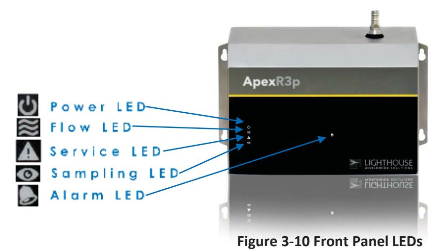

| • Power LED:    | OFF GREEN                            | = Power is OFF. = Power is ON.                                                                                                                   |
|-----------------|-----------------------------------------|-----------------------------------------------------------------------------------------------------------------------------------------------------|
| • Flow LED:     | GREEN GREEN BLINKING                 | = flow is within specification. = flow is out of specification.                                                                                  |
| • Service LED:  | OFF AMBER AMBER BLINKING 1Hz      | = Normal operation = LASER power or current, LASER supply or photo amp is out of range. = sensor background voltage is out of range. |
| • Sampling LED: | OFF BLUE                             | = Idle = Sampling                                                                                                                                |
| • Alarm LED:    | OFF GREEN                            | = No alarms are enabled. = Alarms enabled not exceeding the limits.                                                                           |
|                 | RED                                     | = Alarm enabled exceeding the limits.                                                                                                            |
|                 | BLUE FLASHING 5Hz WHITE FLASHING 5Hz | = Validation mode = SmartBracket mode, bracket not detected.                                                                                  |

# **4 Communications**

This chapter contains information regarding how to set up communication with the **ApexRp** instrument.

#### ApexRp Serial DIP Switches

The **ApexRp** DIP switches are used to set up Serial communication. Refer to Table 4-1 for detailed DIP switch settings, their meaning and effects.

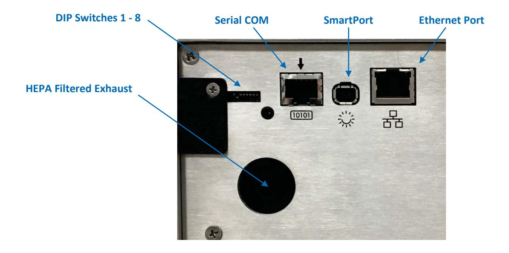

**Figure 4-1 ApexRp Serial Connectors and DIP Switch** 

#### **DIP Switch Definitions**

Table 4-1 displays the general DIP Switch settings. OFF (UP) = 0, ON (DOWN) = 1

**Note:** Use a tool with a very small pointed tip in order to change the DIP Switch positions.

| Position | Description     | Setting                      |
|----------|-----------------|------------------------------|
| #        |                 |                              |
| 1        | Binary Bit 0    | Addressing, OFF=0, ON=1      |
| 2        | Binary Bit 1    | Addressing, OFF=0, ON=1      |
| 3        | Binary Bit 2    | Addressing, OFF=0, ON=1      |
| 4        | Binary Bit 3    | Addressing, OFF=0, ON=1      |
| 5        | Binary Bit 4    | Addressing, OFF=0, ON=1      |
| 6        | COM Mode        | See Table 4-2                |
| 7        | Serial Protocol | UP=use DIP Switch Addressing |
|          |                 | DOWN=To communicate with the |
|          |                 | Instrument Setup tool.       |
| 8        | Reserved        |                              |

**Table 4-1 DIP switch general settings** 

#### *Communication Modes*

The **ApexRp** Serial has options for MODBUS ASCII and MODBUS RTU. Table 4-2 displays those modes.

| COMMUNICATIONS MODE | DIP SW 6 |
|---------------------|-------------|
| MODBUS ASCII (UP)   | OFF         |
| MODBUS RTU (DN)     | ON          |

**Table 4-2 DIP Switch Settings for ApexRp Serial COM Mode** 

#### *DIP Switch Addressing*

Table 4-3 details the addresses set by the binary DIP switches 1-5.

**Note:** Because Address 0 is reserved for broadcasting in MODBUS RS-485 communications, Address 1 is the lowest DIP switch setting that can be used. All switches OFF can cause communication failures on the network and must not be used.

| DIP SWITCHES | ADDRESS    | DIP SWITCHES | ADDRESS |
|--------------|------------|--------------|---------|
| 12345        |            | 12345        |         |
| 0 0 0 0 0    | Do Not Use | 0 0 0 0 1    | 16      |
| 1 0 0 0 0    | 1          | 1 0 0 0 1    | 17      |
| 0 1 0 0 0    | 2          | 0 1 0 0 1    | 18      |
| 1 1 0 0 0    | 3          | 1 1 0 0 1    | 19      |
| 0 0 1 0 0    | 4          | 0 0 1 0 1    | 20      |
| 1 0 1 0 0    | 5          | 1 0 1 0 1    | 21      |
| 0 1 1 0 0    | 6          | 0 1 1 0 1    | 22      |
| 1 1 1 0 0    | 7          | 1 1 1 0 1    | 23      |
| 0 0 0 1 0    | 8          | 0 0 0 1 1    | 24      |
| 1 0 0 1 0    | 9          | 1 0 0 1 1    | 25      |
| 0 1 0 1 0    | 10         | 0 1 0 1 1    | 26      |
| 1 1 0 1 0    | 11         | 1 1 0 1 1    | 27      |
| 0 0 1 1 0    | 12         | 0 0 1 1 1    | 28      |
| 1 0 1 1 0    | 13         | 1 0 1 1 1    | 29      |
| 0 1 1 1 0    | 14         | 0 1 1 1 1    | 30      |
| 1 1 1 1 0    | 15         | 1 1 1 1 1    | 31      |

**Table 4-3 DIP Switch Addressing**

#### Communicating Serial with ApexRp Instrument

#### **Serial Data / Power Port**

The **ApexRp** is equipped with the Serial COM Port shown in Figure 4-2 to communicate to an RS-485 network incorporating LMS equipment, such as the LMS 485 Gateway and Lighthouse System Control Cabinet.

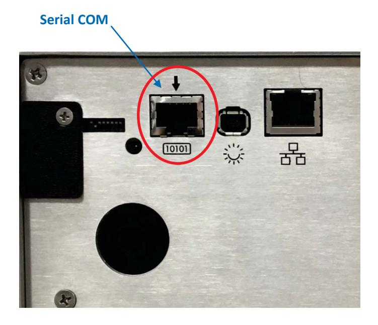

**Figure 4-2 Serial COM Port** 

The connector pinouts are shown in Table 4-4.

| RJ45 Pin | Signal Name             |
|----------|-------------------------|
| 1        | RS-232 TX (Output)      |
| 2        | RS-232 RX (Input)       |
| 3        | RESERVED for future use |
| 4        | RS-485B                 |
| 5        | RS-485A                 |
| 6        | RESERVED for future use |
| 7        | 24 VDC                  |
| 8        | GROUND                  |

**Table 4-4 RJ45 Pinouts** 

To connect the instrument to an RS-485 network:

- 1. Make sure the **SmartPort Cable** is disconnected from the instrument.
- 2. Install the **ApexRp** in a perpendicular position with its Inlet barb upward. Connect one end of a CAT5e cable to the Serial COM port on the instrument (shown in Figure 4-2).
- 3. Connect the other end of the cable to an available RS485 port on an LWS 485 Gateway, an LWS System Control Cabinet RS485 port or other similar equipment port.

#### **RS-485 Communications**

RS-485 must be used if the instrument is more than 50 feet from a computer or is installed in an industrial network. Refer to Table 4-5 for specifics about RS-485. Contact Lighthouse Technical Support for more information.

Table 4-5 shows the Electronics Industry Association (EIA) industry Standards RS485 specifications.

| SPECIFICATIONS                                                   | RS-485              |  |
|------------------------------------------------------------------|---------------------|--|
| Mode of Operation                                                | Differential        |  |
| Total Number of Drivers and Receivers on                         | 32 Drivers          |  |
| One line (one driver active at a time for RS                     | 32 Receivers        |  |
| 485 networks)                                                    |                     |  |
| Maximum Cable Length                                             | 4000 ft (1,219.2 m) |  |
| Maximum Data Rate (40 ft – 4000 ft for RS422/RS-485)          | 100 Kbs – 10 Mbs    |  |
| Maximum Driver Output Voltage                                    | -7V to +12V         |  |
| Driver Output Signal Level (Loaded Min.): LOADED              | +/- 1.5V            |  |
| Driver Output Signal Level (Loaded Max.): UNLOADED            | +/- 6V              |  |
| Driver Load Impedance (Ohms)                                     | 54                  |  |
| Max Driver Current in High Z State                               | +/- 100μA           |  |
| (POWER ON)                                                       |                     |  |
| Max Driver Current in High Z State                               | +/- 100μA           |  |
| (POWER OFF)                                                      |                     |  |
| Receiver Input Voltage Range                                     | -7V to +12V         |  |
| Receiver Input Sensitivity                                       | +/- 200mV           |  |
| Receiver Input Resistance (Ohms), (1 Standard Lad for RS-485) | >12k                |  |

 **Table 4-5 EIA Industry Standards for RS-485 Communications** 

#### **Ethernet Settings:**

The **ApexRp** comes with the Ethernet Enabled (default) and the DHCP disabled.

Enter the correct settings in **IP Address**, **Subnet and Gateway**.

The IT group should provide these numbers to prevent conflicts with devices already on the network. All TCP/IP values should be static.

Checking the DHCP checkbox (Figure 4-4) can cause the instrument and its data to become 'lost' when its IP Address is changed during updates from the DHCP server.

Ensure DHCP is OFF and click **Update Instrument** when done.

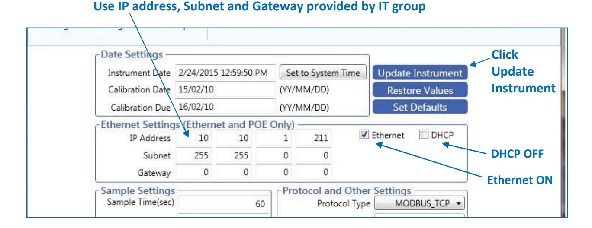

**Figure 4-4 Instrument Setup Tool TCP/IP Set Up Screen** 

#### ApexRp Web Page Interface

**NOTE:** It has been learned that certain antivirus programs may block, interrupt or seriously affect ApexRp's web server functions.

Another feature of the **ApexRp** is the Web Interface that allows real time monitoring of the instrument's data. All monitor points will show current record data, last 5 data records, location info, serial number, model, sampling parameters, location status, flow status, service status and alarm status. All diagnostic results will also be displayed.

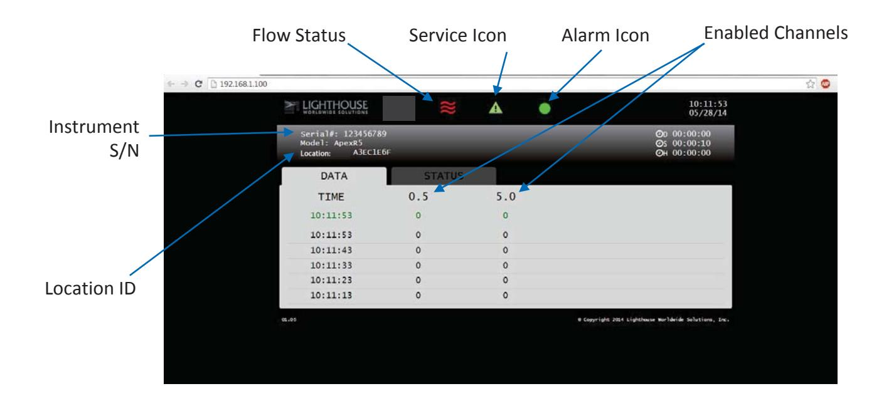

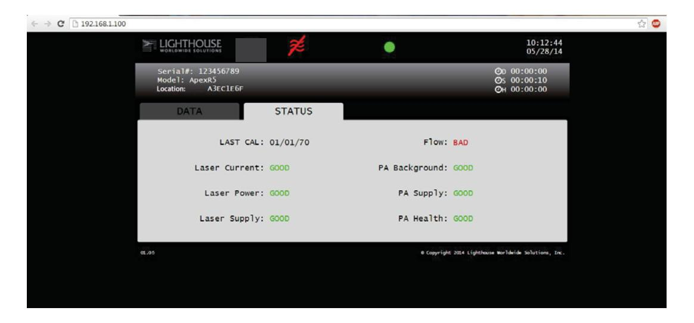

**Figure 4-5 ApexRp Data and Status Web View** 

#### **Intentionally Blank Page**

# **5 Maintenance Procedures**

#### Introduction

This chapter provides routine maintenance instructions that the **ApexRp** instrument requires. The maintenance procedures described in this chapter are not required on regular or prescribed intervals and should be performed only if the user has reason to question the data they are receiving.

#### Safety

Before performing any of the maintenance tasks described in this chapter, read Chapter 1 of this manual and become familiar with the warnings and caution labels.

#### Maintenance Calibration

To maintain optimum performance of this instrument, it should be recalibrated annually by a Lighthouse Authorized Service Provider.

#### Zero Count Test

This section will provide the user a procedure to determine if the **ApexRp** can successfully complete several zero counts. A purge filter must be attached to the instrument and six (6) five (5) minute samples must be taken. There should be no more than 1 count on average per five-minute sample.

- 1. Connect the Purge filter to the sample inlet.
- 2. Apply power to the instrument.
- 3. Configure the unit to sample for 30 minutes.
- 4. Allow the instrument to sample through a 30-minute period. This time allows the unit to warm up and purge any residual particles that might be inside it.
- 5. Configure the unit to sample for 5 minutes with a 10-second hold.
- 6. Allow the instrument to take 6 samples.
- 7. If an average of more than one count per five-minute period is reported, allow the instrument to sample for 30 minutes to purge it, then repeat the test (Steps 5 & 6).

8. After the instrument has met the requirement of the Purge Count test, return the instrument to its normal location and operating status.

#### Fault Isolation

If the instrument does not pass the Purge Count test, perform the following procedure:

- 1. Verify that the Inlet and Outlet barbs are finger-tight do NOT over tighten.
- 2. Check the data over the last 6 five-minute sample times.
- 3. If sporadic counts are occurring over all channels, the unit may still have particles inside it. Allow the unit to sample overnight with the purge filter attached before retesting it. If the counts are still high after the overnight purge, call Lighthouse Technical Support for assistance.
- 4. If the data shows consistent counts in the smallest channel only, the instrument may have electrical problems and may need to be returned to Lighthouse. Call a Lighthouse Service Representative for assistance.

#### Instrument Service Report

The Instrument Service Report screen shows **ApexRp** diagnostic information. The displayed information can be saved to a pdf file by clicking the "save report" button (see Figure 5-1).

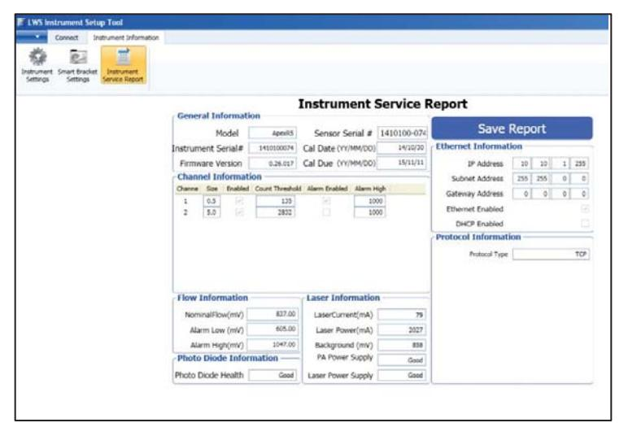

**Figure 5-1 Instrument Service Report Screen** 

## **6 Program with MODBUS Protocol**

**ApexRp** instruments can be programmed using MODBUS Protocol. The full protocol, as used, is detailed in Appendix A: "**ApexRp** MODBUS Register Map v1.50" on page A-1. This chapter contains the information needed to program the basic configuration for the instrument using the MODBUS protocol.

#### DIP Switches

During power-up and reset, ApexRp reads the DIP switches.

#### Protocol Settings

The MODBUS Protocol is defined through an RS-232 or RS-485 interface with:

• Baud Rate: 19200 • Data Bits: 8 • Stop Bits: None

• Parity: 1

• Flow Control: None

#### Power On/Auto Start

When powering up the instrument, it will begin sampling using the default configuration:

- Sample Time = 60 seconds
- Hold Time = 0 seconds
- Alarm Channel = Disabled

To stop the sampling, send the command **12** to command register 40002.

Stopping the sampling will set the Device Status bit in Register 40003 to 0.

**Note:** When changing the DIP switch settings, the instrument must be power-cycled.

**Note:** The automatic starting of the sampling accommodates systems that do not send a START command, but just polls the instrument for its data.

#### Running the Instrument Using MODBUS

The applicable action commands are displayed in Table 6-1.

| Value | Action                                                   |
|-------|----------------------------------------------------------|
|       |                                                          |
| 1     | Saves all writable 4xxxx register values to the EEPROM.  |
| 3     | Clears the Data Buffer. Record count is sent to zero.    |
| 4     | Saves the instrument parameters in the 40xxxx registers  |
|       | to the EEPROM. Parameters include Sample Time, Hold      |
|       | Time and Location.                                       |
| 11    | Instrument Start (Automatic Counting). Uses defined Hold |
|       | Time and Sample Time. Instrument executes samples        |
|       | and holds until an Instrument Stop command is issued.    |
| 12    | Instrument Stop.                                         |
|       | Aborts current sample. Stops data collection.            |

**Table 6-1 Action Commands** 

Each of the described action commands above are written to the command register (40002).

#### **AUTOMATIC Counting Mode**

In Automatic counting mode, the instrument uses the configured sample time and hold time to record samples.

The instrument will continue running samples at the configured sample time until it receives a stop command. When the stop command is given, any partial data will not record to the buffer.

After setting all the instrument parameters as described in "Changing the Default Instrument Parameters" write these commands to the Command register (40002):

**11** Start Instrument; to start recording

**12** Stop Instrument; to stop recording

#### Configuring with the MODBUS Protocol

#### **Setting the Real Time Clock**

The Real Time Clock (RTC) can be read in registers 40027 and 40028 as shown in Table 6-2.

Register 40027 is the high word for the real time clock; 40028 is the low word. The date/time is calculated as the number of seconds since midnight of 1/1/1970.

The date & time is stored in a 4-byte unsigned integer or as a 32-bit unsigned integer.

| Register | Data Type        | Description                                                                                                                                    |
|----------|------------------|------------------------------------------------------------------------------------------------------------------------------------------------|
| 40027    | Unsigned Integer | Real Time Clock (RTC) [high]. Works in conjunction with 40028. Displays data and time, in number of seconds since midnight, 1/1/1970. |
| 40028    | Unsigned Integer | Real Time Clock [low]                                                                                                                          |

**Table 6-2 Real Time Clock Registers** 

In order to change the RTC to the current local date/time, enter the high and low values as unsigned integers to registers 40035 and 40036 respectively, which are the Data Set registers. See Table 6-3.

| Register | Data Type        | Description                                                                                                                         |
|----------|------------------|-------------------------------------------------------------------------------------------------------------------------------------|
| 40035    | Unsigned Integer | Data Set [high]. Works in conjunction with 40036. Data entered here is applied to the device through the command register. |
| 40036    | Unsigned Integer | Data Set [low]                                                                                                                      |

**Table 6-3 Data Set Registers** 

Then write the command **13** to the command register 40002. This will write the values in the Data Set registers (40035 and 40036) to the RTC registers (40027 and 40028).

The Real Time Clock can also be set in the Configuration Software Tool.

#### **Changing the Default Instrument Parameters**

The main instrument parameters involved with the operation of the ApexRp are Location, Sample Time and Hold Time. See Table 6-4.

Sample Time and Hold Time both use 2 registers, a high word and a low word. If the desired value for any of these parameters is less than or equal to 9 hours, 6 minutes and 7 seconds (32,767 seconds), then only the low word register needs to be written with the value in seconds.

The low word register for Sample Time is 40034.

The low word register for Hold Time is 40032.

| Register | Data Type        | Description                                             |
|----------|------------------|---------------------------------------------------------|
|          |                  |                                                         |
| 40026    | Unsigned Integer | Location Number [low]                                   |
|          |                  | Provides location ID for where data was recorded. State |
|          |                  | is read/write.                                          |
| 40031    | Unsigned Integer | Hold Time [high]                                        |
|          |                  | Works in conjunction with 40032. Number of seconds to   |
|          |                  | wait between sample period. Max value is 359,999        |
|          |                  | which equals 99h 59m 59s.                               |
| 40032    | Unsigned Integer | Hold Time [low}                                         |
| 40033    | Unsigned Integer | Sample Time [high].                                     |
|          |                  | Works in conjunction with 40034. Number of seconds to   |
|          |                  | sample. Max value is 86,399 which equals 23h 59m 59s.   |
| 40034    | Unsigned Integer | Sample Time [low]                                       |

**Table 6-4 Instrument Parameters** 

#### **Using Sensor Setting Registers**

Certain configuration settings can be sent to the counter through these registers. Sensor Setting Registers 40001 and 40003 through 40023 are protected and should not be changed.

#### **Location (Register 40026)**

For Particle Counters, this value specifies the location where a sample was recorded.

#### **Hold Time (Registers 40031, 40032)**

The Hold Time is used for pausing in between samples for multiple cycles. This time is specified in seconds. The maximum value is 359,999 seconds (high word: 5, low word: 32319) which is 99 hours, 59 minutes, and 59 seconds. To set the Hold Time to a value less than 9 hours, 6 minutes, 7 seconds, enter the number of seconds in the *low* register (40032).

During Hold Time, the Device Status bit is 0 (Idle).

#### **Sample Time (Registers 40033, 40034)**

The Sample Time specifies the time period of each sample. This time is specified in seconds. The maximum value of the sample time is 86,399 seconds (high word: 1, low word: 20863) which is 23 hours, 59 minutes, 59 seconds.

To set the Sample Time to a value less than 9 hours, 6 minutes, 7 seconds, enter the number of seconds in the *low register* (40034).

During the Sample Time, the Device Status is 1 (Sampling).

#### Alarm and Threshold Registers

#### **Alarm Enable Registers**

The Alarm Enable input registers (43xxx series) shown in Table 6-5 are read/write. All enable data items are 4 bytes long and are stored across 2 registers. Byte and word ordering is big-endian. Thus, data items are formed by placing the high bytes in front of the low bytes. For example:

<High Bytes><Low Bytes> = <4 Byte Data Item>

The 43xxx register series is used to determine which particle data channels are set to ALARM ENABLE.

| Bit | Description                                                                      |
|-----|----------------------------------------------------------------------------------|
| 0   | Channel Enable (0=disable, 1=enable), works in conjunction with Alarm Enable. |
| 1   | Alarm Enable (0=disable, 1=enable), requires channel enable, as well.         |
| 2   | RESERVED                                                                         |

 **Table 6-5 Alarm Enable/Disable Bits** 

These registers run in parallel with the data registers (30xxx series). For example, data register 30010's enable alarm register would be 43010. Data register 30016's enable alarm register would be 43016.

**Note:** Alarm Enable currently only works for Particle Channels.

Enabling the Alarm for a particle channel requires the channel be enabled, as well, setting the bit in the low word of that channel. The user can enable any or all active particle channels at a time and can set a different alarm threshold for each.

Particle data registers for the Alarm Enable setting start at 43009 for the high word and 43010 the low word for channel 1. See Table 6-6.

| Register | Data Type        | Description                                |
|----------|------------------|--------------------------------------------|
| 43009    | unsigned integer | Alarm Enable for Particle Channel 1 [high] |
|          |                  | (smallest particle size starts here)       |
| 43010    | unsigned integer | Alarm Enable for Particle Channel 1 [low]  |
| 43011    | unsigned integer | Alarm Enable for Particle Channel 2 [high] |
| 43012    | unsigned integer | Alarm Enable for Particle Channel 2 [low]  |

**Table 6-6 Alarm Enable Registers**

#### **Enable Alarming for a Channel**

Alarm threshold registers are independent of each other. Any one register's settings will not affect the others and any channel alarms may be enabled or disabled as the user requires. For example, to enable alarming on just the first particle channel as shown in Table 6- 7, the user would enable Bit 1 by writing the value of '3' to register 43010. To disable alarming on the first channel and enable alarming on the second channel, write a '1' to register 43010 and a '3' to register 43012. To enable all alarms, write a '3' to each of the registers 43010 and 43012.

To disable alarming completely, write a '1' to the enabled register or registers (43010, 43012, 43014 or 43016).

| Registers     | Particle Channel | Bit 1 Enabled |
|---------------|---------------------|------------------|
| 43009 - 43010 | 1                   | 0                |
| 43011 - 43012 | 2                   | 1                |

 **Table 6-7 Example of Alarming on Channel 2** 

Use the Threshold registers to set the alarm threshold value. This is described in the next section.

#### **Threshold Setup Registers**

Threshold data is stored in the input registers in the 45xxx series which are read/write. All threshold data items are 4 bytes long and are stored across 2 registers. Byte and word ordering is big-endian.

**Note:** The **ApexRp** comes standard with 2 particle channels.

For particle channels, the threshold value is a 32-bit unsigned integer. If the data value exceeds the threshold value and the alarm is enabled for that channel, the threshold flag in the Data Status register (30007- 30008, bit 4) is set.

The Data Status flag is set if any of the channels have a threshold exceeded state as true.

The threshold registers (45xxx series) shown in Table 6-8, run in parallel with the data registers (30xxx series). For example, data register 30010's corresponding threshold register would be 45010. Data register 30016's threshold register would be 45016.

| Register | Data Type        | Description                             |
|----------|------------------|-----------------------------------------|
| 45009    | unsigned integer | Threshold for Particle Channel 1 [high] |
|          |                  | (smallest particle size starts here)    |
| 45010    | unsigned integer | Threshold for Particle Channel 1 [low]  |
| 45011    | unsigned integer | Threshold for Particle Channel 2 [high] |
| 45012    | unsigned integer | Threshold for Particle Channel 2 [low]  |
| 45013    | unsigned integer | Threshold for Particle Channel 3 [high] |
| 45014    | unsigned integer | Threshold for Particle Channel 3 [low]  |
| 45015    | unsigned integer | Threshold for Particle Channel 4 [high] |
| 45016    | unsigned integer | Threshold for Particle Channel 4 [low]  |

 **Table 6-8 Alarm Threshold Registers** 

#### **Setting the Alarm Threshold Value**

The Alarm Threshold Value is set in the low register of the channels. Each channel has independent threshold value registers. Since any or all channels can be enabled for alarms at any given time, each threshold value applies to the corresponding channel. Setting a value for channel 1 as 100 will not affect channel 2 setting of, say, 500. See Table 6-9.

| Registers     | Particle Channel | Threshold Value |
|---------------|---------------------|--------------------|
| 45009 – 45010 | 1                   | 1000               |
| 45011 – 45012 | 2                   | 1000               |

 **Table 6-9 Alarm Threshold Registers set to 1000** 

# **7 Install**

#### Install the ApexRp

#### **Installation Basics:**

**WARNING:** Make sure the installation point for the ApexRp **does not** prevent easy disconnect of the instrument power.

This section is provided as an example of a typical **ApexRp** installation. The tools and hardware shown are examples and may not apply to all installations. It is suggested that safety glasses and other equipment be used to prevent injury. Do **NOT** attempt to drill into a wall that may have live AC power behind the wallboard being drilled. Contact Facilities Management personnel to have the area made safe before beginning installation.

The **ApexRp** must be mounted on a vertical flat surface and must have the Inlet to Outlet path as close to vertical as possible.

**WARNING:** Power Supply specifications are 100-120VAC, 47-63Hz, 0.5A input, 24VDC 750mA output (18W max). Replacing with a power supply that does not meet these specifications may void the **ApexRp** warranty and risk exposing equipment and users to fire and shock hazard. If replacement of the power supply or its AC power cord is required, replace only with a power supply or cord having as good as or better ratings than the items provided by Lighthouse Worldwide Solutions. Attempting to use an underrated power supply or cord can expose the instrument power supply, adjacent equipment or the user to dangerous shock and fire hazards. Failure to heed this warning can result in personal injury or death.

#### **Installing the Wall Bracket/ApexRp**

#### **Tools/Hardware Required:**

Every installation of measuring instruments is dependent upon facility surroundings, construction materials and points of placement. Due to these differences, specific instructions cannot be supplied in this document. However, the listed tools and hardware shown in Figure 7- 1 are typical for most installations.

**WARNING:** Make sure target location is electrically safe for drilling. Wear safety goggles while drilling.

#### **Figure 7-1 Required Tools and Hardware**

1. Find a point close to necessary connections, such as network and AC power, and where the instrument can be easily accessed by operators or technical support personnel. The power input connection must allow safe and easy manual disconnect of power if needed.

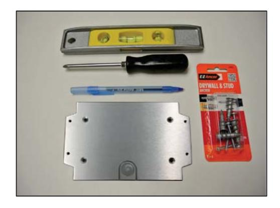

- 2. If the optional **WallBracket** was not ordered, the body of the **ApexRp** can be used as a template to mark the two mounting holes. Make sure the instrument is level then use a pencil to mark the center of the mounting holes. The distance between the holes should be 5.75". Proceed to step 4.
- 3. If the **Wall Bracket** was ordered, use the **Wall Bracket** as a template. Make sure it is level then use a pen or pencil to mark the center of the mounting holes. The **Wall Bracket** has 3/16" holes and has been designed to accept 3/16-24, #8 or #10 flat head screws. See Figure 7-2.

**Figure 7-2 Mark Location of Mounting Holes**

4. Use the appropriate size drill bit and drill the holes as marked. Install the anchors into the drilled holes.

- 5. For **ApexRp** installation without **Wall Bracket**, install the **ApexRp** using the installed anchors and appropriate screws. Proceed to step 8.
- 6. For **Wall Bracket** installation, attach the **Wall Bracket** using the installed anchors. Make sure to use flat head screws to maintain clearance from the rear of the **ApexRp.**
- 7. Attach the **ApexRp** to the **Wall Bracket** by slipping it over the mounting screws provided and sliding it downward on the Bracket. Tighten the two screws.
- 8. The **ApexRp** is now ready for connection to the network.

#### **Installing ApexRp without Wall Bracket**

- 1. Using a bubble level to ensure **ApexRp** is level, place the **ApexRp** against the vertical surface upon which it will be mounted.
- 2. Mark the center of each mounting tab's larger hole then remove the **ApexRp** from the surface and drill pilot holes for the mounting hardware.
- 3. Install the mounting hardware then the **ApexRp**, snugging the instrument to prevent wobble or movement while it is in use.
- 4. Connect the communication cable and the power cable.
- 5. The instrument is ready for connecting and integrating into the instrumentation network.

#### Connections

The top of the instrument has one connection: the inlet nozzle for sample input shown in Figure 7-6.

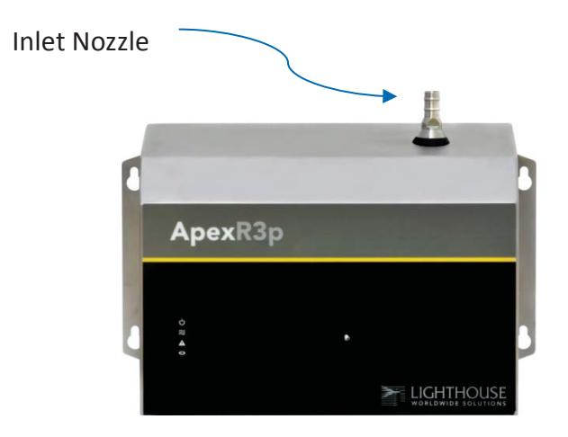

**Figure 7-6 Connections on Top** 

The 1.0 CFM instruments (ApexR3p, ApexR5p) sensors can be used with a direct-mount 1.0 CFM isokinetic probe or the probe can be attached via 3/8" ID tubing to a 3/8" barbed inlet ISO Probe.

The 0.1 CFM instruments (ApexR02p, ApexR03p, ApexR05p) sensors can be used with a direct-mount 0.1 CFM isokinetic probe or the probe can be attached via 1/8" ID tubing to a 1/8" barbed inlet ISO Probe.

The sum of exhaust tubing length plus inlet tubing length to ISO kinetic probe may not exceed 10 feet, (3.0 meters).

Figure 7-7 shows both the Serial and Ethernet connections at the bottom of the **ApexRp**.

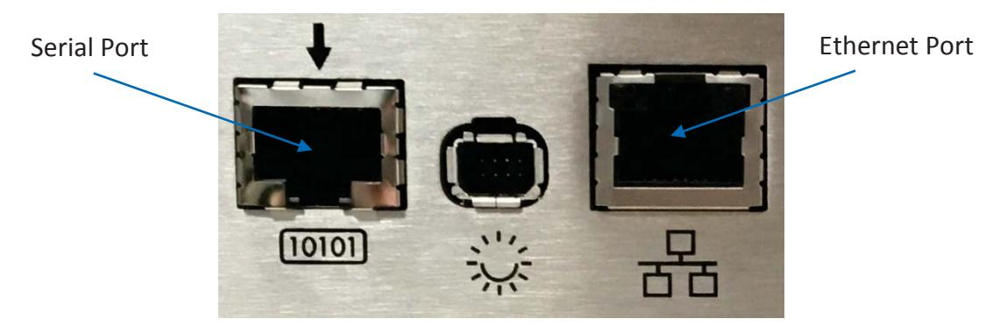

 **Figure 7-7 Serial and Ethernet Instrument Connections** 

#### **Power Consumption:**

The **ApexRp** has a connection for an external 24VDC supply. See figure 7-8.

#### **Exhaust Port**

**ApexRp** uses an internal blower to provide a vacuum source. The blower exhaust is HEPA filtered so as not to contaminate the surrounding monitoring environment. See figure 7-8.

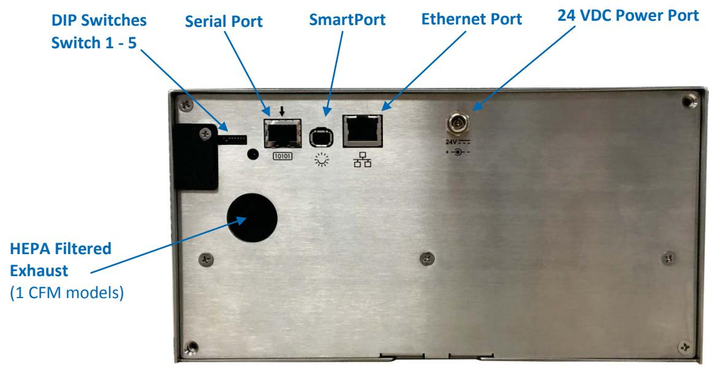

**Figure 7-8 ApexRp Connections** 

#### Real-time LMS Pro/Pharma Data Download

Lighthouse offers several software products to download, monitor and manage data gathered by the **ApexRp** instruments, as well as other RS-485/MODBUS particle counters. When these instruments are connected to an RS-485 or Ethernet network that is monitored and managed by a PC running the Lighthouse Monitoring System (LMS) Express or Express RT (Real Time), they can be identified and controlled by the software. Data can be downloaded from the instruments and put into graphs and charts and archived for future use. Make sure the COM port is set to 19200 BAUD to connect to the USB to-RS-485 converter.

For 3rd-party software use, contact Lighthouse Sales and Support (refer to Additional Help starting on page -i).

#### Shipping Instructions

Should it become necessary to return the unit to the factory for any reason, contact Lighthouse Customer Service or visit our website, www.golighthouse.com/rma, and obtain a Return Material Authorization (RMA) number. Reference this number on all shipping documentation and purchase orders. After receipt of the RMA number follow the shipping instructions below:

- **WARNING**: *If the*  instrument is damaged during a return shipment due to inadequate user packing, the warranty may be voided and result in additional repairs being billed to the customer.
- 1. Use the original container, nozzle caps and packing materials whenever possible. Remove attachments, such as TRH or Isokinetic probes, and package to prevent physical and ESD damage.
- 2. If the original container and packing materials are not available, contact Lighthouse to purchase a replacement shipping container and nozzle caps. If it necessary, wrap the unit in "bubble pack", surround with shock-absorbent material and place in a double-wall carton - the instrument should not rattle around when the carton is vigorously shaken.
- 3. If the instrument is damaged during shipment due to inadequate user packing, the warranty may be voided and result in additional repairs being billed to the customer.
- 4. Seal container or carton securely. Mark "FRAGILE" and write the Return Material Authorization (RMA) number on any unmarked corner.
- 5. Return the instrument to the address provided by a Lighthouse representative or the RMA website.

### **A ApexRp MODBUS Register Map v1.50**

#### COMM Settings

Lighthouse particle counters with MODBUS use the following communications settings:

| Baud Rate         | 19200                                    |
|-------------------|------------------------------------------|
| Data Bits         | 8                                        |
| Stop Bits         | None                                     |
| Parity            | 1                                        |
| Hardware Protocol | RS-232-C or RS-485 standard              |
| Software Protocol | MODBUS ASCII (supports upper/lower case) |
|                   | and MODBUS RTU                           |

**Table A-1 MODBUS Communications Settings**

**Note: ApexRp** currently supports only upper case.

The MODBUS slave address is set on the particle counter.

#### Supported MODBUS Commands

#### **Table A-2 MODBUS Registers**

| Hex Command | Description                   |
|-------------|-------------------------------|
| 03          | Read Holding Registers        |
| 04          | Read Input Registers          |
| 05          | Write Single Holding Register |

Visit www.modbus.org for documentation on how to use these commands.

#### **Sensor Settings Registers**

Instrument settings are stored in holding registers (the 40xxx series), which are mostly read/writable. Not all holding registers are writable. Table A-3 describes the content of these registers.

| Register | Data Type        | Description                                                                                                                                                                              |
|----------|------------------|------------------------------------------------------------------------------------------------------------------------------------------------------------------------------------------|
| 40001    | unsigned integer | MODBUS register map version. Matches the Version number of this document. Major version digits are hundreds. Minor version digits are tens and ones. For example, 135d = v1.35. |
| 40002    | unsigned integer | Command register. Makes the counter execute a command. See the description of this register in the table below.                                                                    |
| 40003    | unsigned integer | Device Status. [bit 0=RUNNING, bit 1=SAMPLING, bit 2=NEW DATA]                                                                                                                        |
| 40004    | unsigned integer | Firmware version. Major version digits are hundreds. Minor version digits are tens and ones. For example, 235d=v2.35                                                               |
| 40005    | unsigned integer | Serial Number [high]                                                                                                                                                                     |
| 40006    | unsigned integer | Serial Number [low]                                                                                                                                                                      |
| 40007    | ASCII string     | Product Name char[0], char [1] (NULL terminated string)                                                                                                                                  |
| 40008    | ASCII string     | Product Name char[2], char [3]                                                                                                                                                           |
| 40009    | ASCII string     | Product Name char[4], char [5]                                                                                                                                                           |
| 40010    | ASCII string     | Product Name char[6], char [7]                                                                                                                                                           |
| 40011    | ASCII string     | Product Name char[8], char [9]                                                                                                                                                           |
| 40012    | ASCII string     | Product Name char[10], char [11]                                                                                                                                                         |
| 40013    | ASCII string     | Product Name char[12], char [13]                                                                                                                                                         |
| 40014    | ASCII string     | Product Name char[14], char [15]                                                                                                                                                         |
| 40015    | ASCII string     | Model Name char[0], char [1] (NULL terminated string)                                                                                                                                    |
| 40016    | ASCII string     | Model Name char[2], char [3]                                                                                                                                                             |
| 40017    | ASCII string     | Model Name char[4], char [5]                                                                                                                                                             |
| 40018    | ASCII string     | Model Name char[6], char [7]                                                                                                                                                             |
| 40019    | ASCII string     | Model Name char[8], char [9]                                                                                                                                                             |
| 40020    | ASCII string     | Model Name char[10], char [11]                                                                                                                                                           |

 **Table A-3 Sensor Settings Registers** 

| Register | Data Type        | Description                                                                                                                                                                                                                                                     |
|----------|------------------|-----------------------------------------------------------------------------------------------------------------------------------------------------------------------------------------------------------------------------------------------------------------|
| 40021    | ASCII string     | Model Name char[12], char [13]                                                                                                                                                                                                                                  |
| 40022    | unsigned integer | Model Name char[14], char [15]                                                                                                                                                                                                                                  |
| 40023    | unsigned integer | Flow Rate. See registers 40041-40042 for flow rate units. Liquid Particle Counters and Samplers: Value equals flow rate. For example: 100d=100. All Other Instruments: Divide by 100 to get flow rate. For example: 100d=1.00                       |
| 40024    | unsigned integer | Record Count. Total number of records stored in the counter.                                                                                                                                                                                                 |
| 40025    | unsigned integer | Record Index. Zero based index to data in 3xxxx register series. Must be lower than the record count (register 40024). Set this index to expose a counter's record in the 3xxxx registers. Set to -1 to retrieve last record stored in the counter. |
| 40026    | unsigned integer | Location number Particle Counters: Specifies location of Particle Counter where data was recorded. Must be 1 to 200 (maps to location names associated with registers 40200 - 40999).                                                                  |
| 40027    | signed integer   | Real Time Clock (RTC) [high]. Displays instrument's real time clock. Works in conjunction with 40028. Displays date and time, in number of seconds since midnight, 1/1/1970. Can be generated by ANSI C/C++ time() function.                        |
| 40028    | signed integer   | Real Time Clock [low]                                                                                                                                                                                                                                           |
| 40029    | unsigned integer | Initial Delay [high]. Works in conjunction with 40030. Number of seconds to wait before starting the first sample. Max value is 359,999, which equals 99h 59m 59s.                                                                                        |
| 40030    | unsigned integer | Initial Delay [low]                                                                                                                                                                                                                                             |
| 40031    | unsigned integer | Hold Time [high]. Works in conjunction with 40032. Number of seconds to wait between sample periods. Max value is 359,999, which equals 99h 59m 59s                                                                                                       |
| 40032    | unsigned integer | Hold Time [low]                                                                                                                                                                                                                                                 |
| 40033    | unsigned integer | Sample Time [high]. Works in conjunction with 40034. Number of seconds to sample. Max value is 86,399, which equals 23h 59m 59s.                                                                                                                          |
| 40034    | unsigned integer | Sample Time [low]                                                                                                                                                                                                                                               |

 **Table A-3 Sensor Settings Registers** 

| Register   | Data Type        | Description                                                                                                                                                                                                                        |
|------------|------------------|------------------------------------------------------------------------------------------------------------------------------------------------------------------------------------------------------------------------------------|
| 40035      | unsigned integer | Data Set [high]. Works in conjunction with 40036. Updates the instrument's real time clock. Setting is the number of seconds since midnight, 1/1/1970. This number can be generated by the ANSI C/C++ time() function. |
| 40036      | unsigned integer | Data Set [low]                                                                                                                                                                                                                     |
| …          |                  |                                                                                                                                                                                                                                    |
| 40039      | unsigned integer | Laser Reference Voltage (millivolts)                                                                                                                                                                                               |
| … 40041 | ASCII string     | Flow Unit - Defines the Unit that Flow Rate value is based on. char[0], char[1]. (NULL-terminated string)                                                                                                                       |
| 40042      | ASCII string     | Flow Unit. char[2], char[3]                                                                                                                                                                                                        |
| 40043      | unsigned integer | Calibration Reference Voltage (millivolts)                                                                                                                                                                                         |
| …          |                  |                                                                                                                                                                                                                                    |
| 40047      | signed integer   | ApexRp: Calibration Due Date [high]. Indicates when instrument is due for calibration. This number can be generated by the ANSI C/C++ time() function.                                                                       |
| 40048      | signed integer   | Calibration Due Date [low].                                                                                                                                                                                                        |
| …          |                  |                                                                                                                                                                                                                                    |
| 40050      | signed integer   | Device Options                                                                                                                                                                                                                     |
| …          |                  |                                                                                                                                                                                                                                    |
| 40054      | unsigned integer | Location ID[high]. Value is 0 when no location bracket is present.                                                                                                                                                              |
| 40055      | unsigned integer | Location ID[low]. Value is 0 when no location bracket is present. Value matches 40026 location number when bracket is present.                                                                                               |
| 40056      | unsigned integer | Device Status[high]                                                                                                                                                                                                                |
| 40057      | unsigned integer | Device Status[low].                                                                                                                                                                                                                |
| 40058      | unsigned integer | Serial number [high].                                                                                                                                                                                                              |
| 40059      | unsigned integer | Serial number [low].                                                                                                                                                                                                               |

 **Table A-3 Sensor Settings Registers** 

| Register | Data Type        | Description                                                                                                                                            |
|----------|------------------|--------------------------------------------------------------------------------------------------------------------------------------------------------|
| 40060    | signed integer   | Last Sample Timestamp [high] (# of seconds since midnight, 1/1/1970.).                                                                              |
| 40061    | signed integer   | Last Sample Timestamp [low].                                                                                                                           |
| 40062    | signed integer   | Last Setting Change Timestamp [high] (# of seconds since midnight, 1/1/1970.). Value indicates.                                                     |
| 40063    | signed integer   | Last Setting Change Timestamp [low].                                                                                                                   |
| 40064    | signed integer   | Run-time particle channel alarm high flags (bit 0 = channel 1, …).                                                                                  |
| 40065    | signed integer   | Run-time particle channel alarm low flags (bit 0 = channel 1,…).                                                                                    |
| 40066    | signed integer   | Run-time analog channel alarm high flags (bit 0 = channel 1,…).                                                                                     |
| 40067    | signed integer   | Run-time analog channel alarm low flags (bit 0 = channel 1,…).                                                                                      |
| 40068    | unsigned integer | Software controlled RGB LED red channel. Uses values from 0-100 for duty cycle percentage every even second from UNIX time.                      |
| 40069    | unsigned integer | Software controlled RGB LED green channel. Uses values from 0-100 for duty cycle percentage every even second from UNIX time.                    |
| 40070    | unsigned integer | Software controlled RGB LED blue channel. Uses values from 0-100 for duty cycle percentage every even second from UNIX time.                     |
| 40071    | unsigned integer | Software controlled RGB LED red channel. Uses values from 0-100 for duty cycle percentage every odd second from UNIX time.                       |
| 40072    | unsigned integer | Software controlled RGB LED green channel. Uses values from 0-100 for duty cycle percentage every odd second from UNIX time.                     |
| 40073    | unsigned integer | Software controlled RGB LED blue channel. Uses values from 0-100 for duty cycle percentage every odd second from UNIX time.                      |
| 40074    | signed integer   | ApexRp: Last Calibration Date [high]. Indicates when instrument was last calibrated. This number can be generated by ANSI C/C++ time() function. |
| 40075    | signed integer   | ApexRp: Last Calibration Date [low]                                                                                                                    |

**Table A-3 Sensor Settings Registers** 

#### *Device Options*

If Bit 0 of Register 40050 is set, it indicates that the instrument is capable of Fast Download.

| Bits | Description                                         |  |
|------|-----------------------------------------------------|--|
| 5    | ApexRp:                                             |  |
|      | Software controlled RGB LED (1=Enabled, 0=Disabled) |  |
| 6    | ApexRp:                                             |  |
|      | Location Bracket (1=Enabled, 0=Disabled)            |  |

 **Table A-4: Device Options** 

#### *Device Status*

The Device Status registers (40003 and 40057) display the current status of the device (Table A-5). Additional status bits are shown in 40056 (Table A-6).

| Bits | Description                                                   |
|------|---------------------------------------------------------------|
| 0    | RUNNING: Set when a start command is executed via             |
|      | Command 11 (instrument start) or through the user             |
|      | interface. The flag will remain set until a stop command      |
|      | is executed.                                                  |
|      |                                                               |
| 1    | SAMPLING: This is set only when the instrument is             |
|      | actually sampling data that is to be recorded. Caution        |
|      | must be used in sending a command during this time            |
|      | that may invalidate current sample.                           |
| 2    | NEW DATA: Set to 1 to indicate that a new data record         |
|      | has been recorded and it hasn't been read via Modbus          |
|      | yet. When a data record has been read via Modbus              |
|      | (registers 30001 to 30999), then this flag is reset to zero.  |
| 3    | DEVICE ERROR: in the event that there is a failure on         |
|      | the device, this bit is set to indicate possible invalid data |
|      | has been collected.                                           |
| 9    | ApexRp:                                                       |
|      | DATA VALIDATION: Set to 1 when unit is in data                |
|      | validation mode, else set to 0.                               |
| 10   | ApexRp: LOCATION VALIDATION: Set to 1 when unit is            |
|      | in Location Validation mode, else set to 0.                   |
| 11   | ApexRp: LASER STATUS: Set to 1 when unit's LASER is           |
|      | out of spec, else set to 0.                                   |
| 12   | ApexRp: FLOW STATUS: Set to 1 when unit's flow is out         |
|      | of spec, else set to 0.                                       |
| 13   | ApexRp: SERVICE STATUS: Set to 1 when unit needs to           |
|      | be serviced, else set to 0.                                   |
| 14   | ApexRp: THRESHOLD HIGH STATUS: Set to 1 when                  |
|      | unit's high alarm threshold is exceeded, else set to 0.    |
| 15   | ApexRp: THRESHOLD LOW STATUS: Set to 1 when unit's            |
|      | low alarm threshold is not met, else set to 0.             |

 **Table A-5 Device Status (40003/40057)** 

Additional status bits are shown in 40056 displayed in Table A-6.

| Bit | Description                                                     |
|-----|-----------------------------------------------------------------|
| 0   | ApexRp: LASER POWER STATUS: Set to 1 when unit's LASER          |
|     | current is out of spec, else set to 0                           |
| 1   | ApexRp: LASER CURRENT STATUS: Set to 1 when unit's              |
|     | LASER power is out of spec, else set to 0                       |
| 2   | ApexRp: LASER SUPPLY STATUS: Set to 1 when unit's LASER         |
|     | supply is out of spec, else set to 0                            |
| 3   | ApexRp: LASER LIFE STATUS: Set to 1 when unit's LASER           |
|     | supply is out of spec, else set to 0                            |
|     |                                                                 |
| 4   | ApexRp: NO FLOW STATUS: Set to 1 when unit's flowis below       |
|     | no flow threshold causing LASER to turn off, else set to 0.     |
|     |                                                                 |
| 5   | ApexRp: PHOTOAMP SUPPLY STATUS: Set to 1 when unit's            |
|     | photo amp supply is out of spec, else set to                    |
| 6   | ApexRp: BACKGROUND STATUS: Set to 1 when unit's photo           |
|     | amp background is out of spec, else set to 0                    |
|     |                                                                 |
| 7   | ApexRp: PHOTODIODE STATUS: Set to 1 when photodiode has         |
|     | failed, else set to 0                                           |
|     |                                                                 |
| 8   | ApexRp: CALIBRATION DUE DATE STATUS: Set to 1 when              |
|     | unit is past calibration due date, else set to 0                |
| 9   | ApexRp: LOCATION BRACKET STATUS: Set to 1 when unit is          |
|     | in location bracket mode and bracket is missing, else set to 0. |

 **Table A-6 Device Status (40056)** 

#### Command Register

The Command Register (40002) is used to make the device perform an action. The register performs an action when an integer value is written to it. The action is completed when the device sends a MODBUS Bit Description response. When this register is read, it always returns a zero.

| Value | Action                                                                                                                                                                                                                                                                                                                                                                                                                                        |
|-------|-----------------------------------------------------------------------------------------------------------------------------------------------------------------------------------------------------------------------------------------------------------------------------------------------------------------------------------------------------------------------------------------------------------------------------------------------|
| 1     | Saves all writable 4xxxx register values to the EEPROM.                                                                                                                                                                                                                                                                                                                                                                                       |
| 2     | Reserved for future use.                                                                                                                                                                                                                                                                                                                                                                                                                      |
| 3     | Clears the Data Buffer. Record count is set to zero.                                                                                                                                                                                                                                                                                                                                                                                          |
| 4     | Saves the instrument parameters in the 40xxx registers to the EEPROM. Parameters include Sample Time, Hold Time, Initial Delay, and Location.                                                                                                                                                                                                                                                                                           |
| 11    | Instrument Start (Automatic Counting). Particle Counters: Uses defined Initial Delay, Hold Time, Sample Interval and counting mode. Instrument executes samples and holds until an Instrument Stop command is issued. For instruments with pumps, this command will start the pump. Manifold Controller: Uses defined Manifold Sequence. Stops counting and changing position when Instrument Stop command is issued. |
| 12    | Instrument Stop. Aborts current sample. Stops pump, if applicable. Stops data collection.                                                                                                                                                                                                                                                                                                                                                  |
| 13    | Set Real Time Clock. Writes "Data Set" values (from Registers 40035 & 40036) to the local Real Time Clock. New time value is saved.                                                                                                                                                                                                                                                                                                     |
| 17    | Instrument Location Validation Start: ApexRp: Start blinking Alarm LED blue                                                                                                                                                                                                                                                                                                                                                                |
| 18    | Instrument Location Validation Stop ApexRp: Stop blinking Alarm LED blue                                                                                                                                                                                                                                                                                                                                                                   |
| 19    | Instrument Data Validation Start ApexRp: Start sampling with dummy data using current sampling parameters. Data is also tagged as validation.                                                                                                                                                                                                                                                                                           |
| 20    | Instrument Data Validation Stop ApexRp: Stop sampling with dummy data using current sampling parameters. Data is also tagged as validation.                                                                                                                                                                                                                                                                                             |

 **Table A-7 Command Register** 

#### Alarm and Threshold Registers

#### **Alarm Enable Registers**

The Alarm Enable input registers (43xxx series) are read/write. All enable data items are 4 bytes long and are stored across 2 registers. Byte and word ordering is big-endian. Thus, data items are formed by placing the high bytes in front of the low bytes. For example:

<High Bytes><Low Bytes> = <4 Byte Data Item>

The 43xxx register series is used to determine which particle data channels are set to ALARM ENABLE.

| Bit | Description                          |
|-----|--------------------------------------|
| 0   | CHANNEL ENABLE (0=disable, 1=enable) |
| 1   | ALARM ENABLE (0=disable; 1=enable)   |
| 2   | RESERVED                             |

**Table A-8 Alarm Enable/Disable Bits** 

These registers run in parallel with the data registers (30xxx series). For example, data register 30010's enable alarm register would be 43010. Data register 30016's enable alarm register would be 43016.

To enable the Alarm for a particle channel, set the bit in the low word of that channel. Because Bit-0 is reserved and must always be ON, only Bit-1 will change for any channel alarm setting and Bit-0 must always be written as a '1'. What this means is that these registers will receive a '3' to turn the setting ON and a '1' to turn it OFF.

Particle data registers for the Alarm Enable setting start at 43009 for the high word and 43010 for the low word for channel 1.

| Register | Data Type        | Description                                |
|----------|------------------|--------------------------------------------|
| 43009    | unsigned integer | Alarm Enable for Particle Channel 1        |
|          |                  | [high](smallest particle size starts here) |
| 43010    | unsigned integer | Alarm Enable for Particle Channel 1 [low]  |
| 43011    | unsigned integer | Alarm Enable for Particle Channel 2 [high] |
| 43012    | unsigned integer | Alarm Enable for Particle Channel 2 [low]  |
| 43013    | unsigned integer | Alarm Enable for Particle Channel 3 [high] |
| 43014    | unsigned integer | Alarm Enable for Particle Channel 3 [low]  |
| 43015    | unsigned integer | Alarm Enable for Particle Channel 4 [high] |
| 43016    | unsigned integer | Alarm Enable for Particle Channel 4 [low]  |

**Table A-9 Alarm Enable Registers** 

**Note:** These registers currently apply only to ALARM enable/disable, not to Channel enable/disable.

**Note:** Alarm Enable currently only works for Particle Channels. Any or all channels and their alarm thresholds can be enabled and configured independently of each other.

#### *Enable Alarming for a Channel*

To enable alarming on particle channel #1, write a '3' to register 43010, which enables its Bit 1 and maintains Bit 0 as '1'. To disable alarming on channel 1 and enable it on channel 2, write a '1' to register 43010 and a '3' to register 43012. To enable all, write a '3' to 43010, 43012, 43014 and 43016.

To disable alarming completely, write a '1' to disable Bit 1 to registers 43010, 43012, 43014 and 43016.

| Registers     | Particle | Bit 1   |
|---------------|----------|---------|
|               | Channel  | Enabled |
| 43009 - 43010 | 1        | 0       |
| 43011 - 43012 | 2        | 1       |
| 43013 - 43014 | 3        | 0       |
| 43015 - 43016 | 4        | 0       |

**Table A-10 Example of Alarming on Channel 2** 

Use the Threshold registers to set the alarm threshold value. This is described in the next section.

#### **Threshold Setup Registers**

Threshold data is stored in the input registers in the 45xxx series which are read/write. All threshold data items are 4 bytes long and are stored across 2 registers. Byte and word ordering is big-endian. Thus, data items are formed by placing the high bytes in front of the low bytes. For example:

<High Bytes><Low Bytes> = <4 Byte Data Item>

For particle channels, the threshold value is a 32-bit unsigned integer. If the data value exceeds the threshold value and the alarm is enabled for that channel, the threshold flag in the Data Status register (30007- 30008, bit 4) is set.

#### ApexRp Operators Manual

**Note:** The Table A-11 shows the registers for an 8 channel particle counter. Counters with fewer channels do not use the extra registers. The smallest particle channel starts at the xxx09 position.

The Data Status flag is set if any of the channels have a threshold exceeded state as true.

The threshold registers (45xxx series) run in parallel with the data registers (30xxx series). For example, data register 30010's corresponding threshold register would be 45010. Data register 30016's threshold register would be 45016.

| Register | Data Type        | Description                             |
|----------|------------------|-----------------------------------------|
| 45009    | unsigned integer | Threshold for Particle Channel 1 [high] |
|          |                  | (smallest particle size starts here)    |
| 45010    | unsigned integer | Threshold for Particle Channel 1 [low]  |
| 45011    | unsigned integer | Threshold for Particle Channel 2 [high] |
| 45012    | unsigned integer | Threshold for Particle Channel 2 [low]  |
| 45013    | unsigned integer | Threshold for Particle Channel 3 [high] |
| 45014    | unsigned integer | Threshold for Particle Channel 3 [low]  |
| 45015    | unsigned integer | Threshold for Particle Channel 4 [high] |
| 45016    | unsigned integer | Threshold for Particle Channel 4 [low]  |

**Table A-11 Alarm Threshold Registers** 

**Note:** Thresholds are independent of each so the value set for one channel does not affect another.

#### *Setting the Alarm Threshold Value*

The Alarm Threshold Value is set in the low register of the channels. Each channel has independent threshold value registers. Setting a value for channel 1 as 100 will not affect channel 2 setting of, say, 500.

| Registers     | Particle | Threshold |
|---------------|----------|-----------|
|               | Channel  | Value     |
| 45009 - 45010 | 1        | 1000      |
| 45011 - 45012 | 2        | 1000      |
| 45013 - 45014 | 3        | 1000      |
| 45015 - 45016 | 4        | 1000      |

**Table A-12 Alarm Threshold Registers set to 1000** 

#### Data Registers

Data is stored in the input registers (30xxx series), which are readonly. All data items are four bytes long and are stored across two registers. Byte and word order is big-endian. Thus, data items are formed by placing the high bytes in front of the low bytes.

Example: <High Bytes><Low bytes> = <4 Byte Data Item>

Not all particle and analog channels are active. Retrieving data from an inactive channel returns garbage. See the Data Enable Registers section of this document for details on how to record data from active channels.

This entire series of registers represents one data record in the device. The Record Index Register (40025) must be changed to index other records here.

The first record in the data buffer is located at Index=0. The most recently saved value is at Index=-1.

| Register | Data Type        | Description                                                 |
|----------|------------------|-------------------------------------------------------------|
| 30001    | signed integer   | Timestamp [high] (# of seconds since midnight, 1/1/1970) |
| 30002    | signed integer   | Timestamp [low]                                             |
| 30003    | unsigned integer | Sample Time [high] (In seconds)                             |
| 30004    | unsigned integer | Sample Time [low]                                           |
| 30005    | signed integer   | Location [high] (Place where data was recorded)             |
| 30006    | signed integer   | Location [low]                                              |
| 30007    | unsigned integer | Sample Status [high]                                        |
| 30008    | unsigned integer | Sample Status [low]                                         |
| 30009    | unsigned integer | Particle Channel 1 [high]                                   |
| 30010    | unsigned integer | Particle Channel 1 [low]                                    |
| 30011    | unsigned integer | Particle Channel 2 [high]                                   |
| 30012    | unsigned integer | Particle Channel 2 [low]                                    |
| 30013    | unsigned integer | Particle Channel 3 [high]                                   |
| 30014    | unsigned integer | Particle Channel 3 [low]                                    |
| 30015    | unsigned integer | Particle Channel 4 [high]                                   |
| 30016    | unsigned integer | Particle Channel 4 [low]                                    |
|          |                  |                                                             |
| 30041    | IEEE Float       | Analog Channel 1 [high]                                     |
| 30042    | IEEE Float       | Analog Channel 1 [low]                                      |
| 30043    | IEEE Float       | Analog Channel 2 [high]                                     |
| 30044    | IEEE Float       | Analog Channel 2 [low]                                      |
| 30045    | IEEE Float       | Analog Channel 3 [high]                                     |
| 30046    | IEEE Float       | Analog Channel 3 [low]                                      |
| 30047    | IEEE Float       | Analog Channel 4 [high]                                     |
| 30048    | IEEE Float       | Analog Channel 4 [low]                                      |
|          |                  |                                                             |
| 30063    | IEEE float       | LASER Supply [low]                                          |
| 30064    | IEEE float       | LASER Supply [high] (percentage based on LASER              |
|          |                  | Supply Reference Value.                                     |
| 30065    | IEEE Float       | Background Voltage [low] (percentage based on               |
|          |                  | Calibration reference value) - ApexRp                       |
| 30066    | IEEE Float       | Background Voltage [high]                                   |
| …        |                  |                                                             |
| 30069    | IEEE Float       | LASER Voltage [low] (Percentage based on LASER              |
|          |                  | Reference value)                                            |
| 30070    | IEEE Float       | LASER Voltage [high]                                        |

**Table A-13 Data Registers** 

| Value | Action                                                      |  |
|-------|-------------------------------------------------------------|--|
| 0     | Service LASER Status                                        |  |
|       | 0 = LASER is good. 1 - LASER needs to be serviced.          |  |
| 1     | Bad Flow Status                                             |  |
|       | 0 = Flow rate is good. 1 = Flow rate is bad.                |  |
| 2     | Particle Overflow Status                                    |  |
|       | 0 = No overflow 1 = Overflow occurred.                      |  |
| 3     | Instrument Service Status                                   |  |
|       | 0 = Instrument is working correctly.                        |  |
|       | 1 = Service light is on. Instrument malfunction detected.   |  |
| 4     | Threshold High Status                                       |  |
|       | 0 = Threshold not exceeded. 1 = Threshold exceeded.         |  |
| 5     | Threshold Low Status                                        |  |
|       | 0 = Threshold not exceeded. 1 = Threshold exceeded.         |  |
| 6     | Instrument Sampler Status                                   |  |
|       | 0 = Nominal Operation. 1 = Sampler Error.                   |  |
| 7     | ApexRp:                                                     |  |
|       | 0 = LASER power in spec. 1 = LASER power out of spec.       |  |
| 8     | ApexRp: LASER current status                                |  |
|       | 0 = LASER current in spec. 1 = LASER power out of spec.     |  |
| 9     | ApexRp: LASER supply status 0 = LASER supply in spec. 1 =   |  |
|       | LASER supply out of spec.                                   |  |
| 10    | ApexRp: LASER life status 0 = LASER life in spec. 1 = LASER |  |
|       | life out of spec.                                           |  |
| 11    | ApexRp: No flow status                                      |  |
|       | 0 = There is flow in the unit. 1 = no flow in unit.         |  |
| 12    | ApexRp: Photoamp supply status 0 = Photoamp supply in       |  |
|       | spec. 1 = Photoamp supply out of spec.                      |  |
| 13    | ApexRp:                                                     |  |
|       | Background status 0 = Photoamp background good. 1 =         |  |
|       | Photoamp background out of spec.                            |  |
| 14    | ApexRp: Photodiode health status                            |  |
|       | 0 = Photodiode good. 1 = Photodiode failure                 |  |
| 15    | ApexRp: Validation mode status                              |  |
|       | 0 = Normal operation data. 1 = Validation dummy data.       |  |
| 16    | ApexRp: Calibration due date status                         |  |
|       | 0 = Unit has not passed calibration date. 1 = Unit has      |  |
|       | passed calibration.                                         |  |

**Table A-14: Instrument Current Status** 

#### ApexRp Operators Manual

The timestamp field indicates when the data record was recorded. Timestamps are stored as the number of seconds since 1/1/1970, the Unix time epoch. This value can be written directly into a C/C++ time\_t data type to be used by ANSI C time functions.

#### **Device Status Word**

**Note:** Particle data is a cumulative raw count regardless of the instrument's settings.

The registers used for the Sample Status Word are 30007-30008 to sample status. The bit order of the Device Status Word is 7 to 0 (right to left), where bit 7 is the most significant bit and bit 0 is the least significant bit. The bits within the Device Status Word are flagged to indicate particular conditions of the currently indexed data record. If multiple states occur, the bits are added together. For example, a Flow Alert and a Particle Overflow would return a value of 6 in register 30008 (bits 1 and 2 are set TRUE).

| Bit | Description                                                                                         |
|-----|-----------------------------------------------------------------------------------------------------|
| 0   | LASER Alert Status                                                                                  |
| 1   | 0 = LASER is good 1 = LASER Alert Flow Alert Status 0 = Flow Rate is good 1 = Flow Rate Alert |
| 3   | Instrument Service Status 0 = Working correctly 1 = Instrument malfunction detected.             |
| 4   | Particle Threshold Exceeded Status 0 = Threshold not exceeded 1 = Threshold exceeded             |

**Table A-15 Device Status Word** 

#### **Data Enable Registers**

**Note:** All data records have the same enable states. The user does not have to read the enable registers for every record.

The 31xxx register series is used to determine which data items in 30xxx are enabled. Enabled items contain recorded data. Data retrieved from disabled items return garbage. Data items are disabled for particle and analog channels not supported by the device or when the device software is configured not to record data for those items. The Enable Registers (31xxx series) run in parallel with the Data Registers (30xxx series). For example, Data Register 30010's Enable Register is 31010. Data Register 30016's Enable Register is 31016.

The 31xxx register states are: 00000000h = Disabled FFFFFFFFh = Enabled

**Intentionally Blank Page** 

# **B Limited Warranty**

#### Limitation Of Warranties:

**A.** Lighthouse Worldwide Solutions (LWS) warrants that all equipment shall be free from defects in material and workmanship under normal use for a period of two years from date of shipment to Buyer except that LWS does not warrant that operation of the software will be completely uninterrupted or error free or that all program errors will be corrected. Buyer shall be responsible for determining that the equipment is suitable for Buyer's use and that such use complies with any applicable local, state, or federal law. Provided that Buyer notifies LWS in writing of any claimed defect in the equipment immediately upon discovery and any such equipment is returned to the original shipping point, transportation charges prepaid, within two years from date of shipment to Buyer and upon examination LWS determines to its satisfaction that such equipment is defective in material or workmanship, i.e. contains a defect arising out of the manufacture of the equipment and not a defect caused by other circumstances, including, but not limited to accident, misuse, unforeseeable use, neglect, alteration, improper installation, improper adjustment, improper repair, or improper testing, LWS shall, at its option, repair or replace the equipment, shipment to Buyer prepaid. LWS shall have reasonable time to make such repairs or to replace such equipment. Any repair or replacement of equipment shall not extend the period of warranty. If the Instrument is modified or in any way altered without the explicit written consent of LWS then the warranty is null and void. This warranty is limited to a period of two years, except as noted below, without regard to whether any claimed defects were discoverable or latent on the date of shipment. The length of warranty for pumps and blowers in airborne particle counters is one (1) year. Batteries and accessories with all products are warranted for one (1) year. Fuses and purge filters carry no warranty. If a third party battery is used in the product, the product warranty is null and void. If the battery is charged by a third party battery charger the battery warranty is null and void.

**B.** If Buyer shall fail to pay when due any portion of the purchase price or any other payment required from Buyer to LWS under this contract or otherwise, all warranties and remedies granted under this Section may, at LWS's option, be terminated.

**C.** THE FOREGOING WARRANTY IS EXCLUSIVE AND IN LIEU OF ALL OTHER REPRESENTATIONS, WARRANTIES AND COVENANTS, EXPRESS OR IMPLIED WITH RESPECT TO THE EQUIPMENT AND ANY DEFECTS THEREIN OF ANY NATURE WHATEVER, INCLUDING AND WITHOUT LIMITATION WARRANTIES OF MERCHANTABILITY OR FITNESS FOR A PARTICULAR PURPOSE. LWS SHALL NOT BE LIABLE FOR, AND BUYER ASSUMES ALL RISK OF, ANY ADVICE OR FAILURE TO PROVIDE ADVICE BY LWS TO BUYER REGARDING THE EQUIPMENT OR BUYERS USE OF THE SAME. UNDER NO CIRCUMSTANCES SHALL LWS BE LIABLE TO BUYER UNDER ANY TORT, NEGLIGENCE, STRICT LIABILITY, OR PRODUCT LIABILITY CLAIM AND BUYER AGREES TO WAIVE SUCH CLAIMS. LWS's SOLE AND EXCLUSIVE LIABILITY AND BUYERS SOLE AND EXCLUSIVE REMEDY, FOR ANY NONCONFORMITY OR DEFECT IN THE PRODUCTS OR ANYTHING DONE IN CONNECTION WITH THIS CONTRACT, IN TORT, (INCLUDING NEGLIGENCE), CONTRACT, OR OTHERWISE, SHALL BE AS SET FORTH IN THE SUBSECTION A HEREOF AS LIMITED BY SUBSECTION B HEREOF. THIS EXCLUSIVE REMEDY SHALL NOT HAVE FAILED OF ITS ESSENTIAL PURPOSE (AS THAT TERM IS USED IN THE UNIFORM COMMERCIAL CODE) PROVIDED THAT THE SELLER REMAINS WILLING TO REPAIR OR REPLACE DEFECTIVE EQUIPMENT (AS DEFINED IN SUBSECTION A) WITH A COMMERCIALLY REASONABLE TIME AFTER RECEIVING SUCH EQUIPMENT. BUYER SPECIFICALLY ACKNOWLEDGES THAT SELLER'S PRICE FOR THE EQUIPMENT IS BASED UPON THE LIMITATIONS OF LWS'S LIABILITY AS SET FORTH IN THIS CONTRACT.

#### Warranty Of Repairs After Initial Two (2) Year Warranty:

**A.** Upon expiration of the initial two-year warranty, all parts and repairs completed by an authorized Lighthouse repair technician are subject to a six (6) month warranty.

**B.** Other than the above, LWS makes no warranty of any kind, expressed or implied, except that the products manufactured and sold by LWS shall be free from defects in materials and workmanship and shall conform to LWS's specifications; Buyer assumes all risk and liability resulting from use of the products whether used singly or in combination with other products. If instrument is modified or in any way altered without the explicit written consent of LWS, then the warranty is null and void.

**C.** WARRANTY REPAIRS SHALL BE COMPLETED AT THE FACTORY, BY AN AUTHORIZED SERVICE LOCATION, BY AN AUTHORIZED SERVICE TECHNICIAN, OR ON SITE AT BUYER'S FACILITY BY A LIGHTHOUSE AUTHORIZED EMPLOYEE. BUYER PAYS FREIGHT TO FACTORY; SELLER WILL PAY STANDARD RETURN FREIGHT DURING THE WARRANTY PERIOD. BUYER MAY SELECT A FASTER METHOD OF SHIPMENT AT ITS OWN EXPENSE.

Service and Support Tel. 1-800-945-5905 (USA Toll Free) Tel. 1-541-770-5905 (Outside of USA) techsupport@golighthouse.com www.golighthouse.com

