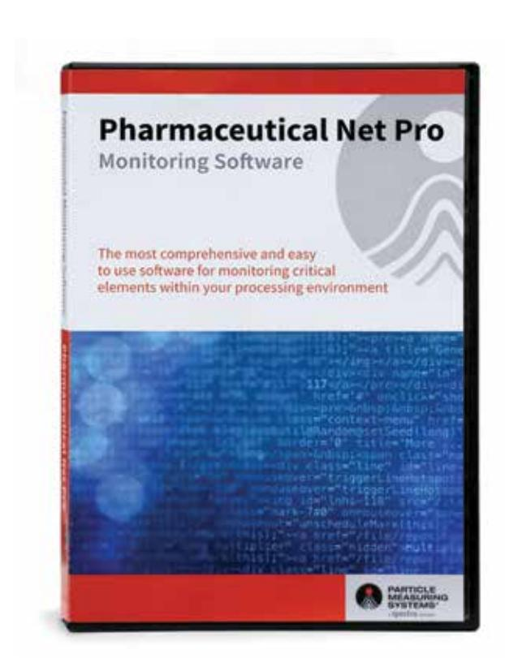

# *Pharmaceutical Net Pro*

# USER GUIDE

# **Pharmaceutical Net Pro User Guide**

#### **HEADQUARTERS**

5475 Airport Blvd Boulder, Colorado 80301 USA T: +1 303 443 7100, +1 800 238 1801

#### **Instrument Service & Support**

E: +1 800 557 6363 **Customer Response Center**

T: +1 877 475 3317 E: Info@pmeasuring.com

#### **GLOBAL OFFICES**

#### **AUSTRIA**

T: +43 1 71 728 285 E: pmsaustria@pmeasuring.com

#### **BENELUX**

T: +32 10 23 71 56 E: pmsbenelux@pmeasuring.com

#### **BRAZIL**

T: +55 11 5188 8227 E: pmsbrazil@pmeasuring.com

#### **CHINA**

T: +86 21 6113 3600 E: pmschina@pmeasuring.com

#### **FRANCE**

T: +33 (0)1 60 10 32 96 E: pmsfrance@pmeasuring.com

#### **GERMANY**

T: +49 6151 6671 632 E: pmsgermany@pmeasuring.com

#### **ITALY**

T: +39 06 9053 0130 E: pmssrl@pmeasuring.com

#### **JAPAN**

T: +81 3 5298 8175 E: pmsjapan@pmeasuring.com

#### **KOREA**

T: +82 31 286 5790 E: pmskorea@pmeasuring.com

#### **MEXICO**

T: +52 55 2271 5106 E: pmsmexico@pmeasuring.com

#### **NORDIC**

T: +45 707 028 55 E: pmsnordic@pmeasuring.com

#### **PUERTO RICO**

T: +1 787 718 9096 E: pmspuertorico@pmeasuring.com

#### **SINGAPORE**

T: +65 6496 0330 E: pmssingapore@pmeasuring.com

#### **SWITZERLAND**

T: +41 71 987 01 01 E: pmsswitzerland@pmeasuring.com

#### **TAIWAN**

T: +886-3-5525300 Ext: 301 E: pmstaiwan@pmeasuring.com

P/N 1000024849 Rev B

Pharmaceutical Net Pro User Guide P/N 1000024849 Rev B © 2019 Particle Measuring Systems, Inc. All rights reserved.

Airnet®, BioCapt®, FacilityPro®, and IsoAir® are registered trademarks of Particle Measuring Systems.

Microsoft is a registered trademark of Microsoft Corporation.

All trademarks appearing in this manual are the property of their respective owners.

#### DO NOT REPRODUCE OR DISTRIBUTE

#### CONFIDENTIAL DOCUMENT

This confidential document contains proprietary information, which is protected by copyright. All rights are reserved. No part of this document may be reproduced, distributed, or transmitted in any form without the prior written consent of Particle Measuring Systems. The information contained in this document is subject to change without notice.

## **Quality Statement**

The Quality Policy of Particle Measuring Systems is to strive to meet or exceed the needs and expectations of our customers, and to align the activities of all employees with the common focus of customer satisfaction through continuous improvement in the quality of our products and services.

#### **Environmental Statement**

There are no potential means by which asbestos exposure is possible because there are no materials in the design or manufacture of the FacilityPro containing asbestos.

This equipment must be properly disposed of at end-of-life by means of an authorized waste management system. Contact our Customer Response Center at (877) 475-3317 or (303) 443-7100 (International Telephone +1 3034437100) for dismantling and disposal information.

# **Manual Conventions**

### **WARNING**

A warning in the text is used to notify the user of the potential for bodily injury or death.

### **CAUTION**

A caution in the text is used to highlight an item that if not done, or incorrectly done, could damage the instrument and/or any materials or devices affected by the instrument.

### **– — NOTICE — –**

A notice in the text is an instructional communication regarding requirements or policies issued by Particle Measuring Systems.

**NOTE:** A note in the text is used to highlight an item that is of operational importance to the user.

It is important that you observe cautions and warnings while performing the procedures described in this manual. Caution and warning labels are located on and inside the instrument to alert you to potentially hazardous conditions. Please familiarize yourself with this information.

This page is intentionally left blank.

# **Brief Table of Contents**

|             | List of Figures               | xiii |
|-------------|-------------------------------|------|
|             | List of Tables                | xvii |
| Chapter 1:  | Overview                   | 1-1  |
| Chapter 2:  | Installation               | 2-1  |
| Chapter 3:  | Get Started                | 3-1  |
| Chapter 4:  | Recipes                       | 4-1  |
| Chapter 5:  | Sampling                   | 5-1  |
| Chapter 6:  | Sensors                    | 6-1  |
| Chapter 7:  | Alarms                        | 7-1  |
| Chapter 8:  | Reports                    | 8-1  |
| Chapter 9:  | Real Time Trend               | 9-1  |
| Chapter 10: | Run Time Logic             | 10-1 |
| Chapter 11: | User Management            | 11-1 |
| Chapter 12: | System Tasks               | 12-1 |
| Chapter 13: | Aventino Setup Options     | 13-1 |
| Appendix A: | Statistical Data Analyzer  | A-1  |
|             | Index Index-1                 |      |

This page is intentionally left blank.

# **Table of Contents**

|            | Quality Statement                                        | ii   |
|------------|----------------------------------------------------------|------|
|            | Environmental Statement                                  | ii   |
|            | Manual Conventions                                       | iii  |
|            | List of Figures                                          | xiii |
|            | List of Tables                                           | xvii |
| Chapter 1: | Overview                                              | 1-1  |
|            | Configuration Options                                    | 1-2  |
|            | Software Architecture                                    | 1-2  |
|            | Server Software Description                              | 1-4  |
|            | Interface                                                | 1-4  |
|            | Electronic Signature                                     | 1-5  |
|            | Electronic Signature window                              | 1-5  |
|            | Specifications                                           | 1-6  |
| Chapter 2: | Installation                                          | 2-1  |
|            | Prerequisites                                            | 2-1  |
|            | Pharmaceutical Net Pro Installation                      | 2-1  |
| Chapter 3: | Get Started                                           | 3-1  |
|            | System Start-Up                                          | 3-1  |
|            | Components of the Pharmaceutical Net Pro software screen | 3-2  |
|            | Header                                                   | 3-2  |
|            | Central area                                             | 3-2  |
|            | Buttons row                                              | 3-2  |
|            | Main Page Window                                         | 3-5  |
|            | Log In and Log Out                                       | 3-6  |
|            | Log in window                                            | 3-6  |
| Chapter 4: | Recipes                                                  | 4-1  |
|            | Recipes Editor Window                                    | 4-1  |
|            | Create a New Recipe                                      | 4-5  |
|            | Edit an Existing Recipe                                  | 4-5  |
|            | Delete an Existing Recipe                                | 4-6  |
| Chapter 5: | Sampling                                              | 5-1  |
|            | Sampling Editor Window                                   | 5-1  |
|            | Schedule a Sampling                                      | 5-3  |
|            | Sampling on input editor dialog box                      | 5-3  |
|            | Abort a Sampling Event                                   | 5-5  |

|            | Edit a Scheduled Sampling                            | 5-5  |
|------------|------------------------------------------------------|------|
|            | Delete a Scheduled Sampling                          | 5-5  |
|            | Configuring Custom Fields to Apply to a Sampling     | 5-6  |
|            | Custom fields configuration window                   | 5-6  |
| Chapter 6: | Sensors                                           | 6-1  |
|            | Particle counter Window                              | 6-1  |
|            | Particle Sensors Values                              | 6-3  |
|            | Biocapt Window                                       | 6-6  |
|            | Biocapt Values                                       | 6-6  |
|            | Analog Inputs Window                                 | 6-9  |
|            | Analog Inputs                                        | 6-9  |
| Chapter 7: | Alarms                                               | 7-1  |
|            | Alarms Window                                        | 7-1  |
|            | Acknowledge an Alarm                                 | 7-3  |
|            |                                                      |      |
| Chapter 8: | Reports                                           | 8-1  |
|            | Overview                                             | 8-1  |
|            | Reports available through the Report Generator       | 8-1  |
|            | Reports available through the Sampling Report window | 8-1  |
|            | Report Window                                        | 8-2  |
|            | Configuration of Tags Catalog                        | 8-3  |
|            | Tags Catalog tabs                                    | 8-4  |
|            | Sensor Type                                          | 8-4  |
|            | Sensors Alarms                                       | 8-5  |
|            | Sensors                                              | 8-6  |
|            | Data Types                                           | 8-7  |
|            | Sensor Groups                                        | 8-8  |
|            | Data Type Groups                                     | 8-9  |
|            | Recipes                                              | 8-10 |
|            | Tags Control                                         | 8-11 |
|            | Pens Color Selection                                 | 8-12 |
|            | History Automation Configuration                     | 8-13 |
|            | Configure Sensor Group Tags                          | 8-16 |
|            | Configure Recipe Tags                                | 8-18 |
|            | Configure Data Type Group Tags                       | 8-19 |
|            | Creating Reports through the Report Window           | 8-20 |
|            | Create a report "by group"                           | 8-21 |
|            | Set a date and time range for a report               | 8-24 |
|            | Select a data subset                                 | 8-25 |
|            | Select a group of modules to include in the report   | 8-25 |
|            | Select report(s) to generate                         | 8-25 |
|            |                                                      |      |
|            | Select an interval, specify the type for the report  | 8-26 |
|            | For a Trend Report, set calculation parameters       | 8-26 |
|            | Execute the report                                   | 8-27 |
|            | Create a report "by sampling"                        | 8-28 |
|            | Set a date and time range for a report               | 8-30 |
|            | Select a recipe, a sampling, and filters             | 8-31 |

| Select a report to generate                                        | 8-32 |
|--------------------------------------------------------------------|------|
| Select an interval, specify the type for the report                | 8-33 |
| For a Trend Report, set calculation parameters                     | 8-33 |
| Execute the report                                                 | 8-33 |
| Change the View in the Report Displayed in the Report Window       | 8-35 |
| Print a Report from the Report Window                              | 8-37 |
| Export a Report from the Report Window                             | 8-37 |
| Report Examples                                                    | 8-38 |
| Audit Report examples – Select by Group – Audit Report             | 8-38 |
| Header information – Audit Report – Select by Group                | 8-38 |
| Report body – Audit Report – Select by Group                       | 8-39 |
| Footer information – Audit Report – Select by Group                | 8-39 |
| Last page – Audit Report – Select by Group                         | 8-39 |
| Audit Report examples – Select by Sampling Audit Report            | 8-40 |
| Header information – Audit Report – Select by Sampling             | 8-40 |
| Report body – Audit Report – Select by Sampling                    | 8-41 |
| Footer information – Audit Report – Select by Sampling             | 8-41 |
| Last page – Audit Report – Select by Sampling                      | 8-41 |
| Data Report examples – Select by Group                             | 8-42 |
| Header information – Data Report – Select by Group                 | 8-42 |
| Report body – Data Report – Select by Group                        | 8-42 |
| Report summary – Data Report – Select by Group                     | 8-43 |
| Footer information – Data Report – Select by Group                 | 8-43 |
| Last page – Data Report – Select by Group                          | 8-43 |
| Data Report examples – Select by Samplings                         | 8-44 |
| Header information – Data Report – Select by Samplings             | 8-44 |
| Report body – Data Report – Select by Samplings                    | 8-45 |
| Report summary – Data Report – Select by Samplings                 | 8-45 |
| Footer information – Data Report – Select by Samplings             | 8-45 |
| Last page – Data Report – Select by Samplings                      | 8-45 |
| Trend Report examples – Select by Samplings                        | 8-46 |
| Header information – Trend Report – Select by Samplings            | 8-46 |
| Header information - Trend Report Exported PDF - Select by Group - | 8-47 |
| Footer information – Trend Report Exported PDF                     | 8-47 |
| Last page – Trend Report                                           | 8-47 |
| Sampling Report                                                    | 8-48 |
| Sampling Report tab                                                | 8-48 |
| Create a Sampling Report                                           | 8-49 |
| Change the view in report displayed in the Sampling Report window  | 8-49 |
| Print a Sampling Report                                            | 8-49 |
| Export a Sampling Report from the Sampling Report Window           | 8-50 |
| Sampling Report components                                         | 8-50 |
| Header information – Sampling Report                               | 8-50 |
| Report body – First section – Sampling Report                      | 8-51 |
| Report body – Second section – Sampling Alarms – Sampling Report   | 8-51 |
| Footer information – Sampling Report                               | 8-51 |
| Last page                                                          | 8-51 |

| Chapter 9:  | Real Time Trend                                    | 9-1          |
|-------------|-------------------------------------------------------|--------------|
|             | Real Time Trend Window                                | 9-1          |
|             | Starting and Stopping a Real Time Trend               | 9-3          |
|             | Editing Pens of the Recipe                            | 9-4          |
|             |                                                       |              |
| Chapter 10: | Run Time Logic                                     | 10-1         |
|             | Available Tags pane                                   | 10-2         |
|             | Analog Input Folder                                   | 10-3         |
|             | BioCapt (BC) Folder                                   | 10-4         |
|             | Digital Input (DI) Folder                             | 10-5         |
|             | Digital Output (DO) Folder                            | 10-5         |
|             | Virtual Digital Input/Output (DX) Folder           | 10-6         |
|             | I/O Module Folder                                  | 10-6         |
|             | Particle Counter Folder                               | 10-6         |
|             | Pumps Group Folder                                    | 10-8         |
|             | Pneumatic Module Folder                               | 10-9         |
|             | System Folder                                      | 10-9         |
|             | Usage for Tag pane                                    | 10-11        |
|             | Editor pane                                           | 10-11        |
|             | Rule Editor                                           | 10-12        |
|             | Rule Type                                             | 10-12        |
|             | Example Rule Editor Rule Creation                     | 10-13        |
|             | Creating a Child Rule                                 | 10-13        |
|             | Sampling on Input Editor                              | 10-14        |
|             | Tower Lights                                          | 10-15        |
|             | Example Tower Light Rule Creation                  | 10-17        |
|             | Testing Output Activation                             | 10-18        |
| Chapter 11: | User Management                                       | 11-1         |
|             |                                                       |              |
|             | Default Users                                         | 11-1         |
|             | "Nobody" user                                         | 11-1         |
|             | User Groups                                           | 11-1         |
|             | Group functions                                       | 11-2         |
|             | Emergency User                                        | 11-3         |
|             | Managing Users                                        | 11-3         |
|             | User Management window                                | 11-3         |
|             | Create a New User                                     | 11-5         |
|             | Modify a User definition Delete a User             | 11-6 11-6 |
|             |                                                       |              |
| Chapter 12: | System Tasks                                          | 12-1         |
|             | System management Window                              | 12-1         |
|             | Sensors Editor                                        | 12-5         |
|             | Sensors Editor window                                 | 12-5         |
|             | Backup and Restore                                    | 12-8         |
|             | Daily backup configuration                            | 12-8         |
|             | Manual backup                                         | 12-9         |
|             | Copy backup files                                     | 12-9         |
|             | Close the Pharmaceutical Net Pro software application | 12-9         |

|             | Restart the System                      | 12-9       |
|-------------|-----------------------------------------|------------|
|             | Shutdown the System                     | 12-10      |
|             | Shutdown a Disconnected Client          | 12-10      |
|             | Change the Display Language             | 12-11      |
|             | Reset the Buffer                        | 12-12      |
|             | Limits Editor                           | 12-13      |
|             | Limits Editor window                    | 12-13      |
|             | Limits Editor History window            | 12-16      |
|             | Limits Editor Configuration window      | 12-18      |
|             | Analog Inputs Limits                    | 12-20      |
| Chapter 13: | Aventino Setup Options               | 13-1       |
|             | Opening the Aventino Wizard Application | 13-1       |
|             | New Installation                        | 13-2       |
|             | Upgrade from Previous Version           | 13-12      |
|             | Restore from Backup                     | 13-12      |
|             | Modify Configuration                    | 13-13      |
|             | Restore FacilityPro                     | 13-13      |
|             |                                         |            |
|             |                                         |            |
| Appendix A: | Statistical Data Analyzer            | A-1        |
|             | Licensing the Application               | A-1        |
|             | Running the Application                 | A-1        |
|             | Application Window                      | A-2        |
|             | Loading CSV Files                       | A-2        |
|             | Display Configuration                   | A-4        |
|             | Axis Adjustment                         | A-4        |
|             | Zoom                                    | A-5        |
|             | Interpolation                           | A-5        |
|             | Saving a Configuration                  | A-6        |
|             | Loading a Previous Configuratoin        | A-6        |
|             | Virtual Pens                            | A-6        |
|             | Markers and Sensor Display Toggling     | A-7        |
|             | Daily Sensor Chart                      | A-7        |
|             | Creating a Report Language           | A-7 A-8 |

This page is intentionally left blank.

# **List of Figures**

| Chapter 1: | Overview                                               | 1-1 |
|------------|--------------------------------------------------------|-----|
| Figure 1-1 | Architecture of Pharmaceutical Net Pro software system | 1-2 |
| Figure 1-2 | Pharmaceutical Net Pro network                         |     |
|            | (with FacilityPro 3010 Processor Module as an example) | 1-3 |
| Figure 1-3 | Electronic Signature window                            | 1-6 |
| Chapter 2: | Installation                                           | 2-1 |
| Figure 2-1 | Pharmaceutical Net Pro Installer                       | 2-1 |
| Figure 2-2 | Installation status                                    | 2-2 |
| Figure 2-3 | Network card popup                                     | 2-2 |
| Figure 2-4 | Hard disk popup                                        | 2-2 |
| Figure 2-5 | Assign computer name window                            | 2-3 |
| Figure 2-6 | Local or domain user option                            | 2-3 |
| Figure 2-7 | License Manager                                        | 2-4 |
| Chapter 3: | Get Started                                            | 3-1 |
| Figure 3-1 | Pharmaceutical Net Pro Main Page window                | 3-1 |
| Figure 3-2 | Log in window                                          | 3-6 |
|            |                                                        |     |
| Chapter 4: | Recipes                                                | 4-1 |
| Figure 4-1 | Recipes Editor window                                  | 4-1 |
| Figure 4-2 | Recipes Editor confirm delete dialog box               | 4-6 |
| Chapter 5: | Sampling                                               | 5-1 |
| Figure 5-1 | Sampling Editor window                                 | 5-1 |
| Figure 5-2 | Sampling on input editor dialog box                    | 5-3 |
| Figure 5-3 | Custom fields configuration window                     | 5-6 |
| Chapter 6: | Sensors                                                | 6-1 |
| Figure 6-1 | Pharmaceutical Net Pro Particle counter window         | 6-2 |
| Figure 6-2 | Sampling point – Particle sensors                      | 6-4 |
| Figure 6-3 | Biocapt window                                         | 6-6 |
| Figure 6-4 | Sampling point – Biological                            | 6-7 |
| Figure 6-5 | Analog Inputs window                                   | 6-9 |
| Chapter 7: | Alarms                                                 | 7-1 |
| Figure 7-1 | Alarms window                                          | 7-1 |
| Chapter 8: | Reports                                                | 8-1 |
| Figure 8-1 | Report window, Select by Group tab fields              | 8-2 |

| Figure 8-2  | Tags catalog window, Sensor Type tab                                              | 8-4   |
|-------------|-----------------------------------------------------------------------------------|-------|
| Figure 8-3  | Tags catalog window, Sensors Alarms tab                                           | 8-5   |
| Figure 8-4  | Tags catalog window, Sensors tab                                                  | 8-6   |
| Figure 8-5  | Tags catalog window, Data Types tab                                               | 8-7   |
| Figure 8-6  | Tags catalog window, Sensor Groups tab                                            | 8-8   |
| Figure 8-7  | Tags catalog window, Data Type Groups tab                                         | 8-9   |
| Figure 8-8  | Tags catalog window, Recipes tab                                                  | 8-10  |
| Figure 8-9  | Tags catalog window, Tags Control tab                                             | 8-11  |
| Figure 8-10 | Tags catalog window, Pens Color Selection tab                                     | 8-12  |
| Figure 8-11 | Tags catalog window, History Automation Configtab                                 | 8-13  |
| Figure 8-12 | Tags catalog window, Sensor Groups tab                                            | 8-16  |
| Figure 8-13 | Select sensors in group window                                                    | 8-17  |
| Figure 8-14 | Tags catalog window, Recipes tab                                                  | 8-18  |
| Figure 8-15 | Tags catalog window, Data Type Groups tab                                         | 8-19  |
| Figure 8-16 | Parameter fields in the Report window for Select by Group reports                 | 8-21  |
| Figure 8-17 | Calendar popup                                                                    | 8-24  |
| Figure 8-18 | Input a comment to print on reports dialog box                                    | 8-27  |
| Figure 8-19 | Parameter fields in the Report window for Select by Sampling reports              | 8-28  |
| Figure 8-20 | Calendar popup                                                                    | 8-30  |
| Figure 8-21 | Input a comment to print on reports dialog box                                    | 8-33  |
| Figure 8-22 | Audit Report window controls for changing the view of a generated report -        | 8-35  |
| Figure 8-23 | Insert alarm ID dialog box                                                        | 8-36  |
| Figure 8-24 | Select pages to print dialog box                                                  | 8-37  |
| Figure 8-25 | Example of an Audit Report Select by Group displayed in the Report window 8-38 |       |
| Figure 8-26 | Example of an Audit Report – Select by Sampling displayed in the Report window | 8-40  |
| Figure 8-27 | Example Data Report – Select by Group displayed in the Report window           | 8-42  |
| Figure 8-28 | Example Data Report – Select by Samplings displayed in the Report window 8-44  |       |
| Figure 8-29 | Example Trend Report displayed in the Report window                               | 8-46  |
| Figure 8-30 | Sampling Report window                                                            | 8-48  |
|             |                                                                                   |       |
| Chapter 9:  | Real Time Trend                                                                   | 9-1   |
| Figure 9-1  | Real Time Trend window                                                            | 9-2   |
| Chapter 10: | Run Time Logic                                                                    | 10-1  |
| Figure 10-1 | Run Time Logic Editor window                                                      | 10-1  |
| Figure 10-2 | Available tag selection displays its usage                                        | 10-11 |
| Figure 10-3 | Editor pane contains all edited rules organized by type                           | 10-11 |
| Figure 10-4 | Rule Editor window                                                                | 10-12 |
| Figure 10-5 | Example Rule created with Rule Editor                                             | 10-13 |
| Figure 10-6 | Child rule creation in Rule Editor                                                | 10-14 |
| Figure 10-7 | Sampling on input editor window                                                   | 10-14 |
| Figure 10-8 | TowerLightEditForm window                                                         | 10-15 |
| Figure 10-9 | Example Tower Light rule                                                          | 10-17 |
|             |                                                                                   |       |
| Chapter 11: | User Management                                                                   | 11-1  |
| Figure 11-1 | Pharmaceutical Net Pro Users Management window                                    | 11-3  |

| Chapter 12:  | System Tasks                                                                   | 12-1           |
|--------------|--------------------------------------------------------------------------------|----------------|
| Figure 12-1  | FacilityPro System management window                                           | 12-2           |
| Figure 12-2  | Sensors Editor window                                                          | 12-5           |
| Figure 12-3  | FacilityPro Tools Language Switch window                                       | 12-11          |
| Figure 12-4  | Limits Editor window                                                           | 12-13          |
| Figure 12-5  | Limits Editor History window displayed in front of the Limits Editor window | 12-16          |
| Figure 12-6  | Limits Editor Configuration window displayed in front of the                   |                |
| Figure 12-7  | Limits Editor window Analog Inputs Limits window                            | 12-18 12-20 |
| Chapter 13:  | Aventino Setup Options                                                         | 13-1           |
| Figure 13-1  | Aventino Setup Wizard                                                          | 13-2           |
| Figure 13-2  | New installation and entering user credentials                                 | 13-3           |
| Figure 13-3  | New installation and entering user credentials                                 | 13-3           |
| Figure 13-4  | Processor module type selected from license                                    | 13-4           |
| Figure 13-5  | Database restore                                                               | 13-4           |
| Figure 13-6  | System hardware configuration                                                  | 13-5           |
| Figure 13-7  | System sampling parameters                                                     | 13-5           |
| Figure 13-8  | Sampler calibration configuration                                              | 13-6           |
| Figure 13-9  | Legacy pneumatic/sensor module configuration                                   | 13-6           |
| Figure 13-10 | Pneumatic module configuration with individual samplers                        | 13-7           |
| Figure 13-11 | Pneumatic module configuration with individual samplers                        | 13-8           |
| Figure 13-12 | Pneumatic module configuration with individual samplers                        | 13-8           |
| Figure 13-13 | Setting number of pumps in group                                               | 13-9           |
| Figure 13-14 | I/O board and module configuration                                             | 13-9           |
| Figure 13-15 | Configuration Save Page                                                        | 13-10          |
| Figure 13-16 | FacilityPro configuration file transfer and restart                            | 13-10          |
| Figure 13-17 | Database initialization                                                        | 13-11          |
| Figure 13-18 | Creation of Pharmaceutical Net Pro software pages                              | 13-11          |
| Figure 13-19 | Testing processor availability                                                 | 13-12          |
| Appendix A:  | Statistical Data Analyzer                                                      | A-1            |
| Figure A-1   | Statistical Data Analyzer window                                               | A-2            |
| Figure A-2   | Select Folder button                                                           | A-2            |
| Figure A-3   | Select Folder window                                                           | A-3            |
| Figure A-4   | SensorsList.CSV directory                                                      | A-3            |
| Figure A-5   | Expand All button                                                              | A-4            |
| Figure A-6   | Global stats display                                                           | A-4            |
| Figure A-7   | Step interpolation                                                             | A-5            |
| Figure A-8   | Save Config. button                                                            | A-6            |
| Figure A-9   | Load Config. button                                                            | A-6            |
| Figure A-10  | Show Virtual Pens button                                                       | A-6            |
| Figure A-11  | Virtual Pens window                                                            | A-6            |
| Figure A-12  | Daily sensor chart window                                                      | A-7            |
| Figure A-13  | Display language adjustment                                                    | A-8            |

This page is intentionally left blank.

# **List of Tables**

| Chapter 1: Overview                                                | 1-1  |
|-----------------------------------------------------------------------|------|
| Chapter 2: Installation                                            | 2-1  |
| Chapter 3: Get Started                                             | 3-1  |
| Table 3-1 Components of the Pharmaceutical Net Pro screen             | 3-2  |
| Table 3-2 Channel Status Legend                                       | 3-5  |
| Chapter 4: Recipes                                                 | 4-1  |
| Table 4-1 Recipes Editor window components                            | 4-2  |
| Chapter 5: Sampling                                                | 5-1  |
| Table 5-1 Sampling Editor window components                           | 5-2  |
| Table 5-2 Sampling on input editor dialog box                         | 5-4  |
| Table 5-3 Components of the Custom fields configuration window        | 5-6  |
| Chapter 6: Sensors                                                 | 6-1  |
| Table 6-1 Particle Sensors window EBI Channel view components         | 6-3  |
| Table 6-2 Biological Sensors window B0 Remote Channel view components | 6-7  |
| Table 6-3 Analog Inputs window view components                        | 6-10 |
| Chapter 7: Alarms                                                  | 7-1  |
| Table 7-1 Alarms window components                                    | 7-2  |
| Chapter 8: Reports                                                 | 8-1  |
| Table 8-1 Report window buttons                                       | 8-2  |
| Table 8-2 Components of the History Automation Config tab             | 8-13 |
| Table 8-3 Select by Group tab Report window components                | 8-21 |
| Table 8-4 Select by Sampling mode Report window components            | 8-28 |
| Table 8-5 General and report-specific controls in the Report window   | 8-35 |
| Chapter 9: Real Time Trend                                         | 9-1  |
| Table 9-1 Components of the Real Time Trend window                    | 9-2  |
| Chapter 10: Run Time Logic                                         | 10-1 |
| Table 10-1 Buttons of the Run Time Logic Editor screen                | 10-2 |
| Table 10-2 Analog Input Folder                                        | 10-3 |
| Table 10-3 BioCapt (BC) Folder                                        | 10-4 |
| Table 10-4 Digital Input (DI) Folder                                  | 10-5 |

| Table 10-5 Digital Output (DO) Folder Table 10-6 Digital Output (DO) Folder | 10-5 10-6 |
|--------------------------------------------------------------------------------|--------------|
| Table 10-7 I/O Module Folder                                                   | 10-6         |
| Table 10-8 Particle Counter (PC) Folder                                        | 10-6         |
| Table 10-9 Pumps Group Folder                                                  | 10-8         |
| Table 10-10 Pumps Group Folder                                                 | 10-9         |
| Table 10-11 System Folder                                                      | 10-9         |
| Table 10-12 Effect on output of turning all input on/off                       | 10-12        |
| Table 10-13 Effect on output of turning any input on/off                       | 10-12        |
| Table 10-14 Tower Light Outputs and Inputs                                     | 10-16        |
| Chapter 11: User Management                                                 | 11-1         |
| Table 11-1 Default users                                                       | 11-1         |
| Table 11-2 Default User Groups' functions                                      | 11-2         |
| Table 11-1 User Management window components                                   | 11-4         |
|                                                                                |              |
|                                                                                |              |
| Chapter 12: System Tasks Table 12-1 System management window components  | 12-1 12-2 |
| Table 12-2 Sensors Editor window components                                    | 12-6         |
| Table 12-3 Components of the Limits Editor window                              | 12-14        |
| Table 12-4 Components of the Limits Editor History window                      | 12-17        |
| Table 12-5 Analog Inputs Limits window view components                         | 12-20        |
| Chapter 13: Aventino Setup Options                                          | 13-1         |

# **Chapter 1 Overview**

Pharmaceutical Net Pro is software that interfaces with two FacilityPro processors and provides a simple monitoring and reporting tool. Pharmaceutical Net Pro can be configured with the following hardware components:

- FacilityPro 1010, 3010 and 5010 processor modules
  - The FacilityPro 1010 allows configuration with:
    - 8, 16 or 32 biological or particle sensors
    - 1 ENODE with a maximum of six modules
  - The FacilityPro 3010 allows configuration with:
    - 16 biological or particle sensors
    - Standard: 16 digital outputs/8 digital inputs
    - Optional: An additional 16 digital outputs/8 digital inputs
    - Optional: 8 analog inputs
  - The FacilityPro 5010 allows configuration with:
    - 64 biological or particle sensors
    - up to 192 analog sensors (+32 virtual points)
    - up to 128 digital outputs
    - up to 64 digital inputs
- Pharmaceutical Net Pro View Client PCs (HMI)
  - 2 or 5 clients
- Samplers, monitors, and/or sensors:
  - BioCapt® microbial samplers
  - Remote Vacuum Unit (RVU) microbial samplers
  - IsoAir® 310P particle sensor
  - Airnet® particle counters
  - Analog sensors (such as temperature, pressure, relative humidity)

Chapter 1 Overview Configuration Options

# **Configuration Options**

The configuration option determines the maximum availability of sensors, DI/DO and analog I/O for the system.

#### **System size**

| LARGE           | 128 sensors | 64 digital in/128 digital out | 192 analog in + 32 virtual |
|-----------------|-------------|-------------------------------|----------------------------|
| CLIENTS         | 2 or 5      |                               |                            |
|                 |             |                               |                            |
| System hardware |             |                               |                            |

#### **System hardware**

| FACILITYPRO | 5010, 3010, 1010 |
|-------------|------------------|
| PROCESSORS  | 3010, 3010, 1010 |

# **Software Architecture**

Pharmaceutical Net Pro software architecture is illustrated in **Figure 1-1**.

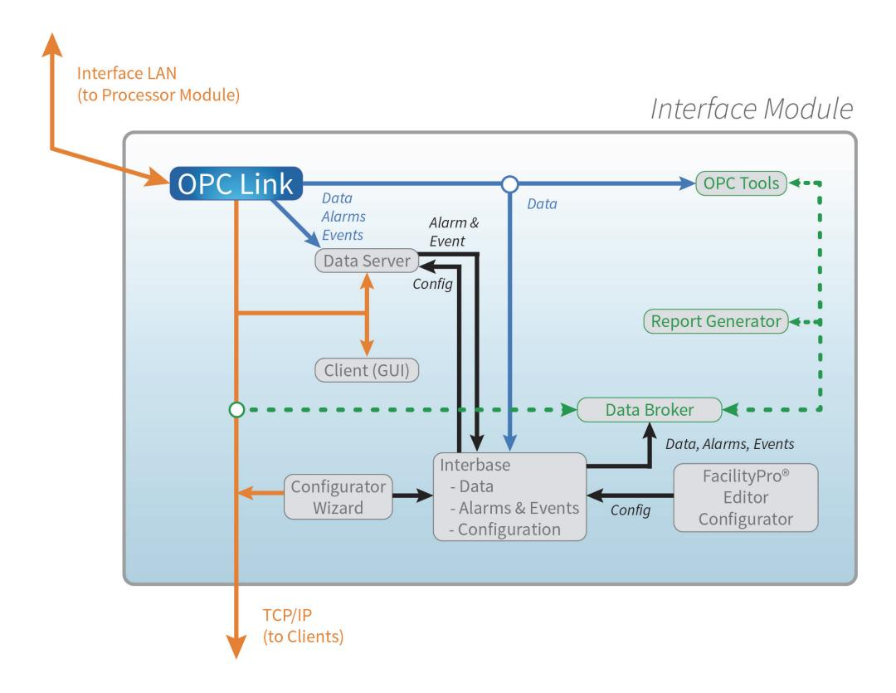

**Figure 1-1** Architecture of Pharmaceutical Net Pro software system

Software Architecture Chapter 1 Overview

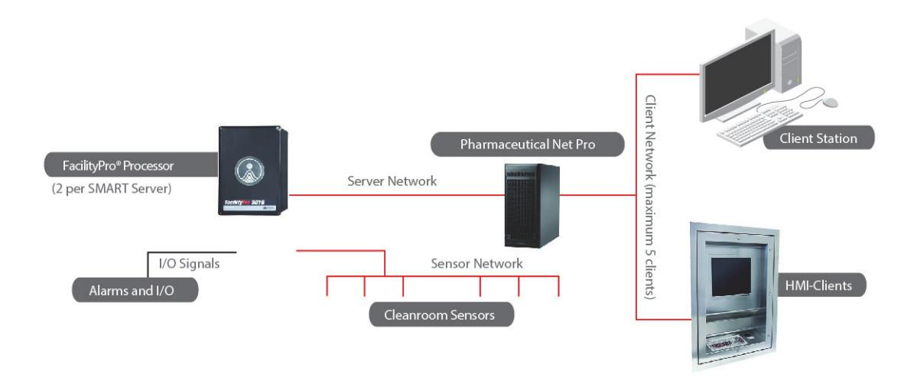

**Figure 1-2** Pharmaceutical Net Pro network (with FacilityPro 3010 Processor Module as an example)

### **WARNING**

It is recommended to use only dedicated LAN networks. Avoid connection to internal office networks or Internet (permitted only for remote assistance purposes).

# **Server Software Description**

Pharmaceutical Net Pro software provides the interface and supervisory control for the FacilityPro 1010/3010/5010 Environmental Monitoring System.

The provided server should contain:

- Data Server runtime
- Data Broker Data interface between software and tag database
- OPC (OLE for Process Control) OPC standard communication driver

The database should be managed by a factory secure password.

#### **Interface**

Pharmaceutical Net Pro application software:

- Pharmaceutical Net Pro Release
- Report Generator Extracts data from DB and generating data reports, audits and trends
- PMS Custom Shell Launcher software with graphical interface showing progression bar and a button to access the OS with a local administrator password for maintenance purposes
- OPC Link OPC driver to communicate to Pharmaceutical Net Pro
- Sensor Editor Sensor setup
- Recipes Editor Recipe setup
- Sampling Editor Setting up sampling recipes
- Limits Editor Setup of alarm and warning limits for each class of sensor
- Run Time Logic Editor DI/DO logic management
- Aventino Backup Service Performs system backup
- PMS Sampling Report Automation Periodically checks for finished samplings and automatically exports to a user-defined filepath
- PMS History Automation Service Daily extraction of sensor data (statistical and sampling) within a user-defined group
- Aventino Data Server Manages alarms written to the database
- SMART Editor Configures and customizes graphical pages
- PMS License Manager Licenses the software

Electronic Signature Chapter 1 Overview

# **Electronic Signature**

The Electronic Signatu[re feature is a control that applie](#page-35-0)s p[assword protection for the](#page-35-0)  [performance of](#page-35-0) an operation or a change of critical values inside the system.

Operations include:

- [User Event \(See](#page-43-2) **User Event button** on page 3-3 and **User Event button** on page 3-3)
- [Recipe management \(see](#page-49-3) **Create a New Recipe** on page 4-5 and **Edit an Existing Recipe** on page 4-5)
- Begin or st[op sampling \(see](#page-53-3) **Sche[dule a Sa](#page-57-0)mpling** [on pa](#page-60-0)ge 5-3 and **Edit a Scheduled Sampling** on [page](#page-65-1) 5-5)
- Manual Switch ON/OFF a particl[e counter, biological sensor,](#page-119-3) or a direct digital output (see **Chapter 6** Sensors on page [6-5 and page](#page-141-6) 6-8)
- Alarm management (see **Acknowledge an Alarm** on page [7-3\)](#page-151-2)
- [Stopping r](#page-151-2)e[al time trending \(see](#page-147-3) **Chapter 9** Real Time Trend)
- • Add, modify, or delete a user (see **Chapter 11** User Management)
- Change the descriptions of individual sampling points (see **Sensors Editor** on page 12-5 in **Chapter 12** System Ta[sks\)](#page-24-1)

### **Electronic Signature window**

In the **Electronic Signature** window (see **Figure 1-3**), the user confirms the event by entering a valid username and password.

The system stores the following event data for Electronic Signature events:

- Operation type
- Old and modified values
- [Account](#page-67-5)
- Comment

Event data can be accessed through the **Audit Trail** from the **Report** window (see **Reports available through the Report Generator** on page 8-1).

Chapter 1 Overview Specifications

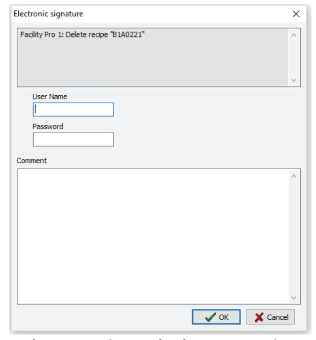

**Figure 1-3 Electronic Signature** window

Note that the text displayed in the top field of the **Electronic Signature** window is a brief description of the action being performed provided by the system.

# **Specifications**

The minimum recommended hardware specifications for Pharmaceutical Net Pro are listed below.

| Pharmaceutical Net Pro Specifications |                                                                                                                    |  |  |
|---------------------------------------|--------------------------------------------------------------------------------------------------------------------|--|--|
| Processor                             | Intel® Core Processor i3 2.2 GHz                                                                                   |  |  |
| Operating System                      | Windows® Server 2016 Standard English (64 bit) Version: 10.0.14393, Build: 14393                                |  |  |
| Operating System (Client)             | Windows 10                                                                                                         |  |  |
| RAM                                   | Minimum 8 GB                                                                                                       |  |  |
| Hard Disk C                           | 1 TB (for OS)                                                                                                      |  |  |
| Hard Disk D                           | 1 TB (for Data)                                                                                                    |  |  |
| Network Card                          | Minimum 1 network card 2 are needed to support clients 3 are needed to support clients and remote assistance |  |  |

Specifications Chapter 1 Overview

#### **CAUTION**

Ensure Windows Update is turned off to allow the software to function as intended. Specific Windows updates compatible with Pharmaceutical Net Pro include:

Windows 10 Professional EN

- Cumulative update 1803
- KB4458469
- KB4100347
- KB4456655
- KB4343669

Windows Server 2016 Standard EN

- KB4457127
- KB4091664
- KB4132216
- KB3192137

The software may be impacted if other Windows updates are installed.

Chapter 1 Overview Specifications

This page is intentionally left blank.

# **Chapter 2 Installation**

This chapter describes the installation steps of Pharmaceutical Net Pro.

# **Prerequisites**

Ensure the PC has the minimum **Specifications** found on page 1-6. The operating system installed should be Windows Server 2016 Standard. The hard disks or partitions available should be named C:\ and D:\.

# **Pharmaceutical Net Pro Installation**

**1** Insert the Pharmaceutical Net Pro disk. Initiate **PharmNetProInstaller.exe** located on the disk.

Once the installer window opens, click **Next**.

**Figure 2-1** Pharmaceutical Net Pro Installer

**2** The initial status of installation is displayed. Click **Next**.

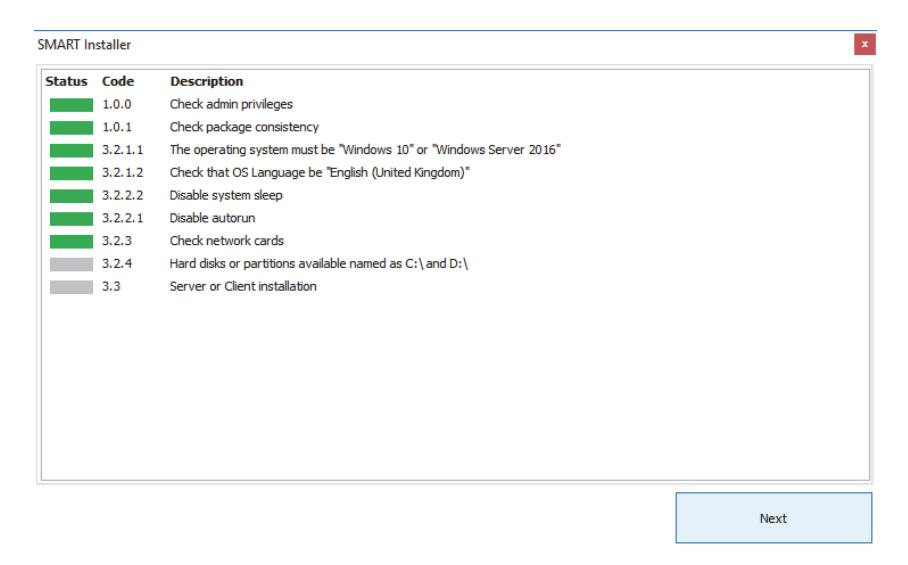

**Figure 2-2** Installation status

**3** Click **OK** when the network card information popup appears.

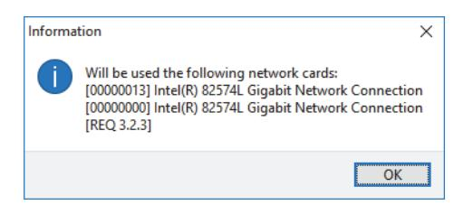

**Figure 2-3** Network card popup

**4** Click **OK** when the hard disk information popup appears.

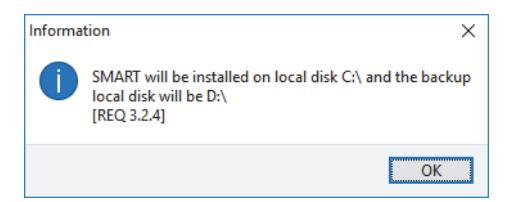

**Figure 2-4** Hard disk popup

- **5** Select **Pharmaceutical Net Pro Server** or **Pharmaceutical Net Pro Client** depending on how the PC will be used and click **OK**.
- **6** If you wish to change the computer name, do so with the **Assign computer name** window. The system will automatically restart after clicking **OK**.

PC.

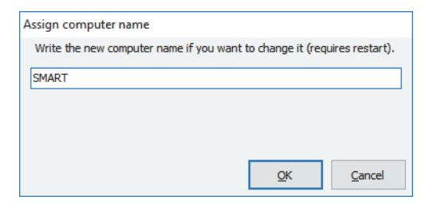

**Figure 2-5 Assign computer name** window

**7** Select **Create new Local User** and use it and click **OK**. The option **Run as Local User (pick one)** requires an administrator created on the

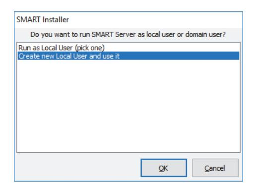

**Figure 2-6** Local or domain user option

- **8** If creating a local user:
  - **a.** Enter the username and click **OK**.
  - **b.** Enter the password and click **OK**.
  - **c.** Enter the password again and click **OK**.
  - **d.** The system automatically restarts.
- **9** Use the following network information for the FIELD network card:
  - **a.** IPv4 address: 192.168.0.2
  - **b.** Subnetmask: 255.255.255.0
- **10** The installer will go step-by-step.

If the system is not connected to the internet, skip **Check Windows Defender** (click **OK**).

- **11** Once **Matrikon Explorer Installation** starts, it might be necessary to wait several minutes for this step to complete.
- **12** Select the desired language in the **Language Switch** window, then close it.

**Figure 2-7** License Manager

- **13** Once the step **License Manager** step has been reached, refer to your specific system configuration:
  - **a. System size license** types:
    - Small: Maximum of 6 sampling points allowed (either biological or particle), with 8 DI, 16 DO and 8 Analog
    - Medium: Maximum of 12 sampling points allowed (either biological or particle), with 16 DI, 32 DO and 48 Analog
    - Large: Unlimited sampling points allowed (either biological or particle), with unlimited DI, DO and Analog
  - **b. Client number license** types:
    - Allow only SERVER: 0 clients
    - Allow 2 physical Clients: 1 to 2 clients
    - Allow 5 physical Clients: 3 to 5 clients
- **14** The following steps are for the **System size license**:
  - **a.** Click **Activate PharmaceuticalNet-Pro Server**.
  - **b.** Choose the activation type based on whether internet is available or not.
  - **c.** Enter the License ID and Password found on the disk or downloaded to the computer connected to the internet.
  - **d.** Click **Continue** when finished.

- **15** The following steps are for the **Clients number license**:
  - **a.** Click **Activate PharmaceuticalNet-Pro CLIENTS**.
  - **b.** Choose the activation type based on whether internet is available or not.
  - **c.** Enter the License ID and Password found on the disk or received through email.
  - **d.** Click **Continue** when finished.
- **16** System size and clients are now active. Close the **License Manager**.
- **17** Click **OK** when the installation application confirms setup is finished.
- **18** The system will automatically restart.

This page is intentionally left blank.

# **Chapter 3 Get Started**

Pharmaceutical Net Pro runs on both the server and client PCs, if present.

# **System Start-Up**

At power-up, the Pharmaceutical Net Pro software application launches automatically and displays the **Main Page** window (see **Figure 3-1**) with the default user logged in (username **Nobody**).

**NOTE:** To work with the Pharmaceutical Net Pro software interface you will need to log out the user **Nobody** and log in as an authorized user (see Log In and Log Out on page 3-6).

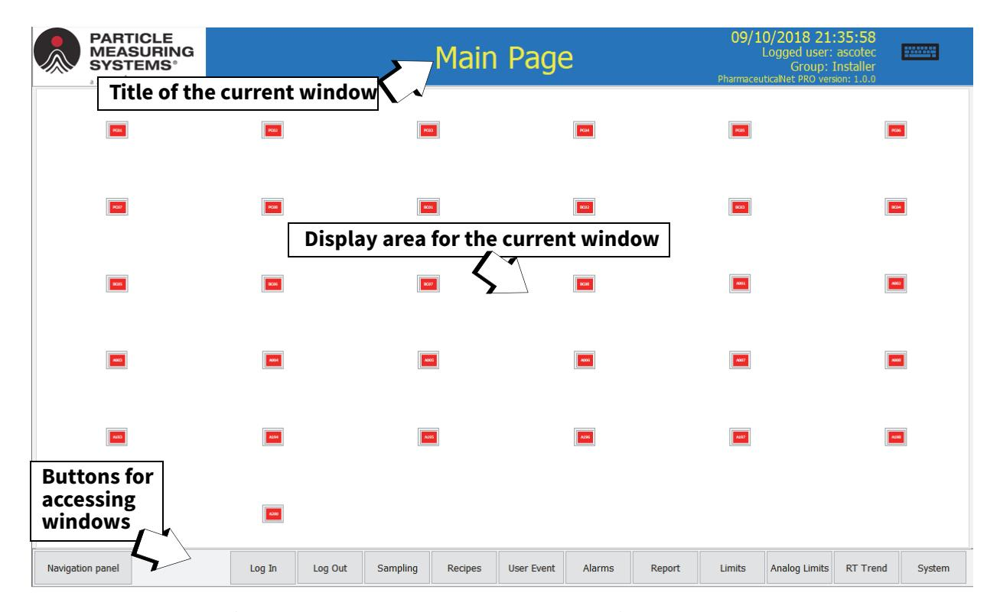

**Figure 3-1** Pharmaceutical Net Pro **Main Page** window

Chapter 3 Get Started System Start-Up

#### **Components of the Pharmaceutical Net Pro software screen**

#### **Header**

The top of the Pharmaceutical Net Pro **Main Page** window displays the following information:

- Logo
- **Window title** Name of the window currently displayed
- **Date and time** Current date and time, in the same format as the OS
- • **Logged user** – User Name of the user currently logged in
- **Group**  Role (i.e., Administrator, Supervisor, Power User, User, Emergency) assigned to the user currently logged in

#### **Central area**

The central area of the Pharmaceutical Net Pro screen displ[ays one of s](#page-34-4)everal windows used to monitor or configure the FacilityPro Environmental Monitoring System. At start-up, the **Main Page** window displays in the central area of the Pharmaceutical Net Pro screen. Navigating to a different window requires cl[icking one of the button](#page-33-3)s at the bottom of the Pharmaceutical Net Pro screen (described in **Table 3-1**, below).

#### **Buttons row**

The bottom of the Pharmaceutical Net Pro screen (see **Figure 3-1** on pa[ge 3-1\) has](#page-34-4) rows of buttons for accessing those windows and for logging in or logging out. Access is governed by the logged-in user's privileges.

The components of the Pharmaceutical Net Pro screen are described in **Table 3-1**.

**Table 3-1** Components of the Pharmaceutical Net Pro screen

| Window title area            | The title of a window displays across the top                                                                                                    |
|------------------------------|--------------------------------------------------------------------------------------------------------------------------------------------------|
| Logged user and Group area   | of the screen. In the upper-right corner, the Logged user and                                                                                 |
| Central area: current window | Group are displayed for the user currently logged in. The user "Nobody" is logged in at start-up. One of the windows used to monitor or |
|                              | configure the FacilityPro Environmental Monitoring System.                                                                                    |

System Start-Up Chapter 3 Get Started

**Table 3-1** Components of the Pharmaceutical Net Pro screen (Continued)

|                         | options: Analog input, Biocapt, Particle counter, Main Page.                                                                                                 |
|-------------------------|-----------------------------------------------------------------------------------------------------------------------------------------------------------------|
|                         |                                                                                                                                                                 |
| Analog input button     | Click this button to display the Analog input window (see Analog Inputs Window on                                                                            |
| Biocapt button          | page 6-9). Click this button to display the Biocapt window (Biocapt Window on page 6-6).                                                            |
| Particle counter button | Click this button to display the Particles counter window (Particle counter Window on                                                                        |
| Main Page button        | page 6-1). button to display the Main Page Click this window (described in Main Page Window on                                                      |
| Log-in button           | page 3-5). Click this button to display the Login window                                                                                               |
| Log-out button          | (described in Log In and Log Out on page 3-6). Click this button to log out the current user                                                           |
|                         | (described in For more information on managing users, see Chapter 11 User Management. on page 3-6). button to display the Sampling Click this |
| Sampling button         | window (described in Chapter 5 Sampling). Click this button to display the Recipes                                                                     |
| Recipes button          | window (described in Chapter 4 Recipes). Click this button to open the Electronic                                                                         |
| User Event button       | Signature window to log a custom user event.                                                                                                                    |
| Alarms button           | Click this button to display the Alarms window (described in Chapter 7 Alarms).                                                                        |
| Report button           | Click this button to display the Report window (described in Chapter 8 Reports).                                                                       |

Chapter 3 Get Started System Start-Up

**Table 3-1** Components of the Pharmaceutical Net Pro s[creen \(Continued\)](#page-159-3)

|                 |                      | page 12-13 in Chapter 12 System Tasks).                                                                                                     |
|-----------------|----------------------|---------------------------------------------------------------------------------------------------------------------------------------------------|
|                 | Analog Limits button | Click this button to display the Analog Inputs Limits window (Analog Inputs Limits on page 12-20).                                       |
| RT Trend button |                      | Click this button to open the RT Trend window (described in Chapter 9 Real Time Trend).                                                  |
| System button   |                      | Click this button to open a page with options for data backup, restart of the installation                                                     |
|                 |                      | Wizard, shutdown of the software, user management, sensor editor, language switch, VNC Viewer (described in Chapter 12 System Tasks). |

Main Page Window Chapter 3 Get Started

# **Main Page Window**

The **Main Page** window (see **Figure 3-1**) is a display-only window that contains a table an ov[erview of the status of](#page-37-1) the sensor modules connected to the FacilityPro Environmental Monitoring System.

The color of a rectangle indicates the current status of the sensor.

• See **Table 3-2** on page 3-5 for descriptions of what a particular color indicates about the status of a module.

#### **>> To open the Main Page window:**

- **1** Click the **Navigation panel** button at the bottom of the [Pharmaceu](#page-33-3)tical Net Pro screen.
- **2** Click the **Main Page** button in the pop-up window.

The **Main Page** window appears showing the floorplan and sensor locations (see **Figure 3-1**).

**Table 3-2 Channel Status Legend**

| Idle                                       | white             |  |
|--------------------------------------------|-------------------|--|
|                                            |                   |  |
| Starting/Stopping/Waiting/Cleaning/Holding | light green       |  |
| Sampling                                   | green             |  |
| Pause                                      | cyan (light blue) |  |
| Delayed start                              | purple            |  |
| Alarm                                      | red               |  |
| Alert                                      | yellow            |  |
|                                            |                   |  |

Chapter 3 Get Started Log In and Log Out

# **Log In and Log Out**

At system start-up, the Pharmaceutical Net Pro **Main Page** window displays with the default user (username **Nobody**) logged in. In order to interact with the Pharmaceutical Net Pro application, a user is expected to log in with their username and password, as the default user has limited a[ccess to the features in the](#page-141-6)  Pharmaceutical Net Pro application.

Management of user privileges, usernames, and passwords for access to Pharmaceutical Net Pro features is described in **Chapter 11** User Management.

#### **Log in window**

#### **>> To log in to FacilityPro:**

**1** Click the **Log In** but[ton at the b](#page-38-2)ottom of the Pharmaceutical Net Pro screen.

The **Log in** window appears (see **Figure 3-2**).

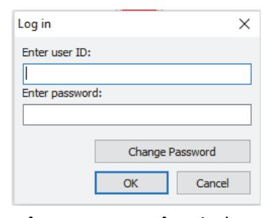

**Figure 3-2 Log in** window

- **2** In the **Enter user ID** field, enter your username.
- **3** In the **Enter password** field, enter your password.
- **4** Click the **OK** button.

Your username will display at the top right c[orner of the FacilityPro screen.](#page-141-6)

**NOTE:** If another user is currently logged in, the **Log in** window displays the **Log-out** button, which you need to click before you can log in.

For more information on managing users, see **Chapter 11** User Management.

#### **>> To log out the current user:**

**1** Click the **Log-out** button at the bottom of the Pharmaceutical Net Pro screen. The **Nobody** username will display at the top right corner of the Pharmaceutical Net Pro screen.

# **Chapter 4 Recipes**

The **Recipes Editor** window (see **Figure 4-1**) is used to create, edit, and delete recipes for running the FacilityPro system. A recipe defines a group of sensors selected to sample at the same time.

# **Recipes Editor Window**

- **>> To open the Recipes Editor window:**
  - Click the **Recipes** button at the bottom of the Pharmaceutical Net Pro screen.

The **Recipes Editor** window appears (see **Figure 4-1**).

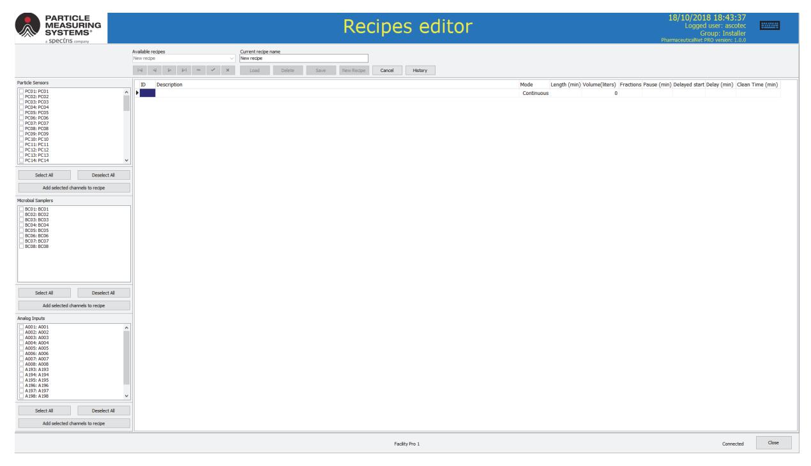

**Figure 4-1 Recipes Editor** window

The components of the **Recipes Editor** window are described in **Table 4-1** on page 4-2.

Chapter 4 Recipes Recipes Editor Window

**Table 4-1 Recipes Editor** window components

| Component                                 | Description                                                                                                                                                                                                                                        |
|-------------------------------------------|----------------------------------------------------------------------------------------------------------------------------------------------------------------------------------------------------------------------------------------------------|
| Available recipes dropdown list           | This list contains the names of all currently defined recipes. When you select the recipe you want to work with, the recipe name displays in the Current recipe name field and the recipe definition displays in the spreadsheet area. |
| Current recipe name field                 | Displays the name of the recipe currently being viewed.                                                                                                                                                                                            |
| Load button                               | Click this button to view the recipe selected in the Available recipes field so you can modify its definition.                                                                                                                                  |
| Delete button                             | Click this button to delete the recipe selected in the Current recipe name field.                                                                                                                                                               |
| Save button                               | Click this button to save a recipe that is new or is being modified.                                                                                                                                                                            |
| New Recipe button                         | Click this button to begin defining a new recipe.                                                                                                                                                                                                  |
| Cancel button                             | Click this button to exit the new recipe mode or the modify recipe mode and enable the Available recipes field and the Load button.                                                                                                          |
| History button                            | Select a recipe from the Available recipes field, then click this button to open a report window that shows the definition of the selected recipe and has a Print button for sending a copy of the report to the printer.              |
| Particle Sensors area                     | Contains a check box for each sensor in the system.                                                                                                                                                                                                |
| S0 sensor n check boxes                   | • When checked, the sensor can be added to a recipe. • When not checked, the sensor will not be added to a recipe.                                                                                                                     |
| Select All button                         | Click this button to quickly place a checkmark in all the sensor check boxes.                                                                                                                                                                |
| Deselect All button                       | Click this button to quickly remove the checkmark from all the sensor check boxes.                                                                                                                                                              |
| Add selected channels to recipe button | After a recipe has been selected from the Available recipes field or the New Recipe button has been clicked, AND one or more sensor check boxes is checked, click this button to add the checked sensors to the recipe.             |

Recipes Editor Window Chapter 4 Recipes

**Table 4-1 Recipes Editor** window components (Continued)

| Component                                      | Description                                                                                                                                                                                                                                           |
|------------------------------------------------|-------------------------------------------------------------------------------------------------------------------------------------------------------------------------------------------------------------------------------------------------------|
| Microbial Samplers area                        | Contains a check box for each BIO sampler in the system.                                                                                                                                                                                              |
| BC: BC channel n check boxes                   | • When checked, the BIO sampler can be added to a recipe. • When not checked, the BIO sampler will not be added to a recipe.                                                                                                           |
| Select All button                              | Click this button to quickly place a checkmark in all the BIO sampler check boxes.                                                                                                                                                              |
| Deselect All button                            | Click this button to quickly remove the checkmark from all the BIO sampler check boxes.                                                                                                                                                            |
|                                                | After a recipe has been selected from the Available                                                                                                                                                                                                   |
| Add selected channels to recipe button      | recipes field or the New Recipe button has been clicked, AND one or more BIO sampler check boxes is checked , click this button to add the checked BIO samplers to the recipe.                                                         |
| Analog Inputs area A0 channel n check boxes | Contains a check box for each Analog sensor in the system. • When checked, the Analog sensor can be added to a recipe.                                                                                                                    |
| Select All button                              | • When not checked, the Analog sensor will not be added to a recipe. Click this button to quickly place a checkmark in all the Analog sensor check boxes.                                                                              |
| Deselect All button                            | Click this button to quickly remove the checkmark from all the Analog sensor check boxes.                                                                                                                                                          |
| Add selected channels to recipe button      | After a recipe has been selected from the Available recipes field or the New Recipe button has been clicked, AND one or more Analog sensor check boxes is checked , click this button to add the checked BIO sensors to the recipe. |
| Recipes spreadsheet fields                     | Each row shows information and data entry fields for a single sensor                                                                                                                                                                               |
| ID column                                      | Displays the short identification number of a sensor.                                                                                                                                                                                                 |
| Description column                             | Sensor description.                                                                                                                                                                                                                                   |

Chapter 4 Recipes Recipes Editor Window

**Table 4-1 Recipes Editor** window components (Continued)

| Component               | Description                                                                                                                                                                                                                                                                                                                               |
|-------------------------|-------------------------------------------------------------------------------------------------------------------------------------------------------------------------------------------------------------------------------------------------------------------------------------------------------------------------------------------|
| Mode column             | Select the sampling mode for the recipe: • Continuous • Time • Volume                                                                                                                                                                                                                                                   |
| Length (min) column     | When the Mode is set to Time, enter the duration of the sampling in minutes.                                                                                                                                                                                                                                                           |
| Volume (liters) column  | When the Mode is set to Volume, enter the amount of air to be sampled (in liters).                                                                                                                                                                                                                                                     |
| Fractions column        | For a Biological Module, it is possible to divide the sample into different fractions. Enter the desired number of fractions (range: 1 to 20 for RVUs, and 1 to 60 for MiniCapt Remote).                                                                                                                                         |
| Pause (min) column      | Enter the number of minutes to pause before sampling.                                                                                                                                                                                                                                                                                     |
| Delayed start column    | Select Yes to set a delay on the start-up of sampling, then enter the delay in the Delay (min) column.                                                                                                                                                                                                                                 |
| Delay (min) column      | When Yes is entered in the Delayed start column, enter the length of the delay (range 1 to 480 minutes).                                                                                                                                                                                                                               |
| Clean Time (min) column | It is possible to set the cleaning time at the start of the sampling. • Only pump is driven in order to clean the vacuum line. • During this time, the system does not handle warnings and alarms.                                                                                                                      |
| Status bar              | Displays the status of the connection to the FacilityPro Processor Module: • Connected – Indicates Pharmaceutical Net application is connected to the FacilityPro Processor Module. Disconnected – Indicates Pharmaceutical Net Pro • software application is disconnected from the FacilityPro Processor Module. |
| Close button            | Click this button to close the Recipes Editor window and return to the Main Page window.                                                                                                                                                                                                                                               |

Create a New Recipe Chapter 4 Recipes

# **Create a New Recipe**

#### **>> To create a new recipe:**

- **1** Log in as a user with Administrator privileges.
- **2** Open the **Recipes Editor** window as described on page 4-1.
- **3** Click the **New Recipe** button.
- **4** In the **Current recipe name** field, enter a unique name for the new recipe.
- **5** Place a checkmark in the check box for each sensor to include in the new recipe.
- **6** Click the **Add selected channels to recipe** button.
- **7** Configure samples for single points:
- **8** [Click](#page-23-2) the **Save** button. The **Recipe** electronic signature window appears.
- **9** Perform the electronic signature to save the recipe (see **Electronic Signature** on page 1-5).

# **Edit an Existing Recipe**

#### **>> To edit a recipe:**

- **1** Open the **Recipes Editor** window as described on page 4-1.
- **2** From the **Available recipes** dropdown list, select the recipe you want to edit.
- **3** Click the **Load** butto[n.](#page-43-0)

The system loads the recipe's configuration.

- **4** Make the edits to the recipe. (Use the procedures suggested in Create a New Recipe, [above\).](#page-23-2)
- **5** [When ed](#page-23-2)iting is complete, click the **Save** button. The **Recipe** electronic signature window appears.
- **6** Perform the electronic signature to save the recipe (see **Electronic Signature** on page 1-5).

# **Delete an Existing Recipe**

- **>> To delete a recipe:**
- **1** Open the **Recipes Editor** window as described on page 4-1.
- **2** From the **Available recipes** dropdown list, selec[t the recipe](#page-44-1) you want to delete.
- **3** Click the **Delete** button.

The system displays a confirmation window (see **Figure 4-2**).

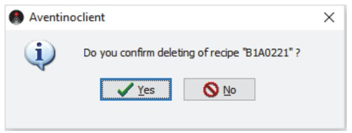

**Figure 4-2 Recipes Editor** confirm delete dialog box

- **4** [To confirm the deletion, in the confirm](#page-23-2)ation window:
  - **a.** Click the **Yes** button.
  - **b.** Perform the electronic signature to remove the recipe from the system (see **Electronic Signature** on page 1-5).

# **Chapter 5 Sampling**

The **Samplings editor** window (see **Figure 5-1**) is used to schedule sampling times for running specific recipes.

# **Sampling Editor Window**

The **Sampling Editor** window allows you to schedule a sampling and displays a list of all samplings planned or currently running.

- **>> To open the Samplings editor window:**
  - Click the **Sampling** button at the bottom of the Pharmaceutical Net Pro screen.

The **Samplings editor** window appears (see **Figure 5-1**).

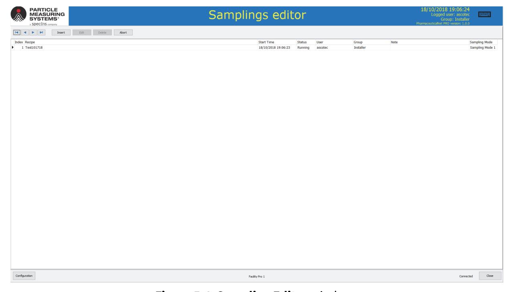

**Figure 5-1 Sampling Editor** window

The components of the **Sampling Editor** window are described in **Table 5-1** on page 5-2.

**Table 5-1 Sampling Editor** window components

| Previous Record button  | Click this button to view the previous record.                                                                                                                                    |
|-------------------------|-----------------------------------------------------------------------------------------------------------------------------------------------------------------------------------|
| Next Record button      | Click this button to view the next record.                                                                                                                                        |
| Last Record button      | Click this button to view the last record.                                                                                                                                        |
|                         | Click this button to open the Sampling on input editor dialog                                                                                                                     |
| Insert button           | box where you can schedule a new sampling run (see Schedule a                                                                                                                     |
| Edit button             | Sampling on page 5-3). Click this button to open the Sampling on input editor dialog box where you can modify a scheduled sampling (see Edit a                           |
| Delete button           | Scheduled Sampling on page 5-5). Click this button to delete the recipe selected in the Current recipe name field.                                                       |
| Abort button            | Click this button to stop the sampling run.                                                                                                                                       |
| Configuration button | Click this button to open the Custom fields configuration window where you can manage definitions available to apply to                                                        |
| Close button            | a sampling (see Configuring Custom Fields to Apply to a Sampling on page 5-6). Click this button to close the Sampling Editor window and                                 |
| Samplings Table         | return to the Main Page window. The Samplings Table lists information for the samplings                                                                                        |
| Index column            | currently scheduled. The sequential number automatically assigned when the                                                                                                     |
| Recipe column           | sampling was scheduled. The name of the recipe that will run during the sampling.                                                                                              |
| Start Time column       | The date and time the sampling will take place in the same                                                                                                                        |
| Status column           | format as the OS. The current state of the sampling:                                                                                                                           |
|                         | • Idle – The sampling program has not been run. Running – Indicates the sampling program is currently • running. Stopping – The sampling program is stopping. • |
| User column             | The name of the user that scheduled the sampling.                                                                                                                                 |
| Group column            | The name of the group that contains the user that scheduled the sampling.                                                                                                      |
| Note column             | Comments included when the sampling was created.                                                                                                                                  |
| Mode column             | The mode assigned to the sampling. Ex. Operational, At Rest, Normal Operation, Custom.                                                                                         |

Schedule a Sampling Chapter 5 Sampling

# **Schedule a Sampling**

Scheduling a sampling using the **Samplings editor** window involves defining the fields of the **Sampling on input editor** dialog box such as:

- Selection of an existing recipe
- Batch number
- • Date and time the sampling should begin
- Mode for the sampling
- • Comments

and performing the Electronic signature

## **Sampling on input editor dialog box**

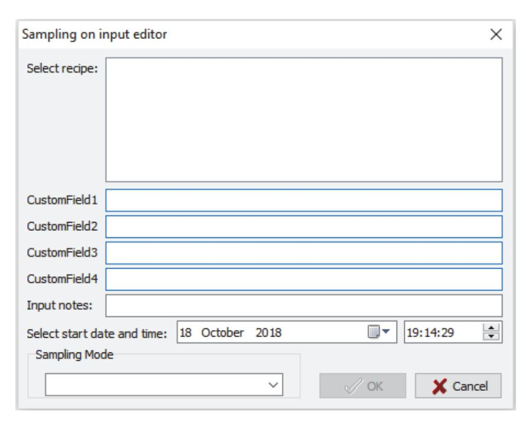

**Figure 5-2 Sampling on input editor** dialog box

The components of the **Sampling on input editor** dialog box for scheduling a sampling are described in **Table 5-2**.

Chapter 5 Sampling Schedule a Sampling

**Table 5-2 Sampling on input editor** dialog box

| Custom fields                    | Lists custom fields to be selected for the sampling.                                                                                                                                  |
|----------------------------------|---------------------------------------------------------------------------------------------------------------------------------------------------------------------------------------|
| Input notes field                | Defines notes to include in the Sampling Report.                                                                                                                                      |
| Select start date and time field | The date field defines the day of the year to begin the                                                                                                                               |
|                                  | sampling. Click in the field to display a calendar from which you can select the desired date.                                                                                     |
| Sampling mode list               | The time field defines the time of day to begin the sampling. Lists the operating modes so you can select the one to apply to the sampling (ex: Operational, At Rest, Normal |
| OK button                        | Operation, Custom). Click this button of save the new sampling schedule and close the Sampling editor dialog box.                                                               |
| Cancel button                    | Click this button to close the Sampling editor dialog box without scheduling a sampling.                                                                                           |
|                                  |                                                                                                                                                                                       |

#### **>> To select and start an existing sampling re[cipe:](#page-47-2)**

- **1** Click the **Insert** button at the top of the **Sampling Editor** window. The **Sampling editor** dialog box appears (see **Figure 5-2** on page 5-3).
- **2** In the **Select recipe** field of the **[Sampling editor](#page-50-1)** dialog box, select the recipe you want to use for the sampling.
- **3** If desired, in a **Custom** field, enter a value to include in the Sampling Report. Optional; see **Custom fields configuration window** on page 5-6.
- **4** If desired, in the **Input notes:** field, enter notes to include in the Sampling Report.
- **5** From the **Select start date and time:** fields, select the day and time the recipe should begin sampling.
- **6** From the **Sampling Mode** dropdown list, select the operating mode in which to start [the samp](#page-23-2)ling (ex: **Operational**, **At Rest**, **Normal Operation**, **[Custom](#page-23-2)**).
- **7** Click the **OK** button in the **Sampling editor** dialog box.
- **8** Perform the electronic signature to start the sampling (see **Electronic Signature** on page 1-5).

The new sampling definition appears in the **Samplings Table** list.

# **Abort a Sampling Event**

- **>> To abort a sample:**
- **1** Open the **Sampling Editor** window as described on page 5-1.
- **2** In the **Recipe** column, select the sampling you want to abor[t.](#page-23-2)
- **3** [Click](#page-23-2) the **Abort** button.
- **4** Perform the electronic signature to abort the sampling (see **Electronic Signature**  on page 1-5).

The sampling run is stopped.

# **Edit a Scheduled Sampling**

You can change a sample that has already been programmed. Time, date and sampling mode are changeable and new record can b[e saved w](#page-45-5)ith an electronic signature.

- **>> To edit a sampling event in the Sampling Editor window:**
- **1** Open the **Sampling Editor** window as described on page 5-1.
- **2** In the **Recipe** column, select the sampling yo[u want to edit.](#page-47-2)
- **3** Click the **Edit** button.

The **Sampling editor** dialog box appears (see **Figure 5-2** on page 5-3).

- **4** In the **Sampling editor** dialog box, make the changes to the sched[uled departure of](#page-23-2)  [the recipe.](#page-23-2)
- **5** Click the **OK** button in the **Sampling editor** dialog box.
- **6** Perform the electronic signature to update the configuration (see **Electronic Signature** on page 1-5).

# **Delete a Scheduled Sampling**

- **>> To delete a sampling event in the Sampling Editor window:**
- **1** Open the **Sampling Editor** window as described on page 5-1.
- **2** In the **Recipe** column, select the sampling you want to delete.
- **3** Click the **Delete** button.

The sampling definition disappears from the table in the **Sampling Editor** window.

# **Configuri[ng Custo](#page-50-2)[m Fields to Apply to a Samplin](#page-47-1)g**

A user with **administrator** privileges can use the **Custom fields configuration** window (see **Figure 5-3**) to define fields that are available in the **Sampling editor** dialog box (see **Sampling on input editor dialog box** on page 5-3), the dialog box where you schedule a sampling.

### **Custom fields configuration window**

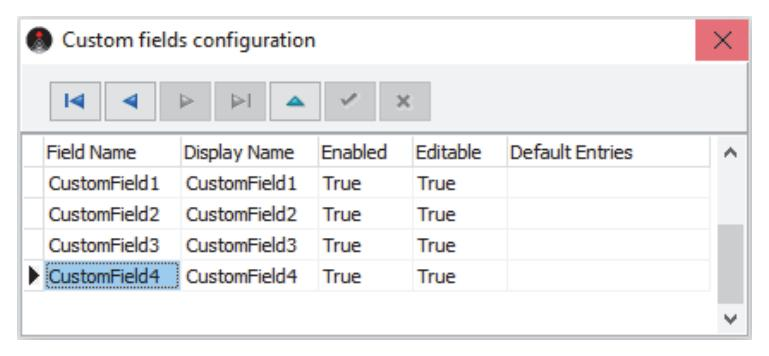

**Figure 5-3 Custom fields configuration** window

**Table 5-3** describes the components of the **Custom fields configuration** window.

**Table 5-3** Components of the **Custom fields configuration** window

| Close Window button        | Click this button to close the Custom fields configuration window.           |
|----------------------------|------------------------------------------------------------------------------------|
| View First Row button      | Click this button to view the first row in the table.                              |
| View Previous Row button   | Click this button to view the previous row in the                                  |
|                            | table. Click this button to view the next row in the table.                     |
| View Next Row button       | Click this button to view the last row in the table.                               |
| View Last Row button       | Click this button to view the previous field in the                                |
| View Previous Field button | table. Click this button to save changes to the Custom                          |
| Save Changes button        | fields configuration window. Click this button to undo changes to the Custom |
| Cancel Changes button      | fields configuration window.                                                    |

**Table 5-3** Components of the **Custom fields configuration** window (Continued)

|                     | Recipe field in the Sampling editor dialog box.                                                                                                                                                                                                                                                                 |
|---------------------|-----------------------------------------------------------------------------------------------------------------------------------------------------------------------------------------------------------------------------------------------------------------------------------------------------------------|
| Enabled list field  | For example, this label was defined as Batch Number in Figure 5-2 on page 5-3. Enables or disables the display of the field in the Sampling editor dialog box. True – Causes the field to be displayed in the •                                                                                  |
| Editable list field | Sampling editor dialog box with the label defined in the Display Name field. • False – Prevents the field from being displayed in the Sampling editor dialog box. Enables or disables editing of the field in the Sampling editor dialog box.                                                 |
| DefaultEntries      | • True – Causes the field to be edited by the user in the Sampling editor dialog box. • False – Prevents the field from being edited by the user in the Sampling editor dialog box. Defines values for a list box that will display for the field. Use a comma-delimited string of values. |
|                     |                                                                                                                                                                                                                                                                                                                 |

#### **>> To define custom fields for the Sampling editor dialog box:**

- **1** Open the **Sampling Editor** window as described on page [5-1.](#page-50-2)
- **2** Click the **Configuration** button at the bottom of the **Sampling Editor** window.

The **Custom fields configuration** window appears (see **Figure 5-3** on page 5-6).

- **3** In the **Custom fields configuration** window, define the display label for the field:
  - **a.** Click in the **Display Name** column for the field you want to work with.
  - **b.** Type the text to use as the name of the field.
- **4** In the **Custom fields configuration** window, set True/False for whether to display the field in the **Sampling Editor** window:
  - **a.** Click in the **Enable** column for the field you want to work with.
  - **b.** From the list box, select:
    - **True** Causes the field to be displayed in the **Sampling editor** dialog box with the label defined in the **Display Name** field.

—OR—

• **False** – Prevents the field from being displayed in the **Sampling editor** dialog box.

- **5** In the **Custom fields configuration** window, set whether the field will allow text data entry:
  - **a.** Click in the **Editable** column for the field you want to work with.
  - **b.** From the list box, select:
    - **True** Causes the field to be edited by the user in the **Sampling editor** dialog box.
    - **False** Prevents the field from being edited by the user in the **Sampling editor** dialog box.
- **6** When the value in the **Editable** column for the field has been set to **False** in the **Custom fields configuration** window, you can define the names for choices to display in a list box for the field.
  - **a.** Type the first value.
  - **b.** Type a comma.
  - **c.** Type the next value.
  - **d.** And so forth. The values must be typed as a comma-separated list without a space after a comma.
- **7** Click the **Save Changes** button in the **Custom fields configuration** window to save your changes.
- **8** Click the **Close Window** button to close the **Custom fields configuration**  window.
- **9** The custom fields will display the next time the **Sampling editor** dialog box is opened.

# **Chapter 6 Sensors**

The sensor windows are [used to view real-time inform](#page-58-1)ation for each sampling point of instruments connecte[d to the system:](#page-61-1)

- Particle sensors (see **Particle Sensors Values** on page 6-3)
- Biological sensors (see **Biocapt Values** on page 6-6)
- • Analog sensors (see **Analog Inputs** on page 6-9)

The Navigation panel button allows access to the above sensor pages. These pages are created by default during the installation process. Using the SMART Editor application, pages and area maps can be added.

# **Particle counter Window**

The **Particle counter** window is for display only, and shows summary information for all sensors of every module in the system.

- **>> To open the Particle counter window:**
- **1** Click the **Navigation panel** button at the bottom of the **Main Page** window.
- **2** From the pop-up menu, click the **Particle counter**  button.
- **3** The **Particle counter** window appears (see **Figure 6-1**).

Chapter 6 Sensors Particle counter Window

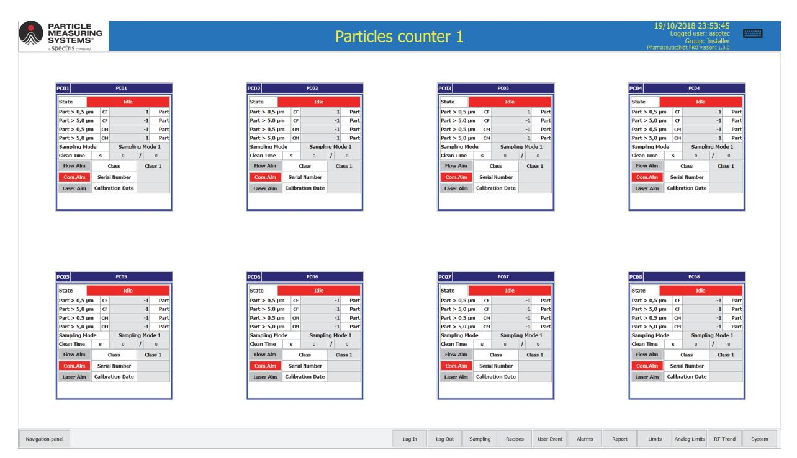

**Figure 6-1** Pharmaceutical Net Pro **Particle counter** window

Particle counter Window Chapter 6 Sensors

#### **Particle Sensors Value[s](#page-55-1)**

The components of the **sampling point information** view in the **Particle Sensors**  window are described in **Table 6-1**.

**Table 6-1 Particle Sensors** window **EBI Channel** view components

| Component        | Description                                                                          |
|------------------|--------------------------------------------------------------------------------------|
| Module Sub-Title | Displays a brief description of the current state of the modules, for example: Idle. |

Chapter 6 Sensors Particle counter Window

**Table 6-1 Particle Sensors** window **EBI Channel** view components (Continued)

# **Particle Counter sampling point information**

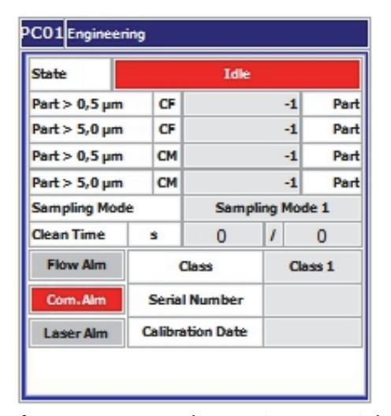

**Figure 6-2** Sampling point – Particle sensors

#### **Component Descriptio[n](#page-151-2)**

- **[Title bar](#page-151-2)** Displays a short descri[ption \(S01,S02,…\):](#page-151-2)  [Long desc](#page-151-2)ription.
- **Custom ID**  User-specified (see **Sensors Editor** on page 12-5) sensor ID
- **Description** User-specified (see **Sensors Editor** on page 12-5) description of sensor
- **State** –Displays the status of the sampling point:
  - **Idle** Point ready
  - **Starting** Point at the start
  - **Sampling** Point in sampling
  - **Stopping** Point at the end of sampling
  - **Waiting** The system has processed the command and it is waiting the response from the sensor
  - **Fault** System alarm for the sensor (flow, communication, laser, etc).
  - **Cleaning** (only for particle counting) Sensor ON, but without acquisition of data and generation of alarms.
- **Part**icles **> 0,5µm/CF** (cubic foot) Displays the counts of particles with size > 0.5 µm in a ft3 .
- **Part**icles **> 5,0µm/CF** (cubic foot) Displays the counts of particles with size > 5.0 µm in a ft3.
- **Part**icles **> 0,5µm/CM** (cubic meter) Displays the counts of particles with size > 0.5µm in a m3.
- **Part**icles **> 5,0µm/CM** (cubic meter) Displays the counts of particles with size > 5.0 µm in a m3 .
- **Sampling mode** (**Volume**, **Time**, or **Continuous**) Displays the sampling mode in effect
- **Volume** Current volume of sampling / target volume (when sampling mode is **Volume**)
- **Time** Current time of sampling / target time (when sampling mode is **Time**)
- **Clean Time** Current clean time (counter is not sampling but pump is active) / target clean time in seconds
- **Flow Alm** Solid red indicates the presence of a flow alarm, which means a fault in the vacuum line to the sensor.
- **Com Alm** Solid red indicates a communication alarm, which means the sensor is not connected and/or not responding.
- **Laser Alm** Solid red indicates the presence of a laser alarm, which means the laser inside the sensor has faulted.

Particle counter Window Chapter 6 Sensors

**Table 6-1 Particle Sensors** window **EBI Channel** view components (Continued)

| Component                                               | Description                                                                                                                                                                                                                                                                                                                                                                                                                                                               |
|---------------------------------------------------------|---------------------------------------------------------------------------------------------------------------------------------------------------------------------------------------------------------------------------------------------------------------------------------------------------------------------------------------------------------------------------------------------------------------------------------------------------------------------------|
| Particle Counter sampling point information, cont'd. | • Manual switch ON/OFF button –                                                                                                                                                                                                                                                                                                                                                                                                                                        |
|                                                         | Switch ON button – Click this button to                                                                                                                                                                                                                                                                                                                                                                                                                                   |
|                                                         | turn the particle counter ON. The Electronic Signature                                                                                                                                                                                                                                                                                                                                                                                                                 |
|                                                         | window will appear.                                                                                                                                                                                                                                                                                                                                                                                                                                                       |
|                                                         | • Switch OFF button – Click this button to turn the particle counter OFF. The Electronic Signature window will appear. • Class – Displays the particle counter's class • Serial Number – Displays the particle counter's serial number • Calibration Date – Displays the particle counter's calibration date • Predictive Reset button – This button appears when predictive alarm is active. Click this button to reset the |

Chapter 6 Sensors Biocapt Window

# **Biocapt Window**

The **Biocapt** window is for display only.

The **Biocapt** window displays of summary information for all sensors of every module in the system.

#### **>> To open the Biocapt window:**

• Click the **Biocapt** button at the bottom of the **Main Page**  window.

The **Biocapt** window appears (see **Figure 6-3**).

## **Biocapt Values**

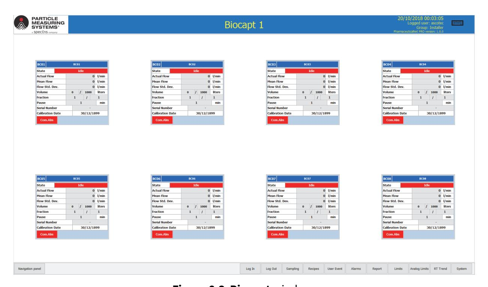

**Figure 6-3 Biocapt** window

The components of the **sampling point information** view in the **Biocapt** window are described in **Table 6-2** on page 6-7.

Biocapt Window Chapter 6 Sensors

**Table 6-2 Biological Sensors** window **B0 Remote Channel** view components

# **Component Description Sensor State** • Displays a brief description of the current state of the sensor, for example: **Idle**.

#### **Biological Sensor sampling point information**

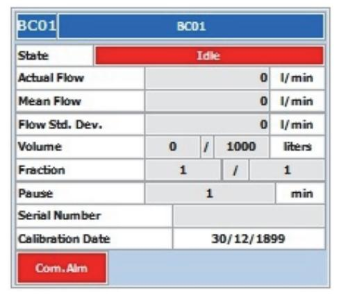

**Figure 6-4** Sampling point – Biological

- • **Title bar** – Displays a short description (B01,B02,…): Long description.
- **State** Displays the status of the sampling point:
  - **Idle** Point ready
  - **Starting** Point at the start
  - **Sampling** Point in sampling
  - **Stopping** Point at the end of sampling
  - **Waiting** The system has processed the command and it is waiting the response from the sensor.
  - **Fault** System alarm for the sensor (flow, communication, laser, etc)
  - **Pause** Sampling paused
- **Actual Flow** Displays the line's flow rate in l/m.
- **Mean Flow** Displays the average of flow rate in l/m.
- **Flow Std. Dev.** Displays the standard deviation of flow rate.
- **Volume** Current volume of sampling / target volume (when sampling mode is **Volume**)
- **Time** Current time of sampling / target time (when sampling mode is **Time**)
- **Fraction** ... **/** Displays the number of fractions set / fractions to reach
- **Pause** Displays the number of minutes of delay between two fractions
- **Serial Number** Displays the biological sensor's serial number
- **Flow Calc Alarm** Solid red indicates the presence of a flow alarm, which means a fault in the vacuum line to the sensor.
- **Com Alarm** Solid red indicates a communication alarm, which means the sensor is not connected and/or not responding.
- **Serial Number** Displays the biological sensor's serial number
- **Calibration Date** Displays the particle counter's calibration date

Chapter 6 Sensors Biocapt Window

**Table 6-2 Biological Sensors** window **B0 Remote Channel** view components (Continued)

| Component | Description                                                                                                              |
|-----------|--------------------------------------------------------------------------------------------------------------------------|
|           | Manual switch ON/OFF button – •                                                                                       |
|           | Switch ON button – Click this button to                                                                                  |
|           | turn the sensor ON. The Electronic Signature window will appear.                                                      |
|           | • Switch OFF button – Click this button to turn the sensor OFF. The Electronic Signature window will appear. |

Analog Inputs Window Chapter 6 Sensors

# **Analog Inputs Window**

The **Analog Inputs** window is for display only.

The **Analog Inputs** window displays of summary information for all sensors of every module in the system.

#### **>> To open the Analog Inputs window:**

• Click the **Analog Inputs** button at the bottom of the **Main Page**  window.

The **Analog Inputs** window appears (see **Figure 6-3**).

## **Analog Inputs**

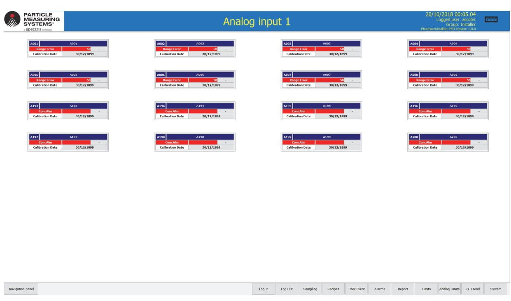

**Figure 6-5 Analog Inputs** window

The components of the **sampling point information** view in the **Analog Inputs**  window are described in **Table 6-3** on page 6-10.

### **WARNING**

In order to avoid the overgrowth of the database, it is strongly recommended with ENODE to the set deadband in the SBPC interface to 0.7% of acquisition range for each channel (in terms of samples this means 28 samples).

Chapter 6 Sensors Analog Inputs Window

**Table 6-3 Analog Inputs** window view components

| Description box        | Displays a description of the input type                                       |
|------------------------|--------------------------------------------------------------------------------|
| Alarm box Value box | Displays any analog sensor alarms (ex. Com. Alm) Displays the input's value |
| Unit box               | Displays the units for the input's value                                       |
|                        |                                                                                |
| NOTE:                  | The virtual analog channels will default to a higher channel number. Each      |

**NOTE:** The virtual analog channels will default to a higher channel number. Each virtual analog channel value is calculated as a subtraction of two physical analog inputs.

**NOTE:** Alert and alarm limits for analog channels are now configured in the Analog Limits Editor. See **Analog Inputs Limits** on page 12-20.

# **Chapter 7 Alarms**

The **Alarms** window (see **Figure 7-1**) is used to acknowledge an alarm.

# **Alarms Window**

#### **>> To open the Alarms window:**

• Click the **Alarms** b[utton at th](#page-63-3)e bottom of the Pharmaceutical Net Pro screen. The **Alarms** window appears (see **Figure 7-1**).

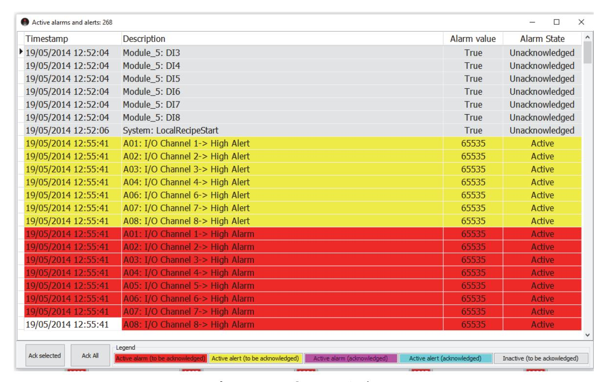

**Figure 7-1 Alarms** window

The components of the **Alarms** window are described in **Table 7-1** on page 7-2.

Chapter 7 Alarms Alarms Window

**Table 7-1 Alarms** window components

| Component           | Description                                                                                                             |  |
|---------------------|-------------------------------------------------------------------------------------------------------------------------|--|
| Alarm data table    |                                                                                                                         |  |
| Change time column  | Date and Time at which the alarm is triggered.                                                                          |  |
| Description column  | Short description of what triggered the alarm.                                                                          |  |
| Alarm value column  | Value of the component when it triggered the alarm.                                                                     |  |
| Alarm State column  | State of the alarm: • Active (not acknowledged) Active (acknowledged) • • Inactive (not acknowledged) |  |
|                     | Click this button to acknowledge the selected alarm (after electronic signature).                                    |  |
| Ack selected button |                                                                                                                         |  |
| Ack All button      | Click this button to acknowledge all the alarms of the list (after electronic signature).                            |  |
| Legend section      | Active Alarm (to be acknowledged) – red                                                                                 |  |
|                     | Active Alert (to be acknowledged) – yellow                                                                              |  |
|                     | Active Alarm (acknowledged) – purple                                                                                    |  |
|                     | Active Alert (acknowledged) – cyan                                                                                      |  |
|                     | Inactive (to be acknowledged) - gray                                                                                    |  |

Acknowledge an Alarm Chapter 7 Alarms

# **Acknowledge an Alarm**

Pharmaceutical Net Pro provides at least the following system alarms:

- Connection with particle sensors
- Connection between management software (SCADA) and FacilityPro®
- • Flow alarm for particle sensor or BioCapt®
- Laser alarm for particle sensor
- System communication alarm (internal FacilityPro communication)

Acknowledging an alarm requires entry of a [password](#page-63-5) in the **Electronic Signature** window.

#### **>> To acknowledge an alar[m:](#page-63-3)**

- **1** Open the **Alarms** window as described on page 7-1.
- **2** In the **Alarms** window (see **Figure 7-1** on page 7-1), locate the alarm you want to acknowledge.
  - Use the vertical scroll bar or the down/up arrow keys on the keyboard to move up and down through the list.
- **3** Select the alarm and either double-[click on it, or click the](#page-23-2) **Ack Selected** button at the bottom of the window.
  - The **Electronic Signature** window appears.
- **4** Enter your electronic signature (see **Electronic Signature** on page 1-5).

After you enter the electronic signature, the [system pe](#page-63-5)rforms the acknowledge of the selected alarm.

#### **>> To acknowledge multiple alarms at once:**

- **1** Open the **Alarms** window as described on page 7-1.
- **2** Click the **Ack All** button [at the bottom of the window, or ho](#page-23-2)ld down the

**SHIFT** key on your keyboard to select multiple rows.

The **Electronic Signature** window appears.

**3** Enter your electronic signature (see **Electronic Signature** on page 1-5).

Chapter 7 Alarms Acknowledge an Alarm

This page is intentionally left blank.

# **Chapter 8 Reports**

Pharmaceutical Net Pro software gen[erates reports via:](#page-114-0)

- • the **Report** window (see Report Window on page 8-2)
- • the **Sampling Report** window (see Sampling Report on page 8-48)

# **Overview**

#### **Reports available through the Report Generator**

The general repor[t types tha](#page-104-1)t can be generated from the **Report** window are:

#### • **Audit Report**

Log-ins, Alarms [and Alarm](#page-112-0)s Acknowledge, Electronic Signature events. See example on page 8-38.

#### • **Trend Report**

Sampling data f[rom the se](#page-108-0)nsors in graphical format. See example in page 8-46.

#### • **Data Report**

Sampling data from the sensors in tabular format. See example on page 8-42.

A **Report** [window report can be filtered for one](#page-87-0) of the following parameters:

#### • **Select By Group**

Selection is made on a pre-defined group of modules. See [Create a report "by group" on page](#page-94-0) 8-21.

#### • **Select By Sampling**

[Extraction](#page-68-0) of data is filtered for recipe. See Create a report "by sampling" on page 8-28.

Generation of reports via the **Report** window is described in Report Window beginning on page 8-2.

### **[Reports availab](#page-114-2)le through the Sampling Report window**

The **Sampling Report** is [generated from the](#page-114-0) **Sampling Report** window (see **Figure 8- 30** on page 8-48).

A **Sampling Report** can be generated for each recipe that has been started during a specific time period (see Sampling Report on page 8-48).

Chapter 8 Reports Report Window

# **Report Window**

Access to the Report Generator is through the **Report** window. The **Report** window has configuration fields across the top of the window and separate tabs for displaying each type of report in a text box (see **Figure 8-1**).

#### **>> To open the Report window:**

**1** Click the **Report** b[utton at the](#page-68-1) bottom of the Pharmaceutical Net Pro screen.

The **Report** window appears (see **Figure 8-1**).

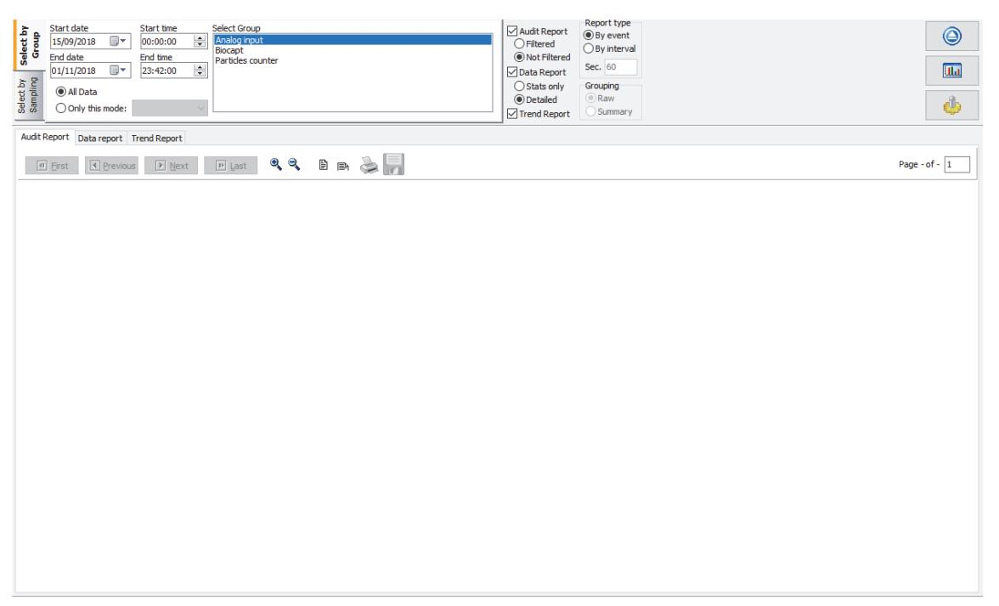

**Figure 8-1 Report** window, **Select by Group** tab fields

The buttons in the top right corner of the **Report** window are described in **Table 8-1**.

**Table 8-1 Report** window buttons

|                | Click this button to open the Tags catalog window where             |
|----------------|---------------------------------------------------------------------|
| Config. button | the parameters displayed in the Report window can be configured. |

**Table 8-1 Report** window buttons (Continued)

| Execute Report button | Click this button to open the "add comment" window and generate the report with the parameters set up in the Report window. See page 8-27 or page 8-33 |
|--------------------------|--------------------------------------------------------------------------------------------------------------------------------------------------------------------|
|                          |                                                                                                                                                                    |

# **Configuration of Tags Catalog**

The **Tags catalog** window lets an Administrator associate sensors with groups and create and modify recipes.

#### **>> To open the Tags catalog window:**

- **1** Log in as a user with Administrator privileges.
- **2** Open the **Report** window as described on page 8-2.

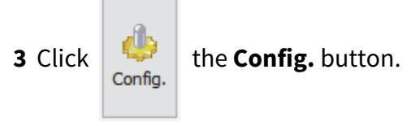

The **Tags catalog** window appears.

### **Tags Catalog tabs**

#### **Sensor Type**

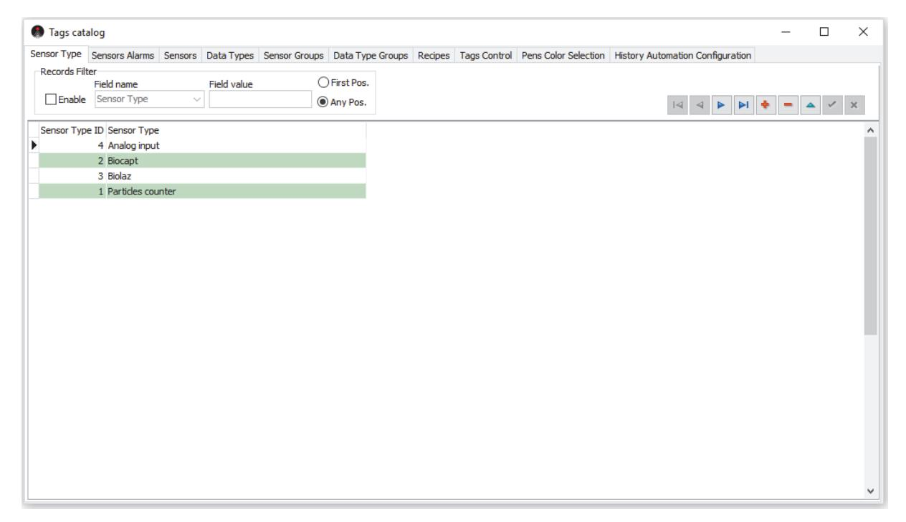

**Figure 8-2 Tags catalog** window, **Sensor Type** tab

Use this tab to add to, edit, delete, and sort through the **Sensor Type** list (i.e. Analog, Particles, RVU).

#### **Sensors Alarms**

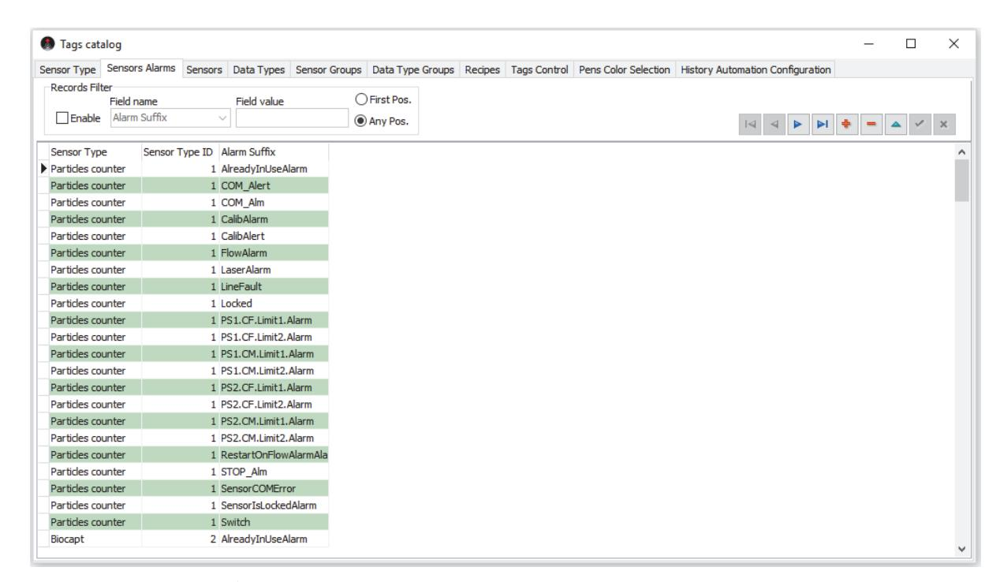

**Figure 8-3 Tags catalog** window, **Sensors Alarms** tab

Use the **Sensors Alarms** tab to add, edit, delete, and sort through sensor alarms. Use **Field name** and **Field value** to filter using the categories of **Sensor Type** (i.e. Analog, Particles, Biological), **Sensor Type ID** (a number assigned to a type of **Alarm Suffix**), and **Alarm Suffix** (specified by its associated alarm tag).

#### **Sensors**

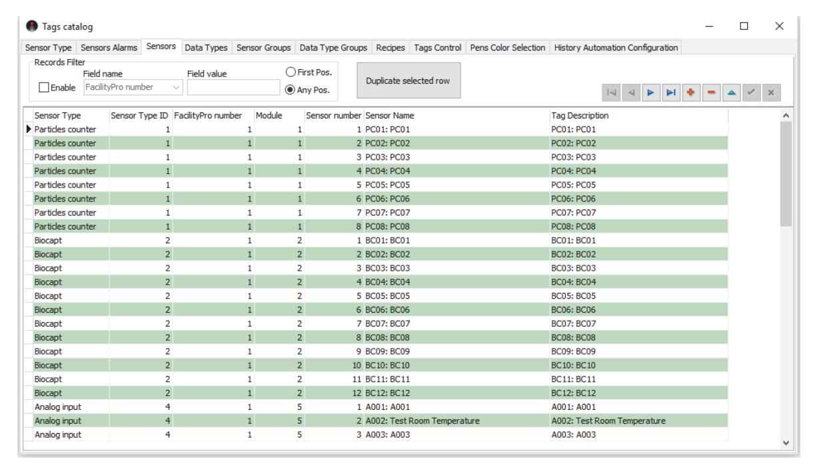

**Figure 8-4 Tags catalog** window, **Sensors** tab

Use the **Sensors** tab to add, edit, delete, and sort through entries based on the following fields: **Sensor Type**, **Sensor Type ID**, **FacilityPro number**, **Module**, **Sensor number**, **Sensor Name** and **Tag Description**. Duplicate a selected row using the associated button adjacent to the **Records Filter**.

All values will have functional defaults in place prior to any editing.

#### **Data Types**

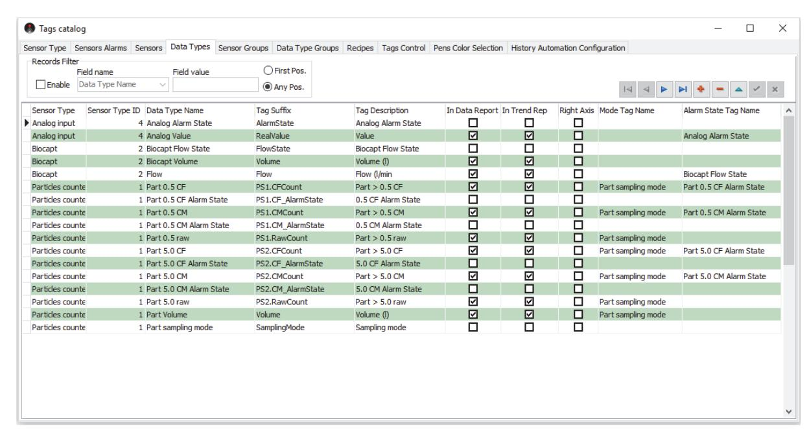

**Figure 8-5 Tags catalog** window, **Data Types** tab

Use the **Data Types** tab to add, edit, delete, and sort through entries based on all possible criteria (use the bottom slider to view all columns).

All values will have functional defaults in place prior to any editing.

#### **Sensor Groups**

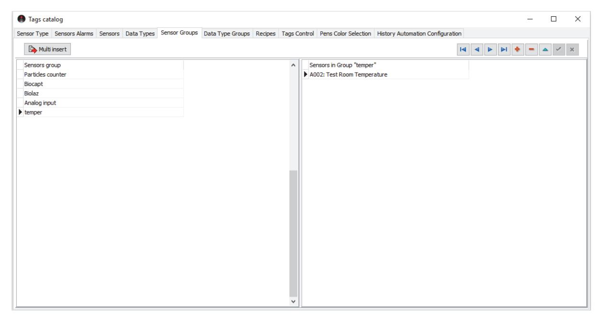

**[Figure 8-6 Ta](#page-82-0)gs catalog** window, **Sensor Groups** tab

Use the **Sensor Groups** tab to associate sensors with groups. See Configure Sensor Group Tags on page 8-16.

#### **Data Type Groups**

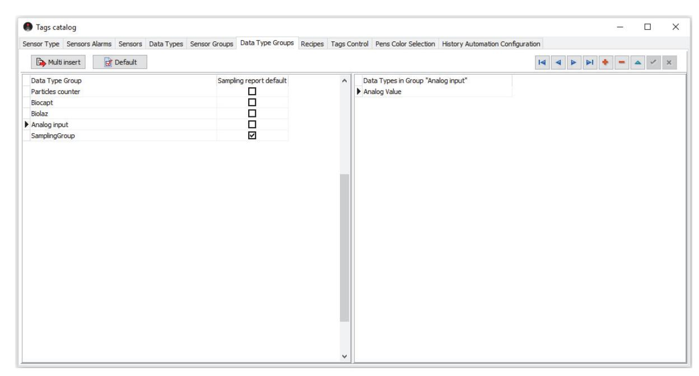

**Figure 8-7 Tags catalog** window, **Data Type Groups** tab

Use the **Data Type Groups** tab to associate **Data Types** (i.e. MiniCapt Flow) with **Data Type Groups** (i.e. MiniCapt). Default **Data Type Groups** to be displayed for **Sampling Reports** can be checkmarked beneath **Sampling report default**.

Use the **Multi insert** button to select multiple **Data Types** to associate with a specific **Data Type Group**.

**Default** restores the selected entry's default values.

#### **Recipes**

**Figure 8-8 Tags catalog** window, **[Recipes](#page-84-0)** tab

Use the **Recipes** tab to assign **Sensors Groups** and **Data Types Groups** to specific recipes (located under Recipe Name, i.e. MiniCapt, Particles, RVU). Entries under **Recipe Name** can be added or deleted. See Configure Recipe Tags on page 8-18 for more details.

Use the **Undo** arrow to undo the last change made.

#### **Tags Control**

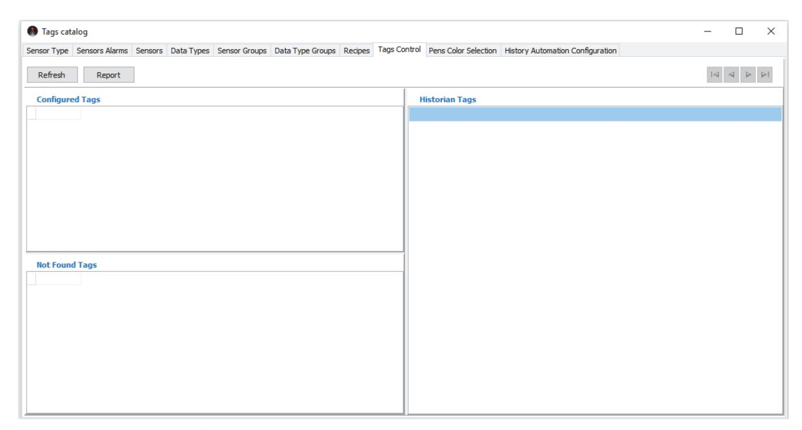

**Figure 8-9 Tags catalog** window, **Tags Control** tab

Use the **Tags Control** tab to **Report** new tags, navigate through **Configured Tags**, **Not Found Tags** and **Historian Tags**, and **Refresh** tag listings.

#### **Pens Color Selection**

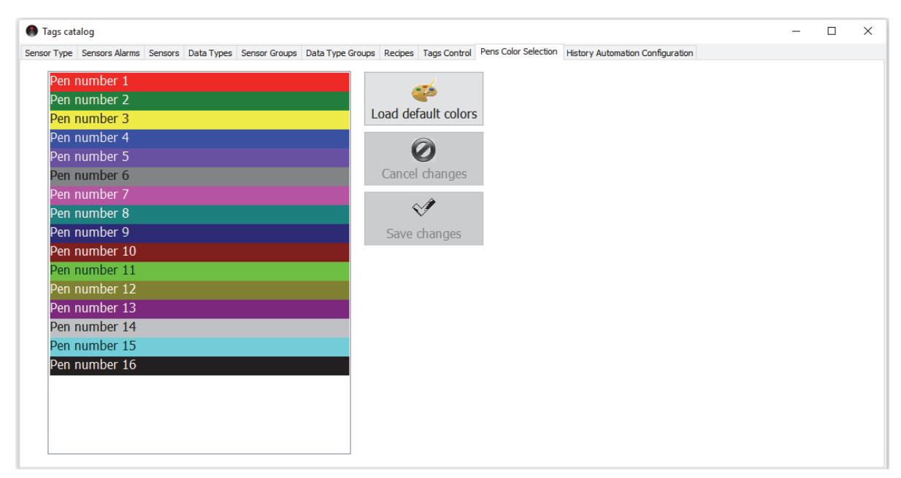

**Figure 8-10 Tags catalog** window, **Pens Color Selection** tab

Use the **Pens Color Selection** tab to specify colors of sensor data in a **Trend Report**. The order of use begins with **Pen number 1**.

#### **History Automation Configuration**

**Figure 8-11 Tags catalog** window, **History Automation Config**tab

Use the **History Automation Configuration** tab to automatically export CSV files, statistical data and PDF reports associated with a specific FacilityPro recipe at a set time and to a set directory.

**Table 8-2** Components of the **History Automation Config** tab

| Component                                   | Description                                                                                                                                             |  |
|---------------------------------------------|---------------------------------------------------------------------------------------------------------------------------------------------------------|--|
| History automation configuration parameters |                                                                                                                                                         |  |
| Export CSV data files                       | Checkmark this box to export CSV data files containing all data for each sensor in the selected Recipe group for the past 24-hour period.            |  |
| Export statistical data                     | Checkmark this box to export statistical data containing all statistics for each sensor in the selected Recipe group for the past 24-hour period. |  |
| Recipe                                      | List of available recipe Groups                                                                                                                         |  |
|                                             | Time when automatic export will occur in the same format as the OS. Automatic export occurs daily.                                                   |  |
| Execution time                              |                                                                                                                                                         |  |
| Target directory                            | Filepath of where the CSV and statistical data will save                                                                                                |  |
| Select                                      | Opens Windows explorer to allow user to choose the desired filepath                                                                                     |  |

**Table 8-2** Components of the **History Automation Config** tab

| Component                                 | Description                                                                                                                                                                                                                                                                                                                      |  |
|-------------------------------------------|----------------------------------------------------------------------------------------------------------------------------------------------------------------------------------------------------------------------------------------------------------------------------------------------------------------------------------|--|
|                                           |                                                                                                                                                                                                                                                                                                                                  |  |
| Timestamp format                          |                                                                                                                                                                                                                                                                                                                                  |  |
| Short Date Format                         | How the date will be displayed as part of the exported data files                                                                                                                                                                                                                                                                |  |
| Long Time Format                          | How the time will be displayed as part of the exported data files                                                                                                                                                                                                                                                                |  |
|                                           | Changes the Timestamp format to the same as the current FacilityPro settings, as seen on the Main Page.                                                                                                                                                                                                                       |  |
| Get local configuration                   |                                                                                                                                                                                                                                                                                                                                  |  |
| Samplings automatic PDF export parameters |                                                                                                                                                                                                                                                                                                                                  |  |
| View First Row button                     | Click this button to view the first row in the table.                                                                                                                                                                                                                                                                            |  |
| View Previous Row button               | Click this button to view the previous row in the table.                                                                                                                                                                                                                                                                         |  |
| View Next Row button                      | Click this button to view the next row in the table.                                                                                                                                                                                                                                                                             |  |
| View Last Row button                      | Click this button to view the last row in the table.                                                                                                                                                                                                                                                                             |  |
| Plus button                               | Click this button to open the list of FacilityPro recipes for the purpose of adding another row.                                                                                                                                                                                                                              |  |
| Minus button                              | Click this button to delete the selected row.                                                                                                                                                                                                                                                                                    |  |
| Save Changes button                       | Click this button to save changes to the Samplings automatic PDF export parameters area.                                                                                                                                                                                                                                      |  |
| Cancel Changes button                     | Click this button to undo changes to the Samplings automatic PDF export parameters area.                                                                                                                                                                                                                                      |  |
| FacilityPro recipe                        | Displays the name of the recipe(s) to be included in the sampling                                                                                                                                                                                                                                                                |  |
|                                           | export in alphabetical order. The elipsis button can be used to                                                                                                                                                                                                                                                               |  |
|                                           | change the chosen recipe. Choosing the asterisk option (*) will extract all recipes configured with the selected FacilityPro processor.                                                                                                                                                                                       |  |
| FacilityPro                               | Displays the FacilityPro processor number associated with the recipe.                                                                                                                                                                                                                                                            |  |
|                                           | The ellipsis button can be used to change the chosen recipe.                                                                                                                                                                                                                                                                  |  |
| Interval                                  | This field defines an "every nth" value (in seconds) for which subset of sample data to include in the report. For example, if this value is '30', the data included in the report will only be those timestamped every 30 seconds from the start of sampling. If this field is 0, only event data will be included. |  |
| Audit                                     | Checkmark this box to include the audit report as part of the recipe sampling export.                                                                                                                                                                                                                                         |  |

**Table 8-2** Components of the **History Automation Config** tab

| Component                  | Description                                                                                                                                                                                                                                                                                                                                                                                                                                                                                                                 |  |
|----------------------------|-----------------------------------------------------------------------------------------------------------------------------------------------------------------------------------------------------------------------------------------------------------------------------------------------------------------------------------------------------------------------------------------------------------------------------------------------------------------------------------------------------------------------------|--|
| Data                       | Checkmark this box to include the data report as part of the recipe sampling export.                                                                                                                                                                                                                                                                                                                                                                                                                                     |  |
| Trend                      | Checkmark this box to include the trend report as part of the recipe sampling export.                                                                                                                                                                                                                                                                                                                                                                                                                                    |  |
| Summary                    | Checkmark to enable the Summary Type and Summary Intervals fields.                                                                                                                                                                                                                                                                                                                                                                                                                                                       |  |
| Summary Type               | Calculating the trend can be done with any of the following options: • Minimum option (Min) – Select this option to use the minimum value of the samples in the sub interval. Maximum option (Max) – Select this option to use the maximum • value of the samples in the sub interval. • Average option (Avg) – Select this option to use the average of the samples in the sub interval. Sum option – Select this option to use the sum of the value of each • sample of the interval. |  |
| Summary Intervals          | This field applies a Historical Trend function which uses fewer samples than the samples stored in the database for the requested time range (between Start date and End date) to create a historical trend view (at least 1 sample every minute). You can set a sub-interval (number of samples) to display collapsed into one sample. A minimum value of 2 is required.                                                                                                                                    |  |
| PDF files export directory | Filepath where the PDF reports will be stored for access by the user.                                                                                                                                                                                                                                                                                                                                                                                                                                                       |  |
| Select                     | Opens Windows explorer to allow the user to choose the desired filepath.                                                                                                                                                                                                                                                                                                                                                                                                                                                 |  |
| Save changes               | Saves adjustments made to any parameters in the History Automation Configuration tab.                                                                                                                                                                                                                                                                                                                                                                                                                                    |  |
| Cancel changes             | Cancels any adjustments made to any of the parameters in the History Automation Configuration tab.                                                                                                                                                                                                                                                                                                                                                                                                                       |  |

### **Configure Sensor Group Tags**

An Administrator can associate sensors with groups using the **Sensor Groups** tab in the **Tags catalog** window.

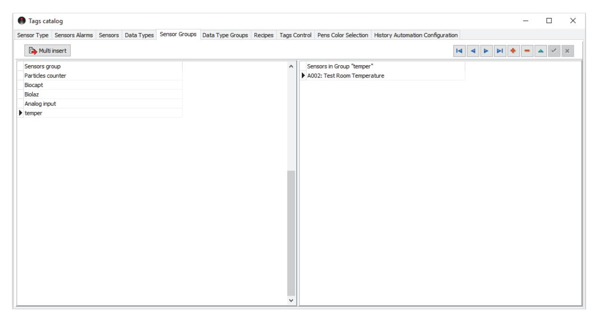

**Figure 8-12 Tags catalog** window, **Se[nsor Grou](#page-69-1)ps** tab

#### **>> To add a new Sensor group:**

- **1** Open the **Tags catalog** window as described on page 8-3.
- **2** Click the **Sensors Groups** tab in the **Tags catalog** window.
- **3** In the **Sensor Groups** tab of the **Tags catalog** window, select one of the existing groups in the **Sensors Groups** list.
- **4** Click the **Plus** button.

A field for the name of the new Sensor group appears in the **Sensors Groups** column of the **Sensors Groups** tab in the **Tags catalog** window.

- **5** Type the name of the new Sensor group.
- **6** Click the **Accept** button.
- **7** Click the **Multi insert** button.

The **Select sensors in group** window appears (see **Figure 8-13**).

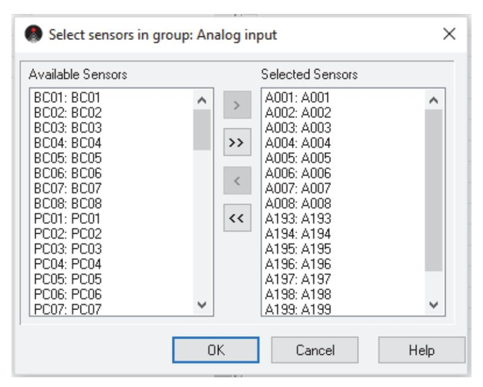

**Figure 8-13 Select sensors in group** window

- **8** In the **Available Sensors** list of the **Select sensors in group** window, select all sensors that you want to add to the new group.
- **9** Click the **>** button to add the selected sensors to the **Selected Sensors** list.
- **10** Click the **OK** button in the **Select sensors in group** window to close it.
- **11** Click the **X** button to close the **Tags catalog** window.

#### **Configure Recipe Tags**

An Administrator can create and modify recipes using the **Recipes** tab in the **Tags catalog** window.

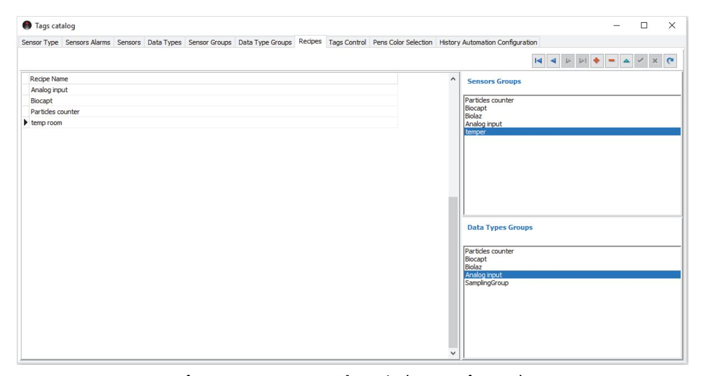

**Figure 8-14 Tags catalog** window, **Recipes** tab

Recipes are collections of data to be displayed in **Report Generator**, obtained as a combination of Sensors Groups and Data types.

#### **>> To add new recipe:**

- **1** Open the **Tags catalog** window as described on page 8-3.
- **2** Click the **Recipes** tab in the **Tags catalog** window.
- **3** In the **Recipes** tab of the **Tags catalog** window, click the **Plus** button. A field for the name of the new recipe appears in the **Recipe Name** column of the **Recipes** tab in the **Tags catalog** window.
- **4** Type the name of the new recipe.
- **5** Select the desired Sensor group from the **Sensors Groups** list.
- **6** Select the desired Data Type group from the **Data Types Groups** list.
- **7** Click the **Accept** button.
- **8** Click the **X** button to close the **Tags catalog** window.

#### **Configure Data Type Group Tags**

An Administrator can associate Data types with gr[oups.](#page-69-1)

- **>> To add a new Data Type Group:**
- **1** Open the **Tags catalog** window as described on page 8-3.
- **2** Click the **Data Type Groups** tab in the **Tags catalog** window.

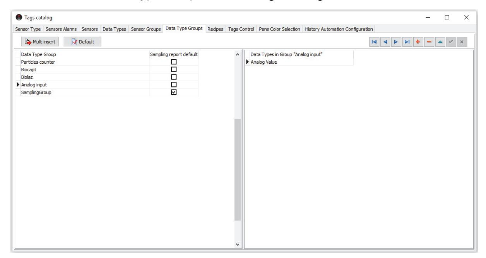

**Figure 8-15 Tags catalog** window, **Data Type Groups** tab

- **3** In the **Recipes** tab of the **Tags catalog** window, click the **Plus** button. A field for the name of the new Group appears in the **Data Type Group** column of the **Data Type Groups** tab in the **Tags catalog** window.
- **4** Type the name of the new Group.
- **5** Click the **Accept** button.
- **6** Click the **Multi insert** button.

The **Select data types in group** window appears.

- **7** Select the desired Data Type group from the **Data Types Groups** list.
- **8** Click the **>** button to add the selected sensors to the **Data types in selected group** list.
- **9** Click the **OK** button in the **Select data types in group** window to close it.
- **10** Click the **X** button to close the **Tags catalog** window.

# **Creating Reports through the Report Window**

Creatin[g any report through the](#page-87-0) **Report** window involves the following general steps:

- **1** Choose between these tabs, then select parameters for the report:
  - **Sel[ect by Group](#page-94-0)**  See Create a report "by group" on page 8-21.
  - **S[elect by Sampling](#page-91-2)**  See Create a report "by sampling" on page 8-28.
- **2** Sel[ect the report you want to generate.](#page-96-0) See Select report(s) to generate on page 8-25.
- **3** Set a date/time range for the report. See Set a date and time range for a report on page 8-30.

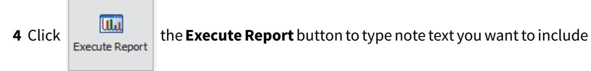

in the header of the report and generate the report. See Execute the report on page 8-27.

The system automatically generates the **Audit** / **Data** / **Trend** report and displays it in t[he text box of the](#page-101-0) **Report** window.

After a report has been generated and displayed in the **Report** window, you can:

- Rev[iew the report on screen.](#page-103-0) See Change the View in the Report Displayed in the Report Window on page 8-35.
- Prin[t the report.](#page-103-1) See Print a Report from the Report Window on page 8-37.
- Save a copy of the report as a **PDF** file or a **CSV** (comma-separated values) file. See Export a Report from the Report Window on page 8-37.

#### **Create a report "by group"**

You can generate a report for a pre-defined group of modules. For example, groups of modules might include:

- **All Analogs** all Analog sensors installed in the system.
- **All BIO**  all Biological samplers installed in the system.
- • **All PC** – all Particle sensors installed in the system.

#### **>> To display the parameters for generating a report based on "by group":**

**1** Click the **Report** bu[tton at the bottom of th](#page-68-1)e Pharmaceutical Net Pro screen.

The **Report** window appears (see **Figure 8-1** on page 8-2).

**2** [Clic](#page-87-1)k the **Select by Group** tab.

The parameters available display along the top of the **Report** window (see **Figure 8- 16**)

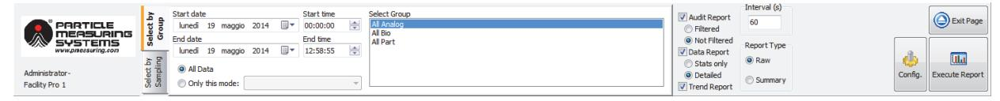

**Figure 8-16** P[arameter f](#page-87-2)ields in the **Report** window for **Select by Group** reports

The parameters available for reports created "by group" in the **Report** window are described in **Table 8-3**.

**Table 8-3 Select by Group** tab **Report** window components

| Start date field and list field      | Defines the day, month, and year for the beginning                                                                                                |
|--------------------------------------|---------------------------------------------------------------------------------------------------------------------------------------------------|
| Start time field and spinner buttons | of the time range to be included in the report. Defines the hour, minute, and second for the                                                   |
| End date field and list field        | beginning of the time range to be included in the report, in the same format as the OS. Defines the day, month, and year for the end of the |
| End time field and spinner buttons   | time range to be included in the report. Defines the hour, minute, and second for the end                                                      |
|                                      | of the time range to be included in the report, in the same format as the OS.                                                                  |
| All Data option                      | Select this option to include in the report all event data collected.                                                                          |

**Table 8-3 Select by Group** tab **Report** window components (Continued)

|                                                      | • Normal Operation                                                                                                                                                                                                                                        |
|------------------------------------------------------|--------------------------------------------------------------------------------------------------------------------------------------------------------------------------------------------------------------------------------------------------------------|
| Select Group list                                    | • At rest • In operation • Custom Only one of the pre-defined groups can be selected as the basis for the an Audit Report report(s) during a session if it is being filtered with                                                    |
| Audit Report check box and options                | the Filtered option. • When checked, an Audit Report will be generated and displayed in the Audit Report tab                                                                                                                                     |
| See an example on page 8-38 Filtered option    | when the Execute Report button is clicked. • When not checked, no Audit Report will be generated when the Execute Report button is clicked. When selected, only the data available for the group selected in the Select Group list will be |
| Not Filtered option                               | included when the Audit report is generated. When selected, data for all groups will be included when the Audit report is generated.                                                                                                                   |
| Data Report check box                                | • When checked, a Data Report will be                                                                                                                                                                                                                     |
| See an example on page 8-42 Detailed option | generated and displayed in the Data Report tab when the Execute Report button is clicked. • When not checked, no Data Report will be generated when the Execute Report button is clicked. When selected, all the data available for the    |
| Stats Only option                                 | group selected in the Select Group list will be included when the Data report is generated. When selected, only the Statistical data                                                                                                                   |
| Trend Report check box                               | available for the group selected in the Select Group list will be included when the Data report is generated. When checked, a Trend Report will be •                                                                                             |
| See an example on page 8-46                       | generated and displayed in the Trend Report tab when the Execute Report button is clicked. • When not checked, no Trend Report will be generated when the Execute Report button is clicked.                                                   |

**Table 8-3 Select by Group** tab **Report** window components (Continued)

| Component                   | Description                                                                                                                                                                                                                                                                                                                                                                                                                                                                                                                                  |
|-----------------------------|----------------------------------------------------------------------------------------------------------------------------------------------------------------------------------------------------------------------------------------------------------------------------------------------------------------------------------------------------------------------------------------------------------------------------------------------------------------------------------------------------------------------------------------------|
| Intervals field             | This field defines an "every nth" value for which subset of samples to include in the report. If this field is null, all the data from the sampling will be included in the report.                                                                                                                                                                                                                                                                                                                                                 |
| Report Type options         |                                                                                                                                                                                                                                                                                                                                                                                                                                                                                                                                              |
| Raw option                  | Select this option to hide the Summarize pane.                                                                                                                                                                                                                                                                                                                                                                                                                                                                                               |
| Summary option              | Select this option to enable the Intervals field and Calculate options in the Summarize pane.                                                                                                                                                                                                                                                                                                                                                                                                                                             |
| Summarize field and options |                                                                                                                                                                                                                                                                                                                                                                                                                                                                                                                                              |
| Number of Intervals field   | This field applies a Historical Trend function which uses fewer samples than the samples stored in the database for the requested time range to create a historical trend view (at least 1 sample every minute). You can set a sub-interval (number of samples) to display collapsed into one sample.                                                                                                                                                                                                                         |
| Calculate options           | The sub-interval's value to use for calculating the trend can be one of the following options: • Minimum option – Select this option to use the minimum value of the samples in the sub interval. • Maximum option – Select this option to use the maximum value of the samples in the sub interval. Average option – Select this option to use the • average of the samples in the sub interval. • Sum option – Select this option to use the sum of the value of each sample of the interval. |

#### **Set a date and time range for a report**

Every report requires a start date and time, and an end date and time.

#### **>> To set the start date for the r[eport:](#page-90-1)**

- **1** In the **Start Date** field, click the list box button. A **Calendar** popup appears (see **Figure 8-17**).
- **2** Use the left and right arrows in the **Calendar** popup to select the month and year for the start date of the report.
- **3** Select the day of the month.

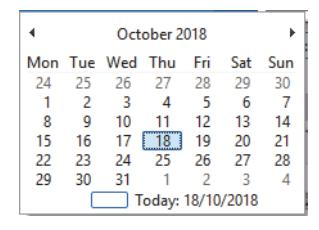

**Figure 8-17 Calendar** popup

**4** Click in the **Start date** field to close the **Calendar** popup. The date you selected in the **Calendar** [popup displays in the](#page-96-2) **Start Date** field.

#### **>> To set the end date for the report:**

**1** Repeat the steps described above in To set the start date for the report: using the **End Date** field instead of the **Start Date** field.

#### **>> To set the start time for the report:**

**1** In the **Start Time** field, edit the hour, minute, second using the format **hh:mm:ss**, –OR– On SCADA Client PCs, click the spinner buttons in the **Start Time** field.

**2** Click the **OK** button in the **Time Set** popup to close it. The time you selected appears in the **[Start Time](#page-97-1)** field.

#### **>> To set the end time for the report:**

**1** Repeat the steps described in To set the start time for the report: on page 8-31 using the **End Time** field instead of the **End Time** field.

#### **Select a data subset**

- **1** To include all data in the report, select the **All Data** option.
- **2** To include a data subset in the report, select the **Only this mode** option:
  - **a.** From the **Only this mode** list box, select the mode to apply to the report. Examples of modes include:
    - **Normal Operation**
    - **At rest**
    - **Custom**

#### **Select a group of modules to include in the report**

- **1** In the **Select Group** list, select a group of modules to use as the basis for the report. Examples of groups are:
  - **All Analogs** all Analog sensors installed in the system.
  - **All BIO**  all Biological samplers installed in the system.
  - **All PC** all Particle sensors installed in the system.

#### **Select report(s) to generate**

One or more of the following reports can be generated at one time:

- **Audit Report** Lists the following events:
  - Log-ins
  - Electronic Signatu[res](#page-104-1)
  - [Alarms](#page-104-1)
  - Alarm Acknowledges

See an illustration in Audit Report examples – Select by Group – Audit Report on page 8-38.

#### • **Trend Report**

Historical trend of sampling data from the sensors rendered in graphical format. See an illustration in [Trend Report examples – Select by Samplings on page](#page-108-0) 8-46.

#### • **Data Report**

Sampling data from the sensors in tabular format.

See an illustration in Data Report examples – Select by Group on page 8-42.

If you choose more than one report to generate, each report will be available in a separate tab in the **Report** window after the reports are generated.

#### **>> To select the report subject(s):**

- **1** To select the **Audit Report**, place a checkmark in the **Audit Report** check box and select [one of the following options:](#page-50-4)
  - **Filtered** option Causes the data displayed to be limited to only the data in the group. (Filters are configured in the **Custom fields configuration** window (see Configuring Custom Fields to Apply to a Sampling on page 5-6.)
  - **Not Filtered** option Causes no filter to be applied to the report.
- **2** To select the **Data Report**, place a checkmark in the **Data Report** check box and select one of the following options:
  - **Detailed** When selected, all the data available for the group selected in the **Select Group** list will be included when the **Data** report is generated.
  - **Stats Only** When selected, only the Statistical data available for the group selected in the **Select Group** list will be included when the **Data** report is generated.
- **3** To select the **Trend Report**, place a checkmark in the **Trend Report** check box.

#### **Select an interval, specify the type for the report**

- **>> To select the a certain interval for which data to include and specify "raw" or "summary" data:**
- **1** In the **Interval(s)** field, enter an "every nth" number to limit the number of samples to include in the report.
- **2** In the **Report Type** pane, select one of the following options:
  - **Raw** Select this option to use raw data in the report.
  - **Summary** Select this option to display the **Summarize** pane with the **Number of intervals** field and the **Calculate** options.

#### **For a Trend Report, set calculation parameters**

- **1** In the **Number of Intervals** field, enter the number of samples to display collapsed into one sample.
- **2** From the **Calculate** pane, select which sub-interval's value to use for calculating the trend:
  - **Minimum** option The minimum value of the samples in the sub interval.
  - **Maximum** option The maximum value of the samples in the sub interval.
  - **Average** option The average of the samples in the sub interval.
  - **Sum** option The sum of the value of each sample of the interval.

#### **Execute the report**

**2** The **Input a comment to print on reports** dialog box appears (see **Figure 8-18** on page 8-27).

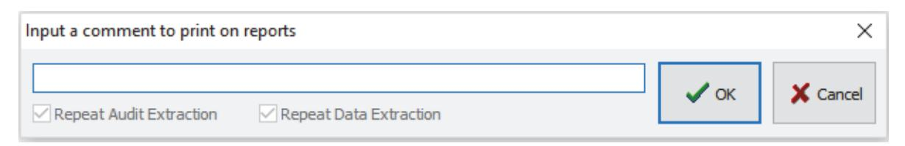

**Figure 8-18 Input a comment to print on reports** dialog box

- **3** In the **Input a comment to print on reports** dialog box, enter note text you want included in the header of the report.
- **4** Click the **OK** button in the **Input a comment to print on reports** dialog

box.

The system automatically generates **Audit** / **Data** / **Trend** report and displays it in the text box of the **Report** window.

#### **Create a report ["by samp](#page-94-2)ling"**

The parameters available for reports created "by sampling" are shown in **Figure 8-19** and described in **Table 8-4**.

#### **>> To display the parameters for generati[ng a report based on "](#page-68-1)by sampling":**

**1** Click the **Report** button at the bottom of the Pharmaceutical Net Pro

screen. The **Report** window appears (see **Figure 8-1** on page 8-2).

**2** [Clic](#page-94-1)k the **Select by Sampling** button.

The parameters available display along the top of the **Report** window (see **Figure 8- 19**)

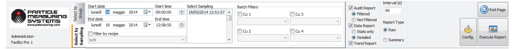

**Figure 8-19** Par[ameter fie](#page-94-2)lds in the **Report** window for **Select by Sampling** reports

The components of the **Report** window for the **Select by Sampling** mode are described in **Table 8-4**.

**Table 8-4 Select by Sampling** mode **Report** window components

| Start date field and list field      | Defines the day, month, and year for the beginning of                                                                                   |
|--------------------------------------|-----------------------------------------------------------------------------------------------------------------------------------------|
| Start time field and spinner buttons | the time range to be included in the report. Defines the hour, minute, and second for the beginning                                  |
| End date field and list field        | of the time range to be included in the report, in the same format as the OS. Defines the day, month, and year for the end of the |
| End time field and spinner buttons   | time range to be included in the report. Defines the hour, minute, and second for the end of the                                     |
| Filter by recipe check box and       | time range to be included in the report, in the same format as the OS. • When checked, you can select recipe from the list     |
| list field Select Sampling list   | to apply as a filter for the report. One currently scheduled sampling can be selected                                                |
|                                      | from this list.                                                                                                                         |

**Table 8-4 Select by Sampling** mode **Report** window components (Continued)

| check boxes and list fields                                                                          | the filter to apply to the report. • Custom Field 2 – When checked, you can select                                                                                                                                                                                                                                                                                                       |
|------------------------------------------------------------------------------------------------------|------------------------------------------------------------------------------------------------------------------------------------------------------------------------------------------------------------------------------------------------------------------------------------------------------------------------------------------------------------------------------------------------|
| Audit Report check box and options                                                                | the filter to apply to the report. • Custom Field 3 – When checked, you can select the filter to apply to the report. • Custom Field 4 – When checked, you can select the filter to apply to the report. See Custom fields configuration window on page 5-6. • When checked, an Audit Report will be generated and displayed in the Audit Report tab when the |
| Filtered option                                                                                   | Execute Report button is clicked. • When not checked, no Audit Report will be generated when the Execute Report button is clicked. When selected, only the data available for the custom filter selected in the Batch Filters list will be                                                                                                                                   |
| Not Filtered option                                                                               | included when the Audit report is generated. When selected, all data for the selected sampling for all groups will be included when the Audit report is                                                                                                                                                                                                                                  |
| Data Report check box                                                                                | generated. • When checked, a Data Report will be generated                                                                                                                                                                                                                                                                                                                               |
| See an example on Data Report examples – Select by Group on page 8-42 Detailed option | and displayed in the Data Report tab when the Execute Report button is clicked. • When not checked, no Data Report will be generated when the Execute Report button is clicked. When selected, all the data available for the                                                                                                                                                |
| Status Only option                                                                                | sampling selected in the Select Sampling list will be included when the Data report is generated. When selected, only the Statistical data available                                                                                                                                                                                                                                     |
| Trend Report check box                                                                               | for the sampling selected in the Select Sampling list will be included when the Data report is generated. • When checked, a Trend Report will be generated                                                                                                                                                                                                                            |
|                                                                                                      | and displayed in the Trend Report tab when the Execute Report button is clicked. • When not checked, no Trend Report will be generated when the Execute Report button is clicked.                                                                                                                                                                                               |

**Table 8-4 Select by Sampling** mode **Report** window components (Continued)

|                                                             | all the data from the sampling will be included in the                                                                                                                                                                                                                                                                    |
|-------------------------------------------------------------|---------------------------------------------------------------------------------------------------------------------------------------------------------------------------------------------------------------------------------------------------------------------------------------------------------------------------|
| Report Type options Raw option                           | report. When selected, hides Summarize pane.                                                                                                                                                                                                                                                                           |
| Summary option                                           | When selected, enables the Intervals field and                                                                                                                                                                                                                                                                            |
|                                                             | Calculate options in the Summarize pane.                                                                                                                                                                                                                                                                                  |
| Summarize field and options Number of Intervals field | This field applies a Historical Trend function which                                                                                                                                                                                                                                                                      |
|                                                             | uses fewer samples than the samples stored in the                                                                                                                                                                                                                                                                         |
| Calculate options                                        | database for the requested time range to create a historical trend view (at least 1 sample every minute). You can set a sub-interval (number of samples) to display collapsed into one sample. The sub-interval's value to use for calculating the trend can be one of the following options:              |
| Set a date and time range for a report                      | • Minimum option – The minimum value of the samples in the sub interval. • Maximum option – The maximum value of the samples in the sub interval. • Average option – The average of the samples in the sub interval. • Sum option – The sum of the value of each sample of the interval. |

#### **Set a date and time range for a report**

Every report requires a start date [and time, and](#page-96-1) an end date and time.

#### **>> To set the start date for the report:**

- **1** In the **Start Date** field, click the list box button. A **Calendar** popup appears (see **Figure 8-20**).
- **2** Use the left and right arrows in the **Calendar** popup to select the month and year for the start date of the report.

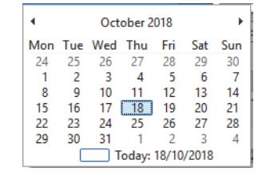

**3** Select the day of the month.

**Figure 8-20 Calendar** popup

**4** Click in the **Start date** field to close the **Calendar** popup. The date you selected in the **Calendar** popup displays in the **Start Date** field.

#### **>> To set the end date for the report:**

**1** Repeat the steps described above in To set the start date for the report: using the **End Date** field instead of the **Start Date** field.

#### **>> To set the start time for the report:**

- **1** In the **Start Time** field, edit the hour, minute, second using the same format as the operating system (OS),
  - –OR–

On SCADA Client PCs, click the spinner buttons in the **Start Time** field.

**2** Click the **OK** button in the **Time Set** popup to close it. The time you selected appears in the **[Start Time](#page-97-1)** field.

#### **>> To set the end time for the report:**

**1** Repeat the steps described in To set the start time for the report: on page 8-31 using the **End Time** field instead of the **End Time** field.

#### **Select a recipe, a sampling, and filters**

- **1** To limit the report to events for a single recipe:
  - **a.** Place a checkmark in the **Filter by recipe** check box.
  - **b.** From the field below the **Filter by recipe** check box, select the Recipe you want to use for the report.
- **2** From the **Select Sampling** field, select the sampling to use in the report.
- **3** To apply filters to the report in the **Batch Filters** pane:
  - **a.** Place a checkmark in the **Custom Field 1** check box to activate the filter.
  - **b.** Place a checkmark in the **Custom Field 2** check box to activate the filter.
  - **c.** Place a checkmark in the **Custom Field 3** check box to activate the filter.
  - **d.** Place a checkmark in the **Custom Field 4** check box to activate the filter.

#### **Select a report to generate**

One or more of the following reports can be generated at one time:

- **Audit Report** Lists the following events:
  - Log-ins
  - Electronic Signatu[res](#page-104-1)
  - [Alarms](#page-104-1)
  - Alarm Acknowledges

See an illustration in Audit Report examples – Select by Group – Audit Report on page 8-38.

#### • **Trend Report**

Sampling data from the sensors in graphical format.

See an illustration in [Trend Report examples – Select by Samplings on page](#page-108-0) 8-46.

#### • **Data Report**

Sampling data from the sensors in tabular format.

See an illustration in Data Report examples – Select by Group on page 8-42.

The **Report** window has separate tabs for type of report.

#### **>> To select the report subject(s):**

- **1** To select the **Audit Report**, place a checkmark in the **Audit Report** check box and select one of the following optio[ns:](#page-50-4)
  - **Filtered** [option C](#page-50-4)auses the data displayed to be limited to only the data in the group selected in the **Select Group** field. (Filters are configured in the **Custom fields configuration** window (see Configuring Custom Fields to Apply to a Sampling on page 5-6.)
  - **Not Filtered** option Causes no filter to be applied to the report.
- **2** To select the **Data Report**, place a checkmark in the **Data Report** check box, and select one of the following options:
  - **Detailed** option When selected, all the data available for the sampling selected in the **Select Sampling** list will be included when the **Data** report is generated.
  - **Stats Only** option When selected, only the Statistical data available for the sampling selected in the **Select Sampling** list will be included when the **Data** report is generated
- **3** To select the **Trend Report**, place a checkmark in the **Trend Report** check box.

#### **Select an interval, specify the type for the report**

- **1** In the **Interval(s)** field, enter an "every nth" number to limit the number of samples to include in the report.
- **2** In the **Report Type** pane, select one of the following options:
  - **Raw** Select this option to use raw data in the report.
  - **Summary** Select this option to display the **Summarize** pane with the **Number of intervals** field and the **Calculate** options.

### **For a Trend Report, set calculation parameters**

- **3** In the **Number of Intervals** field, enter the number of samples to display collapsed into one sample.
- **4** From the **Calculate** pane, select which sub-interval's value to use for calculating the trend:
  - **Minimum** option The minimum value of the samples in the sub interval.
  - **Maximum** option The maximum value of the samples in the sub interval.
  - **Average** option The average of the samples in the sub interval.
  - **Sum** option The sum of the value of each sample of the interval.

#### **Execute the report**

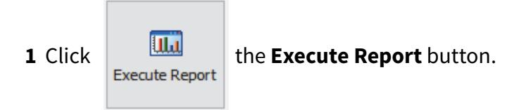

**2** The **Input a comment to print on reports** dialog box appears (see **Figure 8-21** on page 8-33).

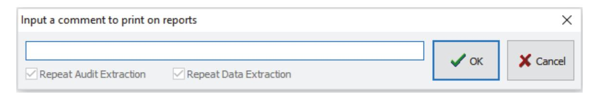

**Figure 8-21 Input a comment to print on reports** dialog box

- **3** In the **Input a comment to print on reports** dialog box, enter note text you want included in the header of the report.
- **4** Click the **OK** button in the **Input a comment to print on reports** dialog box to close it.

**5** If **Data or Trend** check boxes are selected, you will be able to select between PDF and CSV data types.

The data types contained in the data type group you selected are listed in the **Data types in selected group** pane.

- **e.** In the **Data types in selected group** pane, select a data type.
- **f.** Click the **OK** button in the **Select data types group** dialog box to close it.
- **6** The system automatically generates the **Audit** / **Data** / **Trend** report and displays it in the text box of the **Report** window.

# **Change the View in the Report Displayed in the Report Window**

[To view a report you generated, click its ta](#page-101-2)[b in the](#page-101-1) **Report** window.

#### **>> To change the view of the report displayed in the Report window:**

Use the **Report** window controls shown in **Figure 8-22** and described in **Table 8-5** General and report-specific controls in the Report window to change the view of a report.

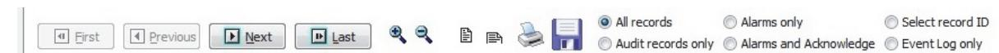

**Figure 8-22 Audi[t Report](#page-101-2)** window controls for changing the view of a generated report

The general controls for changing the view of a report in the **Report** window are described in **Table 8-5**.

**Table 8-5** General and report-specific controls in the **Report** window

| Previous button                | Click this button to view the previous page of the report.                                                                                                                                  |
|--------------------------------|---------------------------------------------------------------------------------------------------------------------------------------------------------------------------------------------|
| Next button                    | Click this button to view the next page of the report.                                                                                                                                      |
| Last button                    | Click this button to view the last page of the report.                                                                                                                                      |
| Zoom In button                 | Click this button to magnify the report.                                                                                                                                                    |
| Zoom Out button                | Click this button to reduce the magnification of the report.                                                                                                                                |
|                                | Click this button to fit the view to show the entire page of                                                                                                                                |
| Fit to page button             | the report. Click this button to fit the view to show the entire width of                                                                                                                |
| Fit to width button            | the report. Click this button to open the Select pages to print dialog                                                                                                                   |
| Print report button            | box so you can select the pages of the report to send to a printer. See Select pages to print dialog box on page 8-37. Click this button to open the Choose the file format dialog |
| Save report button             | box so you can save a PDF file or a CSV file of the report.                                                                                                                                 |
| Page n of m current page field | Type the number of the page you want to view, then press the Enter key on the keyboard to jump to that page.                                                                             |

**Table 8-5** General and report-specific controls in the **Report** [window](#page-104-1) (Continued)

|                                                   | Audit Report. (See example on page 8-38.)                                                                                                                                      |  |  |
|---------------------------------------------------|-----------------------------------------------------------------------------------------------------------------------------------------------------------------------------------|--|--|
| Audit records only option Alarms only option   | Select this option to view only audit events. Select this option to view only alarm events.                                                                                    |  |  |
| Alarms and Acknowledge                            | Select this option to view alarms and acknowledgements.                                                                                                                           |  |  |
| option                                            |                                                                                                                                                                                   |  |  |
| Select record ID option                           | Select this option to open the Insert alarm ID dialog box where you can enter an Alarm ID so you can generate a                                                                |  |  |
|                                                   | report for that record.                                                                                                                                                           |  |  |
|                                                   |                                                                                                                                                                                   |  |  |
|                                                   | Figure 8-23 Insert alarm ID dialog box                                                                                                                                            |  |  |
| Event Log only option                             | Select this option to view events log created by the users.                                                                                                                       |  |  |
| Trend Report Controls                             | Description                                                                                                                                                                       |  |  |
| All Pages option                                  | Select this option to apply the viewing options to all pages in the Trend Report display. (See example on page 8-46.)                                                       |  |  |
| Current Page option                               | Select this option to apply the viewing options to the page                                                                                                                       |  |  |
| Slider                                            | currently being viewed in the Trend Report display. Drag the slider button to move the view left or right.                                                                     |  |  |
| Values per page field                             | Sets the number of intervals to display on the page.                                                                                                                              |  |  |
| Allow hiding check box                            | • When checked, limits the data displayed to the                                                                                                                               |  |  |
| 3D style check box                                | selected sensor. • When checked, applies the 3-dimensional graphing                                                                                                         |  |  |
|                                                   | mode to the display. • When not checked, applies the 2-dimensional graphing mode to the display.                                                                         |  |  |
|                                                   |                                                                                                                                                                                   |  |  |
| Show Alarm Labels check box                       | • When checked, alarms a labels on the graph.                                                                                                                                  |  |  |
| Left Axis check box                               | • When checked, data are shown in logarithmic scale on the left axis, if it has been set in the Tag Catalog.                                                                |  |  |
| Right Axis check box Show < 1 Values check box | • When checked, data are showed in logarithmic scale on the right axis, if it has been set in the Tag Catalog. • When checked, together with Left Axis or Right Axis, |  |  |

**Table 8-5** General and report-specific controls in the **Report** window (Continued)

**Legend** Lists the main parameters used to create the report and the colors that represent an instrument or parameter.

# **Print a Report from the Report Window**

#### **>> To print a report from the Report window:**

- **1** Generate the report. The report displays in the text box of the **Report** [window.](#page-103-2)
- **2** Click the **Print report** icon in the toolbar at the top of the report in the **Report** window.

A **Select Pages To Print** window appears (see **Figure 8-24**).

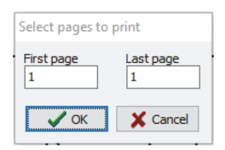

**Figure 8-24 Select pages to print** dialog box

- **3** Enter the pages to print.
- **4** Click the **OK** button in the **Select pages to print** dialog box

# **Export a Report from the Report Window**

Reports generated through the **Report** window can be saved as the following file types:

- PDF Portable Document Format for viewing in Adobe Acrobat
- CSV Comma-separated values for use in a spreadsheet application

#### **>> To export a report from the Report window:**

- **1** Generate the report. The report displays in the text box of the **Report** window.
- **2** Click the **Save report** icon in the toolbar at the top of the report in the **Report** window to choose between PDF and CSV file type options. Choose **Cancel** to exit.
- **3** Select the file format in the **Choose the file format** dialog box. The **Choose the file format** dialog box closes.
  - Pharmaceutical Net Pro exports a PDF of the report to a folder in the general path **c:\Export \PDF** and a CSV file in the general path **c:\Export \CSV**.
  - The full path displays a message with the full name of the exported report file.

Chapter 8 Reports Report Examples

# **Repor[t Examples](#page-104-1)**

[Examples of the reports that can be generated from the](#page-108-0) **Report** window are described in the following sections:

[Audit Report examples – Select by Group – Audit Report, thi](#page-112-0)s page

Data Report examples – Select by Group on page 8-42

Trend Report examples – Select by Samplings on page 8-46

#### **Audit Re[port examp](#page-104-3)les – Select by Group – Audit Report**

An example of an **Audit Report – Select by Group** displayed in the **Report** window is shown in **Figure 8-25**.

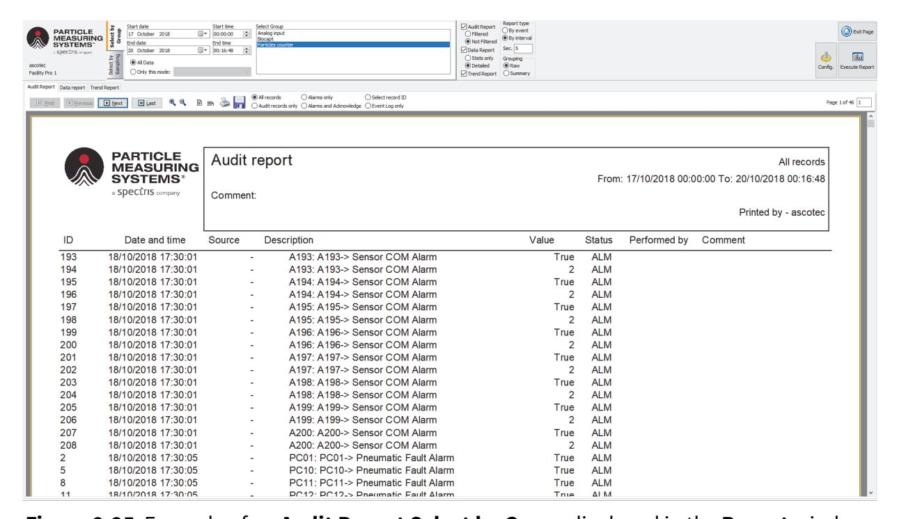

**Figure 8-25** Example of an **Audit Report Select by Group** displayed in the **Report** window

#### **Header information – Audit Report – Select by Group**

The header at the top of the first page of an **Audit Report – Select by Group** contains:

- Company logo
- Report name
- Comment text included when the report was created
- Report range The date/time span covered in the report

Report Examples Chapter 8 Reports

- Data filtering applied
  - **All records**
  - **Audit records only**
  - **Alarm only**
  - **Alarm and AcknowledgeTime interval required: From (date/time) to (date/ time)**
- Printed By Name of the user logged in

#### **Report body – Audit Report – Select by Group**

The body of the **Audit Report – Select by Group** lists information for each event recorded in the audit log.

- Column headings:
  - **ID** The event identification number
  - **Date and Time**  The event's date and time
  - **Node** The iFix data source
  - **Description** A description of the event
  - **Value** For alarms, the value for the TAG
  - **Status** Current status of the event reported:
    - **CFN** Active alarm (Change From Normal)
    - **HIHI** A status indicating the high threshold alarm exceeded
    - **HI** A status indicating the high alert threshold exceeded
    - **LOLO** A status indicating the low threshold alarm exceeded
    - **LO** A status indicating the low alert threshold exceeded
  - **Performed by**  The user who performed the electronic signature
  - **Comment**  Notes inserted by the operator

#### **Footer information – Audit Report – Select by Group**

The footer of each report contains:

- Printing date and time In the same format as the OS
- **FacilityPro** <**station name room name>**
- Page n of m Number of the current page and total number of pages in the report

#### **Last page – Audit Report – Select by Group**

| The last page of a report includes some blank lines for the operator to fill in on the |  |
|----------------------------------------------------------------------------------------|--|
| printed report:                                                                        |  |

|  | Performed byDateReviewed and Approved byDate |
|--|----------------------------------------------|
|  |                                              |

Chapter 8 Reports Report Examples

### **Audit Repo[rt example](#page-106-2)s – Select by Sampling Audit Report**

An example of an **Audit Report – Select by Sampling** displayed in the **Report** window is shown in **Figure 8-26**.

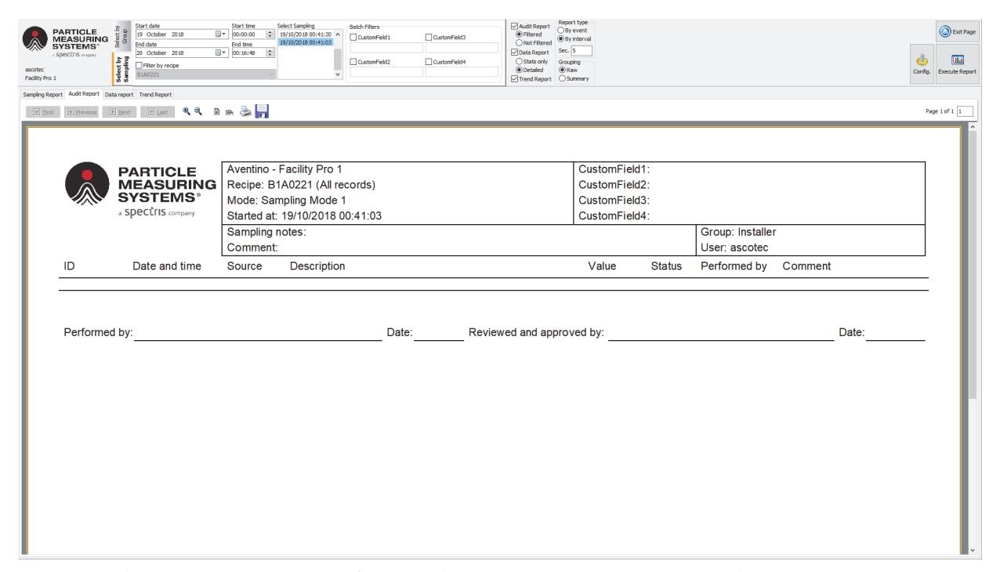

**Figure 8-26** Example of an **Audit Report – Select by Sampling** displayed in the **Report** window

#### **Header information – Audit Report – Select by Sampling**

The header at the top of the first page of a **Audit Report – Select by Sampling**  contains:

- Company logo
- **FacilityPro** <**station name room name>**
- Recipe name The name of the recipe selected for the report.
- Time the recipe started running **Started at mm/dd/yyyy** or **dd/mm/yyyy hh:mm:ss AM** or **PM**
- Mode The mode of the sampling selected for the report:
  - **Normal Operation**
  - **At Rest**
  - **Custom**
- Custom field 1, if any specified
- Custom field 2, if any specified
- Custom field 3, if any specified
- Custom field 4, if any specified
- Sampling notes User defined

Report Examples Chapter 8 Reports

- Comment text included when the report was created
- Group name of the login group the logged-in user belongs to
- User name of the user logged in when the report was generated

#### **Report body – Audit Report – Select by Sampling**

The body of the **Audit Report – Select by Sampling** lists information for each event recorded in the audit log.

- Column headings:
  - **ID** The event identification number
  - **Date and Time**  The event's date and time
  - **Node** The iFix data source
  - **Description** A description of the event
  - **Value** For alarms, the value for the TAG
  - **Status** Current status of the event reported:
    - **CFN** Active alarm (Change From Normal)
    - **HIHI** A status indicating the high threshold alarm exceeding
    - **HI** A status indicating the high alert threshold exceeding
    - **LoLo** A status indicating the low threshold alarm exceeding
    - **Lo** A status indicating the low alert threshold exceeding
  - **Performed by**  The user who performed the electronic signature
  - **Comment**  Notes inserted by the operator

#### **Footer information – Audit Report – Select by Sampling**

The footer of each report contains:

- Printing date and time In the same format as the OS
- **FacilityPro** <**station name room name>**
- Page n of m Number of the current page and total number of pages in the report

#### **Last page – Audit Report – Select by Sampling**

|                 | The last page of a report includes some blank lines for the operator to fill in on the |  |  |  |
|-----------------|----------------------------------------------------------------------------------------|--|--|--|
| printed report: |                                                                                        |  |  |  |

|  |  | Performed byDateReviewed and Approved byDate |  |
|--|--|----------------------------------------------|--|
|--|--|----------------------------------------------|--|

Chapter 8 Reports Report Examples

### **Data Report examples – Select by Group**

The **Data [Report](#page-108-3)** creates a table of sampling data from the sensors and calculated values for minimums, maximums, averages, and standard deviations.

An example of an **Data Report – Select by Group** displayed in the **Report** window is shown in **Figure 8-27**.

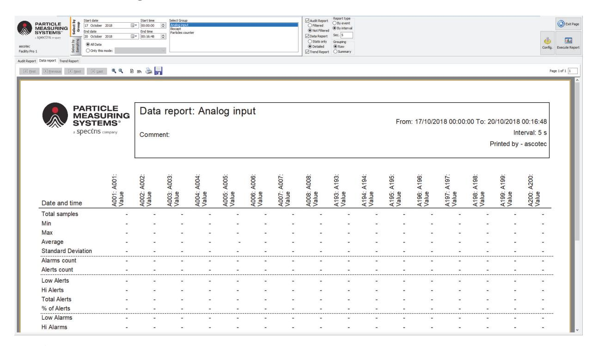

**Figure 8-27** Example **Data Report – Select by Group** displayed in the **Report** window

#### **Header information – Data Report – Select by Group**

The header at the top of each page of a report contains:

- Company logo
- Report name
- Report range The date/time span covered in the report
- • Data interval
- Comment text included when the report was created
- Printed by name of the user logged in for printing

#### **Report body – Data Report – Select by Group**

- Column headings:
  - **Date and Time**  The event's date and time

Report Examples Chapter 8 Reports

• Measurements – Values of the samples, and with an enhanced font, indicates if the value exceeded the threshold of alert or alarm.

For PC reports, for each sampler, column headings include:

- **S0n: Flow(l/min)**  The number of liters sampled per minute, where **n** is the number of the sampler
- **S0n Part>0.5um/CF**
- **S0n Part>0.5um/CM**
- **S0n Part>5.0um/CF**
- **S0n Part>5.0um/CM**
- **S0n Volume(lt)**

#### **Report summary – Data Report – Select by Group**

Appears on the last page of the report.

- **Total samples** total number of samples in the column;
- **Min** the minimum value reported in the column;
- **Max** the maximum value reported in the column;
- **Average** The average value of samples in the column;
- **Standard deviation** With reference to the average value of samples in the column
- **Low Alerts**  The number of low alerts;
- **Hi Alerts** The number of high alerts;
- **% of Alerts** The percentage of alerts to total samples;
- **Low Alarms** The number of low alarms;
- **Hi Alarms** The number of high alarms;
- **% of Alarms** The percentage of alarms to total samples.

#### **Footer information – Data Report – Select by Group**

The footer of each report contains:

- Printing date and time
- **FacilityPro** <**station name room name>**
- Page n of m Number of the current page and total number of pages in the report

#### **Last page – Data Report – Select by Group**

The last page of a report includes some blank lines for the operator to fill in on the printed report:

|  |  |  | Performed byDateReviewed and Approved byDate |
|--|--|--|----------------------------------------------|
|--|--|--|----------------------------------------------|

Chapter 8 Reports Report Examples

### **Data Report examples – Select by Samplings**

The **Data Report** [create](#page-108-3)s a table of sampling data from the sensors and calculated values for minimums, maximums, averages, and standard deviations.

An example of an **Data Report – Select by Samplings** displayed in the **Report** window is shown in **Figure 8-27**.

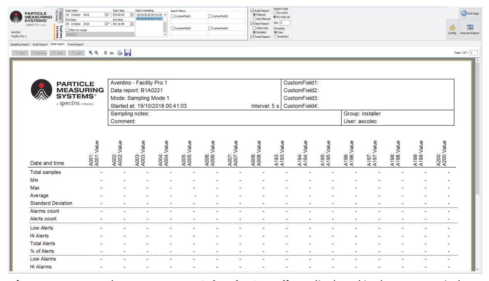

**Figure 8-28** Example **Data Report – Select by Samplings** displayed in the **Report** window

#### **Header information – Data Report – Select by Samplings**

The header at the top of each page of a report contains:

- Company logo
- FacilityPro <station name room name>Report name
- Recipe name The name of the recipe selected for the report.
- Time the recipe started running **Started at mm/dd/yyyy** or **dd/mm/yyyy hh:mm:ss AM** or **PM**
- Mode The mode of the sampling selected for the report:
  - **Normal Operation**
  - **At Rest**
  - **Custom**
- Data Interval
- Custom field 1, if any specified
- Custom field 2, if any specified
- Custom field 3, if any specified
- Custom field 4, if any specified

Report Examples Chapter 8 Reports

- Sampling notes User defined
- Comment text included when the report was created
- Group name of the login group the logged-in user belongs to
- User name of the user logged in when the report was generated

#### **Report body – Data Report – Select by Samplings**

- Column headings:
  - **Date and Time**  The event's date and time
  - Measurements Values of the samples, and with an enhanced font, indicates if the value exceeded the threshold of alert or alarm.

For PC reports, for each sampler, column headings include:

- **S0n: Flow(l/min)**  The number of liters sampled per minute, where **n** is the number of the sampler
- **S0n Part>0.5um/CF**
- **S0n Part>0.5um/CM**
- **S0n Part>5.0um/CF**
- **S0n Part>5.0um/CM**
- **S0n Volume(lt)**

#### **Report summary – Data Report – Select by Samplings**

Appears on the last page of the report.

- **Total samples** total number of samples in the column;
- **Min** the minimum value reported in the column;
- **Max** the maximum value reported in the column;
- **Average** The average value of samples in the column;
- **Standard deviation** With reference to the average value of samples in the column
- **Low Alerts**  The number of low alerts;
- **Hi Alerts** The number of high alerts;
- **% of Alerts** The percentage of alerts to total samples;
- **Low Alarms** The number of low alarms;
- **Hi Alarms** The number of high alarms;
- **% of Alarms** The percentage of alarms to total samples.

#### **Footer information – Data Report – Select by Samplings**

The footer of each report contains:

- Printing date and time
- **FacilityPro** <**station name room name>**
- Page n of m Number of the current page and total number of pages in the report

#### **Last page – Data Report – Select by Samplings**

The last page of a report includes some blank lines for the operator to fill in on the printed report:

| Performed byDateReviewed and Approved byDate |  |  |  |  |  |  |
|----------------------------------------------|--|--|--|--|--|--|
|----------------------------------------------|--|--|--|--|--|--|

Chapter 8 Reports Report Examples

### **[Trend Repo](#page-112-2)rt examples – Select by Samplings**

The **Trend Report** creates a Historical trend graph of sampling data from the sensors. An example of a **Trend Report** displayed in the **Report** window is shown in **Figure 8-29**.

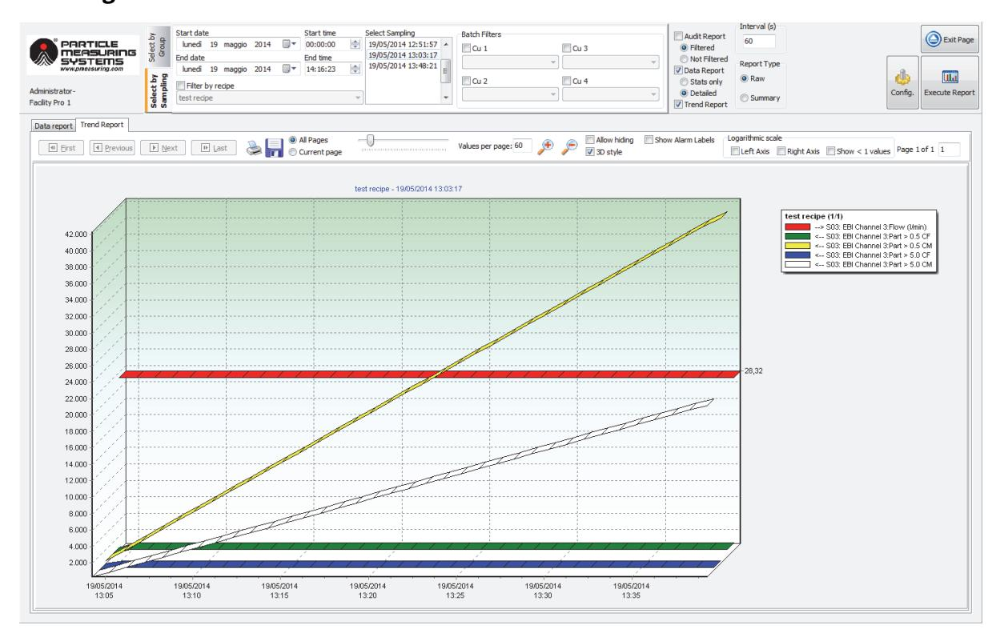

**Figure 8-29** Example **Trend Report** displayed in the **Report** window

In the graphical display of the **Trend Report** you can choose:

- 3D/2D mode
- Display point value
- Zoom the time axis (number of samples per page for trend)
- Enable or disable hiding of filterable data
- • [Show or hide alarm labels](#page-101-2)
- • Set a logarithmic scale on left or right axis

The general viewing controls and controls specific to the **Trend Report** are described in **Table 8-5** General and report-specific controls in the Report window on page 8-35.

#### **Header information – Trend Report – Select by Samplings**

The header at the top of each page of a report contains:

- Company logo
- **FacilityPro** <**station name room name>**
- Recipe name –

Report Examples Chapter 8 Reports

• Time the recipe started running – **Started at mm/dd/yyyy** or **dd/mm/yyyy hh:mm:ss AM** or **PM**

- Custom field 1, if any specified
- Custom field 2, if any specified
- Custom field 3, if any specified
- Custom field 4, if any specified
- Comment text included when the report was created
- Sampling notes, if inserted at the start of the sampling
- Group name of the login group the logged-in user belongs to
- User name of the user logged in when the report was generated

#### **Header information - Trend Report Exported PDF - Select by Group**

The header at the top of each page of a report contains:

- Company logo
- Report name
- Report range The date/time span covered in the report
- Data interval
- Comment text included when the report was created
- • Printed by - name of the user logged in for printing

#### **Footer information – Trend Report Exported PDF**

The footer of each report contains:

- Printing date and time
- **FacilityPro** <**station name room name>**
- Page n of m Number of the current page and total number of pages in the report

#### **Last page – Trend Report**

| The last page of a report includes some blank lines for the operator to fill in on the |  |
|----------------------------------------------------------------------------------------|--|
| printed report:                                                                        |  |

|  | Performed byDateReviewed and Approved byDate |
|--|----------------------------------------------|
|  |                                              |

Chapter 8 Reports Sampling Report

# **Sampling Report**

The **Sampling Report** is used to provide reports for each recipe that has been started in a required time period. Generating a **Sampling Report** retrieves data from the database and arranges the following information in the report:

- Recipe name
- Start date/Start time for each sensor of the recipe
- End date/End time
- Errors and alarms found during the sampling

The objective of this function is to represent significant historical data present in the database for the sampling to selected recipe events (alarms, start / stop point) of the system (Audit) recorded in the DB events and alarms for the selected sampling recipe.

### **WARNING**

It is strongly recommended to perform Database maintenance in order to keep dimension under 5GB. Bigger database size can lead to Report extraction slowdown.

## **Sampling Report tab**

A sampling report will be generated in the **Sampling Report** tab. Configurable settings are found in the top menu.

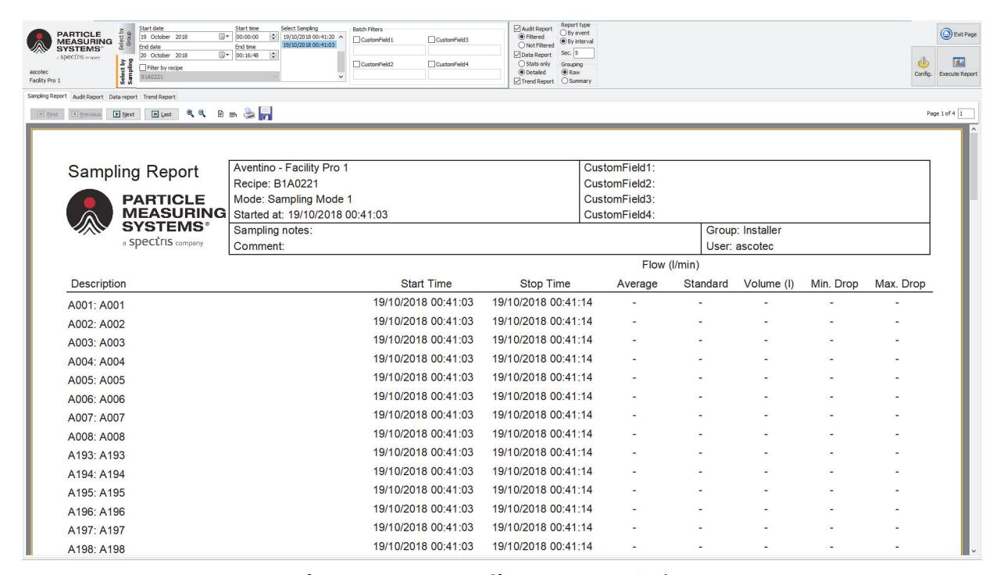

**Figure 8-30 Sampling Report** window

Sampling Report Chapter 8 Reports

### **Create a Sampling Report**

Creati[ng any sampling report involves the following gener](#page-96-0)al steps:

- **1** Set a date/time range for the report See Set a date and time range for a report on page 8-30.
- **2** From the **Select Sampling** field, select the sampling you want to use in the report.
- **3** Apply filters, if necessary.

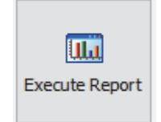

**4** Clic[k the](#page-93-0) **Execute Report** button to type note text you want to

include in the header of the report and generate the report. See Execute the report on page 8-27.

The system automatically generates the **Sampling Report** and displays it in the **Sa[mpling Report](#page-115-1)** tab.

[After a repor](#page-115-1)t has been generated and displayed in the **Sampling Report** tab, you can:

- Review the report on screen. See [Change the view in report displayed in](#page-115-2) the Sampling Report window on page 8-49.
- Prin[t the report.](#page-116-0) See Print a Sampling Report on page 8-49.
- • Save a copy of the report as a **PDF** file. See Export a Sampling Report from the Sampling Report Window on page 8-50.

# **[Change the view in report displayed in the Sampling Report window](#page-101-2)**

The controls for the **Sampling Report** display are the same as the general display controls described in **Table 8-5** General and report-specific controls in the Report window on page 8-35.

# **Print a Sampling Report**

- **>> To print a Sampling Report:**
- **1** Generate the report (see Create a Sampling Report on page 8-49). The report displays in the text box of the **Sampling Report** tab.
- **2** Click the **Printer** icon in the toolbar at the top of the report in the **Sampling Report** window.

A **Print** window appears.

**3** Select which pages to print.

Chapter 8 Reports Sampling Report

### **Export a Sampling Report from the Sampling Report Window**

A **Sampling Report** generated through the **Sampling Report** tab can be saved as a PDF – Portable Document Format – for viewing in Adobe Acrobat

#### **>> To export a Sampling Report from the Sampling Report tab:**

- **1** Generate the report. The report displays in the text box of the **Sampling Report** tab.
- **2** Click the **Save report** icon in the toolbar at the top of the report in the **Sampling Report** window.

Pharmaceutical Net Pro exports a PDF of the report to a folder in the general path **c:\Export \PDF**.

• The full path displays in a message with the full name of the exported report file.

#### **[Sampling Report comp](#page-114-2)onents**

An example of a **Sampling Report** displayed in the **Sampling Report** tab is shown in **Figure 8-30** on page 8-48.

#### **Header information – Sampling Report**

The header at the top of the first page of a **Sampling Report** contains:

- Report name **Sampling Report**
- Company logo
- **FacilityPro** <**station name room name>**
- Recipe name –
- Time the recipe started running **Started at mm/dd/yyyy** or **dd/mm/yyyy hh:mm:ss AM** or **PM**
- Mode The mode of the sampling selected for the report:
  - **Normal Operation**
  - **At Rest**
  - **Custom**
- Batch Number User defined
- Process type:
  - **Custom**
- Sampling notes User defined
- Comment text included when the report was created
- Group name of the login group the logged-in user belongs to
- User name of the user logged in when the report was generated

Sampling Report Chapter 8 Reports

#### **Report body – First section – Sampling Report**

- Column headings:
  - **Channel**  The name of the channel described
  - **Description**  A description defined for the channel
  - **Start Time**  The start time for the sampling
  - **Stop Time**  The end time for the sampling
  - **Flow (L/min)**  Heading for the following columns:
    - **Average**  Average flow in liters/minute in the format **nn.nn**
    - **Std. Dev.** Standard deviation for the flow in the format **nn.nn**
    - **Volume (l)** Number of liters measured in the format **nn.nn**
    - **Min. Drop**  Minimum line pressure drop in the format **nn.nn**
    - **Max. Drop**  Maximum line pressure drop in the format **nn.nn**

#### **Report body – Second section – Sampling Alarms – Sampling Report**

- Column headings:
  - **Alarm date and time**  The date and time the alarm occurred
  - **Channel**  The name of the channel described
  - **Description**  A description defined for the channel
  - **Alarm**  Device ID: Channel name and qualifier **Alert** or **Alarm**
  - **State**  Description of the status of the event (current value that generated the alarm)

#### **Footer information – Sampling Report**

The footer of each report contains:

- Print time PDF creation date and time
- Printed by Name of the user logged in
- Page n of m Number of the current page and total number of pages in the report

#### **Last page**

| The last page of a report includes some blank lines for the operator to fill in on the |  |
|----------------------------------------------------------------------------------------|--|
| printed report:                                                                        |  |

|  | Performed byDateReviewed and Approved byDate |
|--|----------------------------------------------|
|  |                                              |

Chapter 8 Reports Sampling Report

This page is intentionally left blank.

# **Chapter 9 Real Time Trend**

The **Real Time Trend** window allows the user to view a continuous stream of data provided by one of the available recipe sampling groups and its associated sampling channels.

Data is saved when a change event occurs (when the value of the data changes) to save memory space. In the event maximum assets are used (all 16 pens of the trend graph changing once per second), the maximum duration of a trend report is 2 days, 23 hours and 59 minutes.

# **Real Time Trend Window**

**>> To open the Real Time Trend window:**

**1** Click the **Real Time Trend** b[utton at the](#page-120-0) bottom of the

Pharmaceutical Net Pro screen.

The **Real Time Trend** window appears (see **Figure 9-1**).

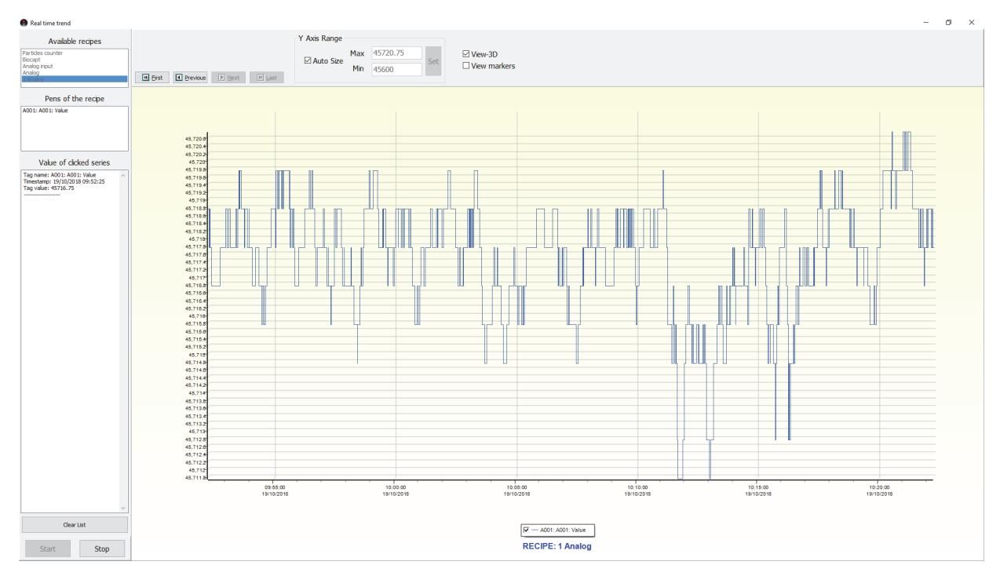

**Figure 9-1** Real Time Trend window

**Table 9-1** contains all components displayed on the **RT Trend** window and their usage.

**Table 9-1** Components of the **Real Time Trend** window

| Available recipes         | Lists all recipe groups configured with the processor.                                                 |
|---------------------------|--------------------------------------------------------------------------------------------------------|
| Pens of the recipe        | Lists all channels in the recipe group selected in Available                                           |
| Value of clicked series   | recipes. Lists the current values of the individual channels of the                                 |
| Clear List                | recipe group, including Tag name, Timestamp and Tag value. Clears Value of clicked series field. |
|                           | Starts real time trending.                                                                             |
| Start                     | Stops real time trending.                                                                              |
| Stop Debug Information | This area contains tag information pertaining to                                                       |
|                           | debugging the tool. Here, the First and Last timestamp in series can be viewed.                     |

**Y Axis Range** Enter a **Max** and **Min** value to limit the vertical view of data plots to desired limits. To enable the **Max** and **Min** range, remove the checkmark from **Auto Size**, enter the desired range and click **Set**. To automatically adjust the view based on the highest and lowest values, checkmark **Auto Size**. **View-3D** Checkmark **View-3D** to change the real time view from the default 2D to 3D. **View markers** Checkmark **View markers** to attach markers listed in the legend to the real time trend lines in addition to their associated values. **Legend area** Lists the markers of each channel including the label and line color. To hide a channel from view, click the adjacent checkmark box so that it is blank.  **First** Navigates timeplot to first data point in series.  **Previous** Navigates timeplot to previous data point in series.  **Next** Navigates timeplot to next data point in series.  **Last** Navigates timeplot to last data point in series. **Component Description**

**Table 9-1** Components of the **Real Time Trend** window

# **Starting and Stopping a Real Time Trend**

The **Real Time Trend** window displays overtop the main screen, allowing the user to minimize it to use other functions of the software while it is running, and also open another **Real Time Trend** window. No more than four **Real Time Trend** windows can be open at once.

#### **>> To begin a trend:**

- **1** Click the desired recipe group listed in **Available recipes**. **Pens of the recipe** automatically populates once a recipe group is chosen.
- **2** Click the **Start** button. Real time trending begins.

#### **>> To end a trend:**

- **1** Click the **Stop** button.
- **2** Perform the **Electronic Signature**. This does not pause the display of data. Trending cannot be started again at the last timestamp in the data series, but will begin again at 00:00:00. Current trend data will be lost.

# **Editing Pens of the Recipe**

Real time trending is only allowed for a recipe with a lower limit of 1 pen and an upper limit of 16 pens.

#### **>> To edit the number of pens:**

**1** Click the **Reports** button.

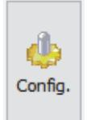

**2** Click the **Config.** button to open the **Tags Catalog**.

**3** Adjustment of the listing of pens in the **Real Time Trend** window is done using the **Sensor Groups** tab and **Data Type Groups** tab. Use the **Multi insert**

button to edit each listing.

The number of pens is equal to the number of sensors listed in the **Sensors in Group** column (**Sensor Groups** tab) multiplied by the number of **Data Types in Group** entries (**Data Type Groups** tab) for the same, applicable **Sensors group**/**Data Type Group**.

For example, if a **Sensors Group** includes both particle and analog sensors, certain **Data Types** will only apply to certain sensors (i.e., Analog Value is only applicable to an analog sensor).

- **4** Colors of the individual sensor trend lines can be adjusted with the **Pens Color Selection** tab.
- **5** Once adjustments have been made, exit the **Reports** window and click the **RT Trend** button. The **Pens of the recipe** listing is now adjusted in the new window (old windows are unaffected).

# **Chapter 10 Run Time Logic**

The purpose of the Run Time Logic Editor is to provide a graphical interface for the editing of digital output activation. With this tool, you can create any logic with "Available tags" to drive physical digital output to activate lamps, sirens, or any device with a switch.

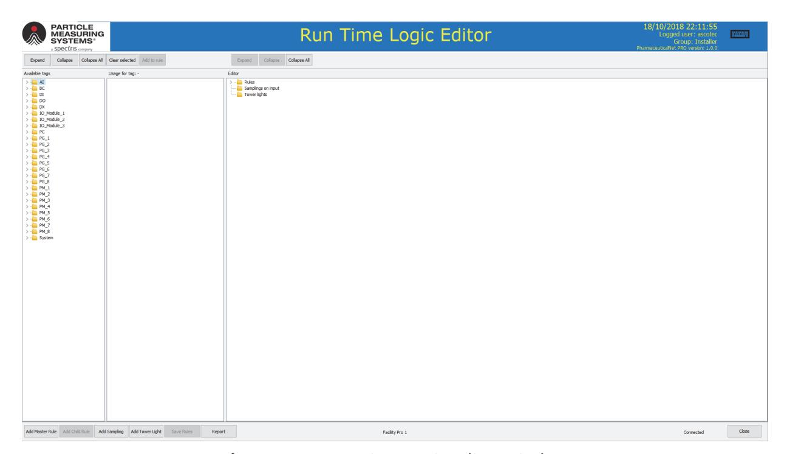

**[Figure 1](#page-124-0)0-1** Run Time Logic Editor window

The[re are three panes of the Ru](#page-133-1)[n Time L](#page-133-0)ogic Editor. From left to right:

- **Available Tags pane**
- **[Usage](#page-124-1) for Tag pane** on page 10-11
- **Editor pane** on page 10-11

**Table 10-1** contains all buttons displayed on the Run Time Logic Editor screen and their usage.

**Table 10-1** Buttons of the **Run Time Logic Editor** screen

| Button          | Description                                                                                                                         |
|-----------------|-------------------------------------------------------------------------------------------------------------------------------------|
|                 | Expands the current selection. A node can be expanded if                                                                            |
| Expand          | a arrow is adjacent to the node title.                                                                                           |
| Collapse        | Collapses the current node selection. A node can be                                                                                 |
|                 | collapsed if a arrow is adjacent to the node title.                                                                              |
| Collapse All    | Collapses all nodes currently expanded.                                                                                             |
|                 | Opens the Rule Editor window to create a new rule.                                                                                  |
| Add Master Rule |                                                                                                                                     |
| Add Child Rule  | Opens the Rule Editor window to create a new child rule.                                                                            |
| Add Sampling    | Opens the Sampling on input window to create a new sampling rule.                                                                |
| Add Tower Light | Opens the TowerLightEditForm window to create a new tower light rule.                                                            |
| Save Rules      | Use this button to save the created rules.                                                                                          |
| Report          | Use this button to save/print a PDF copy detailing the configured rules. The display is the same as shown in the Editor pane. |
| Close           | Returns the user to the System window.                                                                                              |

## **Available Tags pane**

This section outlines the definitions and usage of each available tag contained in the Run Time Logic Editor.

Only a single usage of a unique output is allowed. Any input can be used an unlimited amount of times.

Each alarm has an alarm out. Alarm out is triggered to 1 at the same time of the alarm but changes to 0 after acknowledgement (DO\_Ack = 1). For example, with the use of COM\_ AlarmOut instead of COM\_Alarm, you can silence the siren for a sensor sent to calibration, acknowledging the communication alarm from SCADA.

#### **Analog Input Folder**

The number of analog (including virtual) inputs is dependent on system configuration.

**Table 10-2** Analog Input Folder

| Tags          | Description                                                                                                                                                     | Usage         |
|---------------|-----------------------------------------------------------------------------------------------------------------------------------------------------------------|---------------|
| CalibAlarm    | Alarm triggered from calibration expiration.                                                                                                                    | Input         |
| CalibAlarmOut | Triggered to 1 at the time of the alarm, but switches to 0 after acknowledgement or DO_Ack=1.                                                                | Input         |
| CalibAlert    | Alert triggered from calibration expiration.                                                                                                                    | Input         |
| CalibAlertOut | Triggered to 1 at the time of the alert, but switches to 0 after acknowledgement or DO_Ack=1.                                                                | Input         |
| COM_Alm       | Alarm triggered when the sensor/pneumatic module is disconnected.                                                                                            | Input         |
| COM_AlmOut    | Triggered to 1 at the time of the alarm, but switches to 0 after acknowledgement or DO_Ack=1.                                                                | Input         |
| DO_Ack        | Used as an input to set all system alarms equal to 0 (off). Used as an output for confirmation if acknowledgement from SCADA occurs for any system alarm. | Input, Output |
| HIAlarm       | Alert triggered when the analog value exceeds the Hi alert limit (after set delay).                                                                          | Input         |
| HiAlarmOut    | Triggered to 1 at the time of the alarm, but switches to 0 after acknowledgement or DO_Ack=1.                                                                | Input         |
| HIHIAlarm     | Alarm triggered when the analog value exceeds the Hi alarm Limit (after set delay).                                                                          | Input         |
| HIHIAlarmOut  | Triggered to 1 at the time of the alarm, but switches to 0 after acknowledgement or DO_Ack=1.                                                                | Input         |
| Installed     | Confirms if the sensor is installed.                                                                                                                            | Input         |
| LOAlarm       | Alert triggered when the analog value is lower than the low alert limit (after set delay).                                                                   | Input         |
| LOAlarmOut    | Triggered to 1 at the time of the alarm, but switches to 0 after acknowledgement or DO_Ack=1.                                                                | Input         |
| LogData       | Confirms when the data is logged to the database.                                                                                                               | Input         |
| LOLOAlarm     | Alarm triggered when the analog value is lower than the low alarm limit.                                                                                     | Input         |
| LOLOAlarmOut  | Triggered to 1 at the time of the alarm, but switches to 0 after acknowledgement or DO_Ack=1.                                                                | Input         |
| RangeError    | Alarm triggered when the analog value is 1000 samples lower than the lowest sample calibration point.                                                        | Input         |
| RangeErrorOut | Triggered to 1 at the time of the alarm, but switches to 0 after acknowledgement or DO_Ack=1.                                                                | Input         |

#### **BioCapt (BC) Folder**

The number of BC folders is dependent on the number of configured biological sensors.

**Table 10-3** BioCapt (BC) Folder

| Tags                    | Description                                                                                                                                                     | Usage         |
|-------------------------|-----------------------------------------------------------------------------------------------------------------------------------------------------------------|---------------|
| AlreadyInUseAlarm       | Alarm triggered from calibration expiration.                                                                                                                    | Input         |
| AlreadyInUseAlarmOut    | Triggered to 1 at the time of the alarm, but switches to 0 after acknowledgement or DO_Ack=1.                                                                | Input         |
| CalibAlarm              | Alarm triggered from calibration expiration.                                                                                                                    | Input         |
| CalibAlarmOut           | Triggered to 1 at the time of the alarm, but switches to 0 after acknowledgement or DO_Ack=1.                                                                | Input         |
| CalibAlert              | Alert triggered from calibration expiration.                                                                                                                    | Input         |
| CalibAlertOut           | Triggered to 1 at the time of the alert, but switches to 0 after acknowledgement or DO_Ack=1.                                                                | Input         |
| COM_Alm                 | Alarm triggered when the sensor/pneumatic module is disconnected.                                                                                            | Input, Output |
| COM_AlmOut              | Triggered to 1 at the time of the alarm, but switches to 0 after acknowledgement or DO_Ack=1.                                                                | Input         |
| DelayedStart            | Alarm triggered when the sensor has a Delayed Start status.                                                                                                  | Input         |
| DO_Ack                  | Used as an input to set all system alarms equal to 0 (off). Used as an output for confirmation if acknowledgement from SCADA occurs for any system alarm. | Input, Output |
| DropAlarm               | Alarm triggered when the line pressure drop exceeds set limits during sampling.                                                                              | Input         |
| DropAlarmOut            | Triggered to 1 at the time of the alarm, but switches to 0 after acknowledgement or DO_Ack=1.                                                                | Input         |
| DropHiAlarmEnabled      | Alarm triggered when drop alarm high is enabled.                                                                                                                | Input         |
| DropLowAlarmEnabled     | Alarm triggered when drop alarm low is enabled.                                                                                                                 | Input         |
| EnableSwitch            | Alarm triggered when it is not possible to use the sensor switch.                                                                                            | Input         |
| FlowAlarm               | Alarm triggered when the flow alarm occurs.                                                                                                                     | Input         |
| FlowAlarmOut            | Triggered to 1 at the time of the alarm, but switches to 0 after acknowledgement or DO_Ack=1.                                                                | Input         |
| FlowCalculationAlarm    | Alarm triggered when the analog value is 1000 samples lower than the lowest sample calibration point.                                                        | Input         |
| FlowCalculationAlarmOut | Triggered to 1 at the time of the alarm, but switches to 0 after acknowledgement or DO_Ack=1.                                                                | Input         |
| Installed               | Confirms if the sensor is installed.                                                                                                                            | Input         |
| LineFault               | Alarm triggered when the sampling is interrupted.                                                                                                               | Input         |

**Table 10-3** BioCapt (BC) Folder

| Tags                   | Description                                                                                                                  | Usage         |
|------------------------|------------------------------------------------------------------------------------------------------------------------------|---------------|
| LineFaultOut           | Triggered to 1 at the time of the alarm, but switches to 0 after acknowledgement or DO_Ack=1.                             | Input         |
| Locked                 | Used as an output to disable the sensor from sampling. Used as an input for confirmation of when the sensor is locked. | Input, Output |
| LogData                | Confirms when the data is logged in your database.                                                                           | Input         |
| SensorIsLockedAlarm    | Alarm triggered when the sensor is locked.                                                                                   | Input         |
| SensorIsLockedAlarmOut | Triggered to 1 at the time of the alarm but switches to 0 after acknowledgement or DO_Ack=1.                              | Input         |
| SensorIsSampling       | Alarm triggered when the sensor is in use.                                                                                   | Input         |
| STOP_Alm               | Alarm triggered when time or volume sampling is interrupted by a user.                                                    | Input         |
| STOP_AlmOut            | Triggered to 1 at the time of the alarm, but switches to 0 after acknowledgement or DO_Ack=1.                             | Input         |
| Switch                 | Used as an input for confirmation of the sensor switch status. Used as an output to start sensor sampling.                | Input, Output |

#### **Digital Input (DI) Folder**

Digital Input (DI), numbered from 1 to as many as 64 (dependent on system configuration), refers to physical I/O boards installed. Each I/O board has 8 digital inputs. The I/O Board 1 has input from 1 to 8, I/O Board 2 has input from 9 to 16 and so on.

**Table 10-4** Digital Input (DI) Folder

| Tags          | Description                       | Usage |
|---------------|-----------------------------------|-------|
| Di0XX (01-XX) | Digital input from the I/O Boards | Input |

#### **Digital Output (DO) Folder**

Digital Output (DO) refers to the number of physical I/O boards installed. Each I/O board has 16 digital outputs.

**Table 10-5** Digital Output (DO) Folder

| Tags         | Description                         | Usage         |
|--------------|-------------------------------------|---------------|
| Do0XX (1-32) | Digital output from the I/O Boards. | Input, Output |

#### **Virtual Digital Input/Output (DX) Folder**

DX can be used as a virtual DI/DO provided by the OPC interface. DX can be activated with buttons in SCADA's graphical interface or in any OPC client connected ot the FacilityPro processor module. Each FacilityPro has 64 DX that can be used from SCADA or as intermediate variables for other rules.

**Table 10-6** Digital Output (DO) Folder

| Tags         | Description                     | Usage         |
|--------------|---------------------------------|---------------|
| Dx0XX (1-64) | Virtual digital input or output | Input, Output |

#### **I/O Module Folder**

Each I/O module (displayed as IO\_Module\_X) has a maximum of 3 connected ADAM boards.

**Table 10-7** I/O Module Folder

| Tags              | Description                                                                                                                                                     | Usage         |
|-------------------|-----------------------------------------------------------------------------------------------------------------------------------------------------------------|---------------|
| DO_Ack            | Used as an input to set all system alarms equal to 0 (off). Used as an output for confirmation if acknowledgement from SCADA occurs for any system alarm. | Input, Output |
| ModuleComAlarm    | Alarm triggered when the I/O Board is disconnected.                                                                                                             | Input         |
| ModuleComAlarmOut | Triggered to 1 at the time of the alarm, but switches to 0 after acknowledgement or DO_Ack=1.                                                                | Input         |
| TestMode          | Alarm triggered when installer accesses the Hardware Test page and enables the manual control of the board output.                                        | Input         |

#### **Particle Counter Folder**

The Particle Counter folder contains every available tag that can be used with each connected particle counter.

**Table 10-8** Particle Counter (PC) Folder

| Tags                 | Description                                                                                      | Usage |
|----------------------|--------------------------------------------------------------------------------------------------|-------|
| AlreadyInUseAlarm    | Alarm triggered when the sensor is sampling and another sampling is requested.                | Input |
| AlreadyInUseAlarmOut | Alarm triggered when the I/O Board is disconnected.                                              | Input |
| CalibAlarm           | Triggered to 1 at the time of the alarm, but switches to 0 after acknowledgement or DO_Ack=1. | Input |

**Table 10-8** Particle Counter (PC) Folder

| Tags                                          | Description                                                                                                                                                     | Usage         |
|-----------------------------------------------|-----------------------------------------------------------------------------------------------------------------------------------------------------------------|---------------|
| CalibAlarmOut                                 | Alarm triggered when installer accesses the Hardware Test page and enables the manual control of the board output.                                        | Input         |
| CalibAlert                                    | Alert triggered from calibration expiration.                                                                                                                    | Input         |
| CalibAlertOut                                 | Triggered to 1 at the time of the alert, but switches to 0 after acknowledgement or DO_Ack=1.                                                                | Input         |
| COM_Alm                                       | Alarm triggered when the sensor/pneumatic module is disconnected.                                                                                            | Input         |
| COM_AlmOut                                    | Triggered to 1 at the time of the alarm, but switches to 0 after acknowledgement or DO_Ack=1.                                                                | Input         |
| DelayedStart                                  | Alarm triggered when the sensor has a Delayed Start status.                                                                                                  | Input         |
| DO_Ack                                        | Used as an input to set all system alarms equal to 0 (off). Used as an output for confirmation if acknowledgement from SCADA occurs for any system alarm. | Input, Output |
| EnableSwitch                                  | Alarm triggered when it is not possible to use the sensor switch.                                                                                            | Input         |
| FlowAlarm                                     | Alarm triggered when flow alarm occurs.                                                                                                                         | Input         |
| FlowAlarmOut                                  | Triggered to 1 at the time of the alarm.                                                                                                                        | Input         |
| Installed                                     | Confirms if the sensor is installed.                                                                                                                            | Input         |
| LineFault                                     | Alarm triggered when the sampling is interrupted.                                                                                                               | Input         |
| LineFaultOut                                  | Triggered to 1 at the time of the alarm, but switches to 0 after acknowledgement of DO_Ack=1.                                                                | Input         |
| Locked                                        | Used as an output to disable the sensor from sampling. Used as an input for confirmation of when the sensor is locked.                                    | Input, Output |
| LogData                                       | Confirms when the data is logged in your database.                                                                                                              | Input         |
| PneumaticModuleAlarm                          | Alarm triggered when the pneumatic module has an alarm.                                                                                                      | Input         |
| PneumaticModuleAlarmOut                       | Triggered to 1 at the time of the alarm, but switches to 0 after acknowledgement of DO_Ack=1.                                                                | Input         |
| Alarm PS1>CF>Limit1 or PS1>CM>Limit1    | Alarm triggered when the cubic foot concentration of particles exceeds limit settings.                                                                       | Input         |
| AlarmOut PS1>CF>Limit1 or PS1>CM>Limit1 | Triggered to 1 at the time of the alarm, but switches to 0 after acknowledgement of DO_Ack=1.                                                                | Input         |
| CF_OK Navigate: PS1>CF                     | Alarm triggered when cubic foot concentration is reached.                                                                                                    | Input         |
| CM_OK Navigate: PS1>CM                     | Alarm triggered when cubic meter concentration is reached.                                                                                                   | Input         |
| SensorIsLockedAlarm                           | Alarm triggered when the sensor is locked.                                                                                                                      | Input         |

**Table 10-8** Particle Counter (PC) Folder

| Tags                   | Description                                                                                                   | Usage         |
|------------------------|---------------------------------------------------------------------------------------------------------------|---------------|
| SensorIsLockedAlarmOut | Triggered to 1 at the time of the alarm, but switches to 0 after acknowledgement of DO_Ack=1.              | Input         |
| SensorIsSampling       | Alarm triggered when the sensor is in use.                                                                    | Input         |
| STOP_Alm               | Alarm triggered when time or volume sampling is interrupted by a user.                                     | Input         |
| STOP_AlmOut            | Triggered to 1 at the time of the alarm, but switches to 0 after acknowledgement of DO_Ack=1.              | Input         |
| Switch                 | Used as an input for confirmation of the sensor switch status. Used as an output to start sensor sampling. | Input, Output |

#### **Pumps Group Folder**

The Pumps Group folder contains every available tag that can be used with each connected pump.

**Table 10-9** Pumps Group Folder

| Tags             | Description                                                                                                                             | Usage |
|------------------|-----------------------------------------------------------------------------------------------------------------------------------------|-------|
| Alarm1           | Alarm triggers when the maximum pneumatic pressure between modules in the same pump group limit 1 is exceeded.                    | Input |
| Alarm2           | Alarm triggers when the maximum pneumatic pressure between modules in the same pump group limit 2 is exceeded.                    | Input |
| HardwareTestMode | Alarm triggered when installer accesses the Hardware Test page and enables the manual control of a module in the same pump group. | Input |
| Pump1Test        | Alarm triggered when Pump 1 is on.                                                                                                      | Input |
| Pump2Test        | Alarm triggered when Pump 2 is on.                                                                                                      | Input |
| Pump3Test        | Alarm triggered when Pump 3 is on.                                                                                                      | Input |
| Pump4Test        | Alarm triggered when Pump 4 is on.                                                                                                      | Input |

#### **Pneumatic Module Folder**

The number of pneumatic modules listed is dependent on system configuration. Each sensor has 8 channels (8 channel valves and 8 flow valves).

**Table 10-10** Pumps Group Folder

| Tags                   | Description                                                                                                                                                     | Usage         |
|------------------------|-----------------------------------------------------------------------------------------------------------------------------------------------------------------|---------------|
| CalibAlarm             | Alarm triggered from calibration expiration.                                                                                                                    | Input         |
| CalibAlarmOut          | Triggered to 1 at the time of the alarm, but switches to 0 after acknowledgement of DO_Ack=1.                                                                | Input         |
| CalibAlert             | Alert triggered from calibration expiration.                                                                                                                    | Input         |
| CalibAlertOut          | Triggered to 1 at the time of the alarm, but switches to 0 after acknowledgement of DO_Ack=1.                                                                | Input         |
| ChanValve Channel_X | Alarm is triggered when the channel valve is on.                                                                                                                | Input         |
| FlowValve Channel_X | Alarm triggered when the flow valve is on.                                                                                                                      | Input         |
| COM_Alm                | Alarm triggered when the sensor/pneumatic module is disconnected.                                                                                            | Input         |
| DO_Ack                 | Used as an input to set all system alarms equal to 0 (off). Used as an output for confirmation if acknowledgement from SCADA occurs for any system alarm. | Input, Output |
| PressureTestFault      | Alarm triggered on the initial pressure test fault of the sensor/pneumatic module.                                                                           | Input         |
| RBValve                | Alarm triggered when the barometric pressure valve is on.                                                                                                    | Input         |

#### **System Folder**

System tags refer to SCADA for communication and information exchange (SCADA Alarm).

**Table 10-11** System Folder

| Tags              | Description                                                                                                | Usage |
|-------------------|------------------------------------------------------------------------------------------------------------|-------|
| AICalibAlarmLimit | Status (Enabled/Disabled) of the Analog Sensor Calibration Alarm                                        | Input |
| AICalibAlertLimit | Status (Enabled/Disabled) of the Analog Sensor Calibration Alarm                                        | Input |
| BufferAlarm1      | Alarm triggered when disconnection time between SCADA A and the FacilityPro exceed the set buffer time. | Input |
| BufferAlarm1Out   | Triggered to 1 at the time of the alert, but switches to 0 Input after acknowledgement or DO_Ack=1.  |       |

**Table 10-11** System Folder

| BufferAlarm2Out                       | Triggered to 1 at the time of the alert, but switches to 0                                                                                          | Input          |
|---------------------------------------|-----------------------------------------------------------------------------------------------------------------------------------------------------|----------------|
| ComAlarm1                             | after acknowledgement or DO_Ack=1. FacilityPro communication alarm with Node A.                                                                  | Input          |
| ComAlarm1Out                          | Triggered to 1 at the time of the alert, but switches to 0 after acknowledgement or DO_Ack=1.                                                    | Input          |
|                                       |                                                                                                                                                     |                |
| ComAlarm2 ComAlarm2Out             | FacilityPro communication alarm with Node B. Triggered to 1 at the time of the alert, but switches to 0                                          | Input Input |
|                                       | after acknowledgement or DO_Ack=1.                                                                                                                  |                |
| DO_Ack                                | Used as an input to set all system alarms equal to 0 (off). Used as an output for confirmation if acknowledgement                                | Input, Output  |
| LifeBeat1_Alarm LifeBeat1_AlarmOut | from SCADA occurs for any system alarm. SCADA A communication alarm from OPC Link. Triggered to 1 at the time of the alert, but switches to 0 | Input Input |
|                                       | after acknowledgement or DO_Ack=1.                                                                                                                  |                |
| LifeBeat2_Alarm LifeBeat2_AlarmOut | SCADA B communication alarm from OPC Link. Triggered to 1 at the time of the alert, but switches to 0                                            | Input Input |
|                                       | after acknowledgement or DO_Ack=1.                                                                                                                  |                |
| PCCalibAlarmLimitEnabled              | Status (Enabled/Disabled) of the particle calibration alarm.                                                                                     |                |
| PCCalibAlertLimitEnabled              | Status (Enabled/Disabled) of the particle sensor                                                                                                    |                |
| PMCalibAlarmLimitEnabled              | calibration alert. Status (Enabled/Disabled) of the pneumatic module                                                                             |                |
| PMCalibAlertLimitEnabled              | calibration alarm. Status (Enabled/Disabled) of the pneumatic module                                                                             |                |
| Scada1Alarm                           | calibration alert. Alarm from SCADA A to FacilityPro processor.                                                                                  |                |
| Scada1AlarmOut                        | Triggered to 1 at the time of the alert, but switches to 0                                                                                          |                |
| Scada2Alarm                           | after acknowledgement or DO_Ack=1. Alarm from SCADA B to FacilityPro processor.                                                                  |                |
| Scada2AlarmOut                        | Triggered to 1 at the time of the alert, but switches to 0                                                                                          | Input Input |
|                                       | after acknowledgement or DO_Ack=1.                                                                                                                  |                |

The [logic categories to activate d](#page-137-0)[igital output](#page-136-0) or sensors include:

- **Rule Editor** on page 10-12
- **Sampling on Input Editor** on page 10-14
- **Tower Lights** on page 10-15

#### **Usage for Tag pane**

The Usage for Tag pane will display the rule associated with the selected tag.

**Figure 10-2** Available tag selection displays its usage

In **Figure 10-2**, the Available Tag selected is "Do002". The usage associated with this tag is as an Input for **Sampling on input** Rule 1 (S01).

### **Editor pane**

The Editor pane contains all rules organized by type (**Rules**, **Sampling on input**, and **Tower lights**)

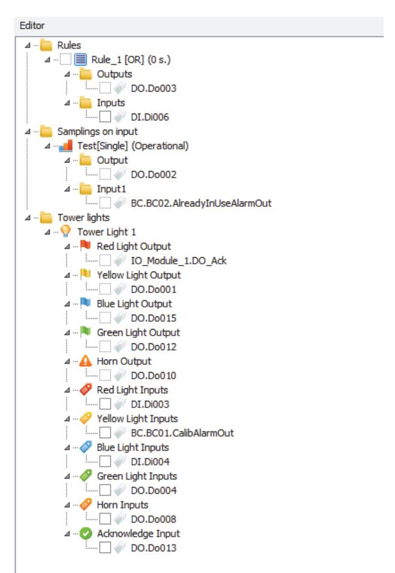

**Figure 10-3** Editor pane contains all edited rules organized by type

# **Rule Editor**

Use the Rule Editor to create logic to drive digital output (DO).

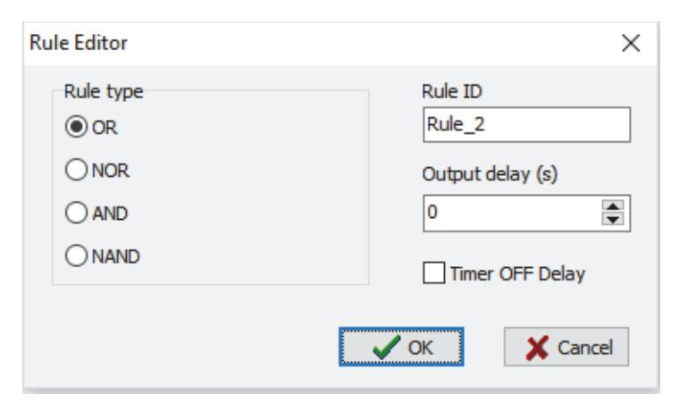

**Figure 10-4** Rule Editor window

#### **Rule Type**

DO activation is a product of combinatory logic that uses the operators "and", "or", "not" and "delay". The list of Rule types (see Figure 4-4) are derived from "and", "or" and "not":

- OR
- NOR
- AND
- NAND

The cause and effect of each logic statement is summarized in the tables below.

**Table 10-12** Effect on output of turning all input on/off

|           |     | Output |      |
|-----------|-----|--------|------|
|           |     | ON     | OFF  |
| All Input | ON  | NOR    | OR   |
|           | OFF | AND    | NAND |

**Table 10-13**  Effect on output of turning any input on/off

|           |     | Output |     |
|-----------|-----|--------|-----|
|           |     | ON     | OFF |
| Any Input | ON  | NAND   | AND |
|           | OFF | OR     | NOR |

The operator "delay" is used in the following way:

- When **Timer OFF Delay** is checked, the output of the rule will = 0 (become false) after the set **Output delay** time (between 0 and 3600 seconds).
- • When **Timer OFF Delay** is left unchecked, the output activation (= 1) of the rule [will be delay](#page-134-2)ed a[fter the set](#page-135-2) **Output delay** time.

## **Example Rule Editor Rule Creation**

Use **Figure 10-4** and **Figure 10-5** as a guide for the following steps:

- **1** To begin, select **Add Master Rule** to open the Rule Editor window.
- **2** Assume the rule requires the output to activate only when all associated inputs are deactivated. For this assumption, under Rule type, select "OR". Create a unique **Rule ID** to describe the rule.
- **3** Assume an output activation delay of 0 seconds. Set the **Output delay** to be 0 seconds, and leave the **Timer OFF Delay** box unchecked.
- **4** Once finished, select **OK**.
- **5** Upon rule creation, **Outputs** and **Inputs** folders will appear beneath the **Rule ID**  details. Drag the desired tags from the Available Tags pane and drop them into the applicable folders. The rule in **Figure 10-5** uses one tag from the Digital Input (DI) folder, and one from the Digital Output (DO) folder: Di006 and Do003.

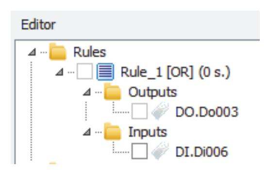

**Figure 10-5** Example Rule created with Rule Editor

### **Creating a Child Rule**

Use this procedure to create an additional l[ogic stateme](#page-136-1)nt within a rule. A child rule can be added to the **Inputs** folder of a rule.

- **1** After selecting the Inputs folder of the rule, select the **Add Child Rule** button.
- **2** The **Rule Editor** window will appear (see **Figure 10-6**). In this window, you will be able to set the **Rule type**, **Output delay** and **Timer OFF Delay** option.

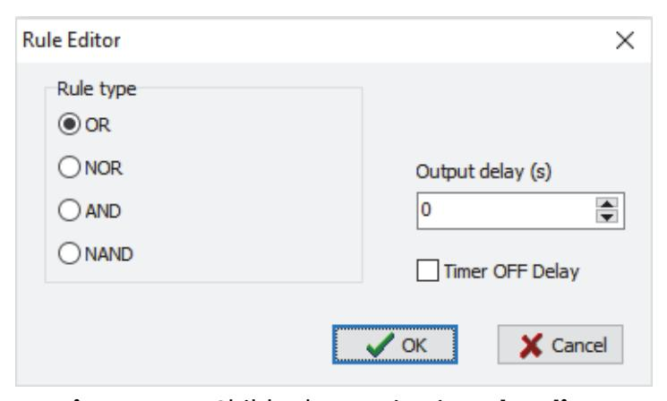

**Figure 10-6** Child rule creation in **Rule Editor**

- **3** Assume that our child rule uses **Rule type** "OR", with the output activating after an **Output delay** of 0 seconds (**Timer OFF Delay** is unchecked).
- **4** Once finished, select **OK**.
- **5** An additional **Inputs** folder is created within the original rule's input. Both rule statements are used for Output activation/deactivation.
- **6** Save the created rule by selecting the **Save Rules** button from the bottom menu.

# **Sampling on Input Editor**

Use the **Sampling on input editor** to start/stop a pre-configured recipe with digital input. A digital output is available as feedback to notify that the recipe is sampling.

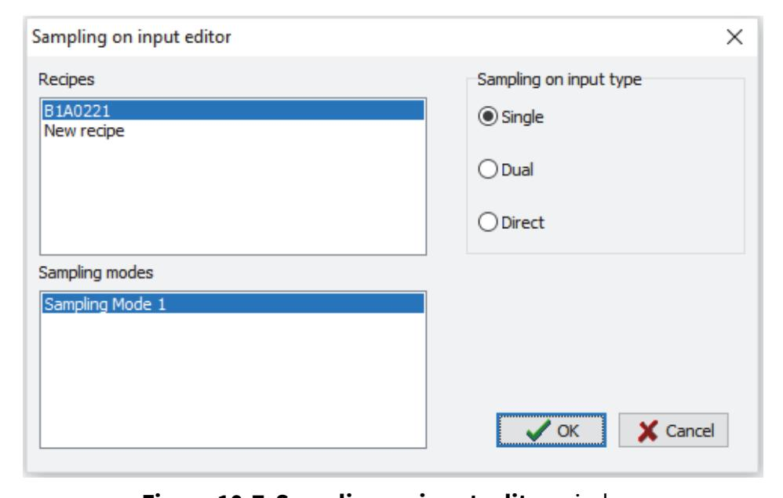

**Figure 10-7 Sampling on input editor** window

#### **Sampling on input type** can be selected as:

- **Single**: Allows a single digital input for the application of pushbutton sampling activation, with a second push deactivating the sampling.
- **Dual**: Allows for two separate manual inputs for the application of a pushbutton to start sampling and a second pushbutton to stop sampling.
- **Direct**: Allows the use of a switch instead of a pushbutton to drive sampling. When the switch is closed, the sampling is started. When open, the sampling is stopped.

**Sampling modes** define the state of operation applied to the selected recipe. Options include **At rest** and **Operational** conditions.

[All associations bet](#page-39-4)ween DI and recipes are saved together with all rules definitions in the Rules.dat file.

**Recipes** can be created using SCADA for implementation in this special rule (see **Chapter 4** Recipes).

# **Tower Lights**

Use the **TowerLightEditForm** to create rules to drive light activation with the use of input/ output tags.

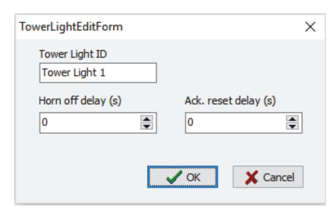

**Figure 10-8** TowerLightEditForm window

A Tower Light rule is a special rule that runs separately from all other rules. When a tower light rule is added, the following may be specified:

- 5 digital outputs to drive light activation
- 5 digital inputs to drive the logic
- One additional digital input **(Acknowledge Input**) for siren silencing (with a **Horn off delay** option)
- A timer for siren reactivation if the alarm should persist after silencing (**Ack. reset delay**).

**Table 10-14**  Tower Light Outputs and Inputs

| Icon | Description                                                                                                                                                                                                    |
|------|----------------------------------------------------------------------------------------------------------------------------------------------------------------------------------------------------------------|
|      | User-specified tower light rule name. Primary node for a tower light rule.                                                                                                                                     |
|      | Red Light Output Activates when Red Light Input is one. Green and Yellow Light Output turns off when activated.                                                                                          |
|      | Yellow Light Output Activates when Yellow Light Input is on. Green Light Output turns off when activated.                                                                                                |
|      | Blue Light Output Activates when Blue Light Input is on. Independent operation from other lights.                                                                                                        |
|      | Green Light Input Activates when Green Light Input is on, indicated the associated channel has a sampling status. All other lights are off when activated.                                               |
|      | Horn Output Activates when Red Light Input is activated.                                                                                                                                                    |
|      | Red Light Input Inputs required to be true to cause Red Light activation.                                                                                                                                   |
|      | Yellow Light Input Inputs required to be true to cause Yellow Light activation.                                                                                                                             |
|      | Blue Light Input Inputs required to be true to cause Blue Light activation.                                                                                                                                 |
|      | Green Light Input Inputs required to be true to cause Green Light activation.                                                                                                                               |
|      | Horn Input Inputs required to be true to cause Horn activation (in addition to Red Light Inputs).                                                                                                           |
|      | Acknowledge Input Silences the horn (deactivates Horn Output). Use the Ack. reset delay to set the timer in seconds (between 0 and 3600) before horn reactivation if the alarm persists after silencing. |

The **Horn off delay** is the time in seconds (between 0 and 3600) before the **Horn Output** becomes false (=0) after the horn is activated.

The **Ack. reset delay** is the amount of lapsed time before the horn is reactivated after Acknowledgement Input is activated. The variable can be set to be between 0 to 3600 seconds.

#### **Example Tower Light Rule Creation**

Use Figure 4-10, Figure 4-11 and Figure 4-12 as a guide for the following steps:

- **1** To begin, select **Add Tower Light** to open the TowerLightEditForm window.
- **2** Create a unique **Tower Light ID** for the rule, or use the default "Tower Light X" format.
- **3** In the **Horn off delay** field, specify the number of seconds before the horn is silenced.
- **4** In the **Ack. reset delay** field, specify the number of sec[onds before](#page-139-1) the horn will reactivate after Acknowledgement Input is activated.
- **5** Once finished, select **OK**.
- **6** A listing of Tower Light Outputs and Inputs will appear. **Figure 10-9** displays an example Tower Light rule.

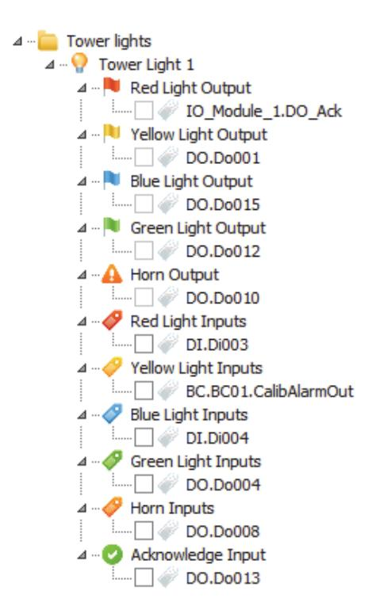

**Figure 10-9** Example Tower Light rule

# **Testing Output Activation**

| activation for specific rules.                                                          |
|-----------------------------------------------------------------------------------------|
| Checkmark the desired inputs in order to test output activation within a specific    |
| rule. When an output is activated, its adjacent box will turn green , in addition to |
| the box adjacent to the rule's description. A white box indicates inactivation.      |

Use the Run Time Logic Editor to manually activate inputs in order to test output

# **Chapter 11 User Management**

# **Default Users**

After protocol execution, the FacilityPro Environmental Monitoring System will have the users listed in **Table 11-1**.

**Table 11-1** Default users

| NOBODY | -       | - |
|--------|---------|---|
|        |         |   |
|        | CAUTION |   |

## **CAUTION**

DO NOT delete or change the following users in the Pharmaceutical Net Pro User Manager:

## **"Nobody" user**

The user **Nobody** is logged in when all others are logged out. The user **Nobody** has access to the following FacilityPro windows:

• View Main Page

# **User Groups**

There are five default user groups:

- User (Operator)
- Supervisor
- Poweruser
- Administrator
- Emergency

## **Group functions**

The functions of the default user groups are itemized in **Table 11-2**.

**Table 11-2** Default User Groups' functions

| Recipe                                  | View                    | View                    | View Create                                   | View Create                                                         |
|-----------------------------------------|-------------------------|-------------------------|--------------------------------------------------|------------------------------------------------------------------------|
|                                         |                         |                         | Modify                                           | Modify                                                                 |
| Sampling                                | View Create          | View Create          | Delete View Create                         | Delete View Create                                               |
| All Sensors Values Sampling Channels | Abort View —      | Abort View —      | Edit Delete Abort View Switch ON/OFF | Edit Delete Abort Edit Custom Fields View Switch ON/OFF |
| Alarm                                   | View                    | View                    | View                                             | View                                                                   |
|                                         |                         | Acknowledge             | Acknowledge                                      | Acknowledge                                                            |
| SamplingReport                          | View Print           | View Print           | View Print                                    | View Print                                                          |
| Report Generator                        | Export View Print | Export View Print | Export View Print                          | Export View Print                                                |
| System                                  | Export —             | Export —             | Export —                                      | Export Configure View                                            |
| Sensor Editor                           | View                    | View                    | View                                             | View                                                                   |
| Limits Editor                           | View                    | View                    | View                                             | Configure View                                                      |
| User Manager                            | —                       | —                       | —                                                | Configure View                                                      |
| Backup & Restore                        | —                       | —                       | —                                                | Create Modify Delete View                                     |
| Close (to Operating                     | —                       | —                       | —                                                | Edit View                                                           |
| System)                                 |                         |                         |                                                  |                                                                        |
| Sampling channel                        | —                       | —                       | Switch ON/OFF                                    | Switch ON/OFF                                                          |
| Change password                         | Modify                  | Modify                  | Modify                                           | Modify                                                                 |

#### **Emergency User**

An Emergency user can be created for disaster recovery access. This user is saved locally and can be used even in case of domain configuration. Emergency group functions are identical to Administrator group functions, except no additional Emergency users can be created.

# **Managi[ng Users](#page-145-0)**

M[anagement of users includ](#page-146-1)[es:](#page-146-0)

- • Create a New User on page 11-5
- • Modify a User definition on page 11-6
- • Delete a User on page 11-6

## **User Management window**

#### **>> To open the User Management window:**

**1** Click the **System** button at the b[ottom of the Pharmaceutic](#page-148-2)al Net Pro screen.

The **System management** window appears (see **Figure 12-1** on page 12-2).

**2** Click the **Users Management** [button in](#page-143-3) the **System** 

**management** window.

The **Users Management** window appears (see **Figure 11-1**).

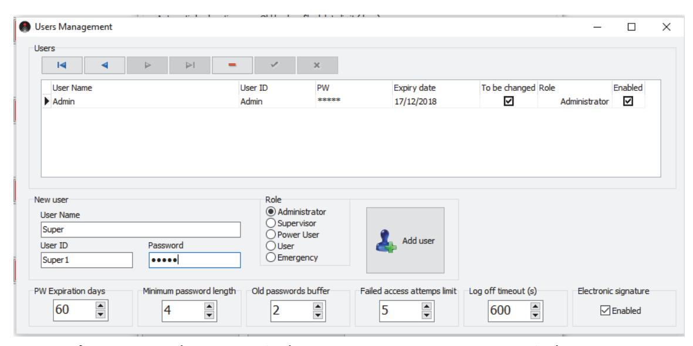

**Figure 11-1** Pharmaceutical Net Pro **Users Management** window

The components in the **Users Management** window are described in **Table 11-1** on page 11-4.

**Table 11-1 User Management** window components

|                               | each: • UserName                                                                                                                                                                                                                                                                                      |
|-------------------------------|-------------------------------------------------------------------------------------------------------------------------------------------------------------------------------------------------------------------------------------------------------------------------------------------------------------|
| New user section              | • User ID • Role • Administrator • Supervisor • Power user • User • Expiry date • To be changed field Section for creating new users. It is possible to define UserName, user ID, password and role.                                                                 |
| User security options section | Section for defining user security options, either for new or existing users.                                                                                                                                                                                                                            |
|                               | It is possible to set: • number of days for the password to expire • minimum password length • number of old password that the system remembers and that is not possible to set again • number of seconds until the auto-log off • enable or disable electronic signature. |

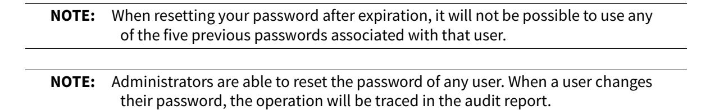

#### **Create a New User**

#### **>> To create a new user:**

- **1** Open the **Users Management** window as described on page 11-3.
- **2** Fill in all the information about the new user, including **User ID**, **User Name** and **Password**.
- **3** Define security policies including password expiration, number of passwords and so forth.
- **4** Click the **Add user** butt[on.](#page-23-2)

The **Electronic Signature** window appears.

- **5** Perform the electronic signature (see Electronic Signature on page 1-5) to save the user definition.
- **6** To close the **Users Management** window, click the **X** button at the top right corner of the window.

#### **Modify a User definition**

#### **>> To modify a user's definition:**

- **1** Open the **Users Management** window as described on page 11-3.
- **2** In the **Users** list near the top of the **Users Management** window, select the user to modify.
- **3** Modify the user's settings.
- **4** Click the green checkmar[k button.](#page-23-2)

The **Electronic Signature** window appears.

- **5** Perform the electronic signature (see Electronic Signature on page 1-5) to save the user definition.
- **6** To close the **Users Management** window, click the **X** button at the top right corner of the window.

#### **Delete a User**

#### **>> To delete a user:**

- **1** Open the **Users Management** window as described on page 11-3.
- **2** In the **Users** list near the top of the **Users Management** window, select the user to delete.
- **3** Click the **Delete** button at the top of the **Users Management** window. The **Electronic Signature** window appears.
- **4** Perform the electronic signature (see Electronic Signature on page 1-5) to save the changes to the user definition.
- **5** To close the **Users Management** window, click the **X** button at the top right corner of the window.

# **Chapter 12 System Tasks**

System tasks in Pharmaceutical [Net Pro include the following](#page-151-3):

- Access the user manage[ment interface \(see](#page-154-0) **[Chapt](#page-156-0)er 11** User Management, Managing Users on page 11-3)
- Edit sensor configuration (see Sensors [Editor on page](#page-123-3) 12-5)
- Backup and restore (see Backup a[nd Restore on page](#page-159-0) 12-8)
- [•](#page-166-0) [Shutdown and restar](#page-166-0)t the system (see page 12-10)
- Editing of digital out[put activation \(see](#page-158-0) **Chapter 10** Run Time Logic)
- • Edit particle and analog limits (see Limits Editor on page [12-13 and Analog Inputs](#page-157-0)  [Limits on p](#page-157-0)age 12-20)
- • Reset the buffer (see Reset the Buffer on page 12-12)
- • Translating entire system in other languages (see Change the Display Language on page 12-11)

# **System management Window**

Many system task windows are accessible through the **System management** window.

**>> To open the System management window:**

**1** Click the **System** button at the bottom of the FacilityPro screen.

The **System management** window appears (see **Figure 12-1**).

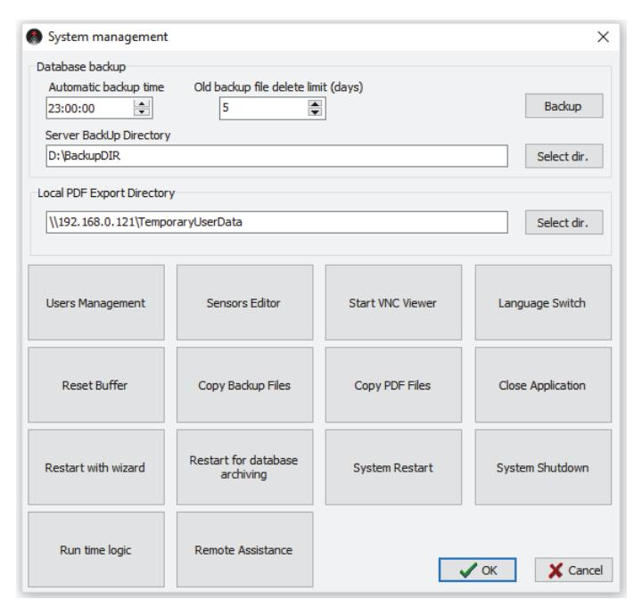

**Figure 12-1** FacilityPro **System management** window

The buttons in the **System management** window are described in **Table 12-1**.

**Table 12-1 System management** window components

| Automatic backup time             | Defines the hour, minute, and seconds for initiating an automatic backup of data.                                     |
|-----------------------------------|--------------------------------------------------------------------------------------------------------------------------|
| Old backup file delete limit      | Use the up and down arrows to set the time for the backup. Defines the number of days before backup files are         |
| (days) Server BackUp Directory | automatically deleted from the Server BackUp Directory. Type the desired backup filepath into this field or click the |
| Local PDF Export Directory        | adjacent Select dir. button. Type the desired PDF export filepath into this field or click                            |
|                                   | the adjacent Select dir. button. Click this button to open Windows Explorer to choose the                             |
| Select dir. button                | destination folder for the backup. Click this button to manually perform a database backup                            |
| Backup button                     | (see Manual backup on page 12-9). An Administrator can click this button to access the user                        |
| Users Management button           | management interface (described in Chapter 11 User Management).                                                    |
|                                   |                                                                                                                          |

**Table 12-1 System [management](#page-151-3)** window components (Continu[ed\)](#page-151-3)

|                            | Editor on page 12-5).                                                                                                        |
|----------------------------|---------------------------------------------------------------------------------------------------------------------------------|
|                            |                                                                                                                                 |
| Sensors Editor button      | Click this button to start VNC Viewer connection with the                                                                       |
|                            | Processor Module.                                                                                                               |
| Start VNC Viewer button    | An Administrator can click this button to access the                                                                            |
|                            | Translate window where the language for the displays can                                                                        |
| Language Switch button     | be selected (see Change the Display Language on page 12-11) Click this button during the Debuffering to reset the data |
|                            | buffer (see Reset the Buffer on page 12-12).                                                                                 |
| Reset Buffer button        |                                                                                                                                 |
|                            | An Administrator can click this button to copy the backup                                                                       |
| Copy Backup Files button   | files to an external hard drive.                                                                                                |
|                            | An Administrator can click this button to copy the PDF files                                                                    |
| Copy PDF Files button      | to an external hard drive.                                                                                                      |
|                            | Click this button to close the Pharmaceutical Net Pro                                                                           |
| Close Application button   | software application.                                                                                                           |
|                            |                                                                                                                                 |
|                            | Click this button to restart the machine and open the Aventino Setup Wizard (see Chapter 13 Aventino Setup Options).   |
| Restart with wizard button |                                                                                                                                 |

**Table 12-1 System management** window components (Continued)

|                                   | database and open a new database initialized with the latest data and alarms. Once the machine restarts and the                                                                                                                                                          |
|-----------------------------------|-----------------------------------------------------------------------------------------------------------------------------------------------------------------------------------------------------------------------------------------------------------------------------|
| Restart for database archiving | archiving option is available, click Archive. When the database reaches a preconfigured size, an alarm message will display notifying the user that it is time to archive. Click this button to restart the system (see Restart the System on page 12-9). |
| System Restart button             | Click this button to shut down the system (see Shutdown the System on page 12-10).                                                                                                                                                                                    |
| System Shutdown button            |                                                                                                                                                                                                                                                                             |
|                                   | Opens the Run Time Logic Editor screen. See Chapter 10 Run Time Logic for more details.                                                                                                                                                                               |
| Run time logic button             |                                                                                                                                                                                                                                                                             |
|                                   | If connected to the internet, clicking this button opens TeamViewer with the ID and password displayed for usage                                                                                                                                                         |
| Remote Assistance button          | by outside support. If not connected to the internet, clicking this button opens Windows Explorer to the C:\WINDOWS\system32 folder.                                                                                                                                  |
| OK button                         | Click to accept changes and close the System management window.                                                                                                                                                                                                          |
| Cancel button                     | Click to close the System management window.                                                                                                                                                                                                                                |

# **Sensors Editor**

The **Sensors Editor** window is used to view (Operator users) and change (Installer user only) the descriptions of individual sampling points that populate labels for data entry fields and display-only fields in other windows of the Pharmaceutical Net Pro software application.

#### **Sensors Editor window**

- **>> To open the Sensors Editor window:**
- **1** Click the **System** button at the b[ottom of the Pharmaceutic](#page-148-0)al Net

Pro screen.

The **System management** window appears (see **Figure 12-1** on page 12-2).

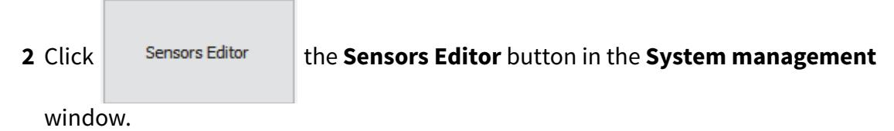

The **Sensors Editor** window appears (see **Figure 12-2**).

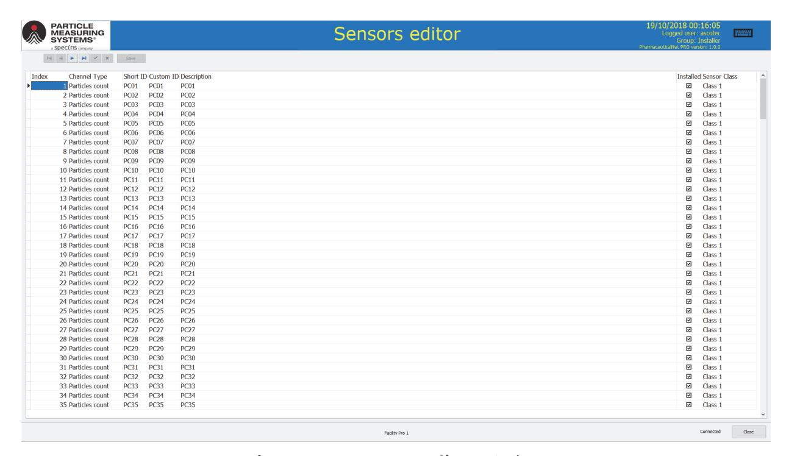

**Figure 12-2 Sensors Editor** window

The components of the **Sensors Editor** window are described in **Table 12-2**.

**Table 12-2 Sensors Editor** window components

|                        | record in the table you want to work with and to                                                    |
|------------------------|-----------------------------------------------------------------------------------------------------|
| First Record button    | "post" and save your edits. Click this button to highlight the first row in the table.        |
| Previous Record button | Click this button to highlight the previous row in the table.                                    |
| Next Record button     | Click this button to highlight the next row in the table.                                        |
| Last Record button     | Click this button to highlight the last row in the table.                                        |
| Post Edit button       | Click this button to "accept" your changes. The Electronic Signature window will appear          |
| Undo Edit button       | (see Electronic Signature on page 1-5). Click this button to "undo" your most recent edit. |
| Save button            | Click this button to save changes to the Sensors Editor window.                                  |
| Table components       |                                                                                                     |
| ID column              | The ID of a sensor.                                                                                 |
| Module Type column     | The sensor's type.                                                                                  |
| Module column          | The sensor's number.                                                                                |
| Channel column         | A channel number.                                                                                   |
| Description column     | A description of the sensor.                                                                        |
|                        | Click this button to close the Sensors Editor                                                       |
| Close button           | window.                                                                                             |

#### **>> To edit the definitions in the Sensor Editor window:**

- **1** Open the **Sensors Editor** window as described on page 12-5.
- **2** Click on the text you want to change.
- **3** Type the new text.
- **4** Click the **Post Edit** toolbar but[ton.](#page-23-2)
  - The **Save** button becomes enabled.
  - The **Electronic Signature** window appears.
- **5** Perform the electronic signature (see Electronic Signature on page 1-5) to save the changes to the **Sensors Editor** window.
- **6** Click the **Save** button.
- **7** Click the **Close** button to close the **Sensors Editor** window.

**NOTE:** Only the Installer can change the Sensor's name.

# **Backup and Restore**

The **System management** window (see **Figure 12-1**) is used to administer database backups and restore a database from a backup.

## **Daily backup configuration**

#### **>> To configure the daily backup:**

**1** Click the **System** button at the [bottom of the](#page-148-0) Pharmaceutical Net

Pro screen.

The **System management** window appears (see **Figure 12-1**).

- **2** In the **Automatic backup time** field, use the up and down arrows to set the time of day for the backup.
- **3** In the **Old backup delete limit (days)** field, adjust the number of days before the old backup files are purged from the directory.
- **4** In the **Server BackUp Directory** field, set the filepath where the backup file will be saved.
- **5** Click the **OK** button in the **System management** window.

#### **Manual backup**

- **>> To perform a manual backup:**
- **1** Open the **System management** window as described on page 12-9.
- **2** Click the **Backup** button in the **System management** window. The backup files will be saved in the filepath specified in the **Server BackUp Directory** field.

# **Copy backup files**

- **>> To copy the backup files:**
- **1** Plug a USB drive into the server module.

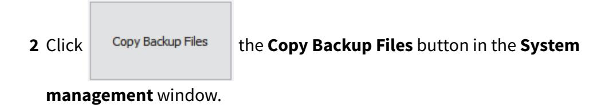

**3** From there, the file to be copied and the destination external drive can be selected.

# **Close the Pharmaceutical Net Pro software application**

An Administrator user can close the Pharmaceutical Net Pro software, and access the

Operating System by clicking the **Close Application** button in

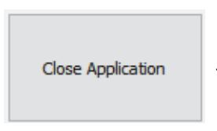

the **System management** window.

# **Restart the System**

An Administrator user can restart the entire system (Server + Clients) by clicking

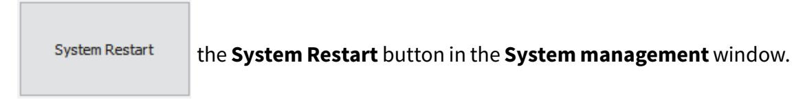

This will restart the Server machine and Pharmaceutical Net Pro software application on the Client machines.

# **Shutdown the System**

An administrator user can shut down the entire system (Server + Clients) by clicking

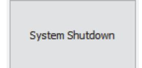

the **System Shutdown** button in the **System management** 

window.

This will result in a complete power-off for the server machine, and a shut down of the Pharmaceutical Net Pro software application on the client machines.

# **Shutdown a Disconnected Client**

When a Pharmaceutical Net Pro client is open but disconnected from the server, the only option to close it is to press the combination keys **Alt + F4** on the keyboard.

This will result in a complete power-off for the client machine.

# **Change the Display Language**

An Administrator user can select the language for the Pharm[aceutical N](#page-155-4)et Pro software displays.

#### **>> To change the display language:**

**1** Open the **System management** window as described on page 12-9.

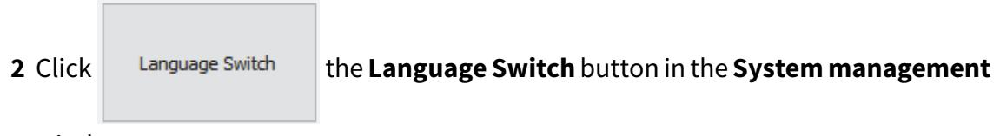

window.

The **FacilityPro Tools Language Switch** window appears (see **Figure 12-3**).

The **FacilityPro Tools Language Switch** window has options for the languages supported for the Pharmaceutical Net Pro software displays.

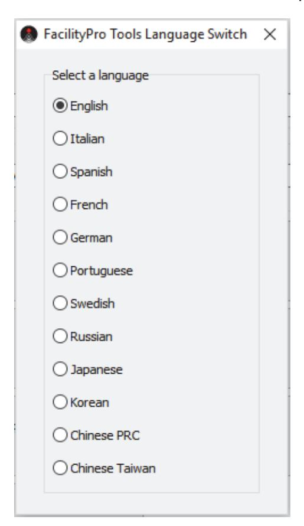

**Figure 12-3 FacilityPro Tools Language Switch** window

- **3** In the **FacilityPro Tools Language Switch** window, select the option for the desired language.
- **4** Click the X button to close the **FacilityPro Tools Language Switch** window.

**5** Click the **Restart with wizard** button in the **System** 

#### **management** window.

The wizard window appears.

**6** Use the wizard to restart the Pharmaceutical Net Pro software application.

# **Reset the Buffer**

An Administrator user can reset the data buffer while the system is debuffering.

**NOTE:** After 8 hours of buffering (collecting data with FacilityPro disconnected), the system goes in a Buffer Overrun state, and stops collecting data. In this case, once reconnected to the Pharmaceutical Net Pro server machine, in order to re-activate the connection the **Reset Buffer** button has to be [pressed.](#page-155-4)

#### **>> To reset the buffer:**

**1** Open the **System management** window as described on page 12-9.

window.

**2** Click the **Reset Buffer** button in the **System management**

# **Limits Editor**

The **Limits Editor** window can be used to view and edit the particle limits used by the system to handle warnings and alarms.

Only Administrator users have sufficient privileges to make changes to this list.

#### **Limits Editor window**

#### **>> To open the Limits Editor window:**

**1** Click the **Limits** button [at the botto](#page-159-2)m of the Pharmaceutical Net

Pro screen.

The **Limits Editor** window appears (see **Figure 12-4**).

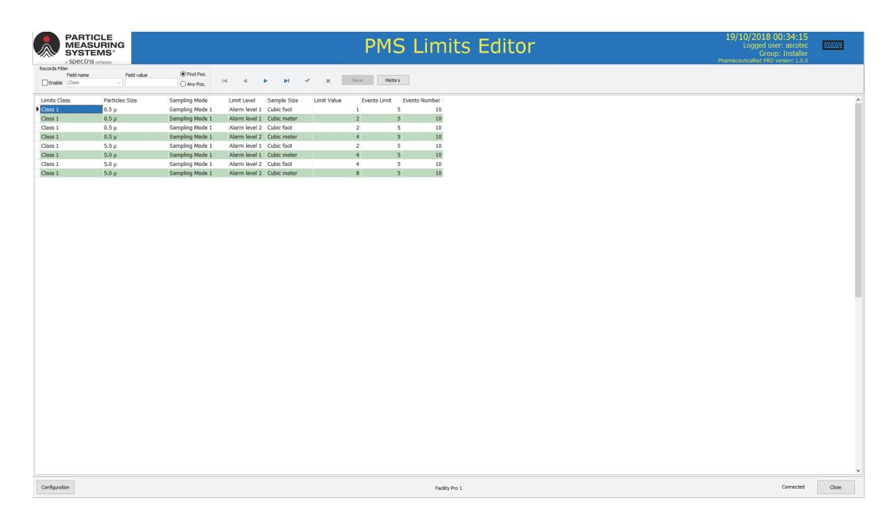

**Figure 12-4 Limits Editor** window

The components of the **Limits Editor** window are described in **Table 12-3** on page 12-14.

**Table 12-3** Components of the **Limits Editor** window

| Components             | Description                                                                                                                                                                                                                                                                              |
|------------------------|------------------------------------------------------------------------------------------------------------------------------------------------------------------------------------------------------------------------------------------------------------------------------------------|
| Records Filter area    |                                                                                                                                                                                                                                                                                          |
| Enable check box       | • When checked, enables the two fields to the right: Field name and Field value. • When not checked disables the two fields to the right: Field name and Field value.                                                                                                     |
| Field name field       | When the Enable check box is checked, use this list box to select the name of the following fields to use with a Field value to focus the values in the table to just those selections: • Limit type • Particles size • Sampling mode • Limits class |
| Field value field      | When the Enable check box is checked and a field name is selected in the Field name field, enter the value for limiting the scope of the values displayed in the table.                                                                                                      |
| First Pos. option      | When selected, positions the row pointer at the first row in the table.                                                                                                                                                                                                            |
| Any Pos. option        | When selected, positions the row pointer wherever you click on a row.                                                                                                                                                                                                              |
| Navigation buttons     | Use the arrow buttons at the top of the Limits Editor window to view a different record of the table.                                                                                                                                                                              |
| First Record button    | Click this button to view the beginning of the list.                                                                                                                                                                                                                                     |
| Previous Record button | Click this button to view the previous record of the list.                                                                                                                                                                                                                            |
| Next Record button     | Click this button to view the next record of the list.                                                                                                                                                                                                                                |
| Last Record button     | Click this button to view the last record of the list.                                                                                                                                                                                                                                |
| Save button            | Click this button to save changes made in the Limits Editor window.                                                                                                                                                                                                                   |

**Table 12-3** Components of the **Limits Editor** win[dow \(Continued\)](#page-162-0)

|                                             | History window (see Limits Editor History window on page 12-16).                                                                                                                                                                                                   |
|---------------------------------------------|--------------------------------------------------------------------------------------------------------------------------------------------------------------------------------------------------------------------------------------------------------------------------|
| Configuration button                        | (Only Administrator users). Click this button to enter the Limits Editor Configuration page.                                                                                                                                                                       |
| Values table columns Limits Class column | Class identification of particle limit sampling.                                                                                                                                                                                                                         |
| Particle Size column                        | Indicates the size of the particles monitored by                                                                                                                                                                                                                         |
|                                             | the system.                                                                                                                                                                                                                                                              |
| Sampling Mode column                        | Indicates the type of particle limits. Custom types of particle limits can be                                                                                                                                                                                         |
| Limit Type column                           | configured. The system has the default types: • At Rest • Operational • Alert • Alarm                                                                                                                                                         |
| Limit Value column                          | Value set for each limit.                                                                                                                                                                                                                                                |
| Cubic Meter Alarm                           | • When checked, the alarm is set per cubic                                                                                                                                                                                                                            |
| Cubic Meter Type column                     | meter. • When not checked, the alarm is set per cubic foot. • Rolling – The system performs a floating                                                                                                                                                    |
| Predictive column                           | window of data per minute to calculate counts per cubic meter (fast trend). • Reset – When the sampling reaches the cubic meter, the system resets the count (total count). • CF X 35 – The system multiplies the value of the cubic foot by 35. |
| Interval column                             | When this box is checked , the algorithm to compute predictive alarms per cubic meter is enabled. The number of samples (Interval) occurring in                                                                                                              |
|                                             | which the number of events is out of bounds (Number)                                                                                                                                                                                                                  |
| Number column                               | The number of events out of bounds.                                                                                                                                                                                                                                      |

### **Limits Editor History window**

**>> To open the Limits Editor History window:**

**1** Click the **Limits** button [at the bottom of the Pharm](#page-159-2)aceutical Net

Pro screen.

The **Limits Editor** window appears (see **Figure 12-4** [on page](#page-162-1) 12-13).

**2** Click the **History** button at the top of the **Limits Editor** window. The **Limits Editor History** window appears (see **Figure 12-5**).

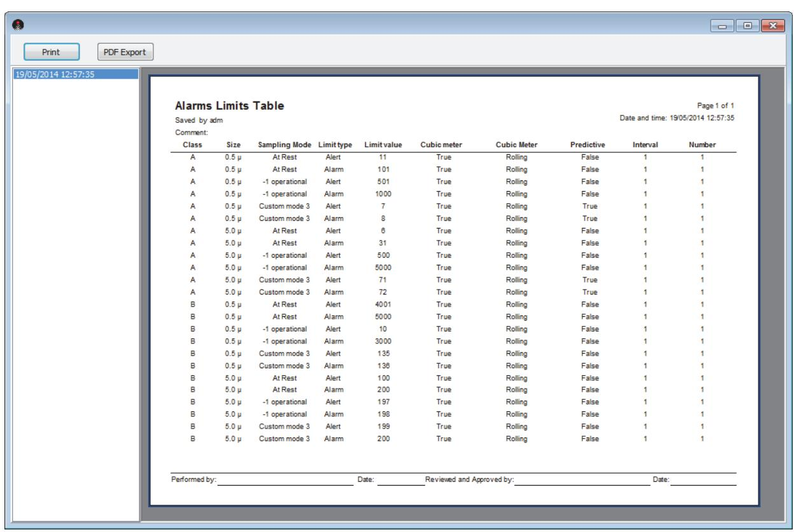

**Figure 12-5 Limits Editor History** window displayed in front of the **Limits Editor** window

**3** [To close t](#page-163-0)he **Limits Editor History** window, click the **X** button at the top right corner of the window.

The components of the **Limits Editor History** window are described in **Table 12-4** on page 12-17.

**Table 12-4** Components of the **Limits Editor History** window

| Components                  | Description                                                                                                                                                                                                                                                                                                            |
|-----------------------------|------------------------------------------------------------------------------------------------------------------------------------------------------------------------------------------------------------------------------------------------------------------------------------------------------------------------|
| Print button                | Click this button to open a Print dialog box where you can send a copy of the listing to the printer.                                                                                                                                                                                                            |
| PDF Export button           | Click this button to export the history in PDF format.                                                                                                                                                                                                                                                                 |
| Dates list                  | Click on a date to populate the Alarms Limits table with information from that date. The date you selected displays be low the table title.                                                                                                                                                                      |
| Alarms Limits table columns |                                                                                                                                                                                                                                                                                                                        |
| Class column                | Class identification of particle limit sampling.                                                                                                                                                                                                                                                                       |
| Size column                 | The particle size.                                                                                                                                                                                                                                                                                                     |
| Sampling Mode column        | The Sampling mode. For example: • At Rest • Operational                                                                                                                                                                                                                                                    |
| Limit type column           | Alarm or Alert.                                                                                                                                                                                                                                                                                                        |
| Limit value column          | Value of the limit.                                                                                                                                                                                                                                                                                                    |
| Cubic Meter Alarms column   | True or False.                                                                                                                                                                                                                                                                                                         |
| Cubic Meter Type column     | • Rolling – The system performs a floating window of data per minute to calculate counts per cubic meter (fast trend). • Reset – When the sampling reaches the cubic meter, the system resets the count (total count). • CF X 35 – The system multiplies the value of the cubic foot by 35. |
| Predictive column           | True or False.                                                                                                                                                                                                                                                                                                         |
| Interval column             | The interval value.                                                                                                                                                                                                                                                                                                    |
| Number column               | The number of events out of bounds.                                                                                                                                                                                                                                                                                    |

#### **Limits Editor Configuration window**

#### **>> To open the Limits Editor Configuration window:**

**1** Click the **Limits** button at the bottom [of the Pharmaceutical Net](#page-159-2) 

Pro screen.

The **Limits Editor Configuration** window appears (see **Figure 12-4** on page 12-13).

**2** Click the **Configuration** button at the top of the **Limits Editor**  window.

The **Limits Editor Configuration** window appears (see **Figure 12-6**).

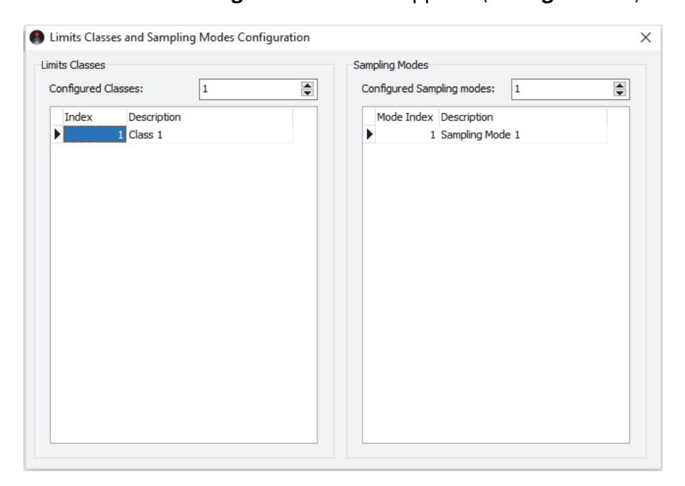

**Figure 12-6 Limits Editor Configuration** window displayed in front of the **Limits Editor** window

#### **>> To enable a new sensor class:**

- **1** In the **Limits Classes** pane of the **Limits Editor Configuration** window (see **Figure 12-6** on page 12-18), place a check mark in the **Enabled** column for the desired class.
- **2** The name of the class can be modified by typing the new name in the **Description** field, then pressing the **Enter** key.
- **3** To close the **Limits Editor Configuration** window, click the **X** button at the top right corner of the window.

#### **>> To enable a new sampling mode:**

- **1** In the **Sampling Modes** pane of the **Limits Editor Configuration** window (see **Figure 12-6** on page 12-18), place a check mark in the **Enabled** column for the desired sampling mode.
- **2** The name of the sampling mode can be modified by typing the new name in the **Description** field, then pressing the **Enter** key.
- **3** To close the **Limits Editor Configuration** window, click the **X** button at the top right corner of the window.

# **Analog Inputs Limits**

Use the **Analog Inputs Limits** to change analog sensor limits.

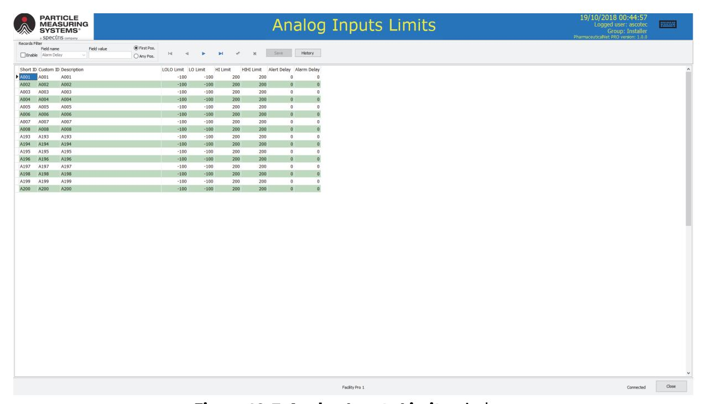

**Figure 12-7 Analog Inputs Limits** window

The components of the **Analog Inputs Limits** window are described in **Table 12-5**.

**Table 12-5 Analog Inputs Limits** window view components

| Short ID column         | Displays the output's system identification number.                                                                                                                                                                                                 |
|-------------------------|-----------------------------------------------------------------------------------------------------------------------------------------------------------------------------------------------------------------------------------------------------|
| Custom ID column        | Displays the output's user-specified identification number.                                                                                                                                                                                         |
| Description column      | Displays a description of the output.                                                                                                                                                                                                               |
| Alert Limits columns    |                                                                                                                                                                                                                                                     |
| LO HI Delay (sec) | Displays the minimum value set for the output's range before the alert is triggered. Displays the maximum value set for the output's range before the alert is triggered. Displays the number of seconds delay before the alert is triggered. |
| Alarm Limits columns    |                                                                                                                                                                                                                                                     |
| LOLO HIHI            | Displays the minimum value set for the output's range before the alarm is triggered. Displays the maximum value set for the output's range before the alarm is triggered.                                                                        |
| Delay (sec)             | Displays the number of seconds delay before the alarm is triggered.                                                                                                                                                                                 |

**Records Filter**

**Table 12-5 Analog Inputs Limits** window view components (Continued)

| Component                   | Description                                                                                                                    |
|-----------------------------|--------------------------------------------------------------------------------------------------------------------------------|
| Enable box                  | Check this box to enable the user-specified search criteria.                                                                   |
|                             | Use the drop down list of Field names (i.e., LOLO Limit, Description, etc.) to facilitate your search to a specific column. |
| Field Name drop down        |                                                                                                                                |
|                             | Type the numeric value of the desired field here.                                                                              |
| Field value                 |                                                                                                                                |
| First Pos.                  | Use this button to search only for the first positive search result.                                                           |
| Any Pos.                    | Use this button to search for all positive search results.                                                                     |
| View First Row button    | Click this button to view the first row in the table.                                                                          |
| View Previous Row button | Click this button to view the previous row in the table.                                                                       |
| View Next Row button     | Click this button to view the next row in the table.                                                                           |
| View Last Row               | Click this button to view the last row in the table.                                                                           |
| button                      |                                                                                                                                |
| Save button                 | Click this button to save any changes made in the table.                                                                       |
|                             | Click this button to view a history of previous changes.                                                                       |
| History button              |                                                                                                                                |

#### **>> To change the Custom ID, Description, Limits and Delays:**

Double-click on the specific field you want to change and enter the desired value. The value will be changed after completing the Electronic Signature.

This page is intentionally left blank.

# **Chapter 13 Aventino Setup Options**

[The options of th](#page-180-0)e Aventino Wizard includes the following:

- • Setting up a new instal[lation of Pharm](#page-180-1)aceutical Net Pro on page 13-2
- • Upgrading the current version of P[harmaceutical N](#page-181-0)et Pro with a new version on page 13-12
- • Restoring a backup file on page [13-12](#page-181-1)
- • Modifying the current configuration on page 13-13
- • Restoring a FacilityPro processor on page 13-13

# **Opening the Aventino Wizard Application**

#### **>> To open the wizard:**

**1** At the bottom of the Pharmaceutical Net Pro screen, click

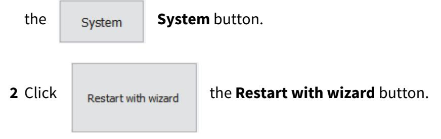

- **3** Perform the **Electronic Signature**.
- **4** The PC will restart and launch the Aventino Wizard application (see **Figure 13-1** on page 13-2.

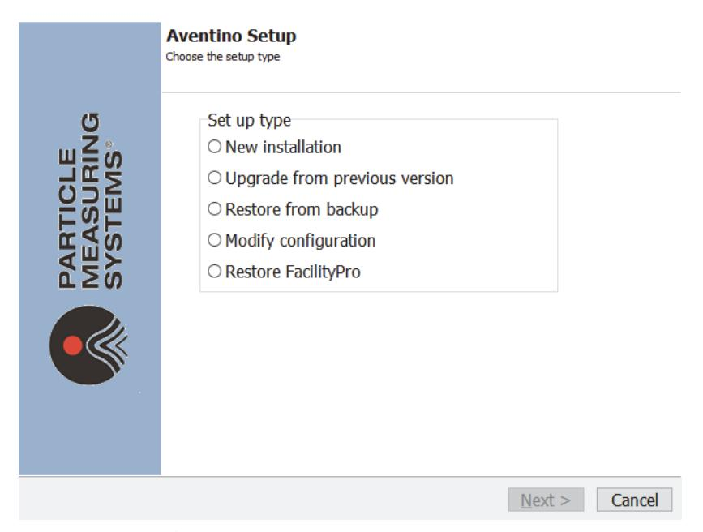

**Figure 13-1** Aventino Setup Wizard

# **New Installation**

Choosing the **Set up type** option **New Installation** allows the user to create a new configuration for the FacilityPro processor. This includes creating a new default installer username and password, entering the IP address of the processor(s), and specifying the number of s[amplers.](#page-171-0)

#### **>> The steps of the new installation process are as follows:**

- **1** After choosing **New installation** from the Aventino Setup Wizard, enter new default installer credentials (see **Figure 13-2** on page 13-3).
- **2** Click **Next**.

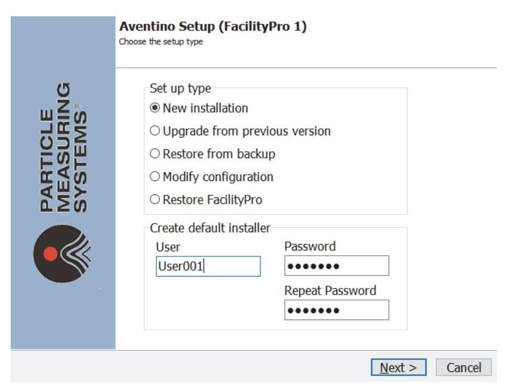

**Figure 13-2** New installation and enteri[ng user crede](#page-171-1)ntials

- **3** Select the number of processor modules in the system (one or two).
- **4** Enter the IP address(es) foreach processor (see **Figure 13-3**).
- **5** Click **Next**.

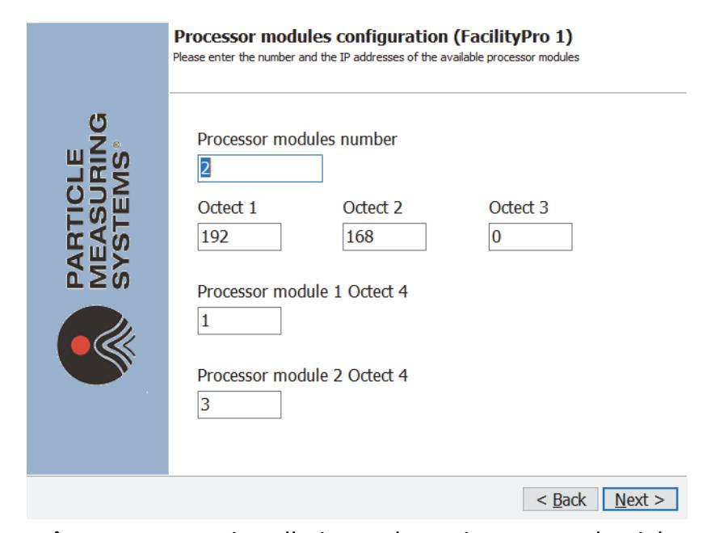

**Figure 13-3** New installation and entering user credentials

- **6** Depending on your license, the processor module type will already be selected on the next screen (see **Figure 13-4**). If you are using an old pneumatic/sensor module, checkmark the box beside **Legacy pneumatic modules**.
- **7** Click **Next**.

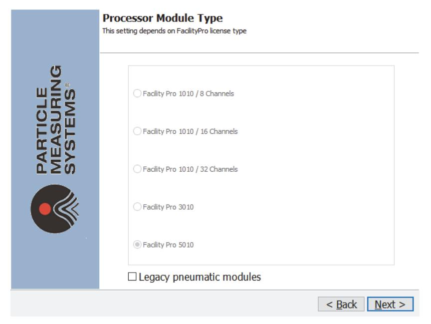

**Figure 13-4** Processor module type selected from license

- **8** Click **Restore** to initialize the database with the processor (see **Figure 13-5**).
- **9** Click **Next**.

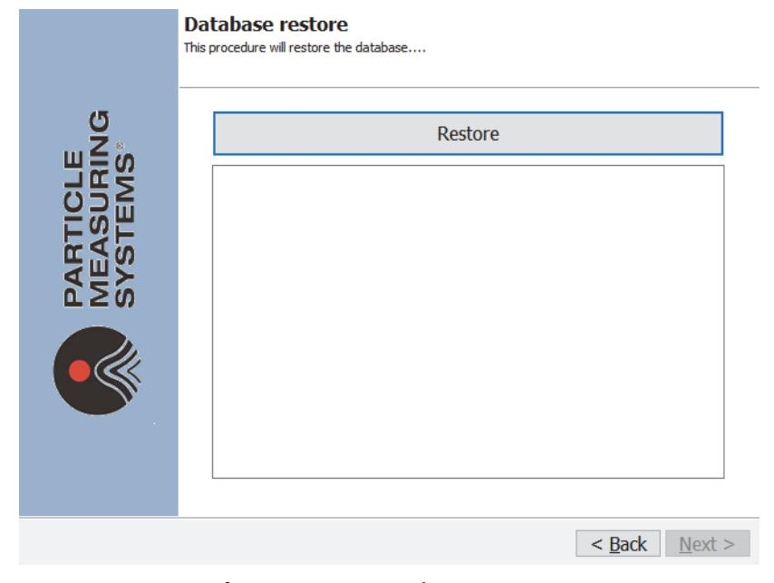

**Figure 13-5** Database restore

- **10** Enter the hardware to be used with the system. This includes all modules, pumps and sensors (see **Figure 13-6**).
- **11** Click **Next**.

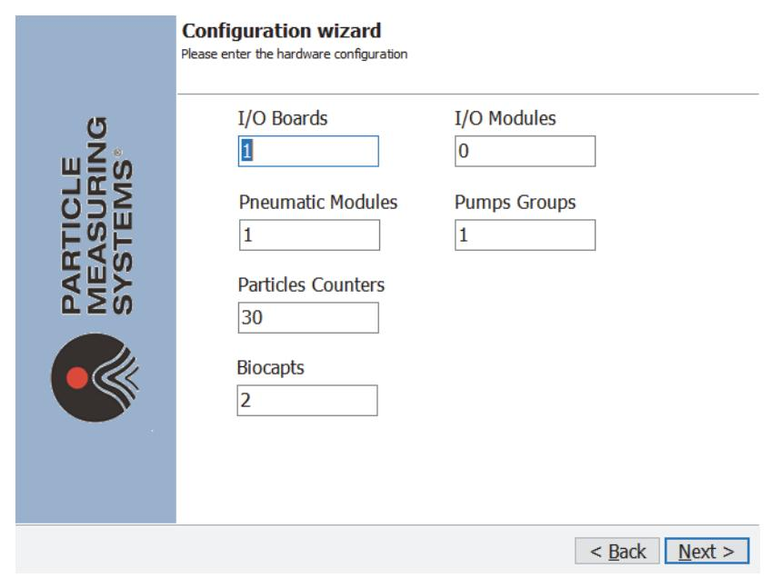

**Figure 13-6** System hardware configuration

- **12** Enter the system parameters, including how often sample readings will be read, number of classes to differentiate samplers and the number of sampling modes (see **Figure 13-7**).
- **13** Click **Next**.

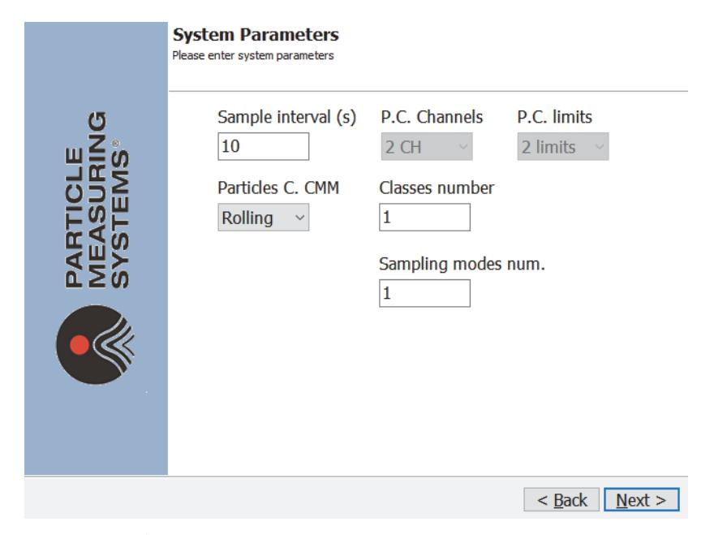

**Figure 13-7** System sampling parameters

- **14** Enter the number of days between calibration alerts and alarms . Checkmark every associated **Enabled** box for each alarm that you want to apply (see **Figure 13-8**). The default number of days for alarms amounts to once per year. The default number of days for alerts is one month before the alarm.
- **15** Click **Next**.

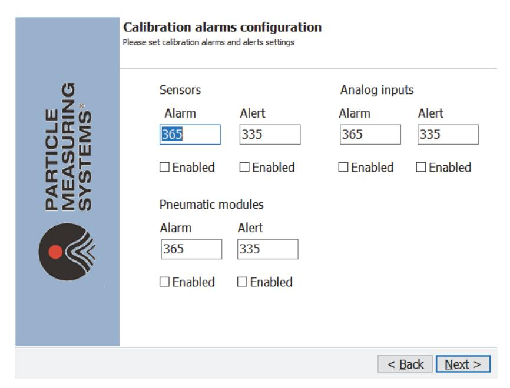

**Figure 13-8** Sampler [calibration c](#page-174-1)onfiguration

- **16** If using legacy pneumatic/sensor modules, select the type of module (biological or particle counter) for each one (see **Figure 13-9**).
- **17** Click **Next**.

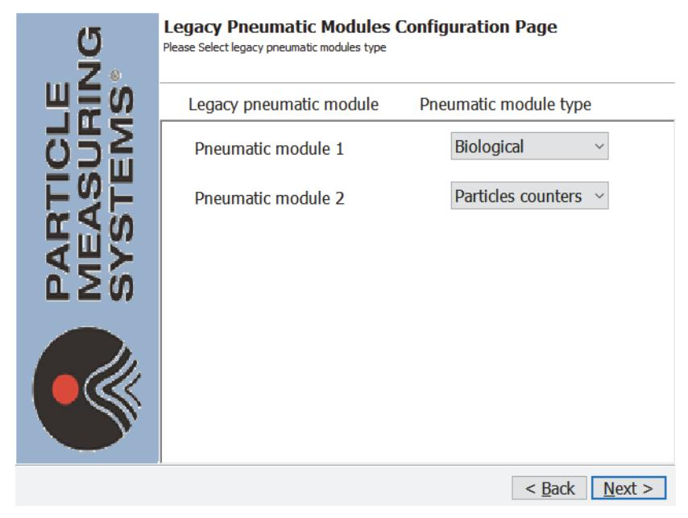

**Figure 13-9** Legacy pneumatic/sensor module configuration

**18** Configure module channels to be associated with individual samplers (see **Figure 13-10**).

Select the channel and the samplers and click **Connect**. The light blue arrow indicates connection/disconnection is available. The gray arrow indicates no connection/disconnection is available for the components selected.

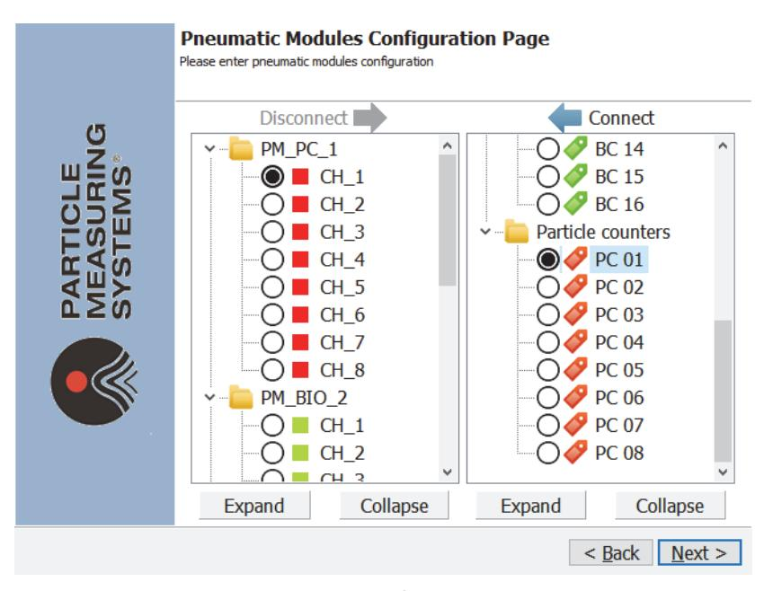

**Figure 13-10** Pneumatic module configuration with individual samplers

- **19** To disconnect a sampler, click its associated tag in the left-hand scrolling pane and click **Disconnect**.
- **20** Click **Next**.

- **21** Set the IP address and associated class for each sampler (see **Figure 13-11**).
- **22** Click **Next**.

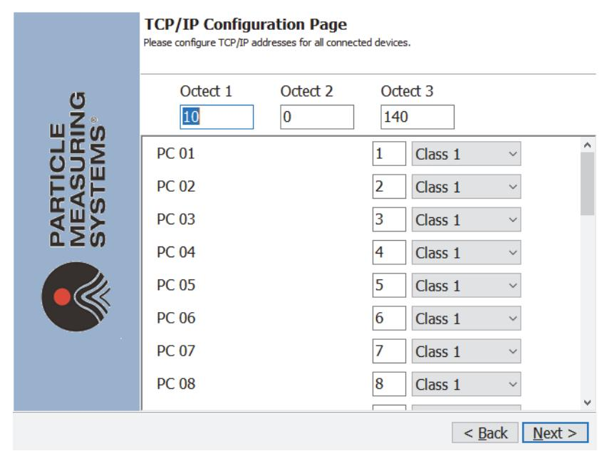

**[Figure 13-11](#page-176-1)** Pneumatic module configuration with individual samplers

- **23** Select the pump group number associated with each pneumatic module (see **Figure 13-12** on page 13-8). The number available is determined with the **Pumps Groups** field in step 10.
- **24** Click **Next**.

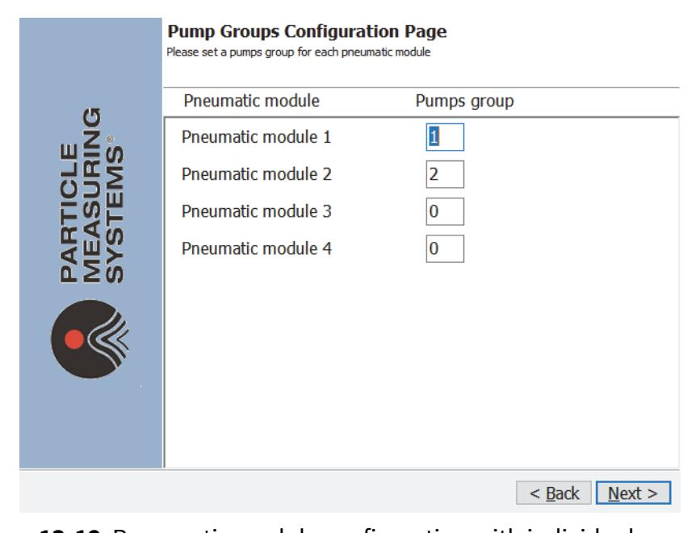

**Figure 13-12** Pneumatic module configuration with individual samplers

**25** Set the number of pumps in each pump group (see **Figure 13-13**).

#### **26** Click **Next**.

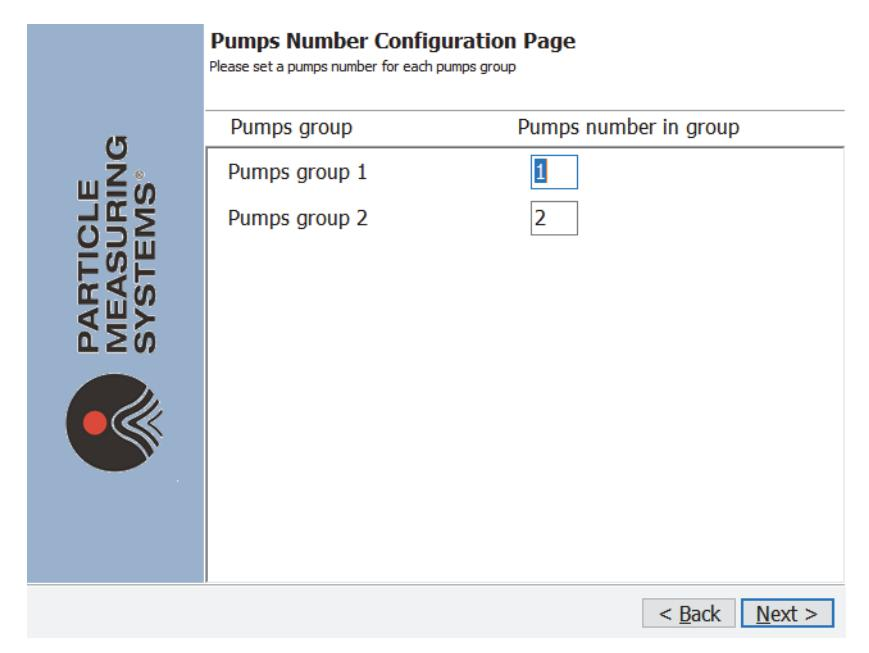

**Figure 13-13** Setting number of pumps in gr[oup](#page-177-1)

- **27** Associate each I/O board with an I/O module (number of each set in step 10).
- **28** Set how many analog boards are in each I/O module (see **Figure 13-14**).
- **29** Click **Next**.

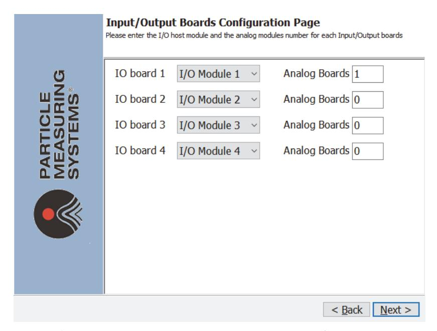

**Figure 13-14** I/O board and module configuration

**30** The **Configuration Save Page** summarizes all settings made to the system in the previous steps (see **Figure 13-15**). Click **Next**.

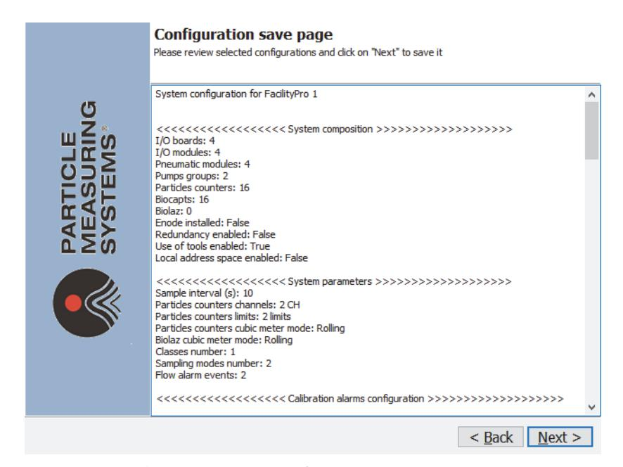

**Figure 13-15** Configuration Save Page

- **31** Click **Transfer**. The FacilityPro processor restarts with the new configuration (see **Figure 13-16**).
- **32** Click **Next** once progress bar is complete.

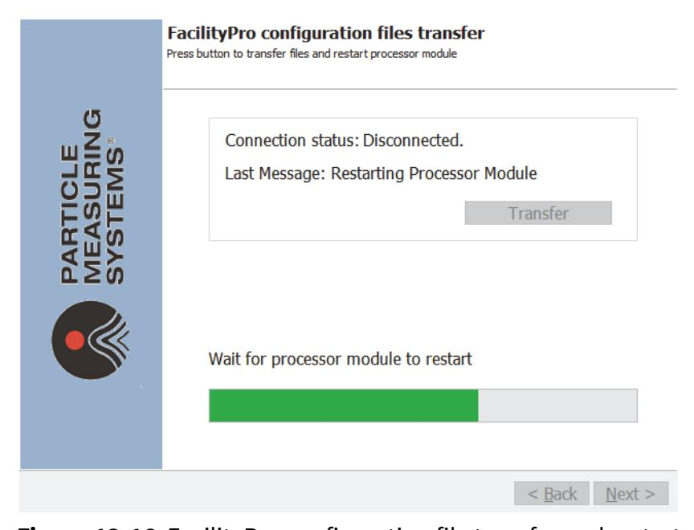

**Figure 13-16** FacilityPro configuration file transfer and restart

**33** Click **Initialize** to reset tags and alarms with the configured settings (see **Figure 13-17**).

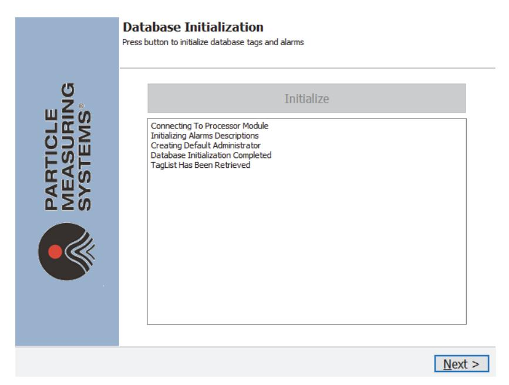

**Figur[e 13-17](#page-179-1)** Database initialization

- **34** Click **Next**.
- **35** Click **Create Pages**. The Pharmaceutical Net Pro software pages are created with the configured settings (see **Figure 13-18**).
- **36** Click **Finish**. The PC restarts.

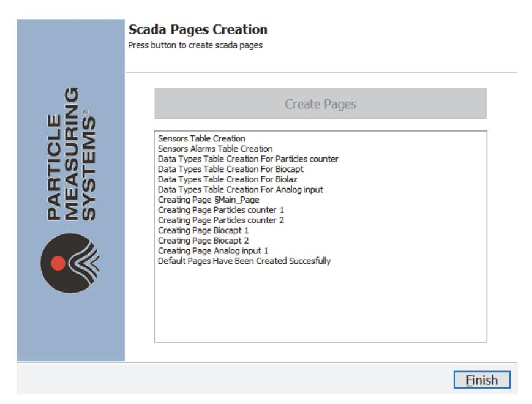

**Figure 13-18** Creation of Pharmaceutical Net Pro software pages

# **Upgrade from Previous Version**

Contact your Particle Measuring Systems representative in the event this action needs to be performed.

# **Restore from Backup**

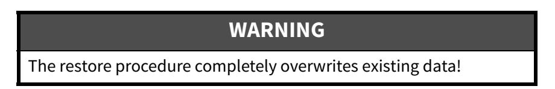

#### **>> To perform a restore of the database:**

- **1** In the Aventino Wizard Setup window (see **Aventino Setup Wizard** on page 13-2), select **Database Restore**.
- **2** Click **Restore**. Select the fil[e to restore fro](#page-180-2)m the specified directory and confirm.
- **3** Click Next.
- **4** Click **Test Availability** (see **Figure 13-19**). If a processor module is connected and the license matches OPCLink, you can proceed to the following step by clicking **Next**.

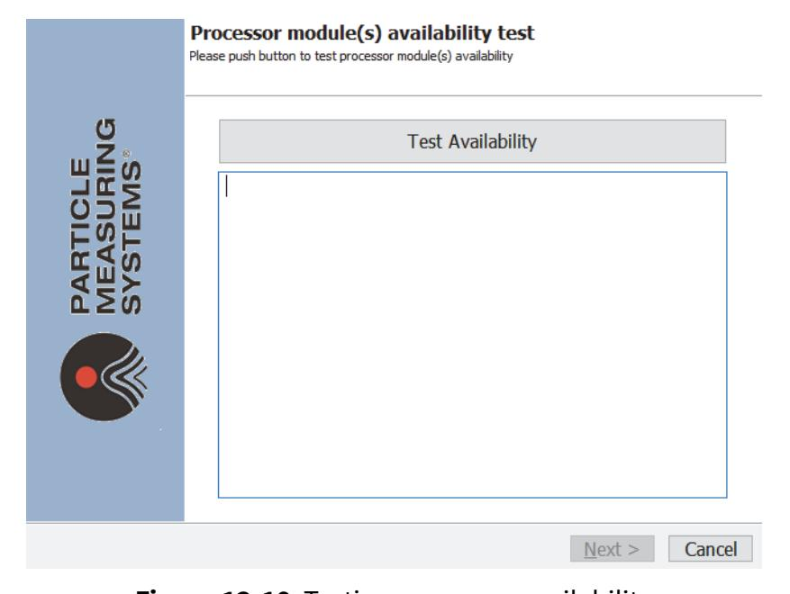

**Figure 13-19** Testing processor availability

- **5** Click **Transfer**. The FacilityPro processor restarts with the new configuration (see **Figu[re 13-16](#page-179-0)**).
  - **6** Click **Next** once the progress bar is complete.
- **7** Click **Initialize** to reset tags and alarms with the configured settings (see **Figure 13-17**).

**8** Click **Finish** to initialize the database. The PC restarts.

# **Modify Configuration**

This option allows the user to see current settings of the configuration and make adjustments. Steps are identical to **New Installation** on page 13-2.

# **Restore FacilityPro**

- **>> To restore the FacilityPr[o processor to](#page-180-2) a previous version:**
- **1** Choose **Restore FacilityPro** from the Aventino Setup Wizard (see **Figure 13-1**).
- **2** Click **Next**.
- **3** Click **Test Availability** (see **Figure 13-19**). If a processor module is connected and the l[icense match](#page-178-1)es OPCLink, you can proceed to the following step by clicking **Next**.
- **4** Click **Transfer**. The FacilityPro processor restarts with the new configuration (see **[Figure 13-16](#page-179-0)**).
- **5** Click **Next** once the progress bar is complete.
- **6** Click **Initialize** to reset tags and alarms with the configured settings (see **Figure 13-17**).
- **7** Click **Finish** to initialize the database. The PC restarts.

This page is intentionally left blank.

# **Appendix A Statistical Data Analyzer**

The Statistical Data Analyzer is an optional data analysis application. Functions of the software include:

- • Imports CSV files provided by History Automation
- Visualizes data in chart form for statistical analysis
- Reports large data volumes for processing
- Extracts processed data in CSV format once per day

# **Licensing the Application**

Upon first running the application, you will be asked to activate Statistical Data Analyzer. You will need a valid License ID and Password.

# **Running the Application**

**StatisticalDataAnalyzer.exe** is an external tool opened from the Aventino folder. The filepath should be similar to the following:

C:\Aventino\StatisticalDataAnalyzer.exe

Once the executable file has been located, double click it or right click and choose "Open".

# **Application Window**

Once opened, the following graphical interface appears:

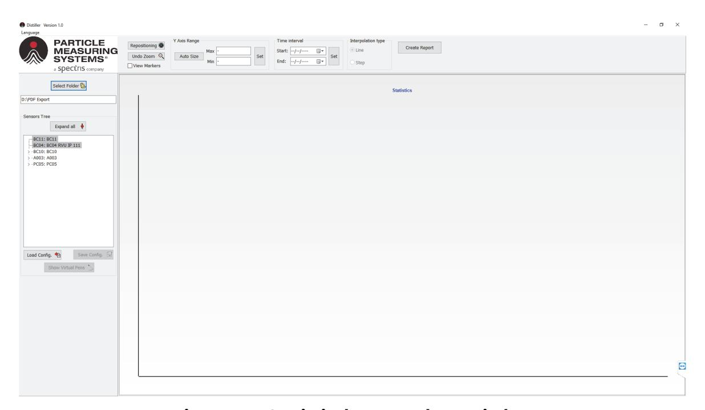

**Figure A-1 Statistical Data Analyzer window**

In **Figure A-1**, a CSV data file has been automatically chosen by the application. Sensors highlighted in gray within the **Sensors Tree** area have no associated sampling data.

# **Loading CSV Files**

A target folder for saved CSV data files is chosen by clicking **Select Folder**. These CSV files are generated by the History Automation Service and loaded individually to the Statistical Data Analyzer.

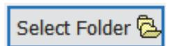

**Figure A-2 Select Folder button**

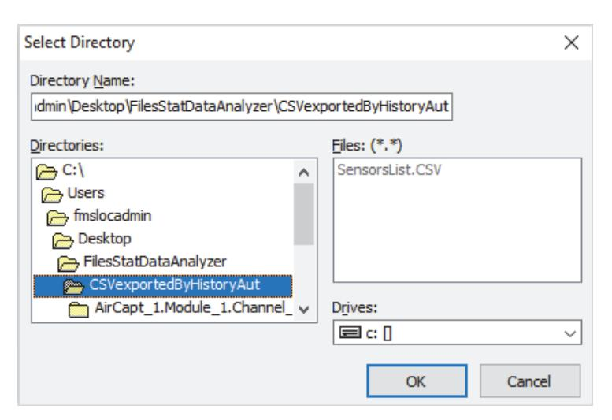

**Figure A-3 Select Folder window**

In the **Select Folder** window (see **Figure A-3**), a filepath can be typed into the **Directory Name** field, or the **Directories** pane can be used to locate the filepath. Folders can be expanded or collapsed by double-clicking them. The selected drive can be changed with the **Drives** drop-down pane. Files found in the selected directory are shown in the **Files** pane.

The loaded CSV file will always have the name "SensorsList.csv", and located in the same directory as the sensor module CSV file folders. For example:

• "AirCapt\_1.Module\_1.Channel\_1"

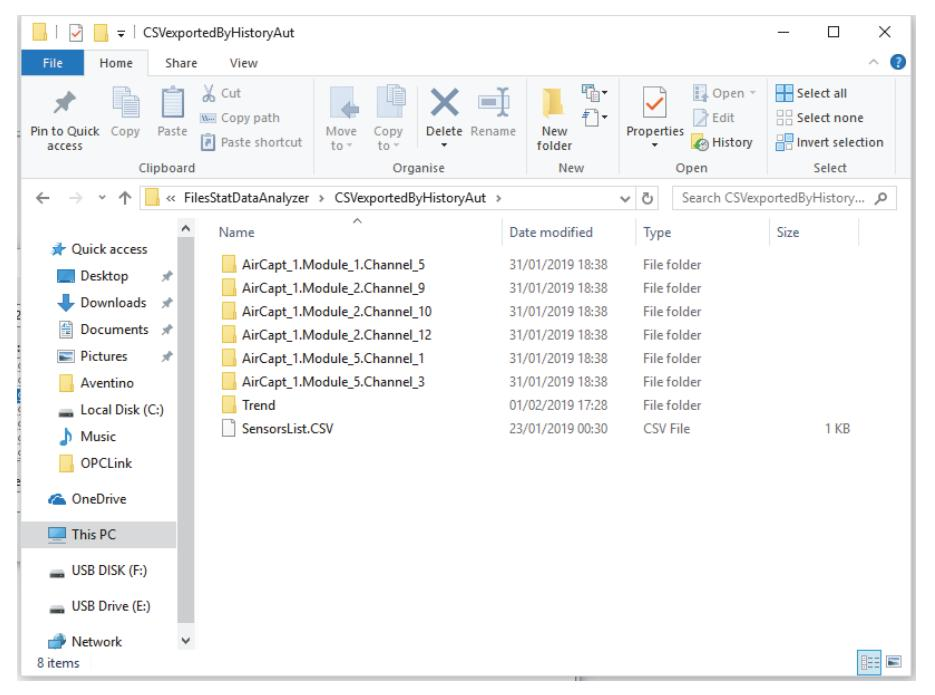

**Figure A-4 SensorsList.CSV directory**

# **Display Configuration**

Beneath **Sensors Tree**, click the **Expand All** button to display all Global Stat options (Average, Minimum, Maximum and Standard Deviation) for each sensor.

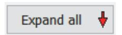

**Figure A-5 Expand All button**

BioCapt sensors (BC) have both flow and volume global stats, and analog sensors (A) have real value global stats. Particle counter sensors (PC) have cubic feet and cubic meter global stats in addition to stats associated with user-defined sampling modes. The selection(s) made by clicking once will appear in bold and display in the graph.

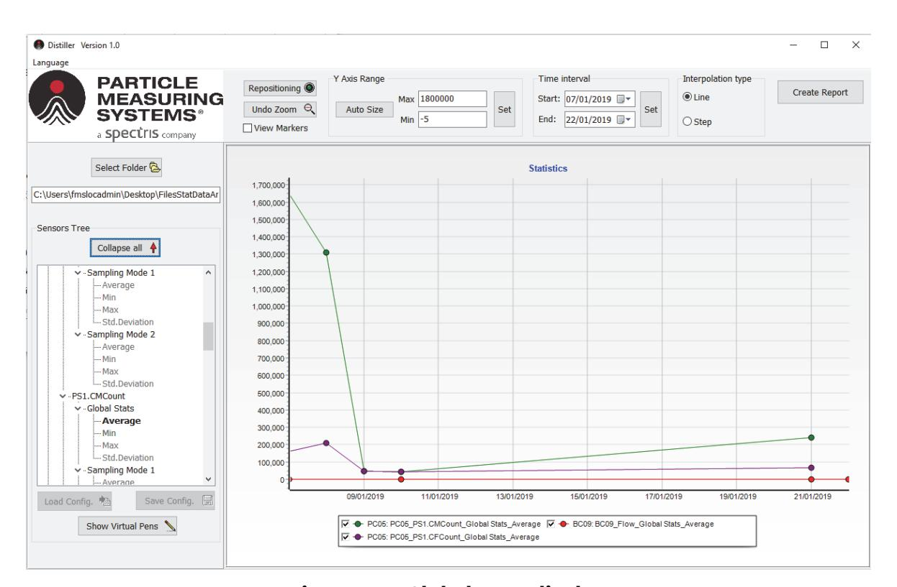

**Figure A-6 Global stats display**

Clicking on the individual global stats for a sensor generates a graph in the **Statistics** display with the chosen stats.

# **Axis Adjustment**

The **Time interval** is automatically chosen to include all days with data. The **Start** and **End** date can be adjusted with the calendar menu.

The x- and y-axis ranges are automatically set for best-fit to include all data points. The yaxis can be adjusted to limit the view with the **Max** and **Min** fields, and implemented by clicking **Set**. Clicking **Auto Size** resets the y-axis to best-fit.

## **Zoom**

By dragging the right mouse button over the graph, the area selected can be zoomedto cover the total display. Clicking **Undo Zoom** resets the display to regular magnification.

Data values can be zoomed in to the thousandth decimal value.

# **Interpolation**

Data display for Average stats is automatically set to include the **Line** interpolation type (shown in **Figure A-6**). An example of the Step interpolation type is shown in **Figure A-7**.

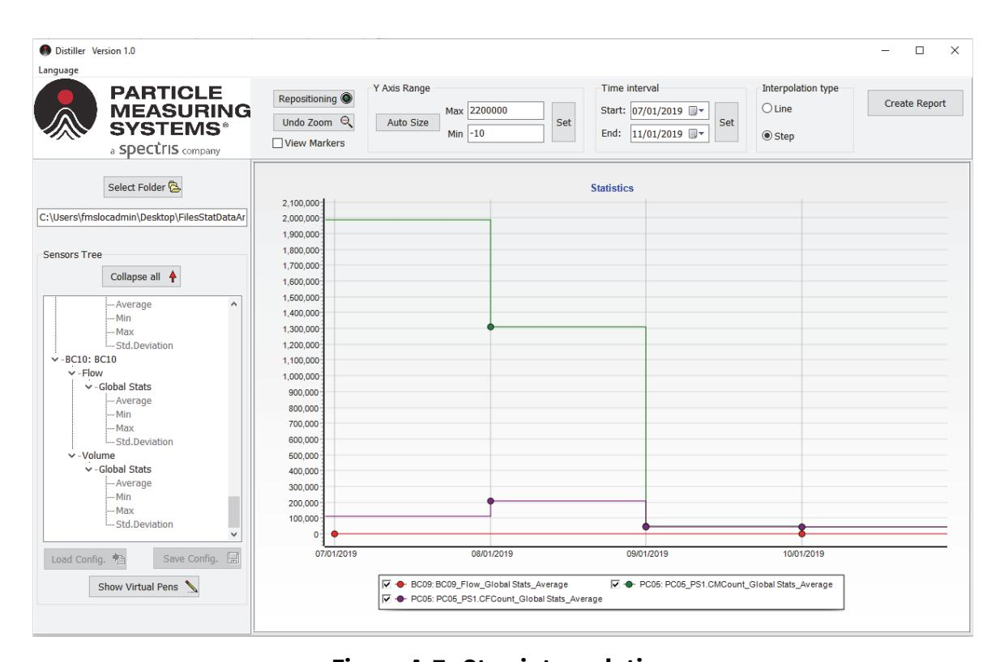

**Figure A-7 Step interpolation**

Min, Max and Std. Deviation values will be displayed as discrete points with no interpolation.

# **Saving a Configuration**

After making the desired selections to adjust the display, the configuration can be saved for later viewing by clicking the **Save Config.** button. Only one configuration can be saved at once.

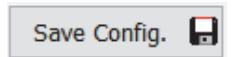

**Figure A-8 Save Config. button**

The **Repositioning** button resets all adjustments made to the saved configuration after loading.

# **Loading a Previous Configuratoin**

The previous configuration saved can be loaded to the Statistical Data Analyzer by clicking the **Load Config.** button.

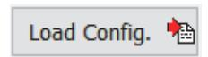

**Figure A-9 Load Config. button**

# **Virtual Pens**

Horizontal lines can be added to the display to represent alert or action limits. These lines are not part of configuration, but will be generated with the report. To add a line, click the **Show Virtual Pens** button.

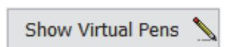

**Figure A-10 Show Virtual Pens button**

The **Virtual Pens** window appears. The previous configuration can be loaded with the **Load** button and will automatically display configuration parameters for editing. After making adjustments or creating a new configuration, the virtual pens can be saved by clicking **Save**. Click **Reset** to remove all parameters.

Click **Enable** to display the virtual pen in the graphical display. To make any adjustments to the pen (Name, Value and Color), ensure the pen is disabled (unchecked) first.

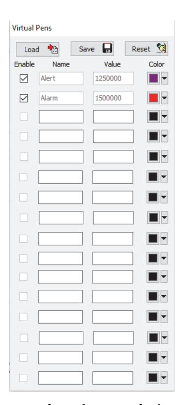

**Figure A-11 Virtual Pens window**

# **Markers and Sensor Display Toggling**

Markers for each data point can be toggled on and off with the **View Markers** checkbox. Individual sensor data that has been selected in the **Sensors Tree** can be toggled on and off by clicking the associated checkbox in the legend area of the Statistics display.

# **Daily Sensor Chart**

A daily sensor chart window can be opened by holding the CTRL button and clicking a data point or interpolation line in the Statistics area. The new window displays the total sensor data for the day associated with the data point.

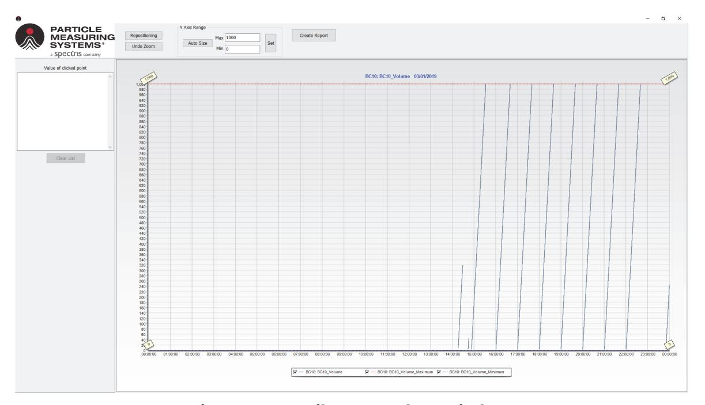

**Figure A-12 Daily sensor chart window**

Inside this new window, data points can be clicked on and their associated tag name, timestamp and value displayed in the **Value of clicked point** display area. Both this window's graphical display, and the Statistics display can be saved as a report.

# **Creating a Report**

A PDF file containing the Statistics display can be generated by clicking the **Create Report** button. Inside the PDF, the Report Title, comments and name of the user printing the report can be added to the empty fields. After all text additions have been made, the PDF can be saved and exported to a predetermined filepath using hte **Export** button located in the top left corner of the window. The filepath is chosen with the History Automation Configuration tool (see **History Automation Configuration** on page 7-13).

# **Language**

The display language can be adjusted to any of the languages supported by FacilityPro SMART NG (see **Change the Display Language** on page 11-11).

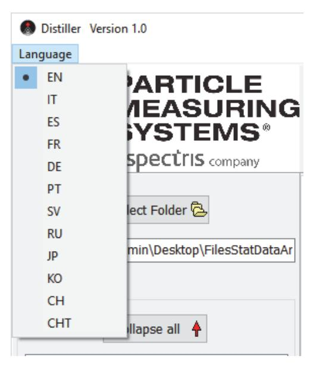

**Figure A-13 Display language adjustment**

# **Index**

#### **A**

Abort button [Sampling Editor window 5-2,](#page-46-1) [5-5](#page-49-4) [aborting sampling 5-5](#page-49-5) [Ack All button 7-2](#page-64-1) [Ack selected button 7-2](#page-64-2) [acknowledge alarm 7-1](#page-63-6) [steps 7-3](#page-65-2) [Add user button 11-5](#page-145-1) [ADMINISTRATORS group 11-2](#page-142-2) [alarms 7-1](#page-63-6) [acknowledge 7-1](#page-63-6) [steps 7-3](#page-65-2) [set particle limits 12-13](#page-159-4) [trigger limits, setting 12-13](#page-159-4) [Alarms button 3-3,](#page-35-1) [7-1](#page-63-7) [Alarms window 7-1](#page-63-8) [components 7-2](#page-64-3) All Values window [components 12-20](#page-166-4) [Analog Limits Editor 12-20](#page-166-3) [Analog Sensors button 3-3,](#page-35-2) [6-9](#page-61-3) [Analog Sensors window 6-9](#page-61-4) [components 6-10](#page-62-1) Audit report [electronic signature events 8-1,](#page-67-7) [8-25,](#page-91-3)  [8-32,](#page-98-1) [8-39,](#page-105-3) [8-41](#page-107-3) [automatic backup time, setting 12-2](#page-148-3) [Available Tags pane 9-2](#page-120-2) [Aventino Wizard 13-1](#page-169-3) [modifying the current configuration 13-1](#page-169-4) [new installation 13-1](#page-169-5) [restoring a backup file 13-1](#page-169-6) [restoring a FacilityPro processor 13-1](#page-169-7) [upgrading 13-1](#page-169-8)

#### **B**

[back up a database 12-8](#page-154-2) backup [copy files 12-9](#page-155-5) [daily, configuring 12-8](#page-154-3) [manual 12-9](#page-155-6) [Backup button 12-2,](#page-148-4) [12-9](#page-155-7) [backups of database 12-8](#page-154-2) biological modules [sampling point information 6-7](#page-59-2) [Biological Sensors button 3-3,](#page-35-3) [6-6](#page-58-4) [Biological Sensors window 6-6](#page-58-5) [components 6-7](#page-59-3) [values 6-6](#page-58-6) buttons Abort [Sampling Editor window 5-2,](#page-46-1) [5-5](#page-49-4) [Ack All 7-2](#page-64-1) [Ack selected 7-2](#page-64-2) [Add user 11-5](#page-145-1) [Alarms 3-3,](#page-35-1) [7-1](#page-63-7) [Analog Sensors 3-3,](#page-35-2) [6-9](#page-61-3) [Backup 12-2,](#page-148-4) [12-9](#page-155-7) [Biological Sensors 3-3,](#page-35-3) [6-6](#page-58-4) [Close Application 12-3,](#page-149-0) [12-9](#page-155-8) [Config. 8-2,](#page-68-3) [8-13](#page-79-3) [Config.,Report window 8-3](#page-69-2) [Configuration 12-15,](#page-161-0) [12-18](#page-164-2) [Sampling Editor window 5-2,](#page-46-2) [5-7](#page-51-0) [Copy Backup Files 12-3,](#page-149-1) [12-9](#page-155-9) [Delete 11-6](#page-146-2) [Edit, Sampling Editor window 5-2,](#page-46-3) [5-5](#page-49-6) [Execute Report 8-3,](#page-69-3) [8-13,](#page-79-4) [8-20,](#page-86-1) [8-27,](#page-93-2)  [8-33,](#page-99-4) [8-49](#page-115-3) [Exit Page 8-3,](#page-69-4) [8-13](#page-79-5) [History 12-15,](#page-161-1) [12-16](#page-162-2) [History, Recipe Editor window 4-2](#page-40-1) Insert [Sampling Editor window 5-2,](#page-46-4) [5-4](#page-48-1) [Language Switch 12-3,](#page-149-2) [12-11](#page-157-2)

| Limits 3-4, 12-13, 12-16, 12-18 Load, Recipe Editor window 4-2, 4-5                                                                                                                                                                                                                                                                                                                                                                                                                                                                                                                                                                                                                                                                                 | Custom fields configuration window 5-6                                                                                                                                                                                                                                                                                                                                                                                                                                                                                                                                                                                                                                                                      |
|--------------------------------------------------------------------------------------------------------------------------------------------------------------------------------------------------------------------------------------------------------------------------------------------------------------------------------------------------------------------------------------------------------------------------------------------------------------------------------------------------------------------------------------------------------------------------------------------------------------------------------------------------------------------------------------------------------------------------------------------------------|-------------------------------------------------------------------------------------------------------------------------------------------------------------------------------------------------------------------------------------------------------------------------------------------------------------------------------------------------------------------------------------------------------------------------------------------------------------------------------------------------------------------------------------------------------------------------------------------------------------------------------------------------------------------------------------------------------------|
| Log In 3-3, 3-6 Log-out 3-3, 3-6                                                                                                                                                                                                                                                                                                                                                                                                                                                                                                                                                                                                                                                                                                                    | D                                                                                                                                                                                                                                                                                                                                                                                                                                                                                                                                                                                                                                                                                                           |
| Main 3-5 Main Page 3-3, 3-5 manual ON/OFF Particle Sensors window 6-5, 6-8 New Recipe Recipe Editor window 4-2, 4-5 Particle Sensors 3-3, 3-4, 6-1 Recipes 3-3, 4-1, 9-1, 13-1 Report 3-3, 8-2, 8-21, 8-28 Reset Buffer 12-3, 12-12 Restart with wizard 12-3, 12-4, 12-12 Sampling 3-3, 5-1, 8-28 Save 12-6, 12-14 Select 12-2 Sensors Editor 12-3, 12-5 Start VNC Viewer 12-3 System 3-4, 11-3, 12-1, 12-5, 12-8 System Shutdown 12-4, 12-9, 12-10 User Event 3-3 Users Management 12-2                                                                                                                                                                                                      | daily backup, configuring 12-8 Data Types 8-7 database backup 12-8 restore 12-8, 13-12 default user groups 11-1 functions 11-2 usernames and passwords 11-1 define custom fields for scheduling a sampling 5-6 recipes 4-1 delete recipe 4-6 sampling event 5-5 user 11-6 Delete button 11-6                                                                                                                                                                                                                                                                                                                                                                |
| C                                                                                                                                                                                                                                                                                                                                                                                                                                                                                                                                                                                                                                                                                                                                                      | E                                                                                                                                                                                                                                                                                                                                                                                                                                                                                                                                                                                                                                                                                                           |
| Channel Status Legend, Main Page window 3-5 channels electronic signature 6-5 manual ON/OFF button 6-5 clients shutdown 12-10 clients, shutdown 12-9, 12-10 close FacilityPro SMART application 12-9 Close Application button 12-3, 12-9 Config. button 8-2, 8-13 Report window 8-3 Configuration button 12-15, 12-18 Sampling Editor window 5-2, 5-7 configure daily backup 12-8 copy backup files 12-9 Copy Backup Files button 12-3, 12-9 create new user 11-5 recipe 4-5 report by group in Report window 8-21 by sampling in Report window 8-28 report from Report window 8-20 Sampling Report 8-49 CSV files A-1 custom fields for scheduling a sampling 5-6 | edit recipe 4-5 sampling event 5-5 sensors definitions 12-7 Edit button Sampling Editor window 5-2, 5-5 electronic signature events Audit report 8-1, 8-25, 8-32, 8-39, 8-41 electronic signature requirement alarm acknowledgement 7-3 All Values window, manual ON/OFF button 12-6 overview 1-5 Particle Sensors window, manual ON/OFF button 6-5, 6-8 recipes 4-5, 4-6 sampling 5-4, 5-5 Sensors Editor 12-7 user management 11-5, 11-6 Electronic Signature window 1-5 Execute Report button 8-3, 8-13, 8-20, 8-27, 8-33, 8-49 Exit Page button 8-3, 8-13 export report in Report window 8-37 in Sampling Report window 8-50 |

| F                                                                                                                                                                                                                                                                          | Log Out 3-6 logging in 3-6                                                                                                                                                                                                                      |
|----------------------------------------------------------------------------------------------------------------------------------------------------------------------------------------------------------------------------------------------------------------------------|----------------------------------------------------------------------------------------------------------------------------------------------------------------------------------------------------------------------------------------------------|
| FacilityPro hardware components 1-1                                                                                                                                                                                                                                     | logging out 3-6 Log-out button 3-3, 3-6                                                                                                                                                                                                         |
| overview 1-1 system overview 1-1                                                                                                                                                                                                                                        | M                                                                                                                                                                                                                                                  |
| G get started 3-1 groups ADMINISTRATORS functions 11-2 OPERATORS functions 11-2 POWERUSERS functions 11-2 SUPERVISORS functions 11-2 user default 11-1 functions 11-2                                                                           | Main button 3-5 Main Page button 3-3, 3-5 Main Page window 3-1, 3-2, 3-5 Channel Status Legend 3-5 components 3-2 manual backup 12-9 manual ON/OFF button 6-5 Particle Sensors window 6-5, 6-8 modifying user 11-6 N |
| H                                                                                                                                                                                                                                                                          |                                                                                                                                                                                                                                                    |
| History button 12-15, 12-16 Recipes Editor window 4-2                                                                                                                                                                                                                   | New Recipe button Recipes Editor window 4-2, 4-5 Nobody user 11-1                                                                                                                                                                            |
| I                                                                                                                                                                                                                                                                          | O                                                                                                                                                                                                                                                  |
| information about a sampling point 6-1 Insert button Sampling Editor window 5-2, 5-4 installation Pharmaceutical Net Pro 2-1 prerequisites 2-1                                                                                                              | ON/OFF button 6-5 opening Alarms window 7-1 Analog Sensors window 6-9 Biological Sensors window 6-6 Custom fields configuration window 5-7 Limits Editor History window 12-16 Limits Editor window 12-13                      |
| L                                                                                                                                                                                                                                                                          | Main Page window 3-5 Particle Sensors window 6-1                                                                                                                                                                                                |
| Language Switch button 12-3, 12-11 launching Pharmaceutical Net Pro application 3-1 Limits button 3-4, 12-13, 12-16, 12-18 Limits Editor 12-13 Limits Editor Configuration window 12-18 Limits Editor History window 12-16 Limits Editor window 12-13 | Recipes Editor window 4-1, 5-1, 9-1, 13-1 Report window 8-2 Sensors Editor window 12-5 System management window 12-1 OPERATORS group 11-2 overview electronic signature requirement 1-5 software 1-4 system 1-1            |
| components 12-14 viewing controls 12-14 Load button                                                                                                                                                                                                                  | P                                                                                                                                                                                                                                                  |
| Recipes Editor window 4-2, 4-5 log in 3-6 Log In button 3-3, 3-6 Log in window 3-6                                                                                                                                                                                | particle counters sampling point information 6-4, 6-5 particle limits for alarms 12-13 Particle Sensors 6-1                                                                                                                               |

| Particle Sensors button 3-3, 3-4, 6-1 Particle Sensors window 6-1, 6-2 components 6-3 manual ON/OFF button 6-5, 6-8 values 6-3 password default users 11-1 Electronic Signature window 4-5, 4-6, 5-3, 5-5, 6-5, 7-3 Pens Color Selection 8-12                                                                                                                           | data intervals 8-26, 8-33 Data Report 8-42, 8-44 data subset 8-25 date/time range 8-24, 8-30 examples 8-38 Audit Report - Select by Group 8-38 Audit Report - Select by Sampling 8-40 Data Report - Select by Group 8-42 Data Report - Select by Samplings 8-44 Sampling Report 8-50                                                                                                          |
|----------------------------------------------------------------------------------------------------------------------------------------------------------------------------------------------------------------------------------------------------------------------------------------------------------------------------------------------------------------------------------------------------|--------------------------------------------------------------------------------------------------------------------------------------------------------------------------------------------------------------------------------------------------------------------------------------------------------------------------------------------------------------------------------------------------------------------------|
| Pharmaceutical Net Pro 3-1 close the application 12-9 interface 1-4 launching 3-1 log in 3-6 logging out 3-6 password default users 11-1 software screen components 3-2 start-up 3-1 system tasks 12-1                                                                                                                                                               | Trend Report 8-46 execute 8-27, 8-33 exporting, in Report window 8-37 exporting, in Sampling Report window 8-50 overview, create from 8-49 overview, create from Report window 8-20 print in Report window 8-37 in Sampling Report window 8-49 raw or summary data 8-26, 8-33 Report window reports 8-1 Sampling 8-48                                                                   |
| POWERUSERS group 11-2 print report in Report window 8-37 in Sampling Report window 8-49                                                                                                                                                                                                                                                                                                   | create 8-49 Sampling Report 8-50 Sampling Report window reports 8-1 time range 8-24, 8-30 Trend Report 8-47                                                                                                                                                                                                                                                                                                  |
| R                                                                                                                                                                                                                                                                                                                                                                                                  | calculation parameters 8-26, 8-33 Reset Buffer button 12-3, 12-12                                                                                                                                                                                                                                                                                                                                                     |
| Real Time Trend 9-1 real-time sampling point information 6-1 Recipes 8-10 recipes 4-1 create new 4-5 deleting 4-6 editing 4-5 schedule a sampling 5-3 start a sampling with 5-3 Recipes button 3-3, 4-1, 9-1, 13-1 Recipes Editor window 4-1, 9-1 components 4-2 Report button 3-3, 8-2, 8-21, 8-28 Report window 8-2 components Select by Group 8-21 | Restart with wizard button 12-3, 12-4, 12-12 restore a backed-up database 13-12 restore database 12-8 Run Time Logic Editor Ack. reset delay 10-16 Available Tags pane 10-2 Child Rule 10-13 Editor pane 10-11 Horn off delay 10-16 Output Activation 10-18 Rule Editor 10-12 Rule Type 10-12 Sampling on Input Editor 10-14 TowerLightEditForm 10-15 Usage for Tag pane 10-11 |
| Select by Sampling 8-28                                                                                                                                                                                                                                                                                                                                                                            | S                                                                                                                                                                                                                                                                                                                                                                                                                        |
| viewing controls 8-35 reports 8-1 Audit Report - Select by Group 8-38 Audit Report - Select by Sampling 8-40 by group in Report window 8-21 by sampling, in Report window 8-28 changing views Report window 8-35 create by group in Report window 8-21 by sampling in Report window 8-28                                                                             | sampling 5-1 aborting 5-5 custom fields for scheduling 5-6 custom fields for scheduling a sampling 5-6 defining custom fields for 5-6 delete sampling event 5-5 edit sampling event 5-5 information about a sampling point 6-1 point biological modules information 6-7                                                                                                                       |

| particle counters information 6-4, 6-5         | Recipes tab 8-10, 8-11, 8-12, 8-13, 8-18,  |
|------------------------------------------------|--------------------------------------------|
| schedule 5-3                                   | 8-19                                       |
| select a recipe for 5-3                        | Sensor groups tab 8-4, 8-5, 8-6, 8-7, 8-8, |
| Sampling button 3-3, 5-1, 8-28                 | 8-9, 8-16 Tags Control 8-11             |
| Sampling editor dialog box 5-6                 |                                            |
| scheduling a sampling 5-3                      | Trend Report                               |
| Sampling Editor window 5-1                     | calculation parameters 8-26, 8-33          |
| components 5-2                                 |                                            |
| sampling point information 6-1                 | U                                          |
| Sampling Report 8-48                           |                                            |
| create 8-49                                    |                                            |
| Sampling Report window 8-48                    | User Event button 3-3                      |
| Save button 12-6, 12-14                        | user management 11-1, 11-3                 |
| schedule a sampling 5-3                        | User Management window                     |
| Select button 12-2                             | components 11-4                            |
| Select sensors in group window 8-17            | deleting user 11-6                         |
| Sensor Groups 8-8, 8-9                         | opening 11-3                               |
| Sensor Type 8-4                                | usernames                                  |
| Sensors 8-6                                    | default users 11-1                         |
| Sensors Alarms 8-5                             | users                                      |
| Sensors Editor 12-5                            | create new 11-5                            |
| Sensors Editor button 12-3, 12-5               | default 11-1                               |
| Sensors Editor window 12-5                     | deleting 11-6                              |
|                                                | groups                                     |
| components 12-6                                | ADMINISTRATORS 11-2                        |
| viewing controls 12-6, 12-14 server         | default 11-1                               |
|                                                | functions 11-2                             |
| overview 1-4                                   | OPERATORS 11-2                             |
| setting                                        | POWERUSERS 11-2                            |
| alarm trigger limit 12-13                      | SUPERVISORS 11-2                           |
| automatic backup time 12-2                     | management 11-3                            |
| particle limits 12-13                          | modifying 11-6                             |
| shutdown                                       | Nobody 3-1, 11-1                           |
| disconnected client 12-10                      | Users Management button 12-2               |
| system 12-9, 12-10                             |                                            |
| software description 3-1                       |                                            |
| Start VNC Viewer button 12-3                   | V                                          |
| start-up of Pharmaceutical Net Pro application |                                            |
| 3-1                                            | viewing controls                           |
| start-up, Pharmaceutical Net Pro 3-1           | Limits Editor window 12-14                 |
| StatisticalDataAnalyzer.exe A-1                | Report window 8-35                         |
| SUPERVISORS group 11-2                         | Sensors Editor window 12-6, 12-14          |
| system                                         |                                            |
| tasks 12-1                                     |                                            |
| System button 3-4, 11-3, 12-1, 12-5, 12-8      | W                                          |
| System management window 12-1                  |                                            |
| components 12-2                                | window                                     |
| system shutdown 12-9, 12-10                    | Limits Editor 12-13                        |
| System Shutdown button 12-4, 12-9, 12-10       | windows                                    |
|                                                | Alarms 7-1                                 |
| system start-up 3-1                            | components 7-2                             |
|                                                | opening 7-1                                |
|                                                | All Values                                 |
| T                                              |                                            |
|                                                | components 12-20                           |
| Tags catalog window 8-3                        | Analog Sensors 6-9                         |
| Data Type Groups tab 8-19                      | components 6-10                            |
|                                                | opening 6-9                                |

[Biological Sensors 6-6](#page-58-5) [components 6-7](#page-59-3) [opening 6-6](#page-58-7) [values 6-6](#page-58-6) [Custom fields configuration 5-6](#page-50-7) [components 5-6](#page-50-8) [Electronic Signature 1-5](#page-23-4) [FacilityPro SMART Main Page 3-2](#page-34-5) [Limits Editor 12-13](#page-159-6) [components 12-14](#page-160-2) [viewing controls 12-14](#page-160-3) [Limits Editor Configuration 12-18](#page-164-4) [Limits Editor History 12-16](#page-162-4) [components 12-17](#page-163-1) [Log in 3-6](#page-38-7) [Main Page 3-1,](#page-33-6) [3-5](#page-37-4) [Channel Status Legend 3-5](#page-37-3) [components 3-2](#page-34-6) [opening 3-5](#page-37-5) [Particle Sensors 6-1,](#page-53-8) [6-2](#page-54-1) [components 6-3](#page-55-2) [opening 6-1](#page-53-7) [values 6-3](#page-55-3) Pharmaceutical Net Pro [components 3-2](#page-34-8) [Pharmaceutical Net Pro Main Page 3-2](#page-34-6) [Recipes Editor 4-1,](#page-39-8) [9-1](#page-119-7) [components 4-2](#page-40-4) [opening 4-1,](#page-39-7) [5-1,](#page-45-7) [9-1,](#page-119-5) [13-1](#page-169-10) [Report 8-2](#page-68-6) [components, Select by Group 8-21](#page-87-5) [components, Select by Sampling 8-28](#page-94-6) [viewing controls 8-35](#page-101-3) [Sampling Editor 5-1](#page-45-9) [components 5-2](#page-46-5) [Sampling editor dialog box 5-6](#page-50-9) [scheduling a sampling 5-3](#page-47-5) [Sampling Report 8-48](#page-114-4) [Select sensors in group 8-17](#page-83-1) [Sensors Editor 12-5](#page-151-8) [components 12-6](#page-152-3) [viewing controls 12-6,](#page-152-4) [12-14](#page-160-4) [System management 12-1](#page-147-7) [components 12-2](#page-148-7) [Tags catalog 8-3](#page-69-5) [Data Type Groups tab 8-19](#page-85-2) [Recipes tab 8-10,](#page-76-3) [8-11,](#page-77-2) [8-12,](#page-78-3) [8-13,](#page-79-6)  [8-18,](#page-84-2) [8-19](#page-85-3) [Sensor Groups tab 8-4,](#page-70-4) [8-5,](#page-71-3) [8-6,](#page-72-3) [8-7,](#page-73-3)   [8-8,](#page-74-3) [8-9,](#page-75-3) [8-16](#page-82-2) User Management [components 11-4](#page-144-1) [deleting user 11-6](#page-146-3) [opening 11-3](#page-143-6)

#### **Z**

zoom in on [report in Report window 8-35](#page-101-5)