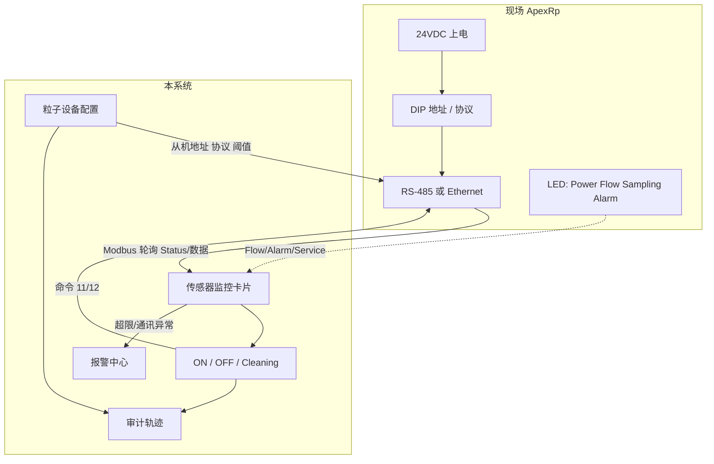
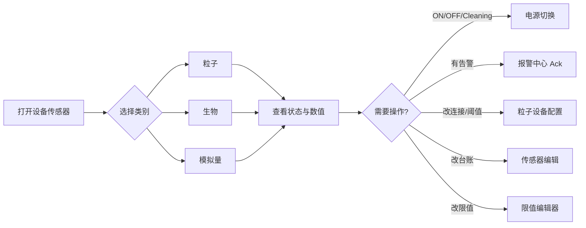

# 设备传感器 — 功能与操作流程

> 软件侧：Pharmaceutical Net Pro · **设备传感器** 菜单  
> 设备侧手册：`md/248083480-1 R2 (OpMan ApexRXp) Letter.pdf`（Lighthouse ApexRemoteWithPump / **ApexRp** 操作手册）  
> 同时对齐软件大纲 Ch.6 Sensors / Ch.12 Sensors Editor & Limits

---

## 1. 模块做什么

对洁净区三类采样点做**实时监控 + 设备连接配置 + 状态同步 + 运行控制 + 限值管理**：

| 类别 | 路由 | 典型设备 |
|------|------|----------|
| 粒子计数器 Particle | `/sensors/particle` | ApexRp（PC-01、PC-02 等） |
| 生物采样 BioCapt | `/sensors/biocapt` | BC-01 |
| 模拟量 Analog | `/sensors/analog` | AI-T1、AI-RH1、AI-DP1 |
| 传感器编辑 | `/sensors/editor` | 改 Custom ID / 描述 / 分组 |
| 限值编辑 | `/sensors/limits` | Warning / Alarm 限值与变更历史 |

粒子设备详细配置弹窗：**粒子设备配置**（通讯、台账、多工况阈值）。

---

## 2. 功能清单

### 2.1 监控总览（粒子 / 生物 / 模拟量）

- 按类别拉取传感器卡片列表
- 展示：Custom ID、描述、通道、运行态、最新值、Com/Flow Alarm
- 电源操作：`ON` / `OFF`（粒子额外支持 `Cleaning`）
- 定时刷新最新值与状态（对应设备侧 Status / NEW DATA 轮询）

### 2.2 设备连接与通讯配置（粒子）

- 厂房/房间节点、设备名称/编号、仪表类型、更新频率
- 从机地址、PLC、协议（ModbusTCP / ModbusRTU / OPC UA）、数据类型/长度/小数位
- 洁净等级、序列号、校准日期、运行模式、当前工况
- 多工况（生产/消毒/静态/消毒后通风/停产）下 0.5μm / 5.0μm 预警·报警阈值

### 2.3 传感器编辑器

- 列表编辑 Custom ID、Description、所属传感器组
- 保存调用 `PUT /api/sensors/:id/meta`
- 组数据来自 `GET /api/sensor-groups`（供报表「按组」与区域图使用）

### 2.4 限值编辑器

- 按类别筛选限值（粒子通道如 `0.5um`/`5.0um`，模拟量 `value`）
- 新建/修改 Warning Limit、Alarm Limit
- 写入限值历史；超限后由报警模块产生 Warning/Alarm 事件

---

## 3. ApexRp 设备连接（手册 Ch.3 / Ch.4 / Ch.7）

> 本节依据 ApexRp Operators Manual。现场接线与 DIP 设置属于设备侧；软件通过粒子设备配置保存从机地址、协议、PLC 等参数，供上位机/网关轮询。

### 3.1 上电与首次配置（SmartPort）

1. 使用 Configuration Kit 中的 **SmartPort Cable** + LWS Instrument Setup Tool 做初次参数配置。  
2. DIP **开关 7 置 DOWN**：进入 Setup Tool 通讯模式。  
3. 接好 24VDC 电源，确认 **Power LED 常亮绿灯** 后再开 Setup Tool，否则识别不到设备。  
4. 在 Setup Tool 中配置地址、TCP/IP、报警阈值等，点击 **Update Instrument** 写入。  
5. **必须拔掉 SmartPort Cable** 后再接入正式 RS-485 / 以太网运行网络；带线运行可能损坏设备并导致保修失效。

### 3.2 正式网络连接

| 方式 | 说明 | 软件侧对应字段 |
|------|------|----------------|
| **RS-485（MODBUS RTU/ASCII）** | RJ45 Serial COM：Pin4=RS-485B、Pin5=RS-485A、Pin7=24VDC、Pin8=GND；接 LMS 485 Gateway / 系统柜 | `protocol=ModbusRTU`，`slaveAddress` |
| **以太网（MODBUS TCP）** | 出厂以太网默认开启、**DHCP 默认关闭**；须配置静态 IP / 子网 / 网关后 Update Instrument | `protocol=ModbusTCP`，`plcIp`（或网关侧映射） |
| 等速采样探头 | 1.0 CFM：3/8" 管；0.1 CFM：1/8" 管；进气管 + 排气管总长 ≤ **10 ft (3 m)** | — |

**接线步骤（简）：**

1. 确认 SmartPort 已断开。  
2. 设备竖直安装，进气口朝上。  
3. CAT5e 一端接设备 Serial COM（或以太网口），另一端接网关/PLC/系统柜。  
4. 接 24VDC 外电（1.0 CFM 约 120W 电源、0.1 CFM 约 25W，以手册规格为准）。  
5. 在本系统「粒子设备配置」中填写从机地址、协议、PLC、更新频率并保存（写入审计）。

### 3.3 DIP 开关（串口地址与协议）

| 位 | 作用 |
|----|------|
| 1–5 | 二进制地址（地址 **0 禁止**，最低可用 **1**，最大 31） |
| 6 | OFF=MODBUS ASCII；ON=MODBUS RTU |
| 7 | UP=使用 DIP 地址；DOWN=Setup Tool 通讯 |
| 8 | 保留 |

修改 DIP 后须 **断电重启** 才生效。

串口默认参数（手册）：**19200 / 8 / 无校验 / 无流控**（手册原文 Data Bits=8，Parity/Stop 表述以附录为准，现场以出厂与 Setup Tool 实测为准）。

### 3.4 Web 界面（设备自带）

浏览器访问设备 IP 可查看：当前记录、最近 5 条、位置/序列号/型号、采样参数，以及 **location / flow / service / alarm** 等状态与诊断结果。注意部分杀毒软件可能干扰设备 Web Server。

---

## 4. 同步状态（手册 LED + Device Status）

### 4.1 面板 LED（现场直读）

| LED | 状态 | 含义 |
|-----|------|------|
| Power | 灭 / 绿 | 断电 / 上电 |
| Flow | 绿常亮 / 绿闪 | 流量正常 / **流量超差** |
| Service | 灭 / 琥珀 / 琥珀 1Hz 闪 | 正常 / 激光或光电异常 / 背景电压异常 |
| Sampling | 灭 / 蓝 | Idle / **正在采样** |
| Alarm | 灭 / 绿 / 红 / 蓝闪 5Hz / 白闪 5Hz | 未启用告警 / 已启用未超限 / **已超限** / 位置校验 / SmartBracket 未检测到支架 |

### 4.2 MODBUS Device Status（寄存器 40003 / 40057）

上位机轮询同步时重点关注：

| Bit | 名称 | 含义 | 软件映射建议 |
|-----|------|------|--------------|
| 0 | RUNNING | 已 Start（命令 11）直至 Stop | `powerOn` / 运行中 |
| 1 | SAMPLING | 正在采样写入周期 | `runtimeState=Sampling` |
| 2 | NEW DATA | 有新记录未读；读 30xxx 后清零 | 刷新最新值触发条件 |
| 3 | DEVICE ERROR | 设备故障，数据可能无效 | `runtimeState=Fault` / Com Alarm |
| 11 | LASER STATUS | 激光超差 | Service / 故障 |
| 12 | FLOW STATUS | 流量超差 | `flowCalcAlarm` |
| 13 | SERVICE STATUS | 需维护 | Service |
| 14 / 15 | THRESHOLD HIGH/LOW | 高低阈值超限 | 报警中心 Warning/Alarm |

附加字 40056：激光电源/电流/供电/寿命、无流量（激光关闭）、光电放大、背景、光电二极管、校准到期、支架缺失等。

### 4.3 采样记录状态字（30007–30008）

单条采样记录上的告警位（可叠加）：LASER Alert、Flow Alert、Service、Particle Threshold Exceeded 等。Flow+Overflow 示例值为 6。

### 4.4 软件侧运行态对照

| 软件 `runtimeState` | 设备侧大致对应 |
|---------------------|----------------|
| Idle | Sampling LED 灭；Hold 期间 Status bit0=0 |
| Sampling | Sampling LED 蓝；Status bit1=1 |
| Cleaning | 软件粒子 Cleaning（ON 但不采集不报警，对齐工艺吹扫） |
| Offline | 通讯失败 / 无响应（Com Alarm） |
| Fault | DEVICE ERROR / Service / Laser 异常 |

卡片上 **Com Alarm** ≈ 通讯/设备错误；**Flow Alarm** ≈ Flow Status / Flow LED 闪。

---

## 5. 相关控制操作（手册 Ch.6 + 软件）

### 5.1 MODBUS 命令寄存器 40002

| 写入值 | 动作 | 与软件关系 |
|--------|------|------------|
| **11** | Instrument Start（自动计数；带泵机型启动泵） | 对应软件电源 **ON** / 启动采样 |
| **12** | Instrument Stop（中止当前采样、停泵、停止采集） | 对应软件电源 **OFF** |
| 1 | 保存全部可写 4xxxx 到 EEPROM | 配置落盘 |
| 3 | 清空数据缓冲 | — |
| 4 | 保存 Sample/Hold/Location 等到 EEPROM | 参数保存 |
| 13 | 设置 RTC（先写 40035/40036） | — |
| 17 / 18 | 位置校验开始/停止（Alarm LED 蓝闪） | 现场点位确认 |
| 19 / 20 | 数据校验开始/停止（假数据采样并打标） | 联调验证 |

上电默认：**Sample Time=60s，Hold=0，Alarm 通道禁用**，并可能自动开始采样（兼容只轮询不发 Start 的系统）。若要停采，写命令 **12**。

### 5.2 软件电源控制

`POST /api/sensors/:id/power`，`action`：

| action | 行为 |
|--------|------|
| `on` | 开机/启动（映射命令 11） |
| `off` | 停机（映射命令 12） |
| `cleaning` | 粒子专用：保持通电、不采集、不判报警（工艺吹扫） |

权限建议：PowerUser 及以上。合规场景建议电子签名后执行。

### 5.3 关键参数寄存器（配置后建议命令 4 落盘）

| 参数 | 寄存器 | 说明 |
|------|--------|------|
| Location | 40026 | 采样位置号 |
| Hold Time | 40031/40032 | 采样间隔等待；Hold 时 Status Idle |
| Sample Time | 40033/40034 | 单次采样时长；采样时 Status=Sampling |
| Alarm Enable | 43xxx（如 43010） | bit0 通道使能 + bit1 报警使能；写 3=启用通道1报警 |
| Alarm Threshold | 对应阈值寄存器 | 与软件「限值编辑器 / 多工况阈值」一致 |

软件「粒子设备配置」中的**多工况阈值**（预警高/低、报警高/低、告警判定）应对齐写入设备阈值寄存器，并按当前工况 `productionState` 切换生效组。

### 5.4 实时信号 / 批量控制

- `/sampling/realtime`：按房间看粒子卡片实时值与状态色。  
- 批量开关机：`POST /api/realtime/batch-power`。  
- 刷新周期与设备配置中的 **更新频率(秒)**、网关轮询周期一致为宜。

---

## 6. 推荐操作流程

```text
① 设备接入（现场 + 软件）
   安装探头/支架 → 接 24V 与 RS-485 或以太网
   → Setup Tool 设地址/IP/阈值 → Update → 拔 SmartPort
   → 本系统「粒子」→ 配置：填从机地址/协议/PLC/房间/工况阈值 → 保存

② 日常巡检
   打开「粒子/生物/模拟量」→ 看 LED/卡片：Power、Flow、Sampling、Alarm
   → Com/Flow 异常 → 报警中心 Ack；必要时 OFF 维护
   → 粒子吹扫：Cleaning

③ 启停控制
   卡片 ON/OFF（或实时信号批量）→ 对应 MODBUS 11/12
   → 审计轨迹记录操作人与对象

④ 台账与限值
   「传感器编辑」改 Custom ID/分组
   「限值编辑器」或设备配置多工况阈值 → 超限进报警模块

⑤ 与上下游
   传感器组 → 配方 pens / 报表按组
   开启点位 → 实时趋势数据源
   配置变更 → 审计轨迹
```

### 连接与控制（简图）



### 日常巡检（简图）



---

## 7. 关键 API

| 方法 | 路径 | 说明 |
|------|------|------|
| GET | `/api/sensors?category=` | 列表（particle/biocapt/analog） |
| GET | `/api/sensors/:id` | 详情 |
| POST | `/api/sensors/:id/power` | `{ action: on\|off\|cleaning }` |
| PUT | `/api/sensors/:id/meta` | Custom ID / 描述 / 组 |
| GET/PUT | `/api/sensors/:id/device-config` | 粒子设备连接与多工况阈值 |
| GET | `/api/realtime/rooms` / `.../signals` | 实时信号 |
| POST | `/api/realtime/batch-power` | 批量开关 |
| GET | `/api/sensor-groups` | 传感器组 |
| GET/PUT | `/api/sensor-limits` | 限值 |
| GET | `/api/sensor-limits/history` | 限值变更历史 |

---

## 8. 权限建议（对齐手册 Table 11-2）

| 能力 | Nobody | User | PowerUser | Supervisor | Admin/Emergency |
|------|--------|------|-----------|------------|-----------------|
| 查看传感器 / 状态 | ✓ | ✓ | ✓ | ✓ | ✓ |
| 开关电源 / 启停采样 | | | ✓ | ✓ | ✓ |
| 编辑元数据 / 设备连接配置 | | | | ✓ | ✓ |
| 查看限值 | ✓ | ✓ | ✓ | ✓ | ✓ |
| 配置限值 / 工况阈值 | | | | ✓ | ✓ |

---

## 9. 安全与注意事项（摘自设备手册）

- 内部无可用户维修部件；擅自拆机、改光学/电路会伤人并作废保修。  
- 使用欠规格电源存在触电与火灾风险。  
- **Network Connect**：通讯口接线错误可能损坏仪器。  
- 配置完成后务必移除 SmartPort，再接入生产网络。  
- 以太网建议静态 IP，勿开 DHCP，以免 IP 变更后“丢设备”。  
- 年校准由 Lighthouse 授权服务商执行；零计数测试见手册 Ch.5。

---

## 10. 已知实现注意

- MySQL 8 中 `LAST_VALUE` 是保留字，SQL 中列名必须写成 `` `last_value` ``。  
- 前端桌面模式需后端 `127.0.0.1:8080` 可用（`pnpm dev:tauri`），仅 `pnpm dev` 不会启动 Rust API。  
- 设备手册英文原文以 PDF 为准；本文为操作摘要，寄存器细节见手册 Appendix A（MODBUS Register Map v1.50）。
